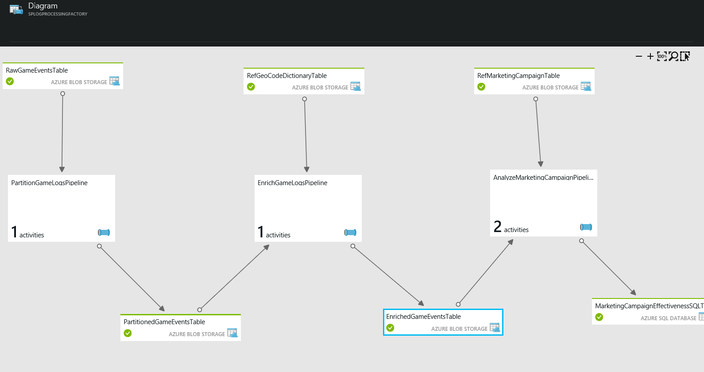

<properties 
    pageTitle="Usar caso - perfil de cliente" 
    description="Saiba como Azure Data Factory é usado para criar um orientadas a dados fluxo de trabalho (pipeline) para clientes de jogos do perfil." 
    services="data-factory" 
    documentationCenter="" 
    authors="sharonlo101" 
    manager="jhubbard" 
    editor="monicar"/>

<tags 
    ms.service="data-factory" 
    ms.workload="data-services" 
    ms.tgt_pltfrm="na" 
    ms.devlang="na" 
    ms.topic="article" 
    ms.date="09/06/2016" 
    ms.author="shlo"/>

# Usar caso - perfil de cliente

Azure fábrica de dados é um dos muitos serviços usados para implementar o pacote de inteligência de Cortana de aceleradores de solução.  Para saber mais sobre Cortana inteligência, visite [Cortana inteligência Suite](http://www.microsoft.com/cortanaanalytics). Neste documento, podemos descrever um caso de uso simples para ajudá-lo a começar a usar Noções básicas sobre como fábrica de dados do Azure pode resolver problemas comuns de análise.

Basta acessar e experimentar neste caso de uso simples é uma [assinatura do Azure](https://azure.microsoft.com/pricing/free-trial/).  Você pode implantar um exemplo que implementa este caso de uso seguindo as etapas descritas no artigo [exemplos](data-factory-samples.md) .

## Cenário

Contoso é uma empresa de jogos que cria jogos várias plataformas: jogo consoles, dispositivos de mão mantido e computadores pessoais (PCs). Como players reproduzir esses jogos, grande volume de dados de log é gerada que controla os padrões de uso, estilo de jogos e preferências do usuário.  Quando combinado com demográficas, regionais e dados de produto, Contoso pode executar a análise para orientá-los sobre como aprimorar a experiência dos jogadores e compras de destino-los para atualizações e jogo. 

Objetivo da Contoso é identificar oportunidades de cima-vender/cruzadas com base no histórico de jogos do seus jogadores e adicionar recursos atraentes ao crescimento de negócios de unidade e fornecer uma melhor experiência aos clientes. Para esse caso de uso, usamos uma empresa de jogos como um exemplo de uma empresa. A empresa deseja otimizar seus jogos com base em comportamento dos jogadores. Esses princípios se aplicam a qualquer empresa que deseja envolver seus clientes em torno de seus produtos e serviços e aprimorar a experiência de seus clientes.

## Desafios

## Visão geral da solução

Neste caso de uso simples pode ser usado como um exemplo de como você pode usar Factory de dados do Azure para inclusão, preparar, transformar, analisar e publicar dados.

Esta figura ilustra como o pipeline de dados são exibidos no portal do Azure após terem sido implantados.

1.  O **PartitionGameLogsPipeline** lê os eventos de jogos brutos do armazenamento de blob e cria partições com base em ano, mês e dia.
2.  O **EnrichGameLogsPipeline** ingressa particionados eventos jogos com dados de referência de código geográfica e enriquece os dados Mapeando endereços IP para locais de geográfica correspondentes.
3.  O pipeline de **AnalyzeMarketingCampaignPipeline** usa os dados rico e processa-la com os dados de anúncios para criar a saída final que contém efetividade de campanhas de marketing.

Neste exemplo, fábrica de dados é usada para coordenar as atividades que copiar processo os dados, transformação e dados de entrada e saída dos dados finais a um banco de dados do SQL Azure.  Você também pode visualizar a rede de pipeline de dados, gerenciá-los e monitorar seus status de interface do usuário.

## Benefícios

Otimizando sua análise de perfil de usuário e alinhando-lo com objetivos comerciais, empresa de jogos é capaz de coletar padrões de uso e analisar rapidamente a eficácia de suas campanhas de marketing.

