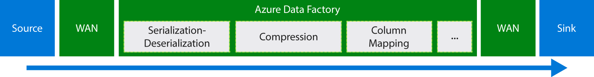

<properties
    pageTitle="Mover dados usando Copiar atividade | Microsoft Azure"
    description="Saiba mais sobre a movimentação de dados em canais de fábrica de dados: migração de dados entre os armazenamentos de nuvem e entre um armazenamento local e um armazenamento de nuvem. Use atividade de cópia."
    keywords="copiar dados, movimentação de dados, migração de dados, dados de transferência"
    services="data-factory"
    documentationCenter=""
    authors="linda33wj"
    manager="jhubbard"
    editor="monicar"/>

<tags
    ms.service="data-factory"
    ms.workload="data-services"
    ms.tgt_pltfrm="na"
    ms.devlang="na"
    ms.topic="article"
    ms.date="09/22/2016"
    ms.author="jingwang"/>

# Mover dados usando Copiar atividade

## Visão geral
Em fábrica de dados do Azure, você pode usar a atividade de cópia para copiar dados de formas diferentes de vários locais e na nuvem fontes de dados do Azure. Depois de dados são copiados, pode ser mais transformado e analisado. Você também pode usar cópia atividade publicar transformação e resultados de análise para business intelligence (BI) e consumo de aplicativo.

Atividade de cópia é da plataforma seguro, confiabilidade, escalabilidade e [serviço globalmente disponível](#global). Este artigo fornece detalhes sobre a movimentação de dados em fábrica de dados e atividade de cópia.

Primeiro, vamos ver como a migração de dados ocorre entre dois armazenamentos de dados de nuvem e entre um armazenamento de dados local e um armazenamento de dados de nuvem.

> [AZURE.NOTE] Para saber mais sobre as atividades em geral, consulte [as atividades e canais de compreensão](data-factory-create-pipelines.md).

### Copiar dados entre dois armazenamentos de dados de nuvem
Quando os armazenamentos de dados de origem e o receptor estiverem na nuvem, atividade de cópia percorre os seguintes estágios para copiar dados de origem para o receptor. O serviço que alimenta atividade de cópia:

1. Lê dados de armazenamento de dados de origem.
2. Executa serialização/desserialização, compactação/descompactação, mapeamento de coluna e conversão de tipo. Ela faz essas operações com base nas configurações do dataset de entrada, conjunto de dados de saída e atividade de cópia.
3.  Grava dados para o armazenamento de dados de destino.

O serviço escolhe automaticamente a região ideal para realizar o movimento de dados. Essa região é geralmente o mais próximo ao armazenamento de dados receptor uma.

### Copiar dados entre um armazenamento de dados local e um armazenamento de dados de nuvem
Para mover os dados com segurança entre um armazenamento de dados local e um armazenamento de dados de nuvem, instale o Gateway de gerenciamento de dados em sua máquina local. Gateway de gerenciamento de dados é um agente que permite o processamento e movimentação de dados híbridos. Você pode instalá-lo no mesmo computador, como o armazenamento de dados em si, ou em uma máquina separada que tenha acesso ao armazenamento de dados.

Neste cenário, Gateway de gerenciamento de dados executa a serialização/desserialização, compactação/descompactação, mapeamento de coluna e digite a conversão. Dados não fluem através do serviço de fábrica de dados do Azure. Em vez disso, o Gateway de gerenciamento de dados diretamente grava os dados para o armazenamento de destino.

Consulte [mover dados entre locais e nuvem armazenamentos de dados](data-factory-move-data-between-onprem-and-cloud.md) para uma introdução e instruções passo a passo. Consulte o [Gateway de gerenciamento de dados](data-factory-data-management-gateway.md) para obter informações detalhadas sobre este agente.

Você também pode mover dados de/para suporte para armazenamentos de dados que são hospedados em Azure IaaS VMs (máquinas virtuais) usando o Gateway de gerenciamento de dados. Nesse caso, você pode instalar o Gateway de gerenciamento de dados na mesma VM como o armazenamento de dados em si, ou em uma máquina virtual separada que tenha acesso ao armazenamento de dados.

## Formatos e armazena dados com suporte
[AZURE.INCLUDE [data-factory-supported-data-stores](../../includes/data-factory-supported-data-stores.md)]

Se você precisar mover dados de/para um dados armazenam que atividade de cópia não oferece suporte, use uma **atividade personalizada** em fábrica de dados com sua própria lógica para copiar/mover os dados. Para obter detalhes sobre como criar e usar uma atividade personalizada, consulte [atividades personalizadas de uso em um pipeline de fábrica de dados do Azure](data-factory-use-custom-activities.md).

### Formatos de arquivo suportados
Você pode usar a atividade de cópia para copiar arquivos como-está entre dois baseados em arquivos armazenamentos de dados, como Azure Blob, sistema de arquivos e HDFS. Para fazer isso, você pode ignorar a [seção formato](data-factory-create-datasets.md) as ambas as definições de conjunto de dados de entrada e saída. Os dados são copiados com eficiência sem qualquer serialização/desserialização.

Atividade de cópia também lê de e grava arquivos nos formatos especificados: texto, Avro, ORC, Parquet e JSON. Você pode fazer as seguintes atividades de cópia, por exemplo:

-   Copiar dados em formato de texto (CSV) do Azure Blob e gravar Azure SQL Database.
-   Copiar arquivos no formato de texto (CSV) do sistema de arquivos local e gravar Azure Blob no formato de Avro.
-   Copiar dados no banco de dados do SQL Azure e gravar HDFS local no formato ORC.

## Movimentação de dados globalmente disponível
Azure fábrica de dados está disponível somente nas regiões Oeste EUA, EUA Leste e Norte da Europa. No entanto, o serviço que alimenta atividade de cópia está disponível globalmente nas seguintes regiões e regiões geográficas. A topologia globalmente disponível garante movimentação de dados eficiente que geralmente evita saltos entre região. Consulte [serviços por região](https://azure.microsoft.com/regions/#services) para disponibilidade de dados fábrica e movimentação de dados em uma região.

### Copiar dados entre armazenamentos de dados de nuvem
Quando os armazenamentos de dados de origem e o receptor na nuvem, Data Factory usa uma implantação do serviço na região que for mais próximo o receptor na mesma geografia para mover os dados. Consulte a tabela a seguir para mapeamento:

Região do armazenamento de dados de destino | Região usada para movimentação de dados
:----------------------------------- | :----------------------------
Leste EUA | Leste EUA
Leste dos EUA 2 | Leste dos EUA 2
Oeste EUA | Oeste EUA
Oeste EUA 2 | Oeste EUA
Centro dos EUA | Centro dos EUA
Centro-Oeste dos EUA | Centro dos EUA
Centro Norte dos EUA | Centro Norte dos EUA
Centro Sul dos EUA | Centro Sul dos EUA
Norte da Europa | Norte da Europa
Europa Ocidental | Europa Ocidental
Sudeste Asiático | Sudeste Asiático
Da Ásia Oriental | Sudeste Asiático
Japão Leste | Japão Leste
Japão Oeste | Japão Leste
Brasil Sul | Brasil Sul
Austrália Oriental | Austrália Oriental
Austrália Sudeste | Austrália Sudeste
Índia central | Índia central
Índia Sul | Índia central
Índia Oeste | Índia central

> [AZURE.NOTE] Se a região do armazenamento de dados de destino não estiver na lista anterior, atividade de cópia falhar em vez de percorrer uma região alternativa.

### Copiar dados entre um armazenamento de dados local e um armazenamento de dados de nuvem
Quando dados estão sendo copiados entre locais (ou máquinas virtuais/IaaS Azure) e armazenamentos de nuvem, [Gateway de gerenciamento de dados](data-factory-data-management-gateway.md) executa a movimentação de dados em um local ou máquina virtual. Os dados não fluem através do serviço na nuvem, a menos que você usar o recurso [transferidos cópia](data-factory-copy-activity-performance.md#staged-copy) . Nesse caso, dados fluem através do armazenamento de Blob do Azure preparação antes de serem gravada no repositório de dados receptor.

## Criar um pipeline com atividade de cópia
Você pode criar um pipeline com atividade de cópia de algumas maneiras:

### Usando o Assistente de cópia
O Assistente de cópia de fábrica de dados ajuda a criar um pipeline com atividade de cópia. Esse pipeline permite copiar dados de fontes com suporte para destinos *sem escrever JSON* definições canais, conjuntos de dados e serviços vinculados. Consulte o [Assistente de cópia de fábrica de dados](data-factory-copy-wizard.md) para obter detalhes sobre o assistente.  

### Usando JSON scripts
Você pode usar o Editor de fábrica de dados no portal do Azure, Visual Studio ou Azure PowerShell para criar uma definição de JSON para um pipeline (usando a atividade de cópia). Em seguida, você pode implantar nele para criar o pipeline em fábrica de dados. Consulte [Tutorial: atividade de cópia de uso em um pipeline de fábrica de dados do Azure](data-factory-copy-data-from-azure-blob-storage-to-sql-database.md) para um tutorial com instruções passo a passo.    

Propriedades JSON (como nome, descrição, entrada e saída tabelas e políticas) estão disponíveis para todos os tipos de atividades. Propriedades que estão disponíveis no `typeProperties` seção da atividade variam com cada tipo de atividade.

Para copiar atividade, o `typeProperties` seção varia dependendo dos tipos de fontes e recpetores. Clique em um fonte/receptor na seção [suporte fontes e receptores](#supported-data-stores) para saber mais sobre propriedades de tipo que suporta a atividade de cópia para esse armazenamento de dados.   

Aqui está um exemplo de definição de JSON:

    {
      "name": "ADFTutorialPipeline",
      "properties": {
        "description": "Copy data from Azure blob to Azure SQL table",
        "activities": [
          {
            "name": "CopyFromBlobToSQL",
            "type": "Copy",
            "inputs": [
              {
                "name": "InputBlobTable"
              }
            ],
            "outputs": [
              {
                "name": "OutputSQLTable"
              }
            ],
            "typeProperties": {
              "source": {
                "type": "BlobSource"
              },
              "sink": {
                "type": "SqlSink",
                "writeBatchSize": 10000,
                "writeBatchTimeout": "60:00:00"
              }
            },
            "Policy": {
              "concurrency": 1,
              "executionPriorityOrder": "NewestFirst",
              "retry": 0,
              "timeout": "01:00:00"
            }
          }
        ],
        "start": "2016-07-12T00:00:00Z",
        "end": "2016-07-13T00:00:00Z"
      }
    }

O agendamento que é definido no dataset saída determina quando a atividade é executada (por exemplo: **diária**, frequência como **dia**e intervalo como **1**). A atividade copia dados de um conjunto de dados de entrada (**origem**) para um conjunto de dados de saída (**receptor**).

Você pode especificar mais de um conjunto de dados de entrada a atividade de cópia. Eles são usados para verificar as dependências antes que a atividade seja executada. No entanto, somente os dados do primeiro conjunto de dados são copiados para o conjunto de dados de destino. Para obter mais informações, consulte programação [e execução](data-factory-scheduling-and-execution.md).  

## Desempenho e ajuste
Consulte o [guia de ajuste e desempenho de atividade de cópia](data-factory-copy-activity-performance.md), que descreve os principais fatores que afetam o desempenho de movimentação de dados (cópia atividade) em fábrica de dados do Azure. Ele também lista o desempenho observado durante o teste interno e aborda várias maneiras de otimizar o desempenho da atividade de cópia.

## Copiar sequencial e agendamento
Consulte [agendamento e execução](data-factory-scheduling-and-execution.md) para obter informações detalhadas sobre como o agendamento e a execução funciona em fábrica de dados. É possível executar várias operações de cópia após o outro de maneira sequencial/ordenadas. Consulte a seção [ordenadas cópia](data-factory-scheduling-and-execution.md#ordered-copy) .

## Conversões de tipo
Fontes de dados diferentes têm sistemas de diferentes tipo nativo. Atividade de cópia executa conversões de tipo automática de tipos de fonte para coletar tipos com a abordagem de duas etapas a seguir:

1. Converta de tipos de fonte nativo para um tipo .NET.
2. Converta de um tipo .NET para um tipo de receptor nativo.

O mapeamento de um sistema de tipo nativo a um tipo de .NET para um armazenamento de dados é o artigo de armazenamento respectivos dados. (Clique no link específico na tabela [suportados armazenamentos de dados](#supported-data-stores) ). Você pode usar esses mapeamentos para determinar tipos apropriados ao criar suas tabelas, para que a atividade de cópia executa as conversões à direita.

## Próximas etapas
- Para saber mais sobre a atividade de cópia, consulte [copiar dados do armazenamento de Blob do Azure para Azure SQL Database](data-factory-copy-data-from-azure-blob-storage-to-sql-database.md).
- Para saber sobre como mover dados de uma loja de dados local para um armazenamento de dados de nuvem, consulte [mover dados da para cloud dados armazena no local](data-factory-move-data-between-onprem-and-cloud.md).
