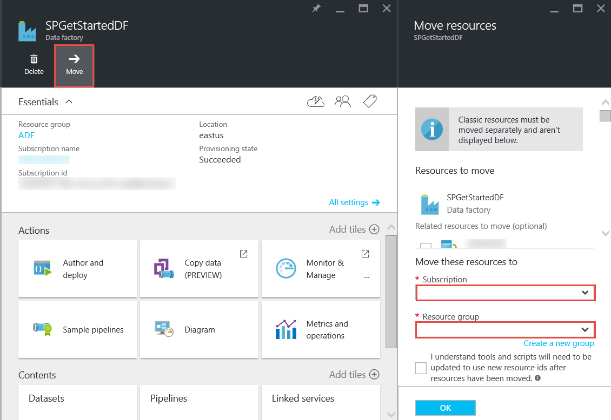

<properties 
    pageTitle="Dados Azure Factory - perguntas frequentes" 
    description="Perguntas frequentes sobre fábrica de dados do Azure." 
    services="data-factory" 
    documentationCenter="" 
    authors="sharonlo101" 
    manager="jhubbard" 
    editor="monicar"/>

<tags 
    ms.service="data-factory" 
    ms.workload="data-services" 
    ms.tgt_pltfrm="na" 
    ms.devlang="na" 
    ms.topic="article" 
    ms.date="09/12/2016" 
    ms.author="shlo"/>

# Dados Azure Factory - perguntas frequentes

## Perguntas gerais

### O que é Azure dados fábrica?

Fábrica de dados é um baseado em nuvem que **automatiza o movimento e a transformação de dados**de serviço de integração de dados. Assim como uma fábrica que executa o equipamento para tirar matéria-prima e transformá-los em mercadorias concluídas, Data Factory organiza serviços existentes que coletam dados processados e transformação-lo em informações de prontos para uso. 
 
Fábrica de dados permite criar fluxos de trabalho orientados a dados para mover dados entre tanto locais e armazenamentos de dados de nuvem como dados de processo/transformação usando os serviços de computação como Azurehdinsight e a análise de Lucerne de dados do Azure. Depois de criar um pipeline que executa a ação que você precisa, você pode programar a execução periodicamente (por hora, diariamente, semanalmente etc.).   

Para obter mais detalhes, consulte [Visão geral e conceitos chave](data-factory-introduction.md) . 

### Onde posso encontrar detalhes de preços para fábrica de dados do Azure?

Consulte a [página de detalhes de preços de fábrica de dados] [ adf-pricing-details] para os detalhes de preços para a fábrica de dados do Azure.  

### Como faço para começar a fábrica de dados do Azure?

- Para obter uma visão geral da fábrica de dados do Azure, consulte [Introdução a fábrica de dados do Azure](data-factory-introduction.md).
- Para um tutorial sobre como **copiar/mover dados** usando Copiar atividade, consulte [copiar dados do armazenamento de Blob do Azure para Azure SQL Database](data-factory-copy-data-from-azure-blob-storage-to-sql-database.md).
- Para obter um tutorial sobre como **transformar dados** usando a atividade de seção de HDInsight. Consulte [dados de processo executando script de seção em Hadoop cluster](data-factory-build-your-first-pipeline.md) 
  
### Qual é a disponibilidade de região de dados da fábrica?
Fábrica de dados está disponível no **Oeste EUA** e **Norte da Europa**. Os serviços de computação e armazenamento usados por fábricas de dados podem estar em outras regiões. Consulte [regiões com suporte](data-factory-introduction.md#supported-regions). 
 
### Quais são os limites de número de dados fábricas/canais/atividades/conjuntos de dados?
 
Consulte a seção **Limites de fábrica de dados do Azure** do artigo [assinatura do Azure e limites de serviço, cotas e restrições](../azure-subscription-service-limits.md#data-factory-limits) .

### O que é a experiência de criação/desenvolvedor com o serviço de fábrica de dados do Azure?

Você pode autor/criar fábricas de dados usando um destes procedimentos:

- **Portal do Azure**  
   blades a fábrica de dados no portal do Azure fornecem rica interface de usuário para você criar serviços de ad vinculado de fábricas de dados. O **Editor de fábrica de dados**, que também é parte do portal, permite que você crie facilmente serviços vinculados, tabelas, conjuntos de dados e canais, especificando definições de JSON para esses artefatos. Consulte [criar sua primeira pipeline de dados usando o portal do Azure](data-factory-build-your-first-pipeline-using-editor.md) para obter um exemplo de como usar o editor do portal/para criar e implantar uma fábrica de dados.

- **Visual Studio**  
   você pode usar o Visual Studio para criar uma fábrica de dados do Azure. Para obter detalhes, consulte [criar sua primeira pipeline de dados usando o Visual Studio](data-factory-build-your-first-pipeline-using-vs.md) . 

- **PowerShell Azure**  
   consulte [criar e monitor fábrica de dados do Azure usando o PowerShell do Azure](data-factory-build-your-first-pipeline-using-powershell.md) para um tutorial/passo a passo para a criação de uma fábrica de dados usando o PowerShell. Consulte [Referência de Cmdlet de fábrica dados] [ adf-powershell-reference] conteúdo na biblioteca MSDN para uma documentação abrangente de cmdlets de fábrica de dados.
   
- **Biblioteca de classes .NET**  
   você pode criar programaticamente fábricas de dados usando o SDK do .NET de fábrica de dados. Consulte [criar, monitorar e gerenciar fábricas de dados usando o SDK do .NET](data-factory-create-data-factories-programmatically.md) para instruções passo a passo de criação de uma fábrica de dados usando o SDK do .NET. Consulte [Referência de biblioteca de classes de fábrica dados] [ msdn-class-library-reference] para uma documentação abrangente de dados fábrica .NET SDK.

- **API REST**  
   você também pode usar a API REST expostos pelo serviço de fábrica de dados do Azure para criar e implantar fábricas de dados. Consulte a [Referência à API REST fábrica dados] [ msdn-rest-api-reference] para uma documentação abrangente da API de REST de fábrica de dados.
 
- **Modelo do Gerenciador de recursos Azure** 
   consulte [Tutorial: criar sua primeira fábrica de dados Azure usando o Gerenciador de recursos do Azure modelo](data-factory-build-your-first-pipeline-using-arm.md) detalhes fo. 

### Posso renomear uma fábrica de dados?
Não. Como outros recursos Azure, o nome de uma fábrica Azure dados não pode ser alterado. 

### Posso mover uma fábrica de dados de uma assinatura do Azure para outro? 
Sim. Use o botão **Mover** na lâmina de fábrica seus dados, conforme mostrado no diagrama a seguir. 

### Quais são os ambientes de computação suportados pelo fábrica de dados?
A tabela a seguir fornece uma lista dos ambientes de computação suportados pelo fábrica de dados e as atividades que podem ser executados neles. 

| Calcular o ambiente | atividades |
| ------------------- | -------- | 
| [Cluster de HDInsight sob demanda](data-factory-compute-linked-services.md#azure-hdinsight-on-demand-linked-service) ou [seu próprio cluster HDInsight](data-factory-compute-linked-services.md#azure-hdinsight-linked-service) | [DotNet](data-factory-use-custom-activities.md), [seção](data-factory-hive-activity.md), [porco](data-factory-pig-activity.md), [MapReduce](data-factory-map-reduce.md), [Hadoop Streaming](data-factory-hadoop-streaming-activity.md) | 
| [Lote Azure](data-factory-compute-linked-services.md#azure-batch-linked-service) | [DotNet](data-factory-use-custom-activities.md) |  
| [Aprendizado de máquina Azure](data-factory-compute-linked-services.md#azure-machine-learning-linked-service) | [Máquina de atividades de aprendizagem: recursos de atualização e execução em lotes](data-factory-azure-ml-batch-execution-activity.md) |
| [Dados Azure Lucerne Analytics](data-factory-compute-linked-services.md#azure-data-lake-analytics-linked-service) | [Lucerne a análise de dados U-SQL](data-factory-usql-activity.md)
| [SQL azure](data-factory-compute-linked-services.md#azure-sql-linked-service), [depósito de dados do SQL Azure](data-factory-compute-linked-services.md#azure-sql-data-warehouse-linked-service), [do SQL Server](data-factory-compute-linked-services.md#sql-server-linked-service) | [Procedimento armazenado](data-factory-stored-proc-activity.md)

## Atividades - perguntas Frequentes
### Quais são os diferentes tipos de atividades que você pode usar em um pipeline de fábrica de dados? 

- [Atividades de movimentação de dados](data-factory-data-movement-activities.md) para mover dados.
- [Atividades de transformação de dados](data-factory-data-transformation-activities.md) para o processo/transformação de dados. 

### Quando uma atividade o funciona?
A configuração de **disponibilidade** na tabela de dados de saída determina quando a atividade é executada. Se conjuntos de dados de entrada forem especificados, a atividade verifica se todas as dependências de dados de entrada são satisfeitas (ou seja, estado **pronto** ) antes de iniciar a execução. 

## Copiar atividade - perguntas Frequentes
### É melhor ter um pipeline com várias atividades ou um pipeline separado para cada atividade? 
Canais devem para agrupar atividades relacionadas. Se os conjuntos de dados que se conectam elas não são consumidos por qualquer outra atividade fora o pipeline, você pode manter as atividades em um pipeline. Dessa forma, você não precisa períodos de ativos de pipeline de corrente para que eles se alinham uns com os outros. Além disso, a integridade dos dados nas tabelas internas no pipeline melhor é preservada ao atualizar o pipeline. Atualização de pipeline essencialmente interrompe todas as atividades no pipeline, remove-los e cria-los novamente. Da perspectiva de criação, talvez também seja mais fácil de ver o fluxo de dados dentro as atividades relacionadas em um arquivo JSON para o pipeline.

### Quais são os armazenamentos de dados com suporte?
[AZURE.INCLUDE [data-factory-supported-data-stores](../../includes/data-factory-supported-data-stores.md)]

### Quais são os formatos de arquivo com suporte? 
[AZURE.INCLUDE [data-factory-file-format](../../includes/data-factory-file-format.md)]

### Onde a operação de cópia é executada? 
Consulte a seção de [movimentação de dados globalmente disponível](data-factory-data-movement-activities.md#global) para obter detalhes. Em resumo, quando um armazenamento de dados local é envolvido, a operação de cópia é executada pelo Gateway de gerenciamento de dados no seu ambiente local. E, quando a movimentação dos dados entre dois armazenamentos de nuvem, a operação de cópia é executada na região mais próxima para o local de receptor na mesma Geografia. 

## Atividade de HDInsight - perguntas Frequentes

### Quais regiões são suportados pelo HDInsight?

Consulte a seção de disponibilidade geográficos no seguinte artigo: ou os [Detalhes de preços de HDInsight][hdinsight-supported-regions].

### Qual região é usado por um cluster de HDInsight sob demanda?

Cluster HDInsight sob demanda é criado na mesma região onde existe o armazenamento especificado para ser usada com o cluster.    

### Como associar contas de armazenamento adicional para seu cluster HDInsight?

Se você estiver usando seu próprio HDInsight Cluster (BYOC - trazer seu próprio Cluster), consulte os tópicos a seguir: 

- [Usando um Cluster de HDInsight com Metastores e contas de armazenamento alternativo][hdinsight-alternate-storage]
- [Usar contas de armazenamento adicional com seção de HDInsight][hdinsight-alternate-storage-2]

Se você estiver usando um cluster de sob demanda que é criado pelo serviço fábrica de dados, especifica contas de armazenamento adicional para o HDInsight vinculado serviço para que o serviço de dados fábrica pode registrá-las em seu nome. Na definição de JSON para o serviço vinculada sob demanda, use a propriedade de **additionalLinkedServiceNames** para especificar contas de armazenamento alternativo, conforme mostrado no seguinte trecho JSON:
 
    {
        "name": "MyHDInsightOnDemandLinkedService",
        "properties":
        {
            "type": "HDInsightOnDemandLinkedService",
            "typeProperties": {
                "clusterSize": 1,
                "timeToLive": "00:01:00",
                "linkedServiceName": "LinkedService-SampleData",
                "additionalLinkedServiceNames": [ "otherLinkedServiceName1", "otherLinkedServiceName2" ] 
            }
        }
    } 

No exemplo acima, otherLinkedServiceName1 e otherLinkedServiceName2 representam serviços vinculados cujas definições contém credenciais que o cluster HDInsight precisa acessar contas de armazenamento alternativo.

## Fatias - perguntas Frequentes

### Por que estão minha entradas fatias não está no estado pronto?  
Um erro comum não está definindo a propriedade **externos** como **true** do dataset de entrada quando os dados de entrada são externos à fábrica dados (não produzida pela fábrica de dados). 

No exemplo a seguir, você só precisa defina **externos** como true no **dataset1**.  

**DataFactory1** Pipeline 1: dataset1 -> activity1 -> dataset2 -> activity2 -> Pipeline de dataset3 2: dataset3 -> activity3 -> dataset4

Se você tiver outro fábrica de dados com um pipeline que leva dataset4 (produzidos pelo pipeline 2 da fábrica de dados 1), marca dataset4 como um conjunto de dados externo porque o conjunto de dados é produzido por uma fábrica de dados diferentes (DataFactory1, não DataFactory2).  

**DataFactory2**    
Pipeline 1: dataset4 -> activity4 -> dataset5

Se a propriedade externa está definida corretamente, verifique se os dados de entrada existem no local especificado na definição do dataset de entrada. 

### Como executar uma fatia em outro momento que meia-noite quando a fatia é produzida diariamente?
Use a propriedade de **deslocamento** para especificar a hora em que você deseja na fatia sejam produzidos. Consulte a seção de [disponibilidade de conjunto de dados](data-factory-create-datasets.md#Availability) para obter detalhes sobre essa propriedade. Aqui está um exemplo rápido:

    "availability":
    {
        "frequency": "Day",
        "interval": 1,
        "offset": "06:00:00"
    }

Fatias diárias iniciam **6 horas** em vez da meia-noite padrão.     

### Como posso reexecutar uma fatia?
Você pode executar novamente uma fatia em uma das seguintes maneiras: 

- Use o Monitor e gerenciar App reexecutar uma janela de atividade ou fatia. Consulte [Reexecutar selecionada windows de atividade](data-factory-monitor-manage-app.md#re-run-selected-activity-windows) para obter instruções.   
- Clique em **Executar** na barra de comandos na lâmina **FATIA de dados** da fatia no portal do Azure.
- Execute o cmdlet **Set-AzureRmDataFactorySliceStatus** com Status definido como **Aguardando** da fatia.   
    
        Set-AzureRmDataFactorySliceStatus -Status Waiting -ResourceGroupName $ResourceGroup -DataFactoryName $df -TableName $table -StartDateTime "02/26/2015 19:00:00" -EndDateTime "02/26/2015 20:00:00" 

Consulte [Set-AzureRmDataFactorySliceStatus] [ set-azure-datafactory-slice-status] para obter detalhes sobre o cmdlet. 

### Quanto tempo levou para processar uma fatia?
Use o Explorador de janela de atividade no Monitor e gerenciar App saber quanto tempo levou para processar uma fatia de dados. Consulte [Atividade de uma janela do Explorer](data-factory-monitor-manage-app.md#activity-window-explorer) para obter detalhes. 

Você também pode fazer o seguinte no portal do Azure:  

1. Clique em bloco de **conjuntos de dados** na lâmina **Fábrica de dados** para sua fábrica de dados.
2. Clique em dataset específico na lâmina **conjuntos de dados** .
3. Selecione a fatia que você está interessado na lista de **fatias recentes** na lâmina **tabela** .
4. Clique na atividade executar na lista de **Atividade executa** na lâmina **FATIA de dados** . 
5. Clique em **Propriedades do** bloco na lâmina **Detalhes de execução de atividade** . 
6. Você deve ver o campo **duração** com um valor. Esse valor é o tempo necessário para processar a fatia.   

### Como parar uma fatia em execução?
Se você precisar interromper o pipeline de execução, você pode usar o cmdlet [Suspender-AzureRmDataFactoryPipeline](https://msdn.microsoft.com/library/mt603721.aspx) . Atualmente, a suspensão o pipeline não parar execuções fatia que estão em andamento. Depois de concluir as execuções em andamento, nenhuma fatia extra é selecionada.

Se você realmente deseja interromper todas as execuções imediatamente, a única maneira seria excluir o pipeline e criá-lo novamente. Se você optar por excluir o pipeline, você não precisa excluir tabelas e serviços vinculados usados pelo pipeline. 

[create-factory-using-dotnet-sdk]: data-factory-create-data-factories-programmatically.md
[msdn-class-library-reference]: https://msdn.microsoft.com/library/dn883654.aspx
[msdn-rest-api-reference]: https://msdn.microsoft.com/library/dn906738.aspx

[adf-powershell-reference]: https://msdn.microsoft.com/library/dn820234.aspx 
[azure-portal]: http://portal.azure.com
[set-azure-datafactory-slice-status]: https://msdn.microsoft.com/library/mt603522.aspx

[adf-pricing-details]: http://go.microsoft.com/fwlink/?LinkId=517777
[hdinsight-supported-regions]: http://azure.microsoft.com/pricing/details/hdinsight/
[hdinsight-alternate-storage]: http://social.technet.microsoft.com/wiki/contents/articles/23256.using-an-hdinsight-cluster-with-alternate-storage-accounts-and-metastores.aspx
[hdinsight-alternate-storage-2]: http://blogs.msdn.com/b/cindygross/archive/2014/05/05/use-additional-storage-accounts-with-hdinsight-hive.aspx
 
