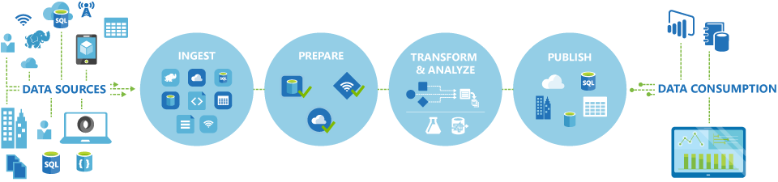

<properties 
    pageTitle="Introdução à fábrica de dados, um serviço de integração de dados | Microsoft Azure" 
    description="Saiba o que é Azure dados fábrica: um serviço de integração de dados de nuvem que organiza e automatize movimentação e transformação de dados." 
    keywords="integração de dados, integração de dados de nuvem, o que é o factory de dados do azure"
    services="data-factory" 
    documentationCenter="" 
    authors="sharonlo101" 
    manager="jhubbard" 
    editor="monicar"/>

<tags 
    ms.service="data-factory" 
    ms.workload="data-services" 
    ms.tgt_pltfrm="na" 
    ms.devlang="na" 
    ms.topic="get-started-article" 
    ms.date="09/22/2016" 
    ms.author="shlo"/>

# Introdução ao serviço de fábrica de dados do Azure, um serviço de integração de dados na nuvem

## O que é Azure dados fábrica? 
Fábrica de dados é um serviço de integração de dados baseada em nuvem que organiza e automatize a **movimentação** e **transformação** de dados. Você pode criar soluções de integração de dados usando o serviço de fábrica de dados que podem incluir dados de várias fontes de dados, transformação/processo os dados e publicar os dados de resultado para armazenamentos de dados. 

Serviço de fábrica de dados permite que você criar canais de dados que mover e transformam dados e execute o pipeline em uma agenda especificada (a cada hora, diariamente, semanalmente, etc.). Ele também fornece visualizações avançadas para exibir a linhagem e dependências entre seus canais de dados e monitorar todos os seus canais de dados de um único modo unificado para facilmente identificar problemas e configuração do monitoramento alertas.

**Figura 1.** Incluir dados de várias fontes de dados, preparar, transformar, analisar os dados e, em seguida, publicar dados prontos para uso para consumo.

## Canais e atividades
Em uma solução de Data Factory, você criar um ou mais dados **canais**. Um pipeline é um agrupamento lógico de atividades. Eles são usados para atividades de grupo em uma unidade que juntos executar uma tarefa. 

**Atividades** definem as ações a serem executadas em seus dados. Por exemplo, você pode usar uma atividade de cópia para copiar dados do repositório de dados para outro armazenamento de dados. Da mesma forma, você pode usar uma atividade de seção, que executa uma consulta de seção em um cluster de Azurehdinsight transformar ou analisar seus dados. Dados fábrica suporta dois tipos de atividades: atividades de movimentação de dados e atividades de transformação de dados. 
  
## Atividades de movimentação de dados 
[AZURE.INCLUDE [data-factory-supported-data-stores](../../includes/data-factory-supported-data-stores.md)]

Consulte o artigo de [Atividades de movimentação de dados](data-factory-data-movement-activities.md) para obter mais detalhes. 

## Atividades de transformação de dados
[AZURE.INCLUDE [data-factory-transformation-activities](../../includes/data-factory-transformation-activities.md)]

Consulte o artigo de [Atividades de transformação de dados](data-factory-data-transformation-activities.md) para obter mais detalhes.

Se você precisar mover dados de/para um dados armazenam que a atividade de cópia não dá suporte a, ou transformar dados usar sua própria lógica, criar uma **atividade personalizada do .NET**. Para obter detalhes sobre como criar e usar uma atividade personalizada, consulte [atividades personalizadas de uso em um pipeline de fábrica de dados do Azure](data-factory-use-custom-activities.md).

## Serviços de vinculadas
Serviços vinculados definem as informações necessárias para fábrica de dados para se conectar à recursos externos (exemplos: armazenamento Azure, SQL Server, Azurehdinsight local). Serviços vinculados são usados para fins de dois em fábrica de dados:

- Para representar um **armazenamento de dados** incluindo, mas não limitado, um SQL Server local, banco de dados Oracle, arquivo compartilhamento ou uma conta de armazenamento de Blob do Azure. Consulte a seção de [atividades de movimentação de dados](data-factory-data-movement-activities.md) para obter uma lista de armazenamentos de dados com suporte. 
- Para representar um **recurso de computação** que pode hospedar a execução de uma atividade. Por exemplo, a atividade de HDInsightHive é executado em um cluster de HDInsight Hadoop. Consulte a seção de [atividades de transformação de dados](data-factory-data-transformation-activities.md) para obter uma lista dos ambientes de computação com suporte. 

## Conjuntos de dados 
Serviços vinculados link armazenamentos de dados para uma fábrica de dados do Azure. Conjuntos de dados representam estruturas de dados com em armazenamentos de dados. Por exemplo, um serviço de armazenamento do Azure vinculado fornece informações de conexão de dados fábrica para se conectar a uma conta de armazenamento do Azure. Um conjunto de dados do Azure Blob Especifica o contêiner de blob e a pasta em armazenamento de Blob do Azure do qual o pipeline deve ler os dados. Da mesma forma, um serviço SQL Azure vinculado fornece informações de conexão para um banco de dados do SQL Azure e um conjunto de dados do SQL Azure Especifica a tabela que contém os dados.   

## Relação entre entidades de fábrica de dados
Dados Factory tem algumas entidades principais que trabalham juntos para definir a entrada e saída de dados, processamento de eventos e o agendamento e os recursos necessários para executar o fluxo de dados desejado.

**Figura 2.** Relações entre serviço Dataset, atividade, Pipeline e vinculado

Com os quatro conceitos simples de serviços vinculados, conjuntos de dados, atividades e canais, você está pronto para começar! Você pode [criar sua primeira pipeline](data-factory-build-your-first-pipeline.md). 

## Regiões com suporte
Atualmente, você pode criar fábricas de dados nas regiões **Oeste EUA**, **EUA Leste**e **Norte da Europa** . Entretanto, uma fábrica de dados pode acessar armazenamentos de dados e serviços em outras regiões Azure para mover dados entre armazenamentos de dados de computação ou dados de processo usando serviços de computação. 

Azure Factory de dados em si não armazena todos os dados. Ele permite que você criar fluxos de orientados a dados para coordenar a movimentação de dados entre o processamento de dados usando [Serviços de computação](data-factory-compute-linked-services.md) em outras regiões ou em um ambiente local e [suporte para armazenamentos de dados](data-factory-data-movement-activities.md#supported-data-stores) . Ele também permite [monitorar e gerenciar fluxos de trabalho](data-factory-monitor-manage-pipelines.md) usando os dois programação e mecanismos de interface do usuário. 

Apesar de fábrica de dados do Azure está disponível em **Apenas Oeste EUA**, **Leste EUA**e regiões **Norte da Europa** , o serviço alimentar a movimentação dos dados em fábrica de dados está disponível [globalmente](data-factory-data-movement-activities.md#global) em vários regiões. No caso de um armazenamento de dados fica atrás de um firewall, em seguida, um [Gateway de gerenciamento de dados](data-factory-move-data-between-onprem-and-cloud.md) instalado no seu ambiente local move os dados em vez disso. 

Por exemplo, vamos supor que seus ambientes de computação como cluster Azurehdinsight e aprendizado de máquina do Azure estão ficando sem região Europa Oeste. Você pode criar e usar uma instância de fábrica de dados do Azure na Europa do Norte e usá-lo para agendar trabalhos em seus ambientes de computação na Europa Ocidental. Demora alguns milissegundos de fábrica de dados para disparar o trabalho em seu ambiente de computação, mas não altera a hora para executar o trabalho em seu ambiente de computação.

Pretendemos ter fábrica de dados do Azure em todas as regiões geográficas suportadas pelo Azure no futuro.
  
## Próximas etapas
Para saber como criar fábricas de dados com o pipeline de dados, siga as instruções passo a passo os seguintes tutoriais. 

Tutorial | Descrição
-------- | -----------
[Criar um pipeline de dados que processa dados usando Hadoop cluster](data-factory-build-your-first-pipeline.md) | Neste tutorial, você criar sua primeira fábrica de dados Azure com um pipeline de dados **dados de processos** executando o script de seção em um cluster de Azurehdinsight (Hadoop). |
[Criar um pipeline de dados para mover dados entre dois armazenamentos de dados de nuvem](data-factory-copy-data-from-azure-blob-storage-to-sql-database.md) | Neste tutorial, você cria uma fábrica de dados com um pipeline que **Move dados** do armazenamento de Blob banco de dados SQL.
[Criar um pipeline de dados para mover dados entre um armazenamento de dados local e um armazenamento de dados de nuvem usando o Gateway de gerenciamento de dados](data-factory-move-data-between-onprem-and-cloud.md) | Neste tutorial, você criar uma fábrica de dados com um pipeline que **Move dados** de um banco de dados do SQL Server **local** para um blob do Microsoft Azure. Como parte da explicação, instalar e configurar o Gateway de gerenciamento de dados em sua máquina. 
