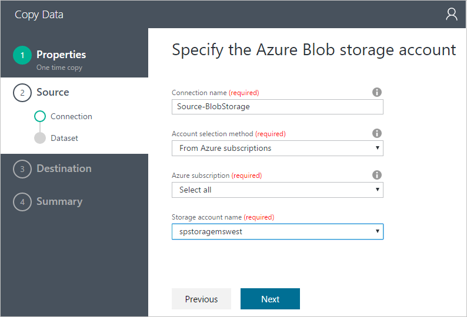
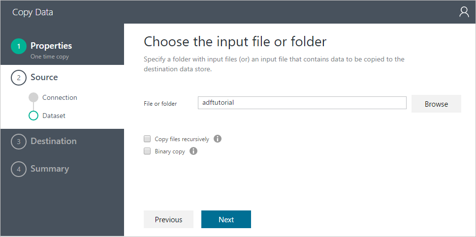
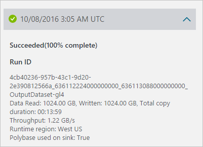

<properties 
    pageTitle="Carregar terabytes de dados em um depósito de dados do SQL | Microsoft Azure" 
    description="Demonstra como 1 TB de dados pode ser carregado no depósito de dados do SQL Azure em 15 minutos com fábrica de dados do Azure" 
    services="data-factory" 
    documentationCenter="" 
    authors="linda33wj" 
    manager="jhubbard" 
    editor="monicar"/>

<tags 
    ms.service="data-factory" 
    ms.workload="data-services" 
    ms.tgt_pltfrm="na" 
    ms.devlang="na" 
    ms.topic="article" 
    ms.date="10/28/2016" 
    ms.author="jingwang"/>

# Carregar 1 TB em um depósito de dados do SQL Azure em 15 minutos com fábrica de dados do Azure [cópia Wizard]
[Depósito de dados do SQL Azure](../sql-data-warehouse/sql-data-warehouse-overview-what-is.md) é um baseado em nuvem escala-out banco de dados capaz de processar grandes volumes de dados relacionais e não relacionais.  SQL Data Warehouse baseado na arquitetura de processamento altamente paralelo (MPP), é otimizado para cargas de trabalho de depósito de dados corporativos.  Ele oferece elasticidade de nuvem com flexibilidade para dimensionar o armazenamento e computação de maneira independente.

Introdução ao depósito de dados do SQL Azure agora é mais fácil do que nunca usando o **Azure dados fábrica**.  Azure fábrica de dados é um serviço de integração de dados totalmente gerenciado baseado em nuvem, que pode ser usado para preencher um depósito de dados do SQL com os dados do seu sistema existente e economizando tempo valioso ao avaliar SQL Data Warehouse e criar soluções analytics sobre elas.  Aqui estão os principais benefícios do carregar dados em depósito de dados do SQL Azure usando o Azure dados fábrica:

- **Fácil de configurar**: 5-etapa assistente intuitivo com nenhum script necessário.
- **Suporte de armazenamento de dados sofisticados**: suporte interno para um conjunto sofisticado de locais e armazena dados na nuvem.
- **Seguros e compatíveis**: dados são transferidos pela HTTPS ou rota expressa e presença do serviço global garante que seus dados nunca deixam o limite geográfico
- **Desempenho sem igual usando PolyBase** – Polybase usando é a maneira mais eficiente para mover dados para depósito de dados do SQL Azure. Usando o recurso de blob preparação, você pode obter velocidades de alta carga de todos os tipos de armazenamentos de dados além do armazenamento de Blob do Azure, que oferece suporte a Polybase por padrão.

Este artigo mostra como usar o Assistente de cópia de fábrica de dados para carregar dados de 1 TB de armazenamento de Blob do Azure para depósito de dados do SQL Azure em 15 minutos, a transferência de GBps ultrapassa 1.2.

Este artigo fornece instruções detalhadas para mover dados para depósito de dados do SQL Azure usando o Assistente de cópia. 

> [AZURE.NOTE] Consulte o artigo [mover dados para e do depósito de dados do SQL Azure usando fábrica de dados do Azure](data-factory-azure-sql-data-warehouse-connector.md) para obter informações gerais sobre recursos de fábrica de dados na movimentação de dados para/de depósito de dados do SQL Azure. 
> 
> Você também pode criar canais usando o portal do Azure, Visual Studio, PowerShell, etc. Consulte [Tutorial: copiar dados do Azure Blob para Azure SQL Database](data-factory-copy-data-from-azure-blob-storage-to-sql-database.md) para um rápida passo a passo com instruções passo a passo para usar a atividade de cópia do Azure dados fábrica.  

## Pré-requisitos
- Armazenamento de Blob do Azure: esse experimento usa o armazenamento de Blob do Azure (GRS) para o armazenamento de conjunto de dados de teste do TPC-H.  Se você não tiver uma conta de armazenamento do Azure, Aprenda [a criar uma conta de armazenamento](../storage/storage-create-storage-account.md#create-a-storage-account).
- Dados [TPC-H](http://www.tpc.org/tpch/) : Vamos usar TPC-H como o conjunto de dados de teste.  Para fazer isso, você precisa usar `dbgen` do Kit de ferramentas TPC-H, que ajuda você a gerar o conjunto de dados.  Você pode baixar ou código-fonte para `dbgen` de [Ferramentas TPC](http://www.tpc.org/tpc_documents_current_versions/current_specifications.asp) e compilá-la ou baixar o binário compilado do [GitHub](https://github.com/Azure/Azure-DataFactory/tree/master/Samples/TPCHTools).  Executar dbgen.exe com os seguintes comandos para gerar o arquivo simples de 1 TB para `lineitem` disseminação de tabela em 10 arquivos:
    - `Dbgen -s 1000 -S **1** -C 10 -T L -v`
    - `Dbgen -s 1000 -S **2** -C 10 -T L -v`
    - …
    - `Dbgen -s 1000 -S **10** -C 10 -T L -v` 

    Agora, copie os arquivos gerados ao Azure Blob.  Consulte para [mover dados de um sistema de arquivos local usando fábrica de dados do Azure e](data-factory-onprem-file-system-connector.md) como fazer isso usando AAD copiar.   
- Depósito de dados do SQL Azure: esse experimento carrega dados em depósito de dados do SQL Azure criado com 6.000 DWUs

    Consulte [criar um depósito de dados do SQL Azure](../sql-data-warehouse/sql-data-warehouse-get-started-provision/) para obter instruções detalhadas sobre como criar um banco de dados do SQL Data Warehouse.  Para obter o melhor desempenho de carga possíveis para SQL Data Warehouse usando Polybase, escolhemos número máximo de unidades de depósito de dados (DWUs) permitidos na configuração de desempenho, que é 6.000 DWUs.

    > [AZURE.NOTE] 
    > Ao carregar do Azure Blob, os dados de desempenho do carregamento são diretamente proporcionais ao número de DWUs que você configurar no Data Warehouse do SQL:
    > 
    > Carregando 1 TB em 1.000 DWU SQL Data Warehouse leva 87min (~ 200MBps produtividade) Carregando 1 TB em 2.000 DWU SQL Data Warehouse leva 46min (~ 380MBps produtividade) Carregando 1 TB em 6.000 DWU SQL Data Warehouse leva 14min (taxa de transferência de ~1.2GBps) 

    Para criar um depósito de dados do SQL com 6.000 DWUs, mova o controle deslizante de desempenho totalmente para a direita:

    

    Para um banco de dados existente não está configurado com 6.000 DWUs, você pode dimensioná-lo usando o portal do Azure.  Navegue até o banco de dados no portal do Azure e há um botão de **escala** no painel **Visão geral** mostrado na imagem a seguir:

        

    Clique no botão de **escala** para abrir o painel seguinte, mova o controle deslizante para o valor máximo e clique em botão **Salvar** .

    
    
    Esse experimento carrega dados em depósito de dados do SQL Azure usando `xlargerc` classe de recurso.

    Para obter melhor produtividade possível, cópia precisa ser realizadas usando um usuário de SQL Data Warehouse pertencente a `xlargerc` classe de recurso.  Saiba como fazer isso pelo seguinte [alterar um exemplo de classe do recurso de usuário](../sql-data-warehouse/sql-data-warehouse-develop-concurrency.md#change-a-user-resource-class-example).  

- Crie esquema de tabela de destino no banco de dados de depósito de dados do SQL Azure, executando a seguinte instrução DDL:

        CREATE TABLE [dbo].[lineitem]
        (
            [L_ORDERKEY] [bigint] NOT NULL,
            [L_PARTKEY] [bigint] NOT NULL,
            [L_SUPPKEY] [bigint] NOT NULL,
            [L_LINENUMBER] [int] NOT NULL,
            [L_QUANTITY] [decimal](15, 2) NULL,
            [L_EXTENDEDPRICE] [decimal](15, 2) NULL,
            [L_DISCOUNT] [decimal](15, 2) NULL,
            [L_TAX] [decimal](15, 2) NULL,
            [L_RETURNFLAG] [char](1) NULL,
            [L_LINESTATUS] [char](1) NULL,
            [L_SHIPDATE] [date] NULL,
            [L_COMMITDATE] [date] NULL,
            [L_RECEIPTDATE] [date] NULL,
            [L_SHIPINSTRUCT] [char](25) NULL,
            [L_SHIPMODE] [char](10) NULL,
            [L_COMMENT] [varchar](44) NULL
        )
        WITH
        (
            DISTRIBUTION = ROUND_ROBIN,
            CLUSTERED COLUMNSTORE INDEX
        )

Com as etapas de pré-requisito concluídas, podemos agora está prontos para configurar a atividade de cópia usando o Assistente de cópia.

## Iniciar o Assistente de cópia

1.  Faça logon no [portal do Azure](https://portal.azure.com).
2.  Clique em **+ nova** do canto superior esquerdo, clique **inteligência + análise**e clique em **Dados fábrica**. 
6. Na lâmina **nova fábrica de dados** :
    1. Digite **LoadIntoSQLDWDataFactory** para o **nome**.
        O nome da fábrica dados Azure deve ser exclusivo. Se você receber o erro: **nome de fábrica de dados "LoadIntoSQLDWDataFactory" não está disponível**, altere o nome da fábrica dados (por exemplo, yournameLoadIntoSQLDWDataFactory) e experimente criar novamente. Consulte o tópico de [Dados Factory - regras de nomenclatura](data-factory-naming-rules.md) para regras de nomenclatura para artefatos de fábrica de dados.  
     
    2. Selecione sua **assinatura**do Azure.
    3. Para o grupo de recursos, siga um dos seguintes passos: 
        1. Selecione **Usar existente** para selecionar um grupo de recursos existentes.
        2. Selecione **Criar novo** inserir um nome para um grupo de recursos.
    3. Selecione um **local** para a fábrica de dados.
    4. Marque a caixa de seleção de **Pin a painel** na parte inferior da lâmina.  
    5. Clique em **criar**.
10. Após a criação for concluída, você verá a lâmina de **Fábrica de dados** conforme mostrado na imagem a seguir:

    
11. Na home page de fábrica de dados, clique no bloco **copiar dados** para iniciar o **Assistente de cópia**. 

    > [AZURE.NOTE] Se você vir que o navegador da web está preso em "Autorizar...", desabilitar/desmarque a opção de configuração de **dados de site e bloquear cookies de terceiros** (ou) mantê-lo habilitado e criar uma exceção para **login.microsoftonline.com** e tente iniciar o assistente novamente.

## Etapa 1: Configurar o cronograma de carregamento de dados
A primeira etapa é configurar os cronograma de carregamento de dados.  

Na página de **Propriedades** :
1. Digite **CopyFromBlobToAzureSqlDataWarehouse** para o **nome da tarefa**
2. Selecione a opção **executar uma vez agora** .   
3. Clique em **Avançar**.  

## Etapa 2: Configurar fonte
Esta seção mostra as etapas para configurar a origem: arquivos de item do Azure Blob contendo a 1 linha TB TPC-H.

Selecione o **Armazenamento de Blob do Azure** enquanto os dados armazenam em clique em **Avançar**.

Preencha as informações de conexão da conta de armazenamento de Blob do Azure e clique em **Avançar**.

Escolha a **pasta** que contém os arquivos de item de linha TPC-H e clique em **Avançar**.

Ao clicar em **Avançar**, as configurações de formato de arquivo são detectadas automaticamente.  Certifique-se de que delimitador de coluna é ' | 'em vez da vírgula padrão','.  Clique em **Avançar** depois de ter visualizado os dados.

## Etapa 3: Configurar o destino
Esta seção mostra como configurar o destino: `lineitem` tabela do banco de dados de depósito de dados do SQL Azure.

Escolha **Depósito de dados do SQL Azure** como o repositório de destino e clique em **Avançar**.

Preencha as informações de conexão de depósito de dados do SQL Azure.  Certificar-se de que você especificar que o usuário que é um membro da função `xlargerc` (consulte a seção **pré-requisitos** para obter instruções detalhadas) e clique em **Avançar**. 

Escolha a tabela de destino e clique em **Avançar**.

Aceite as configurações padrão de mapeamento de coluna e clique em **Avançar**.

## Etapa 4: Configurações de desempenho

**Permitir polybase** é marcada por padrão.  Clique em **Avançar**.

## Etapa 5: Implantar e monitorar resultados de carga
Clique em botão **Concluir** para implantar. 

Após a implantação for concluída, clique em `Click here to monitor copy pipeline` para monitorar a cópia executar o andamento.

Selecione o pipeline de cópia que você criou na lista de **Atividade Windows** .

Você pode exibir a cópia execução detalhes no **Explorador de janela de atividade** no painel direito, incluindo o volume de dados lidos de fonte e gravados em destino, a duração e a produtividade média para executar.

Como você pode ver na captura de tela a seguir, copiando 1 TB de armazenamento de Blob do Azure para SQL Data Warehouse levou 14 minutos, efetivamente atingir 1,22 GBps produtividade!

## Práticas recomendadas
Aqui estão algumas práticas recomendadas para a execução de seu banco de dados de depósito de dados do SQL Azure:

- Use uma classe de recurso maior ao carregar em um índice de COLUMNSTORE AGRUPADO.
- Para junções mais eficientes, considere o uso de distribuição de hash por uma coluna selecionada em vez de padrão round robin distribuição.
- Para carregar mais rapidez, considere usar pilha para dados temporárias.
- Crie estatísticas após terminar de carregar depósito de dados do SQL Azure.

Consulte [práticas recomendadas para depósito de dados do SQL Azure](../sql-data-warehouse/sql-data-warehouse-best-practices.md) para obter detalhes. 

## Próximas etapas
- [Assistente de cópia de fábrica de dados](data-factory-copy-wizard.md) - este artigo fornece detalhes sobre o Assistente de cópia. 
- [Desempenho de atividade de cópia e guia de ajuste](data-factory-copy-activity-performance.md) - este artigo contém as medidas de desempenho de referência e guia de ajuste.

