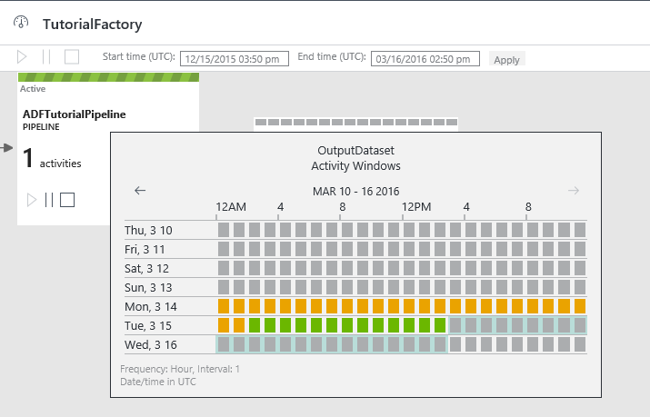
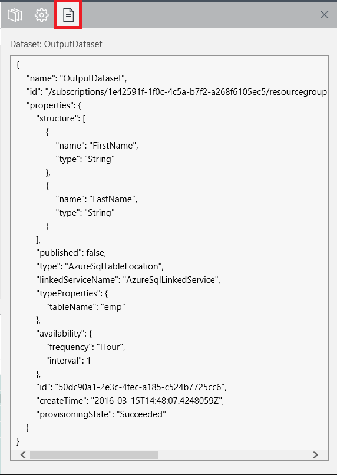
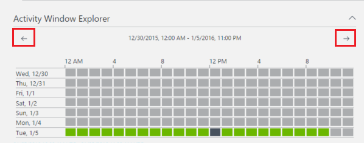
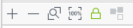
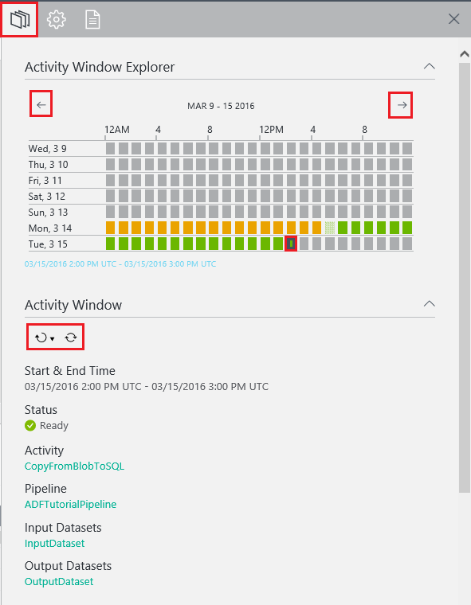
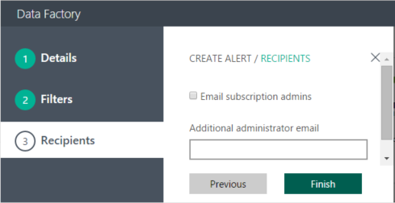

<properties 
    pageTitle="Monitorar e gerenciar o pipeline de fábrica de dados do Azure" 
    description="Saiba como usar o monitoramento e gerenciamento de aplicativo para monitorar e gerenciar canais e fábricas de dados do Azure." 
    services="data-factory" 
    documentationCenter="" 
    authors="spelluru" 
    manager="jhubbard" 
    editor="monicar"/>

<tags 
    ms.service="data-factory" 
    ms.workload="data-services" 
    ms.tgt_pltfrm="na" 
    ms.devlang="na" 
    ms.topic="article" 
    ms.date="09/06/2016" 
    ms.author="spelluru"/>

# Monitorar e gerenciar o pipeline de fábrica de dados do Azure usando o novo monitoramento e gerenciamento de aplicativo
> [AZURE.SELECTOR]
- [Usando o PowerShell de Portal/Azure Azure](data-factory-monitor-manage-pipelines.md)
- [Usando o monitoramento e gerenciamento de aplicativo](data-factory-monitor-manage-app.md)

Este artigo descreve como monitorar, gerenciar e depurar seus canais e criar alertas para ser notificado sobre falhas usando o **monitoramento e gerenciamento de aplicativo**. Você também pode Assista a este vídeo para saber como usar o monitoramento e gerenciamento de aplicativo.
   

> [AZURE.VIDEO azure-data-factory-monitoring-and-managing-big-data-piplines]
      
## Iniciando o monitoramento e gerenciamento de aplicativo um
Para iniciar o Monitor e o aplicativo de gerenciamento, clique bloco de **monitoramento e gerenciar** na lâmina **Fábrica de dados** para sua fábrica de dados.

 

Você deve ver que o monitoramento e gerenciamento de aplicativo iniciado em uma guia/janela separada.  

> [AZURE.NOTE] Se você vir que o navegador da web está preso em "Autorizar...", desabilitar/desmarque a opção de configuração de **dados de site e bloquear cookies de terceiros** (ou) mantê-lo habilitado e criar uma exceção para **login.microsoftonline.com** e tente iniciar o aplicativo novamente.

Se você não vir windows de atividade na lista na parte inferior, clique no botão **Atualizar** na barra de ferramentas para atualizar a lista. Além disso, defina os valores corretos para os filtros de **hora de início** e **hora de término** .  

## Noções básicas sobre o monitoramento e gerenciamento de aplicativo
Há três guias (**Resource Explorer**, **Modos de exibição de monitoramento**e **alertas**) à esquerda e a primeira guia (Explorer de recurso) é selecionada por padrão. 

### Gerenciador de recursos
Você verá o seguinte: 

- Recurso do Explorer **modo de exibição de árvore** no painel esquerdo.
- **Modo de exibição de diagrama** na parte superior.
- Lista de **Atividade Windows** na parte inferior no painel intermediário.
- **Propriedades**/**Atividade de uma janela do Explorer** guias no painel direito. 

No Explorador de recurso, você ver todos os recursos (canais, conjuntos de dados, serviços vinculados) na fábrica dados em um modo de exibição de árvore. Quando você selecionar um objeto no Gerenciador de recursos, observe o seguinte: 

- entidade de fábrica de dados associado é realçada na exibição de diagrama.
- associados windows de atividade (clique [aqui](data-factory-scheduling-and-execution.md) para saber mais sobre o windows de atividade) são realçadas na lista de atividade Windows na parte inferior.  
- Propriedades do objeto selecionado na janela de propriedades no painel direito. 
- Definição de JSON do objeto selecionado, se aplicável. Por exemplo: um serviço vinculado ou um conjunto de dados ou um pipeline. 

Consulte o artigo [agendamento e execução](data-factory-scheduling-and-execution.md) para obter informações conceituais sobre janela atividade. 

### Modo de exibição de diagrama
O modo de exibição de diagrama de uma fábrica de dados fornece um único painel para monitorar e gerenciar a fábrica de dados e seus ativos. Quando você selecionar uma entidade de fábrica de dados (dataset/pipeline) no modo de exibição Diagrama, observe o seguinte:
 
- a entidade de fábrica de dados está selecionada na exibição em árvore
- atividade associada windows são realçadas na lista do Windows de atividade.
- Propriedades do objeto selecionado na janela de propriedades

Quando o pipeline estiver habilitado (não no estado pausado), ela é mostrada com uma linha verde. 

Você perceber que há três botões de comando para o pipeline na exibição de diagrama. Você pode usar o segundo botão Pausar o pipeline. Pausa não terminar as atividades atualmente em execução e permitir que ela continue para conclusão. Terceiro botão Pausa o pipeline e encerra a execução de atividades existente. Primeiro botão continua o pipeline. Quando o pipeline for pausado, observe a alteração de cor para o pipeline de lado a lado da seguinte maneira.

Você pode multisseleção dois ou mais canais (usando CTRL) e use os botões da barra de comando para pausar/continuar vários canais por vez.

Você pode ver todas as atividades no pipeline, clicando no bloco do pipeline e, em seguida, clicando em **pipeline de abrir**.

No modo de exibição pipeline aberto, você vê todas as atividades no pipeline. Neste exemplo, há apenas uma atividade: atividade de cópia. Para voltar à exibição anterior, clique em nome de fábrica de dados no menu de navegação estrutural na parte superior.

No modo de exibição do pipeline, quando você clica em um conjunto de dados de saída ou quando você move o mouse sobre o conjunto de dados de saída, você vê pop-up Windows de atividade para esse conjunto de dados.

Você pode clicar em uma janela de atividade para ver detalhes para ele na janela de **propriedade** no painel direito. 

No painel direito, alterne para a guia **Atividade de uma janela do Explorer** para ver mais detalhes.

 

Você também ver **resolvidos variáveis** para cada execução de atividade tentativa na seção **tentativas** . 

Alternar para a guia de **Script** para ver a definição de script JSON para o objeto selecionado.   

Você pode ver o windows de atividade em três lugares:

- Atividade Windows pop-up no modo de exibição de diagrama (painel central).
- Atividade janela do Explorer, no painel direito.
- Lista de Windows de atividades no painel inferior.

No Windows de atividade pop-up e atividade de uma janela do Explorer, você pode rolar a semana anterior e próxima semana usando setas esquerda e direita.

Na parte inferior da exibição de diagrama, você ver botões para ampliar, zoom, Zoom para ajustá-la, Aplicar Zoom 100%, bloquear layout. Botão de layout bloquear impede que você acidentalmente movendo tabelas e canais na exibição de diagrama e é ativada por padrão. Você pode desativá-lo e mover entidades no diagrama. Quando você desativá-la, você pode usar o último botão posicione automaticamente tabelas e canais. Você também pode ampliar / zoom usando a roda do mouse.

### Lista de atividade do Windows
Lista de windows atividade na parte inferior do painel intermediário exibe todas as janelas de atividade para o conjunto de dados que você selecionou no Gerenciador de recursos ou modo de exibição de diagrama. Por padrão, a lista está em ordem decrescente, o que significa que você verá a janela de atividade mais recente na parte superior. 

Esta lista não atualizar automaticamente; portanto, use o botão Atualizar na barra de ferramentas para atualizá-la manualmente.  

As janelas de atividade podem estar em um dos seguintes status:

<table>
<tr>
    <th align="left">Status</th><th align="left">Substatus</th><th align="left">Descrição</th>
</tr>
<tr>
    <td rowspan="8">Aguardando</td><td>ScheduleTime</td><td>Não chegou a hora para a janela de atividade executar.</td>
</tr>
<tr>
<td>DatasetDependencies</td><td>As dependências upstream não estão prontas.</td>
</tr>
<tr>
<td>ComputeResources</td><td>Os recursos de computação não estão disponíveis.</td>
</tr>
<tr>
<td>ConcurrencyLimit</td> <td>Todas as instâncias de atividade são ocupadas executando outras janelas de atividade.</td>
</tr>
<tr>
<td>ActivityResume</td><td>Atividade é pausada e não é possível executar as janelas de atividade até que ele é reiniciado.</td>
</tr>
<tr>
<td>Repetir</td><td>Execução de atividade está repetida.</td>
</tr>
<tr>
<td>Validação</td><td>Validação ainda não foi iniciado.</td>
</tr>
<tr>
<td>ValidationRetry</td><td>Aguardando a validação ser repetida.</td>
</tr>
<tr>
<tr
<td rowspan="2">InProgress</td><td>Validando</td><td>Validação em andamento.</td>
</tr>
<td></td>
<td>A janela atividade está sendo processada.</td>
</tr>
<tr>
<td rowspan="4">Falha</td><td>TimedOut</td><td>Execução demorou mais que é permitido pela atividade.</td>
</tr>
<tr>
<td>Cancelado</td><td>Cancelado por ação do usuário.</td>
</tr>
<tr>
<td>Validação</td><td>Validação falhou.</td>
</tr>
<tr>
<td></td><td>Falha ao gerar e/ou validar a janela atividade.</td>
</tr>
<td>Pronto</td><td></td><td>A janela de atividade está pronta para o consumo.</td>
</tr>
<tr>
<td>Ignorada</td><td></td><td>A janela atividade não é processada.</td>
</tr>
<tr>
<td>Nenhum</td><td></td><td>Uma janela de atividade que costumava existir com um status diferente, mas tiver sido redefinida.</td>
</tr>
</table>

Quando você clica em uma janela de atividade na lista, você ver detalhes sobre ele na janela **Atividade Windows Explorer** ou **Propriedades** à direita.

### Atualizar o windows de atividade  
Os detalhes não são atualizados automaticamente, para que você usar o **Atualizar** botão (segundo botão) na barra de comando para atualizar manualmente a lista de windows atividade.  
 

### Janela de propriedades
A janela de propriedades está no painel mais à direita da barra de monitoramento e gerenciamento de aplicativos. 

Ele exibe as propriedades para o item selecionado no Gerenciador de recursos (modo de exibição de árvore) (ou) diagrama exibir (ou) lista de atividade do windows. 

### Explorador de janela de atividade

A janela de **Atividade de uma janela do Explorer** está no painel mais à direita de monitoramento e gerenciamento de aplicativo. Exibe detalhes sobre a janela de atividade que você selecionou na lista de atividade Windows ou Windows de atividade pop-up. 

Você pode alternar para outra janela de atividade clicando no modo de exibição calendário na parte superior. Você também pode usar a **seta para a esquerda**/botões de**seta para a direita** na parte superior do Windows atividade de anterior/próxima semana.

Você pode usar os botões da barra de ferramentas no painel inferior para **executar novamente** a janela atividade ou **Atualizar** os detalhes no painel. 

### Script 
Você pode usar a guia de **Script** para exibir a definição de JSON da entidade fábrica de dados selecionada (serviço vinculado, dataset e pipeline). 

## Usando modos de exibição do sistema
O monitoramento e gerenciamento de aplicativo inclui exibições de sistema pré-criados (**windows de atividade recente**, **Falha atividade windows**, **Windows de atividade em andamento**) que permite exibir as janelas de atividade recente/falha/em andamento para fábrica dados. 

Alternar para a guia de **Modos de exibição de monitoramento** à esquerda, clicando nela. 

Atualmente, há três modos de exibição do sistema com suporte. Selecione uma opção para ver recente atividade windows (ou) atividade com falha windows (ou) windows de atividade em andamento na lista de atividade Windows (na parte inferior do painel intermediário). 

Quando você selecionar a opção **windows de atividade recente** , você vê todas as janelas de atividade recentes na ordem decrescente de **última tentativa tempo**. 

Você pode usar o modo de exibição do **windows de atividade de falha** para ver todas as janelas de atividade com falha na lista. Selecione uma janela de atividade com falha na lista para ver detalhes sobre ele no **Propriedades** janela (ou) **Atividade de uma janela do Explorer**. Você também pode baixar todos os logs de uma janela de atividade com falha. 

## Windows de atividade de filtragem e classificação
Altere as configurações de **hora de início** e **hora de término** na barra de comando para o windows de atividade de filtro. Depois de alterar a hora de início e hora de término, clique no botão próximo horário de término para atualizar a lista de atividade Windows.

> [AZURE.NOTE] Atualmente, todos os horários estão no formato UTC no monitoramento e gerenciamento de aplicativo. 

Na **lista de atividade Windows**, clique no nome de uma coluna (por exemplo: Status). 

Você pode fazer o seguinte:

- Classificar em ordem crescente.
- Classificar em ordem decrescente.
- Filtrar por um ou mais valores (pronto, aguardando, etc.)

Quando você define um filtro em uma coluna, você verá o botão de filtro habilitado para a coluna indicar que os valores na coluna são valores filtrados. 

Você pode usar a mesma janela pop-up para limpar filtros. Para limpar todos os filtros para a lista de atividade do windows, clique no botão Limpar filtro na barra de comando. 

## Realizar ações em lotes

### Execute novamente o windows de atividade selecionada
Selecione uma janela de atividade, clique na seta para baixo para o primeiro botão de barra de comando e selecione **Executar** / **Reexecutar com upstream no pipeline**. Quando você selecionar a opção **executar novamente com upstream no pipeline** , ele executa novamente todas as janelas de atividade upstream. 
    

Você também pode selecionar várias janelas de atividade na lista e execute novamente-los ao mesmo tempo. Talvez você queira filtrar windows de atividade baseado no status (por exemplo: **Falha**) e execute novamente as janelas de atividade com falha após corrigir o problema que faz com que as janelas de atividade falha. Consulte a seção a seguir para obter detalhes sobre filtragem windows de atividade na lista.  

### Pausar/continuar vários canais
Você pode multisseleção dois ou mais canais (usando CTRL) e use os botões da barra de comando (realçado no retângulo vermelho na imagem a seguir) para pausar/continuá-las por vez.

## Criar alertas 
A página alertas permite criar um alerta, exibir/editar/excluir os alertas existentes. Você pode também desativar/ativar um alerta. Para ver a página de alertas, clique na guia alertas.

### Para criar um alerta

1. Clique em **Adicionar alerta** para adicionar um alerta. Você verá a página de detalhes. 

    
1. Especifique o **nome** e uma **Descrição** para o alerta e clique em **Avançar**. Você verá a página de **filtros** .

    

2. Selecione o **evento**, **status**e **substatus** (opcional) em que você deseja que o serviço de dados fábrica para alertá-lo e clique em **Avançar**. Você verá a página de **destinatários** .

     
3. Selecione a opção de **administradores de assinatura de Email** e/ou insira **email do administrador adicionais**e clique em **Concluir**. Você deve ver o alerta na lista. 
    
    

Na lista de alertas, use os botões associados para editar/excluir/ativar/desativar um alerta no alerta. 

### Status/evento/substatus
A tabela a seguir fornece a lista de eventos disponíveis e status (e substatus).

Nome do evento | Status | Status de sub
-------------- | ------ | ----------
Atividade executar iniciada | Introdução | Iniciando
Executar terminada de atividade | Bem-sucedida | Bem-sucedida 
Executar terminada de atividade | Falha| Alocação de recursos falhou  Falha na execução  Expirou  Falha de validação  Abandonados
Sob demanda HDI Cluster criar iniciada | Introdução | &nbsp; |
Sob demanda HDI Cluster criado com êxito | Bem-sucedida | &nbsp; |
Sob demanda HDI Cluster excluído | Bem-sucedida | &nbsp; |
### Para editar/excluir/desativar um alerta

    
 

