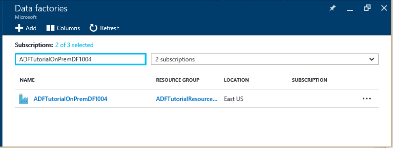
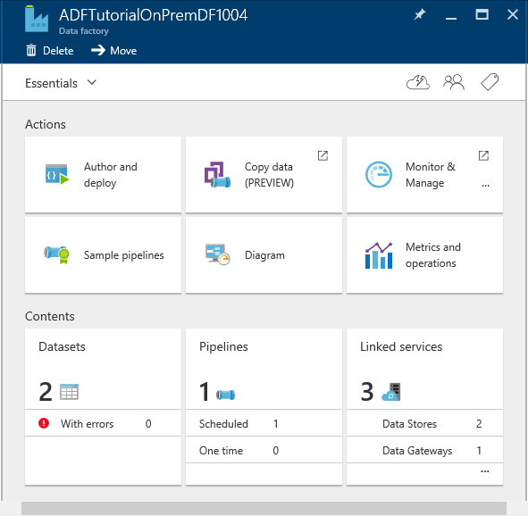
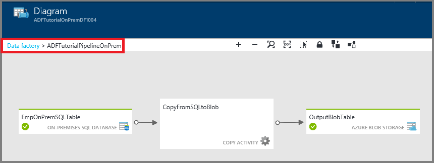
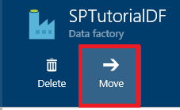

<properties 
    pageTitle="Monitorar e gerenciar o pipeline de fábrica de dados do Azure" 
    description="Saiba como usar o Portal do Azure e PowerShell do Azure para monitorar e gerenciar fábricas de dados do Azure e canais que você criou." 
    services="data-factory" 
    documentationCenter="" 
    authors="spelluru" 
    manager="jhubbard" 
    editor="monicar"/>

<tags 
    ms.service="data-factory" 
    ms.workload="data-services" 
    ms.tgt_pltfrm="na" 
    ms.devlang="na" 
    ms.topic="article" 
    ms.date="09/06/2016" 
    ms.author="spelluru"/>

# Monitorar e gerenciar o pipeline de fábrica de dados do Azure
> [AZURE.SELECTOR]
- [Usando o portal do Azure/Azure PowerShell](data-factory-monitor-manage-pipelines.md)
- [Usando o monitoramento e gerenciamento de aplicativo](data-factory-monitor-manage-app.md)

O serviço de dados fábrica fornece exibição confiável e completa dos seus serviços de movimentação de armazenamento, processamento e dados. O serviço oferece a você um monitoramento Ajuda do dashboard que você pode usar para executar as seguintes tarefas: 

- Avalie rapidamente a integridade do pipeline de dados de ponta a ponta.
- Identificar problemas e tomar medidas corretivas se necessário. 
- Linhagem de dados de controle. 
- Controlar relações entre seus dados em qualquer uma das suas fontes.
- Estatísticas de histórico completo de modo de exibição de execução de trabalho, saúde do sistema e dependências.

Este artigo descreve como monitorar, gerenciar e depurar seus canais. Ele também fornece informações sobre como criar alertas e ser notificado sobre falhas.

## Entender canais e estados de atividade
Usando o portal do Azure, você pode:

- Exibir sua fábrica de dados como um diagrama
- Exibir as atividades em um pipeline
- Exibir conjuntos de dados de entrada e saídos
- e muito mais. 

Esta seção fornece também como uma fatia transições de um estado para outro estado.   

### Navegue até sua fábrica de dados
1.  Entrar no [portal do Azure](https://portal.azure.com).
2.  Clique em **fábricas de dados** no menu à esquerda. Se ela não estiver visível, clique em **mais serviços >** e clique em **fábricas de dados** em **inteligência + ANALYTICS** categoria. 

    

    Você deve ver todas as fábricas de dados na lâmina **fábricas de dados** . 
4. Na lâmina fábricas dados, selecione a fábrica de dados que você está interessado.

      
5.  e você verá a home page (lâmina de**fábrica de dados** ) para a fábrica de dados.

    

#### Modo de exibição de diagrama de sua fábrica de dados
O modo de exibição de diagrama de uma fábrica de dados fornece um único painel para monitorar e gerenciar a fábrica de dados e seus ativos.

Para ver o modo de exibição de diagrama de sua fábrica de dados, clique em **diagrama** na home page de fábrica de dados.

Você pode ampliar, zoom, zoom para ajustá-la, zoom para 100%, bloqueie o layout do diagrama e posicionar automaticamente canais e tabelas. Você também pode ver as informações de linhagem de dados (Mostrar itens upstream e downstream dos itens selecionados).
 

### Atividades dentro de um pipeline 
1. O pipeline de atalho e clique em **Abrir pipeline** para ver todas as atividades no pipeline juntamente com conjuntos de dados de entrada e saídos para as atividades. Esse recurso é útil quando o pipeline consiste de mais de uma atividade e você quiser entender a linhagem operacional de uma tubulação única.

      
2. No exemplo a seguir, você verá duas atividades no pipeline com suas entradas e saídas. A atividade intitulada **JoinData** de tipo de atividade de uma seção do HDInsight e **EgressDataAzure** de tipo de atividade de cópia são nesse pipeline de amostra. 
    
     
3. Você pode navegar para página inicial da fábrica de dados clicando em dados fábrica link na navegação estrutural no canto superior esquerdo.

    

### Estado de exibição de cada atividade dentro de um pipeline
Você pode exibir o estado atual de uma atividade exibindo o status de qualquer um dos conjuntos de dados produzidos pela atividade. 

Por exemplo: no exemplo a seguir, o **BlobPartitionHiveActivity** executado com êxito e produzidas um dataset chamado **PartitionedProductsUsageTable**, que está no estado **pronto** .

Clicando duas vezes na **PartitionedProductsUsageTable** no modo de exibição Diagrama apresenta todas as fatias produzidas por execuções de atividade diferente dentro de um pipeline. Você pode ver que o **BlobPartitionHiveActivity** executado com êxito todo mês para o último oito meses e produzidos as fatias em estado **pronto** .

As fatias do dataset na fábrica de dados podem ter um dos seguintes status:

<table>
<tr>
    <th align="left">Estado</th><th align="left">Subestado</th><th align="left">Descrição</th>
</tr>
<tr>
    <td rowspan="8">Aguardando</td><td>ScheduleTime</td><td>Não chegou a hora da fatia executar.</td>
</tr>
<tr>
<td>DatasetDependencies</td><td>As dependências upstream não estão prontas.</td>
</tr>
<tr>
<td>ComputeResources</td><td>Os recursos de computação não estão disponíveis.</td>
</tr>
<tr>
<td>ConcurrencyLimit</td> <td>Todas as instâncias de atividade são ocupadas executando outras fatias.</td>
</tr>
<tr>
<td>ActivityResume</td><td>Atividade está pausada e não é possível executar as fatias até que ele é reiniciado.</td>
</tr>
<tr>
<td>Repetir</td><td>Execução de atividade está repetida.</td>
</tr>
<tr>
<td>Validação</td><td>Validação ainda não foi iniciado.</td>
</tr>
<tr>
<td>ValidationRetry</td><td>Aguardando a validação ser repetida.</td>
</tr>
<tr>
<tr
<td rowspan="2">InProgress</td><td>Validando</td><td>Validação em andamento.</td>
</tr>
<td></td>
<td>A fatia está sendo processada.</td>
</tr>
<tr>
<td rowspan="4">Falha</td><td>TimedOut</td><td>Execução demorou mais que é permitido pela atividade.</td>
</tr>
<tr>
<td>Cancelado</td><td>Cancelado por ação do usuário.</td>
</tr>
<tr>
<td>Validação</td><td>Validação falhou.</td>
</tr>
<tr>
<td></td><td>Falha ao gerar e/ou validar a fatia.</td>
</tr>
<td>Pronto</td><td></td><td>A fatia está pronta para consumo.</td>
</tr>
<tr>
<td>Ignorada</td><td></td><td>A fatia não é processada.</td>
</tr>
<tr>
<td>Nenhum</td><td></td><td>Uma fatia que costumava existir com um status diferente, mas tiver sido redefinida.</td>
</tr>
</table>

Você pode exibir os detalhes sobre uma fatia clicando em uma entrada de fatia na lâmina **Fatias recentemente atualizado** .

 
Se a fatia tiver sido executada várias vezes, você verá várias linhas na lista de **atividade é executada** . Você pode exibir detalhes sobre uma atividade executar clicando na entrada executar na lista de **que atividade é executada** . A lista mostra todos os arquivos de log junto com uma mensagem de erro se houver. Esse recurso é útil para exibir e logs de depuração sem precisar sair de sua fábrica de dados.

Se a fatia não estiver no estado **pronto** , você pode ver as fatias upstream que não estão prontos e estão bloqueando a fatia atual de executar na lista de **fatias Upstream que são não está prontas** . Esse recurso é útil quando sua fatia estiver em estado de **espera** e você quiser compreender as dependências upstream no qual a fatia está esperando.

### Diagrama de estado de conjunto de dados
Depois que você implantar uma fábrica de dados e os canais têm um período de ativo válido, dataset fatias transição de um estado para outro. Atualmente o status de fatia segue o diagrama de estado a seguir:

O fluxo de transição de estado de dataset em fábrica de dados: espera -> em andamento/em andamento (Validando) -> pronto/falha

As fatias iniciam em um estado **Aguardando** para pré-condições seja atendida antes de executar. Em seguida, a atividade inicia a execução e a fatia vai no estado **Em andamento** . A execução da atividade pode ser bem-sucedida ou falhar. A fatia está marcada como **pronto**' ou **Falha** baseada no resultado da execução. 

Você pode redefinir a fatia para voltar do estado **pronto** ou **Falha** ao estado **Aguardando** . Você pode também marcar o estado de fatia para **Ignorar**, que impede a atividade de executar e não processar a fatia.

## Gerenciar canais
Você pode gerenciar seus canais usando o PowerShell do Azure. Por exemplo, você pode pausar e continuar canais executando cmdlets do PowerShell do Azure. 

### Pausar e continuar canais
Você pode pausar/suspender canais usando o cmdlet do Powershell **Suspender-AzureRmDataFactoryPipeline** . Esse cmdlet é útil quando você não deseja executar o pipeline até que um problema seja corrigido.

Por exemplo: na seguinte captura de tela, foi identificado um problema com o **PartitionProductsUsagePipeline** na fábrica de dados **productrecgamalbox1dev** e desejamos suspender o pipeline.

Para suspender um pipeline, execute o seguinte comando do PowerShell:

    Suspend-AzureRmDataFactoryPipeline [-ResourceGroupName] <String> [-DataFactoryName] <String> [-Name] <String>

Por exemplo:

    Suspend-AzureRmDataFactoryPipeline -ResourceGroupName ADF -DataFactoryName productrecgamalbox1dev -Name PartitionProductsUsagePipeline 

Depois que o problema foi corrigido com o **PartitionProductsUsagePipeline**, o pipeline de suspenso pode ser reiniciado executando o seguinte comando do PowerShell:

    Resume-AzureRmDataFactoryPipeline [-ResourceGroupName] <String> [-DataFactoryName] <String> [-Name] <String>

Por exemplo:

    Resume-AzureRmDataFactoryPipeline -ResourceGroupName ADF -DataFactoryName productrecgamalbox1dev -Name PartitionProductsUsagePipeline 

## Depurar canais
Azure Data Factory fornece recursos avançados por meio do portal do Azure e Azure PowerShell depurar e solucionar problemas de canais.

### Encontrar erros em um pipeline
Se a execução de atividade falhar em um pipeline, dataset produzido pelo pipeline está em um estado de erro devido a falha. Você pode depurar e solucionar problemas de erros em fábrica de dados do Azure usando mecanismos a seguir.

#### Use o portal do Azure para depurar um erro:

3.  Na lâmina **tabela** , clique na fatia de problema com o **STATUS** definido como **Falha**.

    
4.  Na lâmina **FATIA de dados** , clique na atividade executar que falhou.
    
    
5.  Na lâmina **Detalhes de execução de atividade** , você pode baixar os arquivos associados com o processamento de HDInsight. Clique em baixar para Status/stderr baixar o arquivo de log de erro que contém detalhes sobre o erro.

      

#### Usar o PowerShell para depurar um erro
1.  Abra o **PowerShell Azure**.
3.  Execute o comando **Get-AzureRmDataFactorySlice** para ver as fatias e seus status. Você deve ver uma fatia com o status: **Falha**.       

            Get-AzureRmDataFactorySlice [-ResourceGroupName] <String> [-DataFactoryName] <String> [-TableName] <String> [-StartDateTime] <DateTime> [[-EndDateTime] <DateTime> ] [-Profile <AzureProfile> ] [ <CommonParameters>]
    
    Por exemplo:
        
            Get-AzureRmDataFactorySlice -ResourceGroupName ADF -DataFactoryName LogProcessingFactory -TableName EnrichedGameEventsTable -StartDateTime 2014-05-04 20:00:00

    Substitua o valor de StartDateTime especificado para o conjunto-AzureRmDataFactoryPipelineActivePeriod **StartDateTime** .
4. Agora, execute o cmdlet **Get-AzureRmDataFactoryRun** para obter detalhes sobre atividade executar da fatia.

        Get-AzureRmDataFactoryRun [-ResourceGroupName] <String> [-DataFactoryName] <String> [-TableName] <String> [-StartDateTime] 
        <DateTime> [-Profile <AzureProfile> ] [ <CommonParameters>]
    
    Por exemplo:

        Get-AzureRmDataFactoryRun -ResourceGroupName ADF -DataFactoryName LogProcessingFactory -TableName EnrichedGameEventsTable -StartDateTime "5/5/2014 12:00:00 AM"

    O valor de StartDateTime é a hora de início da fatia de erro/problema que você anotou da etapa anterior. A data e hora deve estar entre aspas duplas.
5.  Você deve ver o resultado com detalhes sobre o erro (semelhante à seguinte):

            Id                      : 841b77c9-d56c-48d1-99a3-8c16c3e77d39
            ResourceGroupName       : ADF
            DataFactoryName         : LogProcessingFactory3
            TableName               : EnrichedGameEventsTable
            ProcessingStartTime     : 10/10/2014 3:04:52 AM
            ProcessingEndTime       : 10/10/2014 3:06:49 AM
            PercentComplete         : 0
            DataSliceStart          : 5/5/2014 12:00:00 AM
            DataSliceEnd            : 5/6/2014 12:00:00 AM
            Status                  : FailedExecution
            Timestamp               : 10/10/2014 3:04:52 AM
            RetryAttempt            : 0
            Properties              : {}
            ErrorMessage            : Pig script failed with exit code '5'. See wasb://     adfjobs@spestore.blob.core.windows.net/PigQuery
                                            Jobs/841b77c9-d56c-48d1-99a3-
                        8c16c3e77d39/10_10_2014_03_04_53_277/Status/stderr' for
                        more details.
            ActivityName            : PigEnrichLogs
            PipelineName            : EnrichGameLogsPipeline
            Type                    :
    
    
6.  Você pode executar o cmdlet **Salvar AzureRmDataFactoryLog** com valor de Id ver da saída e baixar os arquivos de log usando o **-DownloadLogsoption** para o cmdlet.

            Save-AzureRmDataFactoryLog -ResourceGroupName "ADF" -DataFactoryName "LogProcessingFactory" -Id "841b77c9-d56c-48d1-99a3-8c16c3e77d39" -DownloadLogs -Output "C:\Test"

## Falhas de executar em um pipeline

### Usando o portal do Azure

Depois de solucionar problemas e depurar falhas em um pipeline, você pode executar novamente falhas navegando até a fatia de erro e clicando no botão **Executar** na barra de comando.

Caso a fatia Falha na validação devido a uma falha de política (para ex: dados não disponíveis), você pode corrigir a falha e valide novamente clicando no botão **Validar** na barra de comando.

### Usando o PowerShell Azure

Você pode executar novamente falhas usando o cmdlet Set-AzureRmDataFactorySliceStatus. Consulte o tópico [Set-AzureRmDataFactorySliceStatus](https://msdn.microsoft.com/library/mt603522.aspx) para sintaxe e outros detalhes sobre o cmdlet. 

**Exemplo:** O exemplo a seguir define o status de todas as fatias da tabela 'DAWikiAggregatedData' 'Aguardando' na fábrica dados Azure 'WikiADF'.

O UpdateType está definido como UpstreamInPipeline, o que significa que o status de cada fatia para a tabela e todas as tabelas (superior) dependentes estão definido como "Aguardando". Outro valor possível para esse parâmetro é "Pessoa".

    Set-AzureRmDataFactorySliceStatus -ResourceGroupName ADF -DataFactoryName WikiADF -TableName DAWikiAggregatedData -Status Waiting -UpdateType UpstreamInPipeline -StartDateTime 2014-05-21T16:00:00 -EndDateTime 2014-05-21T20:00:00

## Criar alertas
Eventos de usuário do Azure logs quando um recurso Azure (por exemplo, uma fábrica de dados) é criado, atualizado ou excluído. Você pode criar alertas nesses eventos. Fábrica de dados permite que você capture várias métricas e criar alertas em métricas. Recomendamos que você use eventos para monitoramento e métricas em tempo real para fins de histórico. 

### Alertas de eventos
Eventos Azure fornecem ideias útil para o que está acontecendo em seus recursos Azure. Eventos de usuário do Azure logs quando um recurso Azure (por exemplo, uma fábrica de dados) é criado, atualizado ou excluído. Ao usar o Factory de dados do Azure, eventos são gerados quando:

- Azure fábrica de dados é criado ou atualizado/excluídos.
- Processamento de dados (chamado como é executado) foi iniciado/concluída.
- Um cluster de HDInsight sob demanda é criado e removido.

Você pode criar alertas nesses eventos de usuário e configurá-los para enviar notificações por email para o administrador e coadministradores da assinatura. Além disso, você pode especificar endereços de email adicionais dos usuários que precisam receber notificações por email quando as condições forem atendidas. Esse recurso é útil quando você deseja ser notificado sobre falhas e não quer monitorar continuamente sua fábrica de dados.

> [AZURE.NOTE] Atualmente, o portal não mostrar alertas de eventos. Use o [monitoramento e gerenciamento de aplicativo](data-factory-monitor-manage-app.md) para ver todos os alertas.

#### Especificando uma definição de alerta:
Para especificar uma definição de alerta, você cria um arquivo JSON que descreve as operações que você deseja ser alertado sobre. No exemplo a seguir, o alerta envia uma notificação por email para a operação de RunFinished. Para ser específico, uma notificação por email é enviada quando uma execução na fábrica dados concluiu e executar falhou (Status = FailedExecution).

    {
        "contentVersion": "1.0.0.0",
         "$schema": "http://schema.management.azure.com/schemas/2014-04-01-preview/deploymentTemplate.json#",
        "parameters": {},
        "resources": 
        [
            {
                "name": "ADFAlertsSlice",
                "type": "microsoft.insights/alertrules",
                "apiVersion": "2014-04-01",
                "location": "East US",
                "properties": 
                {
                    "name": "ADFAlertsSlice",
                    "description": "One or more of the data slices for the Azure Data Factory has failed processing.",
                    "isEnabled": true,
                    "condition": 
                    {
                        "odata.type": "Microsoft.Azure.Management.Insights.Models.ManagementEventRuleCondition",
                        "dataSource": 
                        {
                            "odata.type": "Microsoft.Azure.Management.Insights.Models.RuleManagementEventDataSource",
                            "operationName": "RunFinished",
                            "status": "Failed",
                            "subStatus": "FailedExecution"   
                        }
                    },
                    "action": 
                    {
                        "odata.type": "Microsoft.Azure.Management.Insights.Models.RuleEmailAction",
                        "customEmails": [ "<your alias>@contoso.com" ]
                    }
                }
            }
        ]
    }

Da definição JSON, **subStatus** podem ser removidos se você não deseja ser alertado em uma falha específica.

Este exemplo configura o alerta para todas as fábricas de dados em sua assinatura. Se desejar que o alerta seja configurada para uma fábrica de dados específica, você pode especificar dados fábrica **resourceUri** em **dataSource**:

    "resourceUri" : "/SUBSCRIPTIONS/<subscriptionId>/RESOURCEGROUPS/<resourceGroupName>/PROVIDERS/MICROSOFT.DATAFACTORY/DATAFACTORIES/<dataFactoryName>"

A tabela a seguir fornece a lista de operações disponíveis e status (e sub status).

Nome da operação | Status | Status de sub
-------------- | ------ | ----------
RunStarted | Introdução | Iniciando
RunFinished | Falha / bem-sucedida | FailedResourceAllocation  Bem-sucedida  FailedExecution  TimedOut  < cancelada  FailedValidation  Abandonados
OnDemandClusterCreateStarted | Introdução
OnDemandClusterCreateSuccessful | Bem-sucedida
OnDemandClusterDeleted | Bem-sucedida

Consulte [Criar regra de alerta](https://msdn.microsoft.com/library/azure/dn510366.aspx) para obter detalhes sobre os elementos JSON usados no exemplo. 

#### Implantando o alerta 
Para implantar o alerta, use o cmdlet do PowerShell do Azure: **New-AzureRmResourceGroupDeployment**, conforme mostrado no exemplo a seguir:

    New-AzureRmResourceGroupDeployment -ResourceGroupName adf -TemplateFile .\ADFAlertFailedSlice.json  

Depois que a implantação do grupo de recursos foi concluída com êxito, você verá as seguintes mensagens:

    VERBOSE: 7:00:48 PM - Template is valid.
    WARNING: 7:00:48 PM - The StorageAccountName parameter is no longer used and will be removed in a future release.
    Please update scripts to remove this parameter.
    VERBOSE: 7:00:49 PM - Create template deployment 'ADFAlertFailedSlice'.
    VERBOSE: 7:00:57 PM - Resource microsoft.insights/alertrules 'ADFAlertsSlice' provisioning status is succeeded
    
    DeploymentName    : ADFAlertFailedSlice
    ResourceGroupName : adf
    ProvisioningState : Succeeded
    Timestamp         : 10/11/2014 2:01:00 AM
    Mode              : Incremental
    TemplateLink      :
    Parameters        :
    Outputs           :

> [AZURE.NOTE] Você pode usar a API REST [Criar regra de alerta](https://msdn.microsoft.com/library/azure/dn510366.aspx) para criar uma regra de alerta. A carga JSON é semelhante ao exemplo JSON.  

#### Recuperando a lista de implantações de grupo de recursos do Azure
Para recuperar a lista de implantações de grupo de recursos do Azure implantadas, use o cmdlet: **Get-AzureRmResourceGroupDeployment**, conforme mostrado no exemplo a seguir:

    Get-AzureRmResourceGroupDeployment -ResourceGroupName adf
    
    DeploymentName    : ADFAlertFailedSlice
    ResourceGroupName : adf
    ProvisioningState : Succeeded
    Timestamp         : 10/11/2014 2:01:00 AM
    Mode              : Incremental
    TemplateLink      :
    Parameters        :
    Outputs           :

#### Solução de problemas de eventos do usuário

1. Você pode ver todos os eventos gerados após clicar no bloco **métricas e operações** .

    

2. Clique em bloco de **eventos** para ver os eventos. 

    
3. Na lâmina **eventos** , você pode ver detalhes sobre os eventos, filtrar eventos e assim por diante. 

    
4. Clique em uma **operação** da lista de operações que causa um erro.
    
     
5. Clique em um evento de **erro** para ver detalhes sobre o erro.

    
  

Consulte o artigo do [Azure ideias Cmdlets](https://msdn.microsoft.com/library/mt282452.aspx) para cmdlets do PowerShell que você pode usar para adicionar/get/remover alertas. Aqui estão alguns exemplos de como usar o cmdlet **Get-AlertRule** : 

    PS C:\> get-alertrule -res $resourceGroup -n ADFAlertsSlice -det
        
            Properties :
            Action      : Microsoft.Azure.Management.Insights.Models.RuleEmailAction
            Condition   :
            DataSource :
            EventName             :
            Category              :
            Level                 :
            OperationName         : RunFinished
            ResourceGroupName     :
            ResourceProviderName  :
            ResourceId            :
            Status                : Failed
            SubStatus             : FailedExecution
            Claims                : Microsoft.Azure.Management.Insights.Models.RuleManagementEventClaimsDataSource
            Condition   :
            Description : One or more of the data slices for the Azure Data Factory has failed processing.
            Status      : Enabled
            Name:       : ADFAlertsSlice
            Tags       :
            $type          : Microsoft.WindowsAzure.Management.Common.Storage.CasePreservedDictionary, Microsoft.WindowsAzure.Management.Common.Storage
            Id: /subscriptions/<subscription ID>/resourceGroups/<resource group name>/providers/microsoft.insights/alertrules/ADFAlertsSlice
            Location   : West US
            Name       : ADFAlertsSlice
    
    PS C:\> Get-AlertRule -res $resourceGroup

            Properties : Microsoft.Azure.Management.Insights.Models.Rule
            Tags       : {[$type, Microsoft.WindowsAzure.Management.Common.Storage.CasePreservedDictionary, Microsoft.WindowsAzure.Management.Common.Storage]}
            Id         : /subscriptions/<subscription id>/resourceGroups/<resource group name>/providers/microsoft.insights/alertrules/FailedExecutionRunsWest0
            Location   : West US
            Name       : FailedExecutionRunsWest0
    
            Properties : Microsoft.Azure.Management.Insights.Models.Rule
            Tags       : {[$type, Microsoft.WindowsAzure.Management.Common.Storage.CasePreservedDictionary, Microsoft.WindowsAzure.Management.Common.Storage]}
            Id         : /subscriptions/<subscription id>/resourceGroups/<resource group name>/providers/microsoft.insights/alertrules/FailedExecutionRunsWest3
            Location   : West US
            Name       : FailedExecutionRunsWest3

    PS C:\> Get-AlertRule -res $resourceGroup -Name FailedExecutionRunsWest0
    
            Properties : Microsoft.Azure.Management.Insights.Models.Rule
            Tags       : {[$type, Microsoft.WindowsAzure.Management.Common.Storage.CasePreservedDictionary, Microsoft.WindowsAzure.Management.Common.Storage]}
            Id         : /subscriptions/<subscription id>/resourceGroups/<resource group name>/providers/microsoft.insights/alertrules/FailedExecutionRunsWest0
            Location   : West US
            Name       : FailedExecutionRunsWest0

Execute os seguintes comandos de obter ajuda para ver detalhes e exemplos para o cmdlet Get-AlertRule. 

    get-help Get-AlertRule -detailed 
    get-help Get-AlertRule -examples

- Se você ver os eventos de geração de alerta no portal blade, mas você não receberá notificações de email, verifique se o endereço de email especificado é definido para receber emails de remetentes externos. Os emails de alerta podem ter sido bloqueados por suas configurações de email.

### Alertas em métricas
Fábrica de dados permite que você capture várias métricas e criar alertas em métricas. Você pode monitorar e criar alertas nas seguintes métricas para as fatias na sua fábrica de dados.
 
- Executa falhou
- Executa bem-sucedida

Essas métricas são úteis e permitem que você obtenha uma visão geral de execuções geral falhas e bem-sucedida no factory seus dados. Métricas são emitidas sempre que houver uma execução de fatia. Na parte superior de hora, essas métricas agregadas e enviadas à sua conta de armazenamento. Portanto, para habilitar métricas, configure uma conta de armazenamento.

#### Habilitando métricas:
Para habilitar métricas, clique em da lâmina de fábrica de dados:

**Monitoramento** -> **métrica** -> **configurações de diagnóstico** -> **Diagnóstico**

Na lâmina **Diagnóstico** , clique **em** e selecione a conta de armazenamento e salve.

Depois de salvar, pode levar até uma hora para as métricas fique visível na lâmina monitoramento, porque a agregação de métricas acontece por hora.

### Configurar um alerta métricas:

Clique em blade **métricas de fábrica de dados** : 

Na lâmina **métrica** , clique em **+ Adicionar alerta** na barra de ferramentas. 

Na página **Adicionar uma regra de alerta** , siga estas etapas e clique em **Okey**.
 
- Insira um nome para o alerta (exemplo: falha alerta).
- Insira uma descrição para o alerta (exemplo: enviar um email quando ocorre uma falha).
- Selecione uma métrica (falha é executado versus executa bem-sucedida).
- Especifique uma condição e um valor limite.   
- Especifique o período. 
- Especifique se um email deve ser enviado para os leitores, colaboradores e proprietários.
- e muito mais. 

Depois que a regra de alerta é adicionada com êxito, a lâmina fecha e você verá o novo alerta na página **métrica** . 

Você também deve ver o número de alertas no bloco **alertas** . Clique em bloco de **alertas** .

A lâmina de **alertas** , você verá todos os alertas existentes. Para adicionar um alerta, clique em **Adicionar alerta** na barra de ferramentas.

### Notificações de alerta:
Depois que a regra de alerta corresponde a condição, você deve obter um alerta de email ativado. Depois que o problema for resolvido e a condição de alerta não corresponde mais, você obtém um alerta de email resolvido.

Esse comportamento é diferente de eventos onde uma notificação é enviada em cada falha de qual regra de alerta se qualifica.

### Implantando alertas usando o PowerShell
Você pode implantar alertas para métricas da mesma maneira como você faz para eventos. 

**Definição de alerta:**

    {
        "contentVersion" : "1.0.0.0",
        "$schema" : "http://schema.management.azure.com/schemas/2014-04-01-preview/deploymentTemplate.json#",
        "parameters" : {},
        "resources" : [
        {
                "name" : "FailedRunsGreaterThan5",
                "type" : "microsoft.insights/alertrules",
                "apiVersion" : "2014-04-01",
                "location" : "East US",
                "properties" : {
                    "name" : "FailedRunsGreaterThan5",
                    "description" : "Failed Runs greater than 5",
                    "isEnabled" : true,
                    "condition" : {
                        "$type" : "Microsoft.WindowsAzure.Management.Monitoring.Alerts.Models.ThresholdRuleCondition, Microsoft.WindowsAzure.Management.Mon.Client",
                        "odata.type" : "Microsoft.Azure.Management.Insights.Models.ThresholdRuleCondition",
                        "dataSource" : {
                            "$type" : "Microsoft.WindowsAzure.Management.Monitoring.Alerts.Models.RuleMetricDataSource, Microsoft.WindowsAzure.Management.Mon.Client",
                            "odata.type" : "Microsoft.Azure.Management.Insights.Models.RuleMetricDataSource",
                            "resourceUri" : "/SUBSCRIPTIONS/<subscriptionId>/RESOURCEGROUPS/<resourceGroupName
    >/PROVIDERS/MICROSOFT.DATAFACTORY/DATAFACTORIES/<dataFactoryName>",
                            "metricName" : "FailedRuns"
                        },
                        "threshold" : 5.0,
                        "windowSize" : "PT3H",
                        "timeAggregation" : "Total"
                    },
                    "action" : {
                        "$type" : "Microsoft.WindowsAzure.Management.Monitoring.Alerts.Models.RuleEmailAction, Microsoft.WindowsAzure.Management.Mon.Client",
                        "odata.type" : "Microsoft.Azure.Management.Insights.Models.RuleEmailAction",
                        "customEmails" : ["abhinav.gpt@live.com"]
                    }
                }
            }
        ]
    }
 
Substitua os valores adequados subscriptionId, resourceGroupName e dataFactoryName na amostra.

*metricName* a partir de agora dá suporte a dois valores:
- FailedRuns
- SuccessfulRuns

**Implantando o alerta:**

Para implantar o alerta, use o cmdlet do PowerShell do Azure: **New-AzureRmResourceGroupDeployment**, conforme mostrado no exemplo a seguir:

    New-AzureRmResourceGroupDeployment -ResourceGroupName adf -TemplateFile .\FailedRunsGreaterThan5.json

Você verá a seguinte mensagem após a implantação bem-sucedida:

    VERBOSE: 12:52:47 PM - Template is valid.
    VERBOSE: 12:52:48 PM - Create template deployment 'FailedRunsGreaterThan5'.
    VERBOSE: 12:52:55 PM - Resource microsoft.insights/alertrules 'FailedRunsGreaterThan5' provisioning status is succeeded
    
    
    DeploymentName    : FailedRunsGreaterThan5
    ResourceGroupName : adf
    ProvisioningState : Succeeded
    Timestamp         : 7/27/2015 7:52:56 PM
    Mode              : Incremental
    TemplateLink      :
    Parameters        :
    Outputs           

Você também pode usar o cmdlet **Add-AlertRule** para implantar uma regra de alerta. Consulte o tópico [Adicionar AlertRule](https://msdn.microsoft.com/library/mt282468.aspx) para obter detalhes e exemplos.  

## Mover fábrica de dados para uma assinatura ou um grupo de recursos diferentes
Você pode mover uma fábrica de dados a um grupo de recurso diferente ou uma assinatura diferente usando o botão de barra de comando **Mover** na home page da sua fábrica de dados. 

Você também pode mover qualquer recursos relacionados (como alertas associados a fábrica de dados) juntamente com a fábrica de dados.

