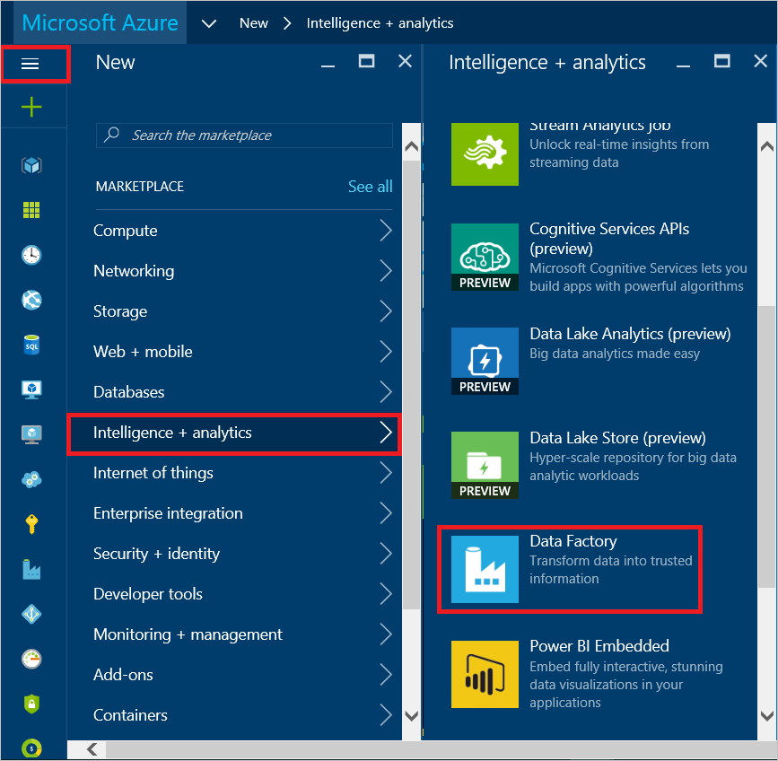
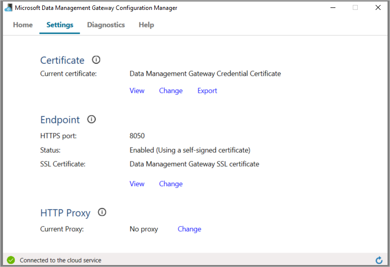

<properties 
    pageTitle="Mover dados - Gateway de gerenciamento de dados | Microsoft Azure"
    description="Configure um gateway dados para mover dados entre locais e na nuvem. Use o Gateway de gerenciamento de dados da fábrica de dados do Azure para mover seus dados." 
    keywords="gateway de dados, integração de dados, mover os dados, credenciais de gateway"
    services="data-factory" 
    documentationCenter="" 
    authors="linda33wj" 
    manager="jhubbard" 
    editor="monicar"/>

<tags 
    ms.service="data-factory" 
    ms.workload="data-services" 
    ms.tgt_pltfrm="na" 
    ms.devlang="na" 
    ms.topic="article" 
    ms.date="10/18/2016" 
    ms.author="jingwang"/>

# Mover dados entre fontes locais e na nuvem com o Gateway de gerenciamento de dados
Este artigo fornece uma visão geral de integração de dados entre armazenamentos de dados locais e os armazenamentos de dados de nuvem usando dados fábrica. Ele se baseia no artigo de [Atividades de movimentação de dados](data-factory-data-movement-activities.md) e outros artigos conceitos de núcleo de fábrica de dados: [conjuntos de dados](data-factory-create-datasets.md) e [canais](data-factory-create-pipelines.md). 

## Gateway de gerenciamento de dados
Você deve instalar o Gateway de gerenciamento de dados no computador local para habilitar a movimentação de dados de/para um armazenamento de dados local. O gateway pode ser instalado na mesma máquina como o armazenamento de dados ou em um computador diferente desde o gateway pode se conectar ao armazenamento de dados. 

> [AZURE.IMPORTANT] Consulte o artigo do [Gateway de gerenciamento de dados](data-factory-data-management-gateway.md) para obter detalhes sobre o Gateway de gerenciamento de dados.   

A instrução a seguir mostra como criar uma fábrica de dados com um pipeline que move dados de um banco de dados do **SQL Server** local para um armazenamento de blob do Microsoft Azure. Como parte da explicação, instalar e configurar o Gateway de gerenciamento de dados em sua máquina. 

## Passo a passo: copiar dados de locais na nuvem
  
## Criar fábrica de dados
Nesta etapa, você pode usar o portal do Azure para criar uma instância de fábrica de dados do Azure denominada **ADFTutorialOnPremDF**. 

1.  Faça logon no [portal do Azure](https://portal.azure.com). 
2.  Clique em **+ novo**, clique **inteligência + análise**e clique em **Dados fábrica**.

      
2. Na lâmina **nova fábrica de dados** , digite **ADFTutorialOnPremDF** para o nome.

    

    > [AZURE.IMPORTANT] 
    > O nome da fábrica dados Azure deve ser exclusivo. Se você receber o erro: **nome de fábrica de dados "ADFTutorialOnPremDF" não está disponível**, altere o nome da fábrica dados (por exemplo, yournameADFTutorialOnPremDF) e experimente criar novamente. Use esse nome no lugar de ADFTutorialOnPremDF ao executar etapas restantes neste tutorial.
    > 
    > O nome da fábrica dados pode ser registrado como um nome **DNS** no futuro e, portanto, ficam visível publicamente.
3. Selecione a **assinatura do Azure** onde você deseja que a fábrica de dados a ser criado. 
4.  Selecionar **grupo de recursos** de existente ou criar um grupo de recursos. Para o tutorial, crie um grupo de recursos denominado: **ADFTutorialResourceGroup**. 
5.  Clique em **criar** na lâmina **nova fábrica de dados** .

    > [AZURE.IMPORTANT] Para criar instâncias de fábrica de dados, você deve ser um membro da função [Colaborador de fábrica de dados](../active-directory/role-based-access-built-in-roles.md/#data-factory-contributor) no nível de grupo assinatura/recurso. 
11. Após a criação estiver concluída, você verá a lâmina de **Fábrica de dados** conforme mostrado na imagem a seguir:

    

## Criar gateway
5. Na lâmina **Fábrica de dados** , clique em **autor e implantar** peças para iniciar o **Editor** para a fábrica de dados.

     
6.  No Editor de fábrica de dados, clique em **… Mais** na barra de ferramentas e clique em **novo gateway de dados**. Como alternativa, você pode **Gateways dados** de atalho na exibição em árvore e clique em **novo gateway de dados**. 

    
2. Na lâmina **criar** , insira **adftutorialgateway** para o **nome**e clique em **Okey**.    

    
3. Na lâmina **Configurar** , clique em **instalar diretamente neste computador**. Esta ação faz o download do pacote de instalação do gateway, instala, configura e registra o gateway no computador.  

    > [AZURE.NOTE] 
    > Use o Internet Explorer ou um navegador da web compatível Microsoft ClickOnce.
    > 
    > Se você estiver usando o Chrome, vá para a [loja do Chrome na web](https://chrome.google.com/webstore/), pesquisar com palavra-chave "ClickOnce", escolha uma das extensões ClickOnce e instalá-lo. 
    >  
    > Faça o mesmo para o Firefox (instalação do suplemento). Clique em botão de **Menu aberto** na barra (**três linhas horizontais** no canto superior direito), clique em **Complementos**, pesquisar com a palavra-chave "ClickOnce", escolha uma das extensões ClickOnce e instalá-lo.    

    

    Dessa maneira é a maneira mais fácil (um único clique) baixar, instalar, configurar e registrar o gateway em uma única etapa. Você pode ver que o aplicativo do **Gerenciador de configuração do Gateway de gerenciamento de dados Microsoft** está instalado no seu computador. Você também pode encontrar o executável **ConfigManager.exe** na pasta: **C:\Program Files\Microsoft dados gerenciamento Gateway\2.0\Shared**.

    Você também pode baixar e instalar o gateway manualmente usando os links neste lâmina e registrar usando a tecla mostrada na caixa de texto **Nova chave** .
    
    Consulte o artigo do [Gateway de gerenciamento de dados](data-factory-data-management-gateway.md) para todos os detalhes sobre o gateway.

    >[AZURE.NOTE] Você deve ser um administrador no computador local para instalar e configurar o Gateway de gerenciamento de dados com êxito. Você pode adicionar usuários adicionais para o grupo local **Usuários de Gateway de gerenciamento de dados** do Windows. Os membros deste grupo podem usar a ferramenta Gerenciador de configuração do Gateway de gerenciamento de dados para configurar o gateway. 

5. Aguarde alguns minutos ou esperar até ver a seguinte mensagem de notificação:

     
6. Inicie o aplicativo do **Gerenciador de configuração do Gateway de gerenciamento de dados** no seu computador. Na janela **Pesquisar** , digite **Data Management Gateway** para acessar esse utilitário. Você também pode encontrar o executável **ConfigManager.exe** na pasta: **C:\Program Files\Microsoft dados gerenciamento Gateway\2.0\Shared** 

    
6. Confirme que você vê `adftutorialgateway is connected to the cloud service` mensagem. A barra na parte inferior de status exibe **conectado ao serviço de nuvem** junto com uma **marca de seleção verde**.

    Na guia **página inicial** , você também pode fazer as seguintes operações: 
    - **Registrar** um gateway com uma chave do portal do Azure usando o botão de registro. 
    - **Parar** o serviço de Host de Gateway de gerenciamento de dados em execução no computador do gateway. 
    - **Agendar atualizações** para ser instalado em uma hora específica do dia. 
    - Modo de exibição, quando o gateway foi **atualizado pela última vez**.
    - Especifique o horário em que é possível instalar uma atualização para o gateway. 

8. Alternar para a guia **configurações** . O certificado especificado na seção de **certificado** é usado para criptografia/descriptografia credenciais para o armazenamento de dados local que você especificar no portal. (opcional) Clique em **Alterar** para usar seu próprio certificado em vez disso. Por padrão, o gateway usa o certificado que é gerado automaticamente pelo serviço de dados fábrica.

    

    Você também pode fazer as seguintes ações na guia **configurações** : 
    - Exibir ou exporte o certificado que está sendo usado pelo gateway.
    - Altere o ponto de extremidade HTTPS usado pelo gateway.    
    - Defina um proxy HTTP para ser usado pelo gateway.   
9. (opcional) Alternar para a guia de **Diagnóstico** , marque a opção **Habilitar o registro extenso** se você quiser ativar o registro extenso que você pode usar para solucionar qualquer problema com o gateway. As informações de registro podem ser encontradas no **Visualizador de eventos** em **Logs aplicativos e serviços** -> nó do**Gateway de gerenciamento de dados** . 

    

    Você também pode executar as seguintes ações na guia **Diagnóstico** : 
    
    - Use a seção de **Conexão de teste** para uma fonte de dados local usando o gateway.
    - Clique em **Exibir Logs** para ver o log de Gateway de gerenciamento de dados em uma janela do Visualizador de eventos. 
    - Clique em **Enviar Logs** para carregar um arquivo zip com logs dos últimos sete dias para a Microsoft para facilitar a solução de problemas de seus problemas. 
10. Na guia **Diagnóstico** , na seção **Testar Conexão** , selecione **SQL Server** para o tipo de armazenamento de dados, insira o nome do servidor de banco de dados, o nome do banco de dados, especifique o tipo de autenticação, insira o nome de usuário e senha e clique em **Testar** para testar se o gateway pode se conectar ao banco de dados. 
11. Alternar para o navegador da web e, no **portal do Azure**, clique **Okey** na lâmina **Configurar** e na lâmina **novo gateway de dados** .
6. Você deve ver **adftutorialgateway** em **Gateways de dados** na exibição em árvore à esquerda.  Se você clicar nele, você deve ver o JSON associado. 
    

## Criar serviços vinculados 
Nesta etapa, você cria dois serviços vinculados: **AzureStorageLinkedService** e **SqlServerLinkedService**. O **SqlServerLinkedService** vincula um banco de dados do SQL Server local e os links de serviço vinculada **AzureStorageLinkedService** armazenar um Azure blob à fábrica dados. Crie um pipeline posteriormente neste passo a passo que copia dados do banco de dados do SQL Server no local para o armazenamento de blob do Microsoft Azure. 

#### Adicionar um serviço vinculado a um banco de dados do SQL Server no local
1.  No **Editor de fábrica de dados**, clique em **armazenam novos dados** na barra de ferramentas e selecione **SQL Server**. 

     
3.  No **editor de JSON** à direita, siga estas etapas: 
    1. Para o **gatewayName**, especifica **adftutorialgateway**. 
    2. Em **connectionString**, siga estas etapas: 
        1. Para **nomedoservidor**, insira o nome do servidor que hospeda o banco de dados do SQL Server.
        2. Para **databasename**, insira o nome do banco de dados.
        3. Clique em botão de **criptografar** na barra de ferramentas. Isso downloads e inicia o aplicativo do Gerenciador de credenciais.
        
            
        5. Na caixa de diálogo **Definir credenciais** , especifique o tipo de autenticação, nome de usuário e senha e clique em **Okey**. Se a conexão for bem-sucedida, as credenciais criptografadas são armazenadas no JSON e fecha a caixa de diálogo. 
        6. Feche a guia do navegador vazia que iniciou a caixa de diálogo se ela não estiver fechada automaticamente e voltar para a guia com o portal do Azure. 
  
            No computador do gateway, essas credenciais são **criptografadas** usando um certificado que possui o serviço de dados fábrica. Se você quiser usar o certificado que está associado com o Gateway de gerenciamento de dados em vez disso, consulte [definir credenciais com segurança](#set-credentials-and-security).    
    1.  Clique em **implantar** na barra de comando para implantar o serviço SQL Server vinculado. Você deve ver o serviço vinculado na exibição em árvore. 
        
          

#### Adicionar um serviço vinculado para uma conta de armazenamento do Azure
 
1. No **Editor de fábrica de dados**, clique em **armazenam novos dados** na barra de comando e clique em **armazenamento do Azure**.
2. Insira o nome da sua conta de armazenamento do Azure para o **nome da conta**.
3. Insira a chave para a sua conta de armazenamento do Azure para a **chave da conta**.
4. Clique em **implantar** para implantar o **AzureStorageLinkedService**.
   
 
## Criar conjuntos de dados
Nesta etapa, você cria a entrada e saída conjuntos de dados que representam dados de entrada e saídos para a operação de cópia (banco de dados no SQL Server local = > armazenamento de blob do Microsoft Azure). Antes de criar conjuntos de dados, siga as etapas a seguir (etapas detalhadas segue lista):

- Criar uma tabela chamada **emp** no banco de dados do SQL Server você adicionado como um serviço vinculado à fábrica dados e insira um par de entradas de exemplo na tabela.
- Crie um contêiner de blob denominado **adftutorial** na conta de armazenamento de blob do Microsoft Azure que você adicionado como um serviço vinculado à fábrica dados.

### Preparar no SQL Server local para o tutorial

1. No banco de dados que você especificou para o SQL Server local serviço vinculado (**SqlServerLinkedService**), use o seguinte script SQL para criar a tabela de **emp** no banco de dados.

        CREATE TABLE dbo.emp
        (
            ID int IDENTITY(1,1) NOT NULL, 
            FirstName varchar(50),
            LastName varchar(50),
            CONSTRAINT PK_emp PRIMARY KEY (ID)
        )
        GO 
2. Inseri alguns exemplo na tabela: 

        INSERT INTO emp VALUES ('John', 'Doe')
        INSERT INTO emp VALUES ('Jane', 'Doe')

### Criar entrada de conjunto de dados

1. No **Editor de fábrica de dados**, clique em **… Mais**, clique em **novo dataset** na barra de comando e clique em **tabela do SQL Server**. 
2.  Substitua o JSON no painel direito com o seguinte texto:
        
            {       
                "name": "EmpOnPremSQLTable",
                "properties": {
                    "type": "SqlServerTable",
                    "linkedServiceName": "SqlServerLinkedService",
                    "typeProperties": {
                        "tableName": "emp"
                    },
                    "external": true,
                    "availability": {
                        "frequency": "Hour",
                        "interval": 1
                    },
                    "policy": {
                        "externalData": {
                            "retryInterval": "00:01:00",
                            "retryTimeout": "00:10:00",
                            "maximumRetry": 3
                        }
                    }
                }
            }    

    Observe os seguintes pontos: 

    - **tipo** está definido como **SqlServerTable**.
    - **nome de tabela** está definido como **emp**.
    - **linkedServiceName** está definido como **SqlServerLinkedService** (você criou esse serviço vinculado anteriormente neste passo a passo.).
    - Um conjunto de dados entrada que não é gerado por outra tubulação em fábrica de dados do Azure, você deve definir **externos** como **true**. Ele indica que os dados de entrada são produzidos externo para o serviço de fábrica de dados do Azure. Opcionalmente, você pode especificar qualquer políticas de dados externos usando o elemento de **externalData** na seção **diretiva** .    

    Consulte [mover dados de/para o SQL Server](data-factory-sqlserver-connector.md) para obter detalhes sobre propriedades JSON.
2. Clique em **implantar** na barra de comando para implantar o conjunto de dados.  

### Criar conjunto de dados de saída

1.  No **Editor de fábrica de dados**, clique em **novo dataset** na barra de comando e clique em **armazenamento de Blob do Azure**.
2.  Substitua o JSON no painel direito com o seguinte texto: 

            {
                "name": "OutputBlobTable",
                "properties": {
                    "type": "AzureBlob",
                    "linkedServiceName": "AzureStorageLinkedService",
                    "typeProperties": {
                        "folderPath": "adftutorial/outfromonpremdf",
                        "format": {
                            "type": "TextFormat",
                            "columnDelimiter": ","
                        }
                    },
                    "availability": {
                        "frequency": "Hour",
                        "interval": 1
                    }
                }
            }
  
    Observe os seguintes pontos: 
    
    - **tipo** está definido como **AzureBlob**.
    - **linkedServiceName** está definido como **AzureStorageLinkedService** (você criou esse serviço vinculado na etapa 2).
    - **folderPath** está definido como **adftutorial/outfromonpremdf** onde outfromonpremdf é a pasta no contêiner de adftutorial. Crie o contêiner de **adftutorial** se ele ainda não exista. 
    - A **disponibilidade** está definido para **cada hora** (**frequência** definido como **hora** e **intervalo** definido como **1**).  O serviço de dados fábrica gera uma fatia de dados de saída cada hora na tabela **emp** do banco de dados do SQL Azure. 

    Se você não especificar um **nome de arquivo** para uma **tabela de saída**, os arquivos gerados no **folderPath** são nomeados no seguinte formato: dados. <Guid>. txt (por exemplo:: Data.0a405f8a-93ff-4c6f-b3be-f69616f1df7a.txt.).

    Para definir **folderPath** e **fileName** dinamicamente com base no período de tempo **SliceStart** , use a propriedade partitionedBy. No exemplo a seguir, folderPath usa ano, mês e dia a partir do SliceStart (hora de início da fatia sendo processada) e fileName usa hora a partir do SliceStart. Por exemplo, se uma fatia é produzida de 2014-10-20T08:00:00, a nomedapasta está definida como wikidatagateway wikisampledataout/2014/10/20 e o nome do arquivo está definida como 08.csv. 

        "folderPath": "wikidatagateway/wikisampledataout/{Year}/{Month}/{Day}",
        "fileName": "{Hour}.csv",
        "partitionedBy": 
        [
            { "name": "Year", "value": { "type": "DateTime", "date": "SliceStart", "format": "yyyy" } },
            { "name": "Month", "value": { "type": "DateTime", "date": "SliceStart", "format": "MM" } }, 
            { "name": "Day", "value": { "type": "DateTime", "date": "SliceStart", "format": "dd" } }, 
            { "name": "Hour", "value": { "type": "DateTime", "date": "SliceStart", "format": "hh" } } 
        ],

 
    Consulte [mover dados de/para o armazenamento de Blob do Azure](data-factory-azure-blob-connector.md) para obter detalhes sobre propriedades JSON.
2.  Clique em **implantar** na barra de comando para implantar o conjunto de dados. Confirme que você vê os dois conjuntos de dados na exibição em árvore.  

## Crie pipeline
Nesta etapa, você cria um **pipeline** com uma **Atividade de cópia** que usa **EmpOnPremSQLTable** como entrada e **OutputBlobTable** como saída.

1.  No Editor de fábrica de dados, clique em **… Mais**e clique em **novo pipeline**. 
2.  Substitua o JSON no painel direito com o seguinte texto: 
    
            {
                "name": "ADFTutorialPipelineOnPrem",
                "properties": {
                "description": "This pipeline has one Copy activity that copies data from an on-prem SQL to Azure blob",
                "activities": [
                {
                    "name": "CopyFromSQLtoBlob",
                    "description": "Copy data from on-prem SQL server to blob",
                    "type": "Copy",
                    "inputs": [
                    {
                        "name": "EmpOnPremSQLTable"
                    }
                    ],
                    "outputs": [
                    {
                        "name": "OutputBlobTable"
                      }
                    ],
                    "typeProperties": {
                      "source": {
                        "type": "SqlSource",
                        "sqlReaderQuery": "select * from emp"
                      },
                      "sink": {
                        "type": "BlobSink"
                      }
                    },
                    "Policy": {
                      "concurrency": 1,
                      "executionPriorityOrder": "NewestFirst",
                      "style": "StartOfInterval",
                      "retry": 0,
                      "timeout": "01:00:00"
                    }
                  }
                ],
                "start": "2016-07-05T00:00:00Z",
                "end": "2016-07-06T00:00:00Z",
                "isPaused": false
              }
            }

    > [AZURE.IMPORTANT]
    > Substitua o valor da propriedade **comece** com o valor de dia e de **término** atual com o próximo dia.

    Observe os seguintes pontos:
 
    - Na seção atividades, há apenas atividade cujo **tipo** está definido como **Copiar**.
    - A **entrada** para a atividade está definido como **EmpOnPremSQLTable** e **saída** para a atividade está definida como **OutputBlobTable**.
    - Na seção **typeProperties** , **SqlSource** é especificado como o **tipo de fonte** e **BlobSink **especificado como o **tipo de receptor**.
    - Consulta SQL `select * from emp` especificado para a propriedade de **sqlReaderQuery** de **SqlSource**.

     Ambos iniciar e encerrar datetimes deve estar no [formato ISO](http://en.wikipedia.org/wiki/ISO_8601). Por exemplo: 2014-10-14T16:32:41Z. A hora de **término** é opcional, mas podemos usá-lo neste tutorial. 
    
    Se você não especificar o valor da propriedade **final** , ele é calculado como "**início + 48 horas**". Para executar o pipeline indefinidamente, especifique **9/9/9999** como o valor da propriedade de **fim** . 
    
    Você está definindo a duração de tempo em que as fatias de dados são processadas baseada nas propriedades **disponibilidade** que foram definidas para cada conjunto de dados do Azure dados fábrica.
    
    No exemplo, há 24 fatias de dados como cada fatia de dados é gerada por hora.     
2. Clique em **implantar** na barra de comando para implantar o conjunto de dados (tabela é um conjunto de dados retangular). Confirme que o pipeline aparece na exibição em árvore nó **canais** .  
5. Agora, clique em **X** duas vezes para fechar as lâminas voltar para a lâmina de **Fábrica de dados** para o **ADFTutorialOnPremDF**.

**Parabéns!** Com êxito você tiver criado uma fábrica dados Azure, serviços vinculados, conjuntos de dados e um pipeline e agendado o pipeline.

#### Exibir a fábrica de dados em um modo de exibição de diagrama 
1. No **portal do Azure**, clique em **diagrama de** bloco na página inicial para a fábrica de dados **ADFTutorialOnPremDF** . :

    

2. Você deve ver o diagrama semelhante a imagem a seguir:

    

    Você pode aumentar o zoom, zoom, zoom para 100%, zoom para ajustá-la, posicione canais e conjuntos de dados automaticamente e mostrar informações de linhagem (destaca upstream e downstream itens dos itens selecionados).  Você pode clicar duas vezes um objeto (dataset de entrada/saída ou pipeline) para ver as propriedades para ele. 

## Pipeline de monitor
Nesta etapa, você pode usar o portal do Azure para monitorar o que está acontecendo em uma fábrica de dados do Azure. Você também pode usar cmdlets do PowerShell para monitorar conjuntos de dados e canais. Para obter detalhes sobre o monitoring, consulte [Monitor e gerenciar canais](data-factory-monitor-manage-pipelines.md).

5. No diagrama, clique duas vezes em **EmpOnPremSQLTable**.  

    

6. Observe que todos os dados fatias para cima em estado **pronto** porque a duração de pipeline (hora de início, a hora de término) é no passado. Também é porque você inseriu os dados do banco de dados do SQL Server e ele está lá o tempo todo. Confirme que nenhuma fatias aparecem na seção **fatias problema** na parte inferior. Para exibir todas as fatias, clique em **Ver mais** na parte inferior da lista de fatias. 
7. Agora, na lâmina **conjuntos de dados** , clique em **OutputBlobTable**.

    
9. Clique em qualquer fatia de dados na lista e você verá a lâmina **Fatia de dados** . Você verá a atividade é executada da fatia. Você vê apenas uma atividade executado normalmente.  

    

    Se a fatia não estiver no estado **pronto** , você pode ver as fatias upstream que não estão prontos e estão bloqueando a fatia atual de executar na lista **Upstream fatias que são não está prontas** .

10. Clique na **atividade executar** na lista na parte inferior para ver a **atividade de execução detalhes**.

    

    Você verá informações como produtividade, duração e o gateway usado para transferir os dados. 
11. Clique no **X** para fechar todas as lâminas até 
12. Voltar para a lâmina inicial para a **ADFTutorialOnPremDF**.
14. (opcional) Clique em **canais**, clique em **ADFTutorialOnPremDF**e detalhada por meio de tabelas de entrada (**consumida**) ou conjuntos de dados de saída (**Produced**).
15. Use ferramentas como usar ferramentas como o [Gerenciador de armazenamento da Microsoft](http://storageexplorer.com/) para verificar que um arquivo do blob/é criado para cada hora.

    

## Próximas etapas

- Consulte o artigo do [Gateway de gerenciamento de dados](data-factory-data-management-gateway.md) para todos os detalhes sobre o Gateway de gerenciamento de dados.
- Consulte [copiar dados do Azure Blob para SQL Azure](data-factory-copy-data-from-azure-blob-storage-to-sql-database.md) para saber mais sobre como usar a atividade de cópia para mover dados de um armazenamento de dados de origem para um armazenamento de dados do receptor. 
