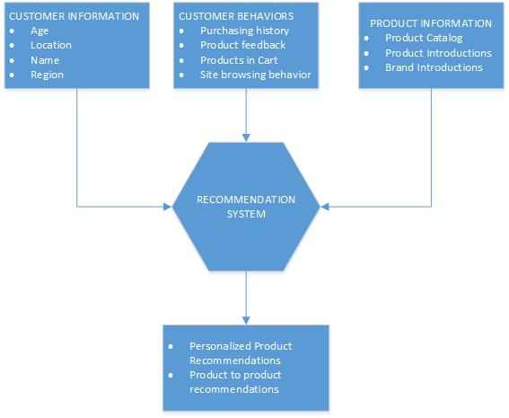

<properties 
    pageTitle="Caso de uso de fábrica de dados - recomendações de produtos" 
    description="Saiba mais sobre um caso de uso implementado usando fábrica de dados do Azure juntamente com outros serviços." 
    services="data-factory" 
    documentationCenter="" 
    authors="sharonlo101" 
    manager="jhubbard" 
    editor="monicar"/>

<tags 
    ms.service="data-factory" 
    ms.workload="data-services" 
    ms.tgt_pltfrm="na" 
    ms.devlang="na" 
    ms.topic="article" 
    ms.date="09/01/2016" 
    ms.author="shlo"/>

# Use maiusculas e minúsculas - recomendações de produto 

Azure fábrica de dados é um dos muitos serviços usados para implementar o pacote de inteligência de Cortana de aceleradores de solução.  Consulte página de [Pacote de inteligência de Cortana](http://www.microsoft.com/cortanaanalytics) para obter detalhes sobre este pacote. Neste documento, podemos descrever um caso de uso comuns que os usuários Azure já resolvido e implementado usando fábrica de dados do Azure e outros serviços de componente de inteligência de Cortana.

## Cenário

Lojas online comumente deseja Atraia clientes para comprar produtos apresentando-los com os produtos que eles são provavelmente ser de seu interesse e, portanto, provavelmente comprar. Para fazer isso, lojas online precisam personalizar seus online experiência de usuário usando recomendações de produto personalizadas para esse usuário específico. Essas recomendações personalizadas devem ser feita com base em suas atuais e históricos de compras dados de comportamento, informações do produto, recentemente introduzidas marcas e dados de segmentação de produtos e atendimento ao cliente.  Além disso, eles podem fornecer as recomendações de produto do usuário com base em análise de comportamento geral do uso de todos os seus usuários combinados.

O objetivo dessas lojas é otimizar para conversões de clique para venda de usuário e ganhar receita de vendas maior.  Eles atingir essa conversão fornecendo recomendações de produtos contextual baseados em comportamento, com base em interesses de cliente e ações. Para esse caso de uso, podemos usar lojas online como exemplo de empresas que deseja otimizar para seus clientes. No entanto, esses princípios se aplicam a qualquer empresa que deseja envolver seus clientes em torno de seus produtos e serviços e aprimorar a experiência de compras de seus clientes com recomendações de produto personalizadas.

## Desafios

Existem muitos desafios que enfrentam lojas online ao tentar implementar esse tipo de caso de uso. 

Primeiro, os dados de formas e tamanhos diferentes devem ser incluídos de várias fontes de dados, ambos os locais e na nuvem. Estes dados incluem dados de produto, dados de comportamento do cliente histórica e dados do usuário, como o usuário navega o site de varejo online. 

Recomendações de produto personalizadas segundo devem ser razoavelmente e precisão calculadas e previstas. Além de produto, marca e dados de comportamento e o navegador do cliente, lojas online também precisam incluir comentários do cliente em compras passadas ao fator a determinar as melhores recomendações de produto para o usuário. 

Terceiro, as recomendações devem ser imediatamente entregues ao usuário para fornecer uma navegação perfeita e a experiência de compra e forneça as recomendações mais recentes e relevantes. 

Por fim, revendedores precisam medir a eficácia de sua abordagem controlando geral vendas cruzadas sucessos de vendas de conversão-clique e ajustar às respectivas recomendações futuras.

## Visão geral da solução

Neste caso de uso de exemplo foi resolvido e implementado por usuários real Azure usando fábrica de dados do Azure e outros serviços de componente de inteligência de Cortana, incluindo [HDInsight](https://azure.microsoft.com/services/hdinsight/) e [Power BI](https://powerbi.microsoft.com/).

O revendedor online usa um armazenamento de Blob do Azure, um SQL server local, DB do SQL Azure e um armazém de dados relacionais como suas opções de armazenamento de dados em todo o fluxo de trabalho.  O armazenamento de blob contém informações de cliente, dados de comportamento do cliente e dados de informações do produto. Os dados de informações do produto incluem informações de marca de produto e armazenados no local em um depósito de dados SQL do catálogo de um produto. 

Todos os dados são combinados e colocados um sistema de recomendação de produto para fornecer recomendações personalizadas com base em interesses de cliente e ações, enquanto o usuário navega produtos no catálogo no site. Os clientes também ver produtos relacionados ao produto está analisando com base em padrões de uso do site geral que não estão relacionadas a qualquer um usuário.

Gigabytes de arquivos de log da web bruto são gerados diariamente do site do revendedor online como arquivos semiestruturados. Os arquivos de log da web bruto e as informações de catálogo de cliente e produto é incluídos regularmente em um armazenamento de Blob do Azure usando o movimento de dados globalmente implantado da fábrica de dados como um serviço. Os arquivos de log bruto para o dia são particionados (por ano e mês) no armazenamento de blob para armazenamento de longo prazo.  [Azurehdinsight](https://azure.microsoft.com/services/hdinsight/) é usado para os arquivos de log bruto no armazenamento de blob de partição e processar os logs ingeridos em escala usando scripts de seção e porco. Web particionada logs de dados é processada para extrair as entradas necessárias para uma sistema de recomendação para gerar as recomendações de produto personalizadas de aprendizado de máquina.

O sistema de recomendação usado para neste exemplo de aprendizado de máquina é uma plataforma de recomendação de [Apache Mahout](http://mahout.apache.org/)de aprendizado de máquina de abrir origem.  Qualquer [Aprendizado de máquina do Azure](https://azure.microsoft.com/services/machine-learning/) ou modelo personalizado pode ser aplicado ao cenário.  O modelo de Mahout é usado para prever a similaridade entre itens no site com base em padrões de uso geral e para gerar as recomendações personalizadas com base no usuário individual.

Por fim, o conjunto de resultados de recomendações de produto personalizadas é movido para um armazém de dados relacionais consumo pelo site revendedor.  O conjunto de resultados também pode ser acessado diretamente do armazenamento de blob por outro aplicativo ou movido para lojas adicional para outros consumidores e casos de uso.

## Benefícios

Otimizando sua estratégia de recomendação de produto e alinhando-lo com as metas de negócios, a solução atendidos mercadorias do revendedor online e os objetivos de marketing. Além disso, foram capazes de colocar em operação e gerenciar o fluxo de trabalho de recomendação de produto de maneira eficiente, confiável e econômica. A abordagem tornou mais fácil para que elas sejam atualizar seu modelo e ajustar sua eficácia com base nas medidas de vendas sucessos de conversão-clique. Usando fábrica de dados do Azure, eles conseguiram abandonar seu gerenciamento de recursos de nuvem manual caro e demorado e mover para o gerenciamento de recursos de nuvem sob demanda. Portanto, eles conseguiram economizar tempo, dinheiro e reduzir seu tempo para implantação da solução. Modos de exibição de linhagem de dados e a integridade do serviço operacional ficaram fácil visualizar e solucionar problemas com o monitoramento de fábrica de dados intuitiva e UI disponível a partir do Azure portal de gerenciamento. Sua solução agora pode ser agendada e gerenciada para que dados concluído é confiável produzidos e entregues aos usuários e dados e as dependências de processamento são automaticamente gerenciadas sem a intervenção.

Fornecendo esta experiência de compra personalizada, o revendedor online criado um cliente mais concorrência, atraente experiência e, portanto, melhore a satisfação do cliente de vendas e geral.

  