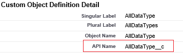

<properties
    pageTitle="Mover dados do Salesforce usando dados fábrica | Microsoft Azure"
    description="Saiba mais sobre como mover dados de vendas usando fábrica de dados do Azure."
    services="data-factory"
    documentationCenter=""
    authors="linda33wj"
    manager="jhubbard"
    editor="monicar"/>

<tags
    ms.service="data-factory"
    ms.workload="data-services"
    ms.tgt_pltfrm="na"
    ms.devlang="na"
    ms.topic="article"
    ms.date="10/25/2016"
    ms.author="jingwang"/>

# Mover dados do Salesforce usando fábrica de dados do Azure
Este artigo descreve como você pode usar atividade de cópia em uma fábrica de dados do Azure para copiar dados de vendas para qualquer armazenamento de dados que está listado na coluna receptor na tabela [suporte fontes e receptores](data-factory-data-movement-activities.md#supported-data-stores) . Este artigo se baseia o artigo de [atividades de movimentação de dados](data-factory-data-movement-activities.md) , que apresenta uma visão geral de movimentação de dados com atividade de cópia e combinações de repositório de dados com suporte.

Atualmente, o Azure Data Factory oferece suporte a somente movimentação de dados de vendas para [stores]((data-factory-data-movement-activities.md#supported-data-stores) de dados de receptor com suporte, mas não armazena não oferece suporte para movimentação de dados de outros dados para a equipe de vendas.

## Pré-requisitos
- Você deve usar um dos seguintes edições do Salesforce: Developer Edition, Professional Edition, Enterprise Edition ou ilimitado Edition.
- Permissão de API deve ser habilitado. Consulte [como habilitar o acesso de API no Salesforce pelo conjunto de permissões?](https://www.data2crm.com/migration/faqs/enable-api-access-salesforce-permission-set/)
- Para copiar dados de Salesforce armazenamentos de dados local, você deve ter pelo menos 2.0 de Gateway de gerenciamento de dados instalado no seu ambiente local.

## Limites de solicitação de SalesForce
SalesForce tem limites do total de solicitações de API e solicitações de API simultâneas. Consulte a seção "Limites de solicitação de API" no artigo [Limites de desenvolvedor do Salesforce](http://resources.docs.salesforce.com/200/20/en-us/sfdc/pdf/salesforce_app_limits_cheatsheet.pdf) para obter detalhes. Observação Se o número de solicitações simultâneas exceder o limite, a limitação ocorre e você verá falhas aleatórias; Se o número total de solicitações de exceder o limite, a conta de Salesforce será bloqueada por 24 horas; Você também pode receber o erro "REQUEST_LIMIT_EXCEEDED" em ambos os cenários.

## Assistente de cópia de dados
A maneira mais fácil para criar um pipeline que copia dados de Salesforce para qualquer um dos armazenamentos de dados com suporte receptor é usar o Assistente para copiar dados. Consulte [Tutorial: criar um pipeline usando o Assistente de cópia](data-factory-copy-data-wizard-tutorial.md) para um rápida passo a passo sobre como criar um pipeline usando o Assistente de dados de cópia.

O exemplo a seguir fornece definições de JSON de exemplo que você pode usar para criar um pipeline usando o [portal do Azure](data-factory-copy-activity-tutorial-using-azure-portal.md), [Visual Studio](data-factory-copy-activity-tutorial-using-visual-studio.md)ou [Azure PowerShell](data-factory-copy-activity-tutorial-using-powershell.md). Eles mostram como copiar dados de vendas para o armazenamento de Blob do Azure. No entanto, os dados podem ser copiados para qualquer um dos receptores declarado [aqui](data-factory-data-movement-activities.md#supported-data-stores) usando a atividade de cópia em fábrica de dados do Azure.   

## Exemplo: Copiar dados de vendas para um blob do Microsoft Azure
Este exemplo copia dados de vendas para um Azure blob cada hora. As propriedades JSON que são usadas nesses exemplos são descritas nas seções após os exemplos. Você pode copiar dados diretamente para qualquer um dos receptores de listados no artigo [atividades de movimentação de dados](data-factory-data-movement-activities.md#supported-data-stores) usando Copiar atividade no Azure dados fábrica.

Aqui estão os artefatos de fábrica de dados que você precisará criar para implementar o cenário. As seções a seguir lista fornecem detalhes sobre essas etapas.

- Um serviço vinculado do tipo [Salesforce](#salesforce-linked-service-properties)
- Um serviço vinculado do tipo [AzureStorage](data-factory-azure-blob-connector.md#azure-storage-linked-service-properties)
- Um [conjunto de dados](data-factory-create-datasets.md) de entrada do tipo [RelationalTable](#salesforce-dataset-properties)
- Uma saída [dataset](data-factory-create-datasets.md) do tipo [AzureBlob](data-factory-azure-blob-connector.md#azure-blob-dataset-type-properties)
- Um [pipeline](data-factory-create-pipelines.md) com atividade de cópia que usa [RelationalSource](#relationalsource-type-properties) e [BlobSink](data-factory-azure-blob-connector.md#azure-blob-copy-activity-type-properties)

**Serviço de SalesForce vinculado**

Este exemplo usa o serviço de **Salesforce** vinculado. Consulte a seção [Salesforce vinculado serviço](#salesforce-linked-service-properties) para as propriedades que são suportados por esse serviço vinculado.  Consulte [obter token de segurança](https://help.salesforce.com/apex/HTViewHelpDoc?id=user_security_token.htm) para obter instruções sobre como redefinir/obter o token de segurança.

    {
        "name": "SalesforceLinkedService",
        "properties":
        {
            "type": "Salesforce",
            "typeProperties":
            {
                "username": "<user name>",
                "password": "<password>",
                "securityToken": "<security token>"
            }
        }
    }

**Serviço de armazenamento vinculado do Azure**

    {
      "name": "AzureStorageLinkedService",
      "properties": {
        "type": "AzureStorage",
        "typeProperties": {
          "connectionString": "DefaultEndpointsProtocol=https;AccountName=<accountname>;AccountKey=<accountkey>"
        }
      }
    }

**Conjunto de dados de entrada do SalesForce**

    {
        "name": "SalesforceInput",
        "properties": {
            "linkedServiceName": "SalesforceLinkedService",
            "type": "RelationalTable",
            "typeProperties": {
                "tableName": "AllDataType__c"  
            },
            "availability": {
                "frequency": "Hour",
                "interval": 1
            },
            "external": true,
            "policy": {
                "externalData": {
                    "retryInterval": "00:01:00",
                    "retryTimeout": "00:10:00",
                    "maximumRetry": 3
                }
            }
        }
    }

Configuração **externos** como **true** informa o serviço de fábrica de dados que o conjunto de dados externo à fábrica dados e não é produzido por uma atividade na fábrica dados.

> [AZURE.IMPORTANT] A parte de "__c" do nome da API é necessário para qualquer objeto personalizado.

**Conjunto de dados de saída de blob do Microsoft Azure**

Dados são gravados em um novo blob cada hora (frequência: horas, intervalo: 1).

    {
        "name": "AzureBlobOutput",
        "properties":
        {
            "type": "AzureBlob",
            "linkedServiceName": "AzureStorageLinkedService",
            "typeProperties":
            {
                "folderPath": "adfgetstarted/alltypes_c"
            },
            "availability":
            {
                "frequency": "Hour",
                "interval": 1
            }
        }
    }

**Pipeline com atividade de cópia**

O pipeline contém atividade de cópia, que é configurado para usar a entrada acima e conjuntos de dados de saída, e está agendado para ser executado a cada hora. No pipeline de definição de JSON, o tipo de **fonte** é definido como **RelationalSource**e o tipo de **receptor** está definido como **BlobSink**.

Consulte [Propriedades de tipo de RelationalSource](#relationalsource-type-properties) para a lista de propriedades que são suportados pela RelationalSource.

    {  
        "name":"SamplePipeline",
        "properties":{  
            "start":"2016-06-01T18:00:00",
            "end":"2016-06-01T19:00:00",
            "description":"pipeline with copy activity",
            "activities":[  
            {
                "name": "SalesforceToAzureBlob",
                "description": "Copy from Salesforce to an Azure blob",
                "type": "Copy",
                "inputs": [
                {
                    "name": "SalesforceInput"
                }
                ],
                "outputs": [
                {
                    "name": "AzureBlobOutput"
                }
                ],
                "typeProperties": {
                    "source": {
                        "type": "RelationalSource",
                        "query": "SELECT Id, Col_AutoNumber__c, Col_Checkbox__c, Col_Currency__c, Col_Date__c, Col_DateTime__c, Col_Email__c, Col_Number__c, Col_Percent__c, Col_Phone__c, Col_Picklist__c, Col_Picklist_MultiSelect__c, Col_Text__c, Col_Text_Area__c, Col_Text_AreaLong__c, Col_Text_AreaRich__c, Col_URL__c, Col_Text_Encrypt__c, Col_Lookup__c FROM AllDataType__c"             
                    },
                    "sink": {
                        "type": "BlobSink"
                    }
                },
                "scheduler": {
                    "frequency": "Hour",
                    "interval": 1
                },
                "policy": {
                    "concurrency": 1,
                    "executionPriorityOrder": "OldestFirst",
                    "retry": 0,
                    "timeout": "01:00:00"
                }
            }
            ]
        }
    }

> [AZURE.IMPORTANT] A parte de "__c" do nome da API é necessário para qualquer objeto personalizado.

## Propriedades do serviço de SalesForce vinculado

A tabela a seguir fornece descrições dos elementos JSON que são específicos para o serviço de Salesforce vinculado.

| Propriedade | Descrição | Necessário |
| -------- | ----------- | -------- |
| tipo | A propriedade de tipo deve ser definida como: **Salesforce**. | Sim |
| nome de usuário |Especifique um nome de usuário da conta de usuário. | Sim |
| senha | Especifica uma senha para a conta de usuário.  | Sim |
| securityToken | Especifique um token de segurança da conta de usuário. Consulte [obter token de segurança](https://help.salesforce.com/apex/HTViewHelpDoc?id=user_security_token.htm) para obter instruções sobre como redefinir/obter um token de segurança. Para saber mais sobre tokens de segurança em geral, consulte [a API e segurança](https://developer.salesforce.com/docs/atlas.en-us.api.meta/api/sforce_api_concepts_security.htm).  | Sim |

## Propriedades do conjunto de dados de vendas

Para obter uma lista completa de seções e propriedades que estão disponíveis para definir conjuntos de dados, consulte o artigo de [conjuntos de dados criando](data-factory-create-datasets.md) . Seções como estrutura, disponibilidade e política de um conjunto de dados JSON são semelhantes para todos os tipos de conjunto de dados (SQL Azure, BLOB do Microsoft Azure, tabela do Microsoft Azure e assim por diante).

A seção **typeProperties** é diferente para cada tipo de conjunto de dados e fornece informações sobre o local dos dados no repositório de dados. A seção de typeProperties para um conjunto de dados do tipo **RelationalTable** tem as seguintes propriedades:

| Propriedade | Descrição | Necessário |
| -------- | ----------- | -------- |
| nome de tabela | Nome da tabela no Salesforce. | Não (se uma **consulta** de **RelationalSource** for especificada) |

> [AZURE.IMPORTANT]  A parte de "__c" do nome da API é necessário para qualquer objeto personalizado.

## Propriedades de tipo de RelationalSource

Para obter uma lista completa das seções e propriedades que estão disponíveis para a definição de atividades, consulte o artigo [criar canais](data-factory-create-pipelines.md) . Propriedades, como nome, descrição, entrada e saída tabelas e várias diretivas estão disponíveis para todos os tipos de atividades.

As propriedades que estão disponíveis na seção typeProperties da atividade, por outro lado, variam com cada tipo de atividade. Para copiar atividade, eles variam dependendo dos tipos de fontes e receptores.

Atividade de cópia, quando a origem for do tipo **RelationalSource** (que inclui Salesforce), as seguintes propriedades estão disponíveis na seção de typeProperties:

| Propriedade | Descrição | Valores permitidos | Necessário |
| -------- | ----------- | -------------- | -------- |
| consulta | Use a consulta personalizada para ler dados. | Uma consulta de SQL-92 ou uma consulta de [Linguagem de consulta de objeto de Salesforce (SOQL)](https://developer.salesforce.com/docs/atlas.en-us.soql_sosl.meta/soql_sosl/sforce_api_calls_soql.htm) . Por exemplo: `select * from MyTable__c`. | Não (se o **nome de tabela** do **dataset** for especificado) |

> [AZURE.IMPORTANT] A parte de "__c" do nome da API é necessário para qualquer objeto personalizado.

## Dicas de consulta

### Recuperando dados usando onde cláusula na coluna de DateTime
Especificar quando a consulta SQL ou SOQL, atenção de remuneração para a diferença de formato DateTime. Por exemplo:

- **Exemplo SOQL**: $$Text.Format (' selecione Id, nome, BillingCity da conta onde Modificadopelaúltimavez > = {0:yyyy-MM-ddTHH:mm:ssZ} e Modificadopelaúltimavez < {1:yyyy-MM-ddTHH:mm:ssZ}', WindowStart, WindowEnd)
- **Amostra SQL**: $$Text.Format ('SELECT * da conta onde Modificadopelaúltimavez > = {{ts\'{0:yyyy-MM-dd hh}\'}} Modificadopelaúltimavez e < {{ts\'{1:yyyy-MM-dd hh}\'}}', WindowStart, WindowEnd)'.

### Recuperar dados de relatório de vendas
Você pode recuperar dados de relatórios de Salesforce, especificando a consulta como `{call "<report name>"}`, por exemplo, `"query": "{call \"TestReport\"}"`.

### Recuperando registros excluídos da Lixeira do Salesforce
Para consultar suaves registros excluídos da Lixeira do Salesforce, você pode especificar **"IsDeleted = 1"** em sua consulta. Por exemplo, 

- Para consultar apenas os registros excluídos, especifique "Selecione *MyTable__c * *onde IsDeleted = 1**"
- Para consultar todos os registros, incluindo o existente e excluído, especifique "Selecione *MyTable__c * *onde IsDeleted = 0 ou IsDeleted = 1**"

[AZURE.INCLUDE [data-factory-structure-for-rectangualr-datasets](../../includes/data-factory-structure-for-rectangualr-datasets.md)]

### Digite o mapeamento para Salesforce
Tipo de SalesForce | . Tipo baseado em líquido
--------------- | ---------------
Numeração automática | Cadeia de caracteres
Caixa de seleção | Booliano
Moeda | Duplo
Data | DateTime
Data/hora | DateTime
Email | Cadeia de caracteres
ID | Cadeia de caracteres
Relação de pesquisa | Cadeia de caracteres
Lista de seleção múltipla | Cadeia de caracteres
Número | Duplo
Porcentagem | Duplo
Telefone | Cadeia de caracteres
Lista de opções | Cadeia de caracteres
Texto | Cadeia de caracteres
Área de texto | Cadeia de caracteres
Área de texto (por extenso) | Cadeia de caracteres
Área de texto (Rich) | Cadeia de caracteres
Texto (criptografado) | Cadeia de caracteres
URL | Cadeia de caracteres

[AZURE.INCLUDE [data-factory-column-mapping](../../includes/data-factory-column-mapping.md)]
[AZURE.INCLUDE [data-factory-structure-for-rectangualr-datasets](../../includes/data-factory-structure-for-rectangualr-datasets.md)]

## Desempenho e ajuste  
Consulte o [guia de ajuste e desempenho de atividade de cópia](data-factory-copy-activity-performance.md) para saber mais sobre principais fatores que desempenho de impacto de movimentação de dados (cópia atividade) em fábrica de dados do Azure e várias maneiras de otimizá-lo.
