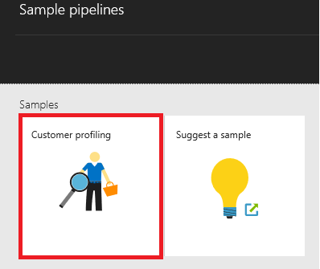

<properties     
    pageTitle="Dados Azure Factory - exemplos" 
    description="Fornece detalhes sobre exemplos que vêm com o serviço de fábrica de dados do Azure." 
    services="data-factory" 
    documentationCenter="" 
    authors="sharonlo101" 
    manager="jhubbard" 
    editor="monicar"/>

<tags 
    ms.service="data-factory" 
    ms.workload="data-services" 
    ms.tgt_pltfrm="na" 
    ms.devlang="na" 
    ms.topic="article" 
    ms.date="10/18/2016" 
    ms.author="shlo"/>

# Dados Azure Factory - exemplos

## Exemplos no GitHub
O [repositório de GitHub Azure-DataFactory](https://github.com/azure/azure-datafactory) contém vários exemplos que ajudarão-lo rapidamente agilizar com o serviço de fábrica de dados do Azure (ou) modifique os scripts e usá-lo no próprio aplicativo. A pasta Samples\JSON contém trechos JSON para cenários comuns.

| Exemplo | Descrição |
| :----- | :---------- | 
| [AAD explicação passo a passo](https://github.com/Azure/Azure-DataFactory/tree/master/Samples/ADFWalkthrough) | Este exemplo fornece uma explicação de ponta a ponta para processar arquivos de log usando fábrica de dados do Azure para transformar os dados de arquivos de log de obtenção de informações.   Este passo a passo, o pipeline de fábrica de dados coleta logs de amostra processos enriquece os dados de logs com dados de referência e transforma os dados para avaliar a eficiência de uma campanha de marketing que recentemente foi iniciada. |
| [Exemplos JSON](https://github.com/Azure/Azure-DataFactory/tree/master/Samples/JSON) | Este exemplo fornece exemplos JSON para cenários comuns. | 
| [Amostra de download de dados http](https://github.com/Azure/Azure-DataFactory/tree/master/Samples/HttpDataDownloaderSample) | Este exemplo apresenta o download de dados de um ponto de extremidade HTTP para armazenamento de Blob do Azure usando atividade personalizada do .NET. |
| [Cross AppDomain ponto atividade líquido amostra](https://github.com/Azure/Azure-DataFactory/tree/master/Samples/CrossAppDomainDotNetActivitySample) | Este exemplo permite que você criar uma atividade personalizada do .NET que não é restringida a versões de montagem usadas pelo inicializador de AAD (por exemplo, WindowsAzure.Storage v4.3.0 Newtonsoft.Json v6.0.x, etc.). |
| [Executar scripts de R](https://github.com/Azure/Azure-DataFactory/tree/master/Samples/RunRScriptUsingADFSample) |  Este exemplo inclui a atividade personalizada de fábrica de dados que pode ser usada para invocar RScript.exe. Este exemplo só funciona com seu próprio cluster de HDInsight (não sob demanda) que já tenha instalado R nele. |
| [Invocar trabalhos Spark em cluster HDInsight Hadoop](https://github.com/Azure/Azure-DataFactory/tree/master/Samples/Spark) | Este exemplo mostra como usar MapReduce atividade para chamar um programa Spark. O programa spark apenas copia dados de um contêiner de Blob do Azure para outro. |
| [Análise de Twitter usando a atividade de pontuação do Azure máquina aprendizagem em lotes](https://github.com/Azure/Azure-DataFactory/tree/master/Samples/TwitterAnalysisSample-AzureMLBatchScoringActivity) | Este exemplo mostra como usar AzureMLBatchScoringActivity para chamar um modelo de aprendizado de máquina do Azure que executa análise de sentimento twitter, pontuação, previsão etc. |
| [Análise de Twitter usando atividade personalizada](https://github.com/Azure/Azure-DataFactory/tree/master/Samples/TwitterAnalysisSample-CustomC%23Activity) |  Este exemplo mostra como usar uma atividade personalizada do .NET para chamar um modelo de aprendizado de máquina do Azure que executa análise de sentimento twitter, pontuação, previsão etc. |
| [Parametrizada canais para aprendizado de máquina Azure](https://github.com/Azure/Azure-DataFactory/tree/master/Samples/ParameterizedPipelinesForAzureML/) | O exemplo fornece uma ponta a ponta c# código para implantar canais de N para pontuação e treinamento cada uma com um parâmetro de região diferente onde a lista das regiões provenientes de um arquivo de parameters.txt, que está incluído com este exemplo. | 
| [Atualização de dados de referência para trabalhos de análise de fluxo do Azure](https://github.com/Azure/Azure-DataFactory/tree/master/Samples/ReferenceDataRefreshForASAJobs) |  Este exemplo mostra como usar os fábrica de dados do Azure e Azure fluxo análise para executar as consultas com dados de referência e configurar a atualização para dados de referência em uma agenda. |
| [Pipeline de híbrido com local Hortonworks Hadoop](https://github.com/Azure/Azure-DataFactory/tree/master/Samples/HybridPipelineWithOnPremisesHortonworksHadoop) | O exemplo usa um cluster de Hadoop local como um destino de computação para execução de trabalhos em fábrica de dados exatamente como você faria adiciona outros destinos de computação como um HDInsight com base em cluster Hadoop na nuvem. |
| [Ferramenta de conversão de JSON](https://github.com/Azure/Azure-DataFactory/tree/master/Samples/JSONConversionTool) | Esta ferramenta permite que você converta JSONs de versão anterior ao 2015-07-01-visualização para mais recente ou 2015-07-01-preview (padrão). |  
| [Arquivo de entrada de amostra U-SQL](https://github.com/Azure/Azure-DataFactory/tree/master/Samples/U-SQL%20Sample%20Input%20File) |  Este arquivo é um arquivo de amostra usado por uma atividade de U-SQL. | 

## Modelos do Azure Gerenciador de recursos
Você pode encontrar os seguintes modelos de Gerenciador de recursos do Azure para dados de fábrica no Github. 

| Modelo | Descrição |
| -------- | ----------- | 
| [Copiar do armazenamento de blob do Microsoft Azure ao banco de dados do SQL Azure](https://github.com/Azure/azure-quickstart-templates/tree/master/101-data-factory-blob-to-sql-copy) | Implantar este modelo cria uma fábrica dados Azure com um pipeline que copia dados do armazenamento de blob do Microsoft Azure especificado para o banco de dados do SQL Azure |    
| [Copiar de Salesforce ao Azure Blob Storage](https://github.com/Azure/azure-quickstart-templates/tree/master/101-data-factory-salesforce-to-blob-copy) | Implantar este modelo cria uma fábrica dados Azure com um pipeline que copia dados da conta de Salesforce especificada para o armazenamento de blob do Microsoft Azure. |    
| [Transformar dados executando o script de seção em um cluster de Azurehdinsight](https://github.com/Azure/azure-quickstart-templates/tree/master/101-data-factory-hive-transformation) | Implantar este modelo cria uma fábrica dados Azure com um pipeline que transforma dados executando o script de seção de amostra em um cluster de Azure HDInsight Hadoop. | 

## Exemplos no portal do Azure
Você pode usar o bloco de **canais de amostra** na home page de sua fábrica de dados para implantar canais de amostra e seus entidades associadas (conjuntos de dados e serviços vinculados) na sua fábrica de dados. 

1. Criar uma fábrica de dados ou abra uma fábrica de dados existente. Consulte [Introdução ao Azure dados fábrica](data-factory-copy-data-from-azure-blob-storage-to-sql-database.md#CreateDataFactory) para obter as etapas para criar uma fábrica de dados.
2. Na lâmina **Fábrica de dados** para a fábrica de dados, clique no bloco de **canais de amostra** .

    

2. Na lâmina **canais de amostra** , clique na **amostra** que você deseja implantar. 
    
    

3. Especifica definições de configuração de amostra. Por exemplo, sua chave de nome e uma conta da conta de armazenamento do Azure, o nome de servidor do SQL Azure, banco de dados, ID de usuário e senha, etc. 

    

4. Depois de terminar com especificando as configurações, clique em **criar** para criar/implantar o pipeline de amostra e serviços/tabelas vinculadas usadas pelos canais.
5. Você pode ver o status de implantação no bloco amostra que você clicou anteriormente na lâmina **canais de amostra** .

    

6. Quando você vir a mensagem de **implantação bem-sucedida** no bloco de amostra, feche a lâmina de **canais de amostra** .  
5. Lâmina de **Fábrica de dados** , você vê que serviços vinculados, conjuntos de dados e canais são adicionados à sua fábrica de dados.  

    
   
## Exemplos no Visual Studio

### Pré-requisitos

Você deve ter os seguintes programas instalados no seu computador: 

- Visual Studio 2013 ou Visual Studio de 2015
- Baixe o SDK do Azure para Visual Studio 2013 ou Visual Studio 2015. Navegue até a [Página de Download do Azure](https://azure.microsoft.com/downloads/) e clique **VS 2013** ou **VS 2015** na seção **.NET** .
- Baixar o plug-in fábrica de dados do Azure mais recente para Visual Studio: [VS 2013](https://visualstudiogallery.msdn.microsoft.com/754d998c-8f92-4aa7-835b-e89c8c954aa5) ou o [VS 2015](https://visualstudiogallery.msdn.microsoft.com/371a4cf9-0093-40fa-b7dd-be3c74f49005). Se você estiver usando o Visual Studio 2013, você também pode atualizar o plug-in seguindo as etapas a seguir: no menu, clique em **Ferramentas** -> **extensões e atualizações** -> **Online** -> **Galeria do Visual Studio** -> **Ferramentas de fábrica de dados do Microsoft Azure para Visual Studio** -> **Atualizar**.

### Usar modelos de fábrica de dados

1. Clique em **arquivo** no menu, aponte para **novo**e clique em **projeto**. 
2. Na caixa de diálogo **Novo projeto** , siga estas etapas: 
    1. Selecione **DataFactory** em **modelos**. 
    2. Selecione **Modelos de fábrica de dados** no painel direito. 
    3. Insira um **nome** para o projeto. 
    4. Selecione um **local** para o projeto. 
    5. Clique em **Okey**. 

    
6. Na caixa de diálogo **Modelos de fábrica de dados** , selecione o modelo de exemplo na seção **Modelos de caso de uso** e clique em **Avançar**. As etapas a seguir orientá-lo usando o modelo de **Criação de perfil de cliente** . Etapas são semelhantes para os outros exemplos. 

     
7. Na caixa de diálogo **Configuração de fábrica de dados** , clique em **Avançar** na página **Noções básicas de fábrica de dados** .
8. Na página **Configurar fábrica de dados** , siga estas etapas: 
    1. Selecione **Criar nova fábrica de dados**. Você também pode selecionar **fábrica de dados existente do uso**.
    2. Insira um **nome** para a fábrica de dados.
    3. Selecione a **assinatura do Azure** no qual você deseja que a fábrica de dados a ser criado. 
    4. Selecione o **grupo de recursos** para a fábrica de dados.
    5. Selecione o **Oeste EUA**, **Leste EUA**ou **Norte da Europa** para a **região**.
    6. Clique em **Avançar**. 
9. Na página **Configurar dados armazena** , especifique uma existente **banco de dados do SQL Azure** e a **conta de armazenamento do Azure** (ou) criar/armazenamento de banco de dados e clique em Avançar. 
10. Na página **Configurar calcular** , selecione padrões e clique em **Avançar**. 
11. Na página **Resumo** , revise todas as configurações e clique em **Avançar**. 
12. Na página de **Status de implantação** , aguarde até terminar a implantação e clique em **Concluir**.
13. Clique com botão direito projeto no Solution Explorer e clique em **Publicar**. 
19. Se você vir a caixa de diálogo **entrar sua conta da Microsoft** , insira suas credenciais para a conta que tem a assinatura do Azure e clique em **entrar**.
20. Você verá a caixa de diálogo a seguir:

    

21. Na página **Configurar fábrica de dados** , siga estas etapas: 
    1. Confirme a opção **fábrica de dados existente do uso** .
    2. Selecione a **fábrica de dados** que você tinha selecione ao usar o modelo. 
    6. Clique em **próximo** para alternar para a página **Publicar itens** . (Pressione **TAB** para tira o campo nome para se o botão **Avançar** ficará desabilitado.) 
23. Na página **Publicar itens** , certifique-se de que todas as fábricas de dados entidades estão selecionadas e clique em **próximo** para alternar para a página de **Resumo** .     
24. Revise o resumo e clique em **Avançar** para iniciar o processo de implantação e exibir o **Status da implantação**.
25. Na página de **Status de implantação** , você deve ver o status do processo de implantação. Clique em Concluir após a conclusão da implantação. 

Consulte [criar sua primeira fábrica de dados (Visual Studio)](data-factory-build-your-first-pipeline-using-vs.md) para obter detalhes sobre como usar Visual Studio para criar entidades de fábrica de dados e publicá-los no Azure.          