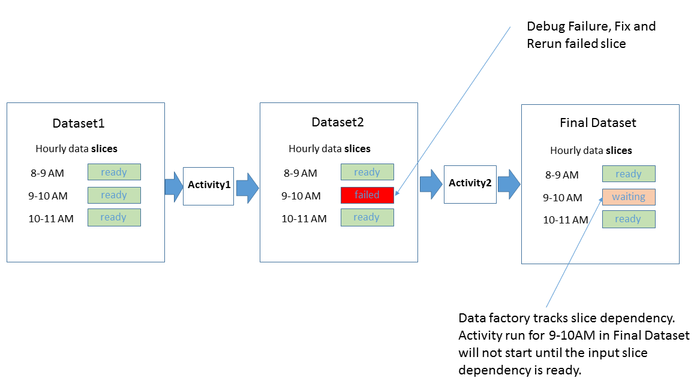

<properties
    pageTitle="Planejamento e execução com dados fábrica | Microsoft Azure"
    description="Saiba aspectos de programação e a execução do modelo de aplicativo de fábrica de dados do Azure."
    services="data-factory"
    documentationCenter=""
    authors="spelluru"
    manager="jhubbard"
    editor="monicar"/>

<tags
    ms.service="data-factory"
    ms.workload="data-services"
    ms.tgt_pltfrm="na"
    ms.devlang="na"
    ms.topic="article"
    ms.date="08/22/2016"
    ms.author="spelluru"/>

# Agendamento de fábrica de dados e a execução
Este artigo explica os aspectos de programação e a execução do modelo de aplicativo de fábrica de dados do Azure. 

## Pré-requisitos
Este artigo pressupõe que você compreenda Noções básicas de conceitos de modelo de aplicativo de fábrica de dados, incluindo a atividade, canais, serviços vinculados e conjuntos de dados. Para obter conceitos básicos da fábrica de dados do Azure, consulte os seguintes artigos:

- [Introdução à fábrica de dados](data-factory-introduction.md)
- [Canais](data-factory-create-pipelines.md)
- [Conjuntos de dados](data-factory-create-datasets.md) 

## Agendar uma atividade

Com a seção Agendador da atividade JSON, você pode especificar um agendamento recorrente para uma atividade. Por exemplo, você pode agendar uma atividade de cada hora da seguinte maneira:

    "scheduler": {
        "frequency": "Hour",
        "interval": 1
    },  

Como mostrado no diagrama, especificar uma programação para a atividade cria uma série de queda windows. Janelas de queda são uma série de intervalos de tempo de tamanho fixo, não sobrepostas, contíguas. Essas janelas queda lógico da atividade são chamadas de *windows de atividade*.

Para a janela de atividade atualmente em execução, você pode acessar o intervalo de tempo associado à janela de atividade com variáveis de sistema de [WindowStart](data-factory-functions-variables.md#data-factory-system-variables) e [WindowEnd](data-factory-functions-variables.md#data-factory-system-variables) na atividade JSON. Você pode usar essas variáveis finalidades diferentes em sua atividade JSON. Por exemplo, você pode usá-los para selecionar dados de entrada e saídos conjuntos de dados que representa dados da série de tempo.

A propriedade **Agendador** suporta as mesmas subpropriedades como a propriedade de **disponibilidade** em um conjunto de dados. Ver a [disponibilidade de conjunto de dados](data-factory-create-datasets.md#Availability) para obter detalhes. Exemplos: agendamento em um deslocamento de tempo específico, ou definindo o modo para alinhar o processamento no início ou no final do intervalo para a janela de atividade.

Você pode especificar propriedades de **Agendador** para uma atividade, mas essa propriedade é **opcional**. Se você especificar uma propriedade, ele deve corresponder a cadência especificado na definição do dataset de saída. Atualmente, conjunto de dados de saída é o que orienta o cronograma, então você deve criar um conjunto de dados de saída, mesmo se a atividade não produzir qualquer saída. Se a atividade não assumir qualquer entrada, você pode ignorar a criação do dataset de entrada.

## Frações de dados e conjuntos de dados da série de tempo

Dados da série de tempo são uma sequência contínua de pontos de dados que geralmente consiste sucessivas medidas feitas ao longo de um intervalo de tempo. Exemplos comuns de dados da série de tempo incluem dados e dados de telemetria do aplicativo.

Com fábrica de dados, você pode processar tempo séries de dados de uma maneira em lote com atividade é executado. Normalmente, não há uma cadência recorrente no qual os dados de entrada chegam e saída dados precisam ser produzidas. Este cadência é modelada especificando **disponibilidade** no conjunto de dados da seguinte maneira:

    "availability": {
      "frequency": "Hour",
      "interval": 1
    },

Cada unidade de dados consumidas e produzidos por um tempo de execução atividade é chamada uma fatia de dados. O diagrama a seguir mostra um exemplo de uma atividade com um conjunto de dados de entrada e um conjunto de dados de saída. Esses conjuntos de dados têm **disponibilidade** definida como uma frequência por hora.

O diagrama anterior mostra as fatias de dados por hora para o dataset de entrada e saída. O diagrama mostra três fatias de entrada que estão prontas para processamento. A atividade de 10-11 AM está em andamento, produzir na fatia de saída de 10-11 AM.

Você pode acessar o intervalo de tempo associado a fatia atual produzida no dataset JSON com variáveis [SliceStart](data-factory-functions-variables.md#data-factory-system-variables) e [SliceEnd](data-factory-functions-variables.md#data-factory-system-variables).

Atualmente, a fábrica de dados requer que o agendamento especificado na atividade exatamente corresponde o agendamento especificado na **disponibilidade** do conjunto de dados de saída. Portanto, **WindowStart**, **WindowEnd**, **SliceStart**e **SliceEnd** sempre são mapeados para o mesmo período de tempo e uma fatia de saída simples.

Para obter mais informações sobre propriedades diferentes disponíveis para a seção de disponibilidade, consulte [Criando conjuntos de dados](data-factory-create-datasets.md).

## Mover dados do banco de dados SQL para armazenamento de Blob

Vamos colocar algumas coisas juntos e em ação, criando um pipeline que copia dados de uma tabela de banco de dados do Azure SQL ao armazenamento de Blob do Azure cada hora.

**Entrada: Conjunto de dados de banco de dados do SQL Azure**

    {
        "name": "AzureSqlInput",
        "properties": {
            "published": false,
            "type": "AzureSqlTable",
            "linkedServiceName": "AzureSqlLinkedService",
            "typeProperties": {
                "tableName": "MyTable"
            },
            "availability": {
                "frequency": "Hour",
                "interval": 1
            },
            "external": true,
            "policy": {}
        }
    }

**Frequência** é definida como **hora** e **intervalo** é definido como **1** na seção disponibilidade.

**Saída: Conjunto de dados de armazenamento de blob do Microsoft Azure**

    {
        "name": "AzureBlobOutput",
        "properties": {
            "published": false,
            "type": "AzureBlob",
            "linkedServiceName": "StorageLinkedService",
            "typeProperties": {
                "folderPath": "mypath/{Year}/{Month}/{Day}/{Hour}",
                "format": {
                    "type": "TextFormat"
                },
                "partitionedBy": [
                    {
                        "name": "Year",
                        "value": {
                            "type": "DateTime",
                            "date": "SliceStart",
                            "format": "yyyy"
                        }
                    },
                    {
                        "name": "Month",
                        "value": {
                            "type": "DateTime",
                            "date": "SliceStart",
                            "format": "%M"
                        }
                    },
                    {
                        "name": "Day",
                        "value": {
                            "type": "DateTime",
                            "date": "SliceStart",
                            "format": "%d"
                        }
                    },
                    {
                        "name": "Hour",
                        "value": {
                            "type": "DateTime",
                            "date": "SliceStart",
                            "format": "%H"
                        }
                    }
                ]
            },
            "availability": {
                "frequency": "Hour",
                "interval": 1
            }
        }
    }

**Frequência** é definida como **hora** e **intervalo** é definido como **1** na seção disponibilidade.

**Atividade: Atividade de cópia**

    {
        "name": "SamplePipeline",
        "properties": {
            "description": "copy activity",
            "activities": [
                {
                    "type": "Copy",
                    "name": "AzureSQLtoBlob",
                    "description": "copy activity",
                    "typeProperties": {
                        "source": {
                            "type": "SqlSource",
                            "sqlReaderQuery": "$$Text.Format('select * from MyTable where timestampcolumn >= \\'{0:yyyy-MM-dd HH:mm}\\' AND timestampcolumn < \\'{1:yyyy-MM-dd HH:mm}\\'', WindowStart, WindowEnd)"
                        },
                        "sink": {
                            "type": "BlobSink",
                            "writeBatchSize": 100000,
                            "writeBatchTimeout": "00:05:00"
                        }
                    },
                    "inputs": [
                        {
                            "name": "AzureSQLInput"
                        }
                    ],
                    "outputs": [
                        {
                            "name": "AzureBlobOutput"
                        }
                    ],
                    "scheduler": {
                        "frequency": "Hour",
                        "interval": 1
                    }
                }
            ],
            "start": "2015-01-01T08:00:00Z",
            "end": "2015-01-01T11:00:00Z"
        }
    }

O exemplo mostra o cronograma de atividade e seções de disponibilidade do conjunto de dados definido como uma frequência por hora. O exemplo mostra como você pode usar **WindowStart** e **WindowEnd** para selecionar dados relevantes para uma atividade executar e copiá-lo para um blob com o apropriado **folderPath**. O **folderPath** é parametrizada para ter uma pasta separada para cada hora.

Quando três as fatias entre 8 – 11 AM executar, os dados no banco de dados do SQL Azure são a seguinte:

Depois que o pipeline implanta, o Azure blob é preenchido da seguinte maneira:

-   Arquivo mypath/2015/1/1/8/dados. &lt;Guid&gt;. txt com dados

            10002345,334,2,2015-01-01 08:24:00.3130000
            10002345,347,15,2015-01-01 08:24:00.6570000
            10991568,2,7,2015-01-01 08:56:34.5300000

    > [AZURE.NOTE] &lt;GUID&gt; é substituído por um guid real. Exemplo de nome de arquivo: Data.bcde1348-7620-4f93-bb89-0eed3455890b.txt
-   Arquivo mypath/2015/1/1/9/dados. &lt;Guid&gt;. txt com dados:

            10002345,334,1,2015-01-01 09:13:00.3900000
            24379245,569,23,2015-01-01 09:25:00.3130000
            16777799,21,115,2015-01-01 09:47:34.3130000
-   Arquivo mypath/2015/1/1/10/dados. &lt;Guid&gt;. txt sem dados.

## Período ativo do pipeline

[Criando canais](data-factory-create-pipelines.md) introduziu o conceito de um período de ativo para um pipeline especificado definindo as propriedades de **início** e **fim** .

Você pode definir a data de início para o período ativo pipeline no passado. Dados fábrica automaticamente calcula (preenchimentos traseiro) todas as fatias de dados no passado e inicia o processamento-los.

## Processamento paralelo de fatias de dados
Você pode configurar frações de dados back-preenchidas para ser executado em paralelo, definindo a propriedade de **concorrência** na seção diretiva da atividade JSON. Para obter mais informações sobre esta propriedade, consulte [Criando canais](data-factory-create-pipelines.md).

## Execute novamente uma fatia dados falhou 
Você pode monitorar a execução de fatias de uma forma visual avançada. Para obter detalhes, consulte [monitoramento e gerenciamento de canais usando o Azure blades portal](data-factory-monitor-manage-pipelines.md) ou [aplicativo de monitoramento e gerenciamento](data-factory-monitor-manage-app.md) .

Considere o exemplo a seguir, que mostra duas atividades. Activity1 produz um conjunto de dados de série de tempo com fatias como saída consumida como entrada por Activity2 para produzir o conjunto de dados de série de tempo de saída final.

O diagrama mostra que sair três fatias recentes, houve uma falha produzir fatia 9-10 AM para Dataset2. Dados fábrica rastreia automaticamente dependência para o conjunto de dados de série de tempo. Como resultado, ele não inicia a atividade executar da fatia downstream 9H - 10.

Ferramentas de monitoramento e gerenciamento de dados fábrica permitem que você analise logs de diagnóstico da fatia Falha ao encontrar a causa para o problema e corrigi-lo facilmente. Após você ter corrigido o problema, você pode iniciar facilmente a atividade executar para produzir na fatia falha. Para obter mais detalhes sobre como executar novamente e compreender as transições de estado para fatias de dados, consulte [monitoramento e gerenciamento de canais usando o Azure blades portal](data-factory-monitor-manage-pipelines.md) ou [aplicativo de monitoramento e gerenciamento](data-factory-monitor-manage-app.md).

Depois de executar novamente na fatia 9H - 10 para **Dataset2**, fábrica de dados inicia a execução da fatia dependentes 9-10 AM no conjunto de dados final.

## Executar atividades em uma sequência
Você pode cadeia duas atividades (executadas uma atividade após o outro) definindo o conjunto de dados de saída de uma atividade como do dataset de entrada da outra atividade. As atividades podem estar no mesmo pipeline ou em canais diferentes. A segunda atividade executa somente quando primeiro for concluído com êxito.

Por exemplo, considere o seguinte:

1.  Pipeline P1 tem A1 atividade que requer dataset de entrada externo D1 e produz saída dataset D2.
2.  Pipeline P2 tem A2 de atividade que requer entrada do dataset D2 e produz saída dataset D3.

Neste cenário, atividades A1 e A2 estão em canais diferentes. A atividade A1 é executado quando os dados externos estão disponíveis e a frequência de disponibilidade do agendamento é alcançada. A atividade A2 é executada quando as fatias agendadas de D2 se tornam disponíveis e a frequência de disponibilidade do agendamento é alcançada. Se houver um erro em uma das fatias em dataset D2, A2 não são executadas para essa fatia até que ele fique disponível.

O modo de exibição de diagrama ficaria o diagrama a seguir:

Conforme mencionado anteriormente, as atividades podem ser no mesmo pipeline. O modo de exibição de diagrama com ambas as atividades no mesmo pipeline ficaria o diagrama a seguir:

### Copiar sequencialmente
É possível executar várias operações de cópia após o outro de maneira sequencial/ordenadas. Por exemplo, você pode ter duas atividades de cópia em um pipeline (CopyActivity1 e CopyActivity2) com os seguintes conjuntos de dados de saída de dados de entrada:   

CopyActivity1

Entrada: Dataset. Saída: Dataset2.

CopyActivity2

Entrada: Dataset2.  Saída: Dataset3.

CopyActivity2 seria executado somente se a CopyActivity1 foi executado com êxito e Dataset2 está disponível.

Aqui está o pipeline de amostra JSON:

    {
        "name": "ChainActivities",
        "properties": {
            "description": "Run activities in sequence",
            "activities": [
                {
                    "type": "Copy",
                    "typeProperties": {
                        "source": {
                            "type": "BlobSource"
                        },
                        "sink": {
                            "type": "BlobSink",
                            "copyBehavior": "PreserveHierarchy",
                            "writeBatchSize": 0,
                            "writeBatchTimeout": "00:00:00"
                        }
                    },
                    "inputs": [
                        {
                            "name": "Dataset1"
                        }
                    ],
                    "outputs": [
                        {
                            "name": "Dataset2"
                        }
                    ],
                    "policy": {
                        "timeout": "01:00:00"
                    },
                    "scheduler": {
                        "frequency": "Hour",
                        "interval": 1
                    },
                    "name": "CopyFromBlob1ToBlob2",
                    "description": "Copy data from a blob to another"
                },
                {
                    "type": "Copy",
                    "typeProperties": {
                        "source": {
                            "type": "BlobSource"
                        },
                        "sink": {
                            "type": "BlobSink",
                            "writeBatchSize": 0,
                            "writeBatchTimeout": "00:00:00"
                        }
                    },
                    "inputs": [
                        {
                            "name": "Dataset2"
                        }
                    ],
                    "outputs": [
                        {
                            "name": "Dataset3"
                        }
                    ],
                    "policy": {
                        "timeout": "01:00:00"
                    },
                    "scheduler": {
                        "frequency": "Hour",
                        "interval": 1
                    },
                    "name": "CopyFromBlob2ToBlob3",
                    "description": "Copy data from a blob to another"
                }
            ],
            "start": "2016-08-25T01:00:00Z",
            "end": "2016-08-25T01:00:00Z",
            "isPaused": false
        }
    }

Observe que, no exemplo, o conjunto de dados de saída da primeira atividade cópia (Dataset2) for especificado como entrada para a segunda atividade. Portanto, a segunda atividade executa somente quando o conjunto de dados de saída da primeira atividade está pronto.  

No exemplo, CopyActivity2 pode ter uma entrada diferente, como Dataset3, mas você especificar Dataset2 como entrada para CopyActivity2, para que a atividade não é executado até que CopyActivity1 seja concluída. Por exemplo:

CopyActivity1

Entrada: Dataset1. Saída: Dataset2.

CopyActivity2

Entradas: Dataset3, Dataset2. Saída: Dataset4.

    {
        "name": "ChainActivities",
        "properties": {
            "description": "Run activities in sequence",
            "activities": [
                {
                    "type": "Copy",
                    "typeProperties": {
                        "source": {
                            "type": "BlobSource"
                        },
                        "sink": {
                            "type": "BlobSink",
                            "copyBehavior": "PreserveHierarchy",
                            "writeBatchSize": 0,
                            "writeBatchTimeout": "00:00:00"
                        }
                    },
                    "inputs": [
                        {
                            "name": "Dataset1"
                        }
                    ],
                    "outputs": [
                        {
                            "name": "Dataset2"
                        }
                    ],
                    "policy": {
                        "timeout": "01:00:00"
                    },
                    "scheduler": {
                        "frequency": "Hour",
                        "interval": 1
                    },
                    "name": "CopyFromBlobToBlob",
                    "description": "Copy data from a blob to another"
                },
                {
                    "type": "Copy",
                    "typeProperties": {
                        "source": {
                            "type": "BlobSource"
                        },
                        "sink": {
                            "type": "BlobSink",
                            "writeBatchSize": 0,
                            "writeBatchTimeout": "00:00:00"
                        }
                    },
                    "inputs": [
                        {
                            "name": "Dataset3"
                        },
                        {
                            "name": "Dataset2"
                        }
                    ],
                    "outputs": [
                        {
                            "name": "Dataset4"
                        }
                    ],
                    "policy": {
                        "timeout": "01:00:00"
                    },
                    "scheduler": {
                        "frequency": "Hour",
                        "interval": 1
                    },
                    "name": "CopyFromBlob3ToBlob4",
                    "description": "Copy data from a blob to another"
                }
            ],
            "start": "2017-04-25T01:00:00Z",
            "end": "2017-04-25T01:00:00Z",
            "isPaused": false
        }
    }

Observe que, no exemplo, dois conjuntos de dados de entrada são especificados para a segunda atividade de cópia. Quando várias entradas forem especificadas, apenas o primeira entrado conjunto de dados é usado para copiar dados, mas outros conjuntos de dados são usados como dependências. CopyActivity2 comece somente depois que as seguintes condições forem atendidas:

- CopyActivity1 foi concluída com êxito e Dataset2 está disponível. Este conjunto de dados não é usado ao copiar dados para Dataset4. Só funciona como uma dependência de agendamento para CopyActivity2.   
- Dataset3 está disponível. Este dataset representa os dados que são copiados para o destino.  

## Conjuntos de dados de modelo com diferentes frequências

Nos exemplos, as frequências para conjuntos de dados de entrada e saídos e a janela de programação de atividade eram os mesmos. Alguns cenários requerem a capacidade de produzir saída em uma frequência diferente do que as frequências das entradas de um ou mais. Dados fábrica oferece suporte a esses cenários de modelagem.

### Exemplo 1: Produzir um relatório de saída diária de dados de entrada que está disponíveis cada hora

Considere um cenário em que você ter a entrada dados de medição de sensores disponíveis cada hora no armazenamento de Blob do Azure. Você deseja produzir um relatório de agregação diário com estatísticas como média, máximo e mínimo para o dia com [dados fábrica seção atividade](data-factory-hive-activity.md).

Veja aqui como você pode modelar esse cenário com fábrica de dados:

**Dataset de entrada**

Arquivos de entrada por hora são descartados na pasta para o dia especificado. Disponibilidade de entrada está definida na **hora** (frequência: horas, intervalo: 1).

    {
      "name": "AzureBlobInput",
      "properties": {
        "type": "AzureBlob",
        "linkedServiceName": "StorageLinkedService",
        "typeProperties": {
          "folderPath": "mycontainer/myfolder/{Year}/{Month}/{Day}/",
          "partitionedBy": [
            { "name": "Year", "value": {"type": "DateTime","date": "SliceStart","format": "yyyy"}},
            { "name": "Month","value": {"type": "DateTime","date": "SliceStart","format": "%M"}},
            { "name": "Day","value": {"type": "DateTime","date": "SliceStart","format": "%d"}}
          ],
          "format": {
            "type": "TextFormat"
          }
        },
        "external": true,
        "availability": {
          "frequency": "Hour",
          "interval": 1
        }
      }
    }

**Conjunto de dados de saída**

Um arquivo de saída é criado diariamente na pasta do dia. Disponibilidade de saída estiver definida no **dia** (frequência: dia e intervalo: 1).

    {
      "name": "AzureBlobOutput",
      "properties": {
        "type": "AzureBlob",
        "linkedServiceName": "StorageLinkedService",
        "typeProperties": {
          "folderPath": "mycontainer/myfolder/{Year}/{Month}/{Day}/",
          "partitionedBy": [
            { "name": "Year", "value": {"type": "DateTime","date": "SliceStart","format": "yyyy"}},
            { "name": "Month","value": {"type": "DateTime","date": "SliceStart","format": "%M"}},
            { "name": "Day","value": {"type": "DateTime","date": "SliceStart","format": "%d"}}
          ],
          "format": {
            "type": "TextFormat"
          }
        },
        "availability": {
          "frequency": "Day",
          "interval": 1
        }
      }
    }

**Atividade: atividade de seção em um pipeline**

O script de seção recebe as informações apropriadas de *DateTime* como parâmetros que usam a variável **WindowStart** , conforme mostrado no seguinte trecho. O script de seção usa esta variável de carregar os dados da pasta correta para o dia e executar a agregação para gerar a saída.

        {  
            "name":"SamplePipeline",
            "properties":{  
            "start":"2015-01-01T08:00:00",
            "end":"2015-01-01T11:00:00",
            "description":"hive activity",
            "activities": [
                {
                    "name": "SampleHiveActivity",
                    "inputs": [
                        {
                            "name": "AzureBlobInput"
                        }
                    ],
                    "outputs": [
                        {
                            "name": "AzureBlobOutput"
                        }
                    ],
                    "linkedServiceName": "HDInsightLinkedService",
                    "type": "HDInsightHive",
                    "typeProperties": {
                        "scriptPath": "adftutorial\\hivequery.hql",
                        "scriptLinkedService": "StorageLinkedService",
                        "defines": {
                            "Year": "$$Text.Format('{0:yyyy}',WindowStart)",
                            "Month": "$$Text.Format('{0:%M}',WindowStart)",
                            "Day": "$$Text.Format('{0:%d}',WindowStart)"
                        }
                    },
                    "scheduler": {
                        "frequency": "Day",
                        "interval": 1
                    },          
                    "policy": {
                        "concurrency": 1,
                        "executionPriorityOrder": "OldestFirst",
                        "retry": 2,
                        "timeout": "01:00:00"
                    }
                 }
             ]
           }
        }

O diagrama a seguir mostra o cenário do ponto de vista da dependência de dados.

A fatia de saída para cada dia depende de 24 fatias por hora de um conjunto de dados de entrada. Dados fábrica calcula essas dependências automaticamente descobrindo como os dados de entrada fatias que ficam no mesmo período de tempo que a fatia de saída sejam produzidos. Se qualquer uma das 24 entradas fatias não estiver disponível, o Data Factory aguarda a entrada fatia esteja pronto antes de iniciar as atividades diárias executar.

### Exemplo 2: Especificar dependência com expressões e funções de fábrica de dados

Vamos considerar outro cenário. Suponha que você tenha uma atividade de seção que processa dois conjuntos de dados de entrada. Um deles tem novos dados diariamente, mas um deles obtém novos dados toda semana. Suponha que você queira fazer uma associação entre as duas entradas e gerar uma saída diariamente.

A abordagem simple em qual Data Factory automaticamente descobre direita entrada fatias para processar alinhando à saída da hora da fatia dados período não funciona.

Você deve especificar que para todas as atividades executar, a fábrica de dados deve usar fatia de dados da semana passada para o conjunto de dados de entrada semanal. Use funções de fábrica de dados do Azure conforme mostrado no seguinte trecho para implementar esse comportamento.

**Input1: Blob do Microsoft Azure**

A primeira entrada é o Azure blob sendo atualizado diariamente.

    {
      "name": "AzureBlobInputDaily",
      "properties": {
        "type": "AzureBlob",
        "linkedServiceName": "StorageLinkedService",
        "typeProperties": {
          "folderPath": "mycontainer/myfolder/{Year}/{Month}/{Day}/",
          "partitionedBy": [
            { "name": "Year", "value": {"type": "DateTime","date": "SliceStart","format": "yyyy"}},
            { "name": "Month","value": {"type": "DateTime","date": "SliceStart","format": "%M"}},
            { "name": "Day","value": {"type": "DateTime","date": "SliceStart","format": "%d"}}
          ],
          "format": {
            "type": "TextFormat"
          }
        },
        "external": true,
        "availability": {
          "frequency": "Day",
          "interval": 1
        }
      }
    }

**Input2: Blob do Microsoft Azure**

Input2 é o Azure blob sendo atualizado semanalmente.

    {
      "name": "AzureBlobInputWeekly",
      "properties": {
        "type": "AzureBlob",
        "linkedServiceName": "StorageLinkedService",
        "typeProperties": {
          "folderPath": "mycontainer/myfolder/{Year}/{Month}/{Day}/",
          "partitionedBy": [
            { "name": "Year", "value": {"type": "DateTime","date": "SliceStart","format": "yyyy"}},
            { "name": "Month","value": {"type": "DateTime","date": "SliceStart","format": "%M"}},
            { "name": "Day","value": {"type": "DateTime","date": "SliceStart","format": "%d"}}
          ],
          "format": {
            "type": "TextFormat"
          }
        },
        "external": true,
        "availability": {
          "frequency": "Day",
          "interval": 7
        }
      }
    }

**Saída: Azure blob**

Um arquivo de saída é criado diariamente na pasta para o dia. Disponibilidade de saída é definida como **dia** (frequência: dia, intervalo: 1).

    {
      "name": "AzureBlobOutputDaily",
      "properties": {
        "type": "AzureBlob",
        "linkedServiceName": "StorageLinkedService",
        "typeProperties": {
          "folderPath": "mycontainer/myfolder/{Year}/{Month}/{Day}/",
          "partitionedBy": [
            { "name": "Year", "value": {"type": "DateTime","date": "SliceStart","format": "yyyy"}},
            { "name": "Month","value": {"type": "DateTime","date": "SliceStart","format": "%M"}},
            { "name": "Day","value": {"type": "DateTime","date": "SliceStart","format": "%d"}}
          ],
          "format": {
            "type": "TextFormat"
          }
        },
        "availability": {
          "frequency": "Day",
          "interval": 1
        }
      }
    }

**Atividade: atividade de seção em um pipeline**

A atividade de seção leva as duas entradas e produz uma fatia de saída diariamente. Você pode especificar fatia de saída de cada dia para dependem fatia de entrada da semana anterior para entrada semanal da seguinte maneira.

    {  
        "name":"SamplePipeline",
        "properties":{  
        "start":"2015-01-01T08:00:00",
        "end":"2015-01-01T11:00:00",
        "description":"hive activity",
        "activities": [
          {
            "name": "SampleHiveActivity",
            "inputs": [
              {
                "name": "AzureBlobInputDaily"
              },
              {
                "name": "AzureBlobInputWeekly",
                "startTime": "Date.AddDays(SliceStart, - Date.DayOfWeek(SliceStart))",
                "endTime": "Date.AddDays(SliceEnd,  -Date.DayOfWeek(SliceEnd))"  
              }
            ],
            "outputs": [
              {
                "name": "AzureBlobOutputDaily"
              }
            ],
            "linkedServiceName": "HDInsightLinkedService",
            "type": "HDInsightHive",
            "typeProperties": {
              "scriptPath": "adftutorial\\hivequery.hql",
              "scriptLinkedService": "StorageLinkedService",
              "defines": {
                "Year": "$$Text.Format('{0:yyyy}',WindowStart)",
                "Month": "$$Text.Format('{0:%M}',WindowStart)",
                "Day": "$$Text.Format('{0:%d}',WindowStart)"
              }
            },
            "scheduler": {
              "frequency": "Day",
              "interval": 1
            },          
            "policy": {
              "concurrency": 1,
              "executionPriorityOrder": "OldestFirst",
              "retry": 2,  
              "timeout": "01:00:00"
            }
           }
         ]
       }
    }

## Funções de fábrica de dados e variáveis de sistema   

Consulte [funções de fábrica de dados e variáveis de sistema](data-factory-functions-variables.md) para obter uma lista das funções e variáveis de sistema que dá suporte a fábrica de dados.

## Detalhamento de dependência de dados

Para gerar uma fatia dataset por um tempo de execução atividade, Data Factory usa o seguinte *modelo de dependência* para determinar as relações entre conjuntos de dados consumidas e produzidos por uma atividade.

O intervalo de tempo dos conjuntos de dados entrados necessários para gerar a fatia de conjunto de dados de saída é chamado de *período de dependência*.

Executar uma atividade gera uma fatia dataset somente depois que as fatias de dados em conjuntos de dados de entrada dentro do período de dependência estão disponíveis. Em outras palavras, todas as fatias de entrada que compõem o período de dependência devem estar no estado **pronto** para a atividade executar para produzir uma fatia de conjunto de dados de saída.

Para gerar a fatia dataset [**início**, **término**], uma função deve mapear na fatia dataset para seu período de dependência. Esta função é essencialmente uma fórmula que converte o início e fim da fatia dataset até o início e final do período de dependência. Mais anteriormente:

    DatasetSlice = [start, end]
    DependecyPeriod = [f(start, end), g(start, end)]

**F** e **g** são mapeamento funções que calculam início e no final do período de dependência para cada atividade de entrada.

Como visto nos exemplos, o período de dependência é igual ao período da fatia de dados que é gerado. Nesses casos, fábrica de dados calcula automaticamente as fatias entradas que estejam no período de dependência.  

Por exemplo, na amostra agregação onde saída é gerada diariamente e dados de entrada estão disponíveis a cada hora, o período de fatia de dados é 24 horas. Dados fábrica localiza a entrada de hora relevante fatias para esse período de tempo e torna a fatia de saída dependente na fatia entrada.

Você também pode fornecer o seu próprio mapeamento para o período de dependência conforme mostrado no exemplo, onde uma das entradas é semanal e na fatia de saída é produzido diariamente.

## Dependência de dados e validação

Um conjunto de dados pode ter definida uma política de validação que especifica como os dados gerados por uma execução de fatia possam ser validados antes que ele esteja pronto para o consumo. Consulte [Criando conjuntos de dados](data-factory-create-datasets.md) para obter detalhes.

Nesses casos, após a fatia execução, o status de fatia de saída é alterado para **Aguardando** com um substatus de **validação**. Depois que as fatias são validadas, o status de fatia muda para **pronto**.

Se uma fatia de dados foi produziu, mas não passou na validação, executa de atividade para fatias downstream que dependem essa fatia não é processadas.

[Monitor e gerenciar canais](data-factory-monitor-manage-pipelines.md) aborda os vários estados de fatias de dados em dados fábrica.

## Dados externos

Um conjunto de dados pode ser marcado como externo (como mostrado no seguinte trecho JSON), indicando que não foi gerado com dados de fábrica. Nesse caso, a política de conjunto de dados pode ter um conjunto adicional de parâmetros descrevendo validação e repetir política para o conjunto de dados. Consulte [Criando canais](data-factory-create-pipelines.md) para obter uma descrição de todas as propriedades.

Semelhante a conjuntos de dados que são produzidos pelo fábrica de dados, as fatias de dados para os dados externos devem ser pronto antes de fatias dependentes podem ser processadas.

    {
        "name": "AzureSqlInput",
        "properties":
        {
            "type": "AzureSqlTable",
            "linkedServiceName": "AzureSqlLinkedService",
            "typeProperties":
            {
                "tableName": "MyTable"
            },
            "availability":
            {
                "frequency": "Hour",
                "interval": 1     
            },
            "external": true,
            "policy":
            {
                "externalData":
                {
                    "retryInterval": "00:01:00",
                    "retryTimeout": "00:10:00",
                    "maximumRetry": 3
                }
            }  
        }
    }

## Pipeline de única
Você pode criar e agendar um pipeline para executar periodicamente (por exemplo: hora ou diariamente) dentro as horas de início e término especificado na definição do pipeline. Consulte [as atividades de agendamento](#scheduling-and-execution) para obter detalhes. Você também pode criar um pipeline que é executado apenas uma vez. Para fazer isso, você definir a propriedade de **pipelineMode** na definição de pipeline para **única** conforme mostrado no exemplo a seguir JSON. O valor padrão para essa propriedade é **agendada**.

    {
        "name": "CopyPipeline",
        "properties": {
            "activities": [
                {
                    "type": "Copy",
                    "typeProperties": {
                        "source": {
                            "type": "BlobSource",
                            "recursive": false
                        },
                        "sink": {
                            "type": "BlobSink",
                            "writeBatchSize": 0,
                            "writeBatchTimeout": "00:00:00"
                        }
                    },
                    "inputs": [
                        {
                            "name": "InputDataset"
                        }
                    ],
                    "outputs": [
                        {
                            "name": "OutputDataset"
                        }
                    ]
                    "name": "CopyActivity-0"
                }
            ]
            "pipelineMode": "OneTime"
        }
    }

Observe o seguinte:

- Horários de **início** e **fim** para o pipeline não estão especificados.
- **Disponibilidade** de conjuntos de dados de entrada e saídas é especificado (**frequência** e **intervalo**), apesar de fábrica de dados não usa os valores.  
- Modo de exibição de diagrama não Mostrar canais únicas. Esse comportamento é por design.
- Canais únicas não podem ser atualizados. Você pode clonar uma única tubulação, renomeá-la, atualizar propriedades e implantá-lo para criar outra.
