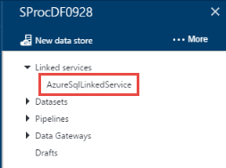
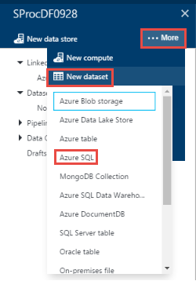

<properties 
    pageTitle="Atividade de procedimento armazenado do SQL Server" 
    description="Saiba como você pode usar a atividade de procedimento armazenado do SQL Server para chamar um procedimento armazenado em um banco de dados do Azure SQL ou um depósito de dados do SQL Azure de um pipeline de fábrica de dados." 
    services="data-factory" 
    documentationCenter="" 
    authors="spelluru" 
    manager="jhubbard" 
    editor="monicar"/>

<tags 
    ms.service="data-factory" 
    ms.workload="data-services" 
    ms.tgt_pltfrm="na" 
    ms.devlang="na" 
    ms.topic="article" 
    ms.date="09/30/2016" 
    ms.author="spelluru"/>

# Atividade de procedimento armazenado do SQL Server
> [AZURE.SELECTOR]
[Seção](data-factory-hive-activity.md)  
[Porco](data-factory-pig-activity.md)  
[MapReduce](data-factory-map-reduce.md)  
[Fluxo de Hadoop](data-factory-hadoop-streaming-activity.md)
[Aprendizado de máquina](data-factory-azure-ml-batch-execution-activity.md) 
[Procedimento armazenado](data-factory-stored-proc-activity.md)
[Dados Lucerne Analytics U-SQL](data-factory-usql-activity.md)
[.NET personalizado](data-factory-use-custom-activities.md)

Você pode usar a atividade de procedimento armazenado do SQL Server em um Data Factory [pipeline](data-factory-create-pipelines.md) para chamar um procedimento armazenado em um dos seguintes repositórios de dados: 

- Banco de dados do SQL Azure 
- Depósito de dados do SQL Azure  
- Banco de dados SQL Server em sua empresa ou uma máquina virtual do Azure. Você precisa instalar o Gateway de gerenciamento de dados na mesma máquina que hospeda o banco de dados ou em uma máquina separada para evitar que competem para recursos com o banco de dados. Gateway de gerenciamento de dados é um software que conecta fontes de dados/fontes de dados hospedados no Azure VMs aos serviços de nuvem de maneira segura e gerenciada local. Consulte o artigo [mover dados entre locais e nuvem](data-factory-move-data-between-onprem-and-cloud.md) para obter detalhes sobre o Gateway de gerenciamento de dados. 

Este artigo se baseia o artigo de [atividades de transformação de dados](data-factory-data-transformation-activities.md) , que apresenta uma visão geral de transformação de dados e as atividades de transformação com suporte.

## Explicação passo a passo

### Tabela de exemplo e um procedimento armazenado
1. Crie a seguinte **tabela** no seu banco de dados de SQL Azure usando o SQL Server Management Studio ou qualquer outra ferramenta que você está familiarizado com. A coluna datetimestamp é a data e hora quando a identificação correspondente é gerada. 

        CREATE TABLE dbo.sampletable
        (
            Id uniqueidentifier,
            datetimestamp nvarchar(127)
        )
        GO

        CREATE CLUSTERED INDEX ClusteredID ON dbo.sampletable(Id);
        GO

    ID é exclusivo identificadas e a coluna datetimestamp é a data e hora quando a identificação correspondente é gerada.
    

    > [AZURE.NOTE] Este exemplo usa o banco de dados do SQL Azure, mas funciona da mesma maneira para depósito de dados do SQL Azure e o banco de dados do SQL Server. 
2. Crie o seguinte **procedimento armazenado** que insere dados para o **sampletable**.

        CREATE PROCEDURE sp_sample @DateTime nvarchar(127)
        AS
        
        BEGIN
            INSERT INTO [sampletable]
            VALUES (newid(), @DateTime)
        END

    > [AZURE.IMPORTANT] **Nome** e **a capitalização** do parâmetro (DateTime neste exemplo) devem corresponder do parâmetro especificado na pipeline/atividade JSON. Na definição do procedimento armazenado, certifique-se de que **@** é usado como um prefixo para o parâmetro.
    
### Criar uma fábrica de dados  
4. Faça logon no [portal do Azure](https://portal.azure.com/). 
5. Clique em **novo** no menu à esquerda, clique em **inteligência + Analytics**e em **Fábrica de dados**.
    
       
4.  Na lâmina **nova fábrica de dados** , digite **SProcDF** para o nome. Nomes de fábrica dados Azure são **globalmente exclusivos**. Você precisa prefixar o nome da fábrica dados com seu nome, para habilitar a criação bem-sucedida de fábrica.

          
3.  Selecione sua **assinatura do Azure**. 
4.  **Grupo de recursos**, siga um das seguintes etapas: 
    1.  Clique em **Criar novo** e digite um nome para o grupo de recursos.
    2.  Clique em **Usar existente** e selecione um grupo de recursos existente.  
5.  Selecione o **local** para a fábrica de dados.
6.  Selecione **Fixar em dashboard** para que você possa ver a fábrica de dados no painel próxima vez que fizer logon no. 
6.  Clique em **criar** na lâmina **nova fábrica de dados** .
6.  Você vê a fábrica de dados sendo criada no **dashboard** do portal do Azure. Depois que a fábrica de dados foi criada com êxito, você verá a página de fábrica de dados, que mostra o conteúdo da fábrica dados.
    

### Criar um serviço SQL Azure vinculado  
Depois de criar a fábrica de dados, você cria um serviço do SQL Azure vinculado que vincule seu banco de dados do SQL Azure à fábrica dados. Este banco de dados contém o sampletable tabela e sp_sample procedimento armazenado.

7.  Clique em **autor e implantar** na lâmina **Fábrica de dados** para **SProcDF** iniciar o Editor de fábrica de dados.
2.  Clique em **armazenam novos dados** na barra de comando e escolha **Azure SQL Database**. Você deve ver o script JSON para a criação de um serviço SQL Azure vinculado no editor. 

    
4. No script JSON, faça as seguintes alterações: 
    1. Substituir ** &lt;nomedoservidor&gt; ** com o nome do seu servidor do Azure SQL Database.
    2. Substituir ** &lt;databasename&gt; ** com o banco de dados no qual você criou a tabela e o procedimento armazenado.
    3. Substituir ** &lt; username@servername ** com a conta de usuário que tenha acesso ao banco de dados.
    4. Substituir ** &lt;senha&gt; ** com a senha da conta de usuário. 

    
5. Clique em **implantar** na barra de comando para implantar o serviço vinculado. Confirme que você vê o AzureSqlLinkedService na exibição em árvore à esquerda. 

    

### Criar um conjunto de dados de saída
6. Clique em **… Mais** na barra de ferramentas, clique em **novo conjunto de dados**e clique em **SQL Azure**. **Novo dataset** na barra de comando e selecione **SQL Azure**.

    
7. Copiar/colar o seguinte script no JSON para o editor de JSON.

        {               
            "name": "sprocsampleout",
            "properties": {
                "type": "AzureSqlTable",
                "linkedServiceName": "AzureSqlLinkedService",
                "typeProperties": {
                    "tableName": "sampletable"
                },
                "availability": {
                    "frequency": "Hour",
                    "interval": 1
                }
            }
        }
7. Clique em **implantar** na barra de comando para implantar o conjunto de dados. Confirme que você vê o conjunto de dados na exibição em árvore. 

    

### Criar um pipeline com SqlServerStoredProcedure atividade
Agora, vamos criar um pipeline com uma atividade de SqlServerStoredProcedure.
 
9. Clique em **… Mais** no comando de barras e clique em **novo pipeline**. 
9. Copiar/colar o trecho JSON a seguir. O **storedProcedureName** definido como **sp_sample**. Nome e capitalização do parâmetro **DateTime** devem corresponder o nome e a capitalização do parâmetro na definição do procedimento armazenado.  

        {
            "name": "SprocActivitySamplePipeline",
            "properties": {
                "activities": [
                    {
                        "type": "SqlServerStoredProcedure",
                        "typeProperties": {
                            "storedProcedureName": "sp_sample",
                            "storedProcedureParameters": {
                                "DateTime": "$$Text.Format('{0:yyyy-MM-dd HH:mm:ss}', SliceStart)"
                            }
                        },
                        "outputs": [
                            {
                                "name": "sprocsampleout"
                            }
                        ],
                        "scheduler": {
                            "frequency": "Hour",
                            "interval": 1
                        },
                        "name": "SprocActivitySample"
                    }
                ],
                "start": "2016-08-02T00:00:00Z",
                "end": "2016-08-02T05:00:00Z",
                "isPaused": false
            }
        }

    Se você precisa passar null para um parâmetro, use esta sintaxe: "param1": nulo (letras minúsculas). 
9. Clique em **implantar** na barra de ferramentas para implantar o pipeline.  

### Monitorar o pipeline

6. Clique no **X** para fechar lâminas de Editor de fábrica de dados e navegar de volta para a lâmina de fábrica de dados e clique em **diagrama**.

    
7. No modo **De exibição de diagrama**de, você vê uma visão geral dos canais e conjuntos de dados usados neste tutorial. 

    
8. No modo de exibição de diagrama, clique duas vezes o conjunto de dados **sprocsampleout**. Você vê as fatias em estado pronto. Deve haver cinco fatias porque uma fatia é gerada para cada hora entre a hora de início e hora de término do JSON.

     
10. Quando uma fatia está no estado **pronto** , execute um * *Selecione* sampletable** consulta o banco de dados do SQL Azure para verificar que os dados foram inseridos à tabela pelo procedimento armazenado.

    

    Consulte [Monitor o pipeline](data-factory-monitor-manage-pipelines.md) para obter informações detalhadas sobre o monitoring canais de fábrica de dados do Azure.  

> [AZURE.NOTE] Neste exemplo, o SprocActivitySample não tem entradas. Se você deseja cadeia esta atividade com uma atividade upstream (ou seja, processamento anterior), as saídas da atividade upstream podem ser usadas como entradas nesta atividade. Nesse caso, esta atividade não é executado até a atividade upstream está concluída e saídas das atividades upstream estão disponíveis (no status Pronto). As entradas não podem ser usadas diretamente como um parâmetro para a atividade de procedimento armazenado

## Formato JSON
    {
        "name": "SQLSPROCActivity",
        "description": "description", 
        "type": "SqlServerStoredProcedure",
        "inputs":  [ { "name": "inputtable"  } ],
        "outputs":  [ { "name": "outputtable" } ],
        "typeProperties":
        {
            "storedProcedureName": "<name of the stored procedure>",
            "storedProcedureParameters":  
            {
                "param1": "param1Value"
                …
            }
        }
    }

## Propriedades JSON

Propriedade | Descrição | Necessário
-------- | ----------- | --------
nome | Nome da atividade | Sim
Descrição | Texto que descreve a atividade para que serve | Não
tipo | SqlServerStoredProcedure | Sim
entradas | Opcional. Se você especificar um conjunto de dados de entrada, ele deve estar disponível (no status 'Pronto') para a atividade de procedimento armazenado executar. O conjunto de dados de entrada não pode ser consumido no procedimento armazenado como um parâmetro. Ele só é usado para verificar a dependência antes de iniciar a atividade de procedimento armazenado. | Não
saídas | Você deve especificar um conjunto de dados de saída para uma atividade de procedimento armazenado. Conjunto de dados de saída Especifica o **cronograma** para a atividade de procedimento armazenado (por hora, semanal, mensal, etc.).   O conjunto de dados de saída deve usar um **serviço vinculado** que se refere a um banco de dados do SQL Azure ou um depósito de dados do SQL Azure ou um banco de dados do SQL Server na qual você deseja que o procedimento armazenado para executar.   O conjunto de dados de saída pode servir como uma forma de passar o resultado do procedimento armazenado para subsequentes de outra atividade ([encadeamento atividades](data-factory-scheduling-and-execution.md#chaining-activities)) no pipeline de processamento. No entanto, fábrica de dados não automaticamente escrever a saída de um procedimento armazenado para este conjunto de dados. É o procedimento armazenado que grava uma tabela do SQL que o conjunto de dados de saída aponta para.   Em alguns casos, o conjunto de dados de saída pode ser um **conjunto de dados fictício**, que só é usado para especificar o cronograma para executar a atividade de procedimento armazenado. | Sim
storedProcedureName | Especifique o nome do procedimento armazenado no banco de dados do SQL Azure ou depósito de dados do SQL Azure é representado pelo serviço vinculado que usa a tabela de saída. | Sim
storedProcedureParameters | Especifica valores para parâmetros de procedimento armazenado. Se você precisar passar null para um parâmetro, use esta sintaxe: "param1": nulo (todas as letras minúsculas). Consulte o exemplo a seguir para saber como usar esta propriedade.| Não

## Passando um valor estático 
Agora, vamos considerar adicionar outra coluna denominada 'Cenário' na tabela que contém um valor estático chamado 'Documento amostra'.

    CREATE PROCEDURE sp_sample @DateTime nvarchar(127) , @Scenario nvarchar(127)
    
    AS
    
    BEGIN
        INSERT INTO [sampletable]
        VALUES (newid(), @DateTime, @Scenario)
    END

Agora, passe o parâmetro de cenário e o valor da atividade de procedimento armazenado. A seção typeProperties no exemplo anterior se parece com o trecho a seguir:

    "typeProperties":
    {
        "storedProcedureName": "sp_sample",
        "storedProcedureParameters": 
        {
            "DateTime": "$$Text.Format('{0:yyyy-MM-dd HH:mm:ss}', SliceStart)",
            "Scenario": "Document sample"
        }
    }

