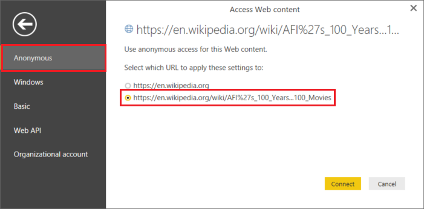

<properties 
    pageTitle="Mover dados de tabela da Web | Fábrica de dados do Azure" 
    description="Saiba mais sobre como mover dados do local uma tabela em uma página da Web usando fábrica de dados do Azure." 
    services="data-factory" 
    documentationCenter="" 
    authors="linda33wj" 
    manager="jhubbard" 
    editor="monicar"/>

<tags 
    ms.service="data-factory" 
    ms.workload="data-services" 
    ms.tgt_pltfrm="na" 
    ms.devlang="na" 
    ms.topic="article" 
    ms.date="09/26/2016" 
    ms.author="jingwang"/>

# Mover dados de uma fonte de tabela da Web usando fábrica de dados do Azure
Este artigo descreve como você pode usar a atividade de cópia em uma fábrica de dados do Azure para copiar dados de uma tabela em uma página da Web para outro armazenamento de dados. Este artigo se baseia o artigo de [atividades de movimentação de dados](data-factory-data-movement-activities.md) , que apresenta uma visão geral de movimentação de dados com atividade de cópia e combinações de repositório de dados com suporte.

Fábrica de dados atualmente oferece suporte apenas movimentação de dados de uma tabela da Web para outros armazenamentos de dados, mas não movendo os dados de outros dados armazena para um destino de tabela da Web.

> [AZURE.NOTE] Atualmente, esse conector Web suporta somente o conteúdo de extração de tabela de uma página HTML.

## Exemplo: Copiar dados de tabela da Web para Azure Blob

O exemplo abaixo mostra:

1.  Um serviço vinculado do tipo [Web](#web-linked-service-properties).
2.  Um serviço vinculado do tipo [AzureStorage](data-factory-azure-blob-connector.md#azure-storage-linked-service-properties).
3.  Uma entrada [dataset](data-factory-create-datasets.md) do tipo [WebTable](#WebTable-dataset-properties).
4.  Uma saída [dataset](data-factory-create-datasets.md) do tipo [AzureBlob](data-factory-azure-blob-connector.md#azure-blob-dataset-type-properties).
4.  Um [pipeline](data-factory-create-pipelines.md) com atividade de cópia que usa [WebSource](#websource-copy-activity-type-properties) e [BlobSink](data-factory-azure-blob-connector.md#azure-blob-copy-activity-type-properties).

O exemplo copia dados de uma tabela da Web para um Azure blob cada hora. As propriedades JSON usadas nesses exemplos são descritas nas seções seguindo as amostras. 

O exemplo a seguir mostra como copiar dados de uma tabela da Web para um blob do Microsoft Azure. No entanto, os dados podem ser copiados diretamente para qualquer um dos receptores de consta no artigo [Atividades de movimentação de dados](data-factory-data-movement-activities.md) usando a atividade de cópia no Azure dados fábrica. 

**Serviço vinculadas à Web** Este exemplo usa o serviço Web vinculado com autenticação anônima. Consulte a seção de [serviço vinculadas à Web](#web-linked-service-properties) para diferentes tipos de autenticação, você pode usar. 

    {
        "name": "WebLinkedService",
        "properties":
        {
            "type": "Web",
            "typeProperties":
            {
                "authenticationType": "Anonymous",
                "url" : "https://en.wikipedia.org/wiki/"
            }
        }
    }

**Serviço de armazenamento vinculado do Azure**

    {
      "name": "AzureStorageLinkedService",
      "properties": {
        "type": "AzureStorage",
        "typeProperties": {
          "connectionString": "DefaultEndpointsProtocol=https;AccountName=<accountname>;AccountKey=<accountkey>"
        }
      }
    }

**Conjunto de dados de entrada do WebTable** Configuração **externos** como **true** informa o serviço de fábrica de dados que o conjunto de dados externo à fábrica dados e não é produzido por uma atividade na fábrica dados.

> [AZURE.NOTE] Consulte a seção de [obter índice de uma tabela em uma página HTML](#get-index-of-a-table-in-an-html-page) para as etapas para obter o índice de uma tabela em uma página HTML.  

    
    {
        "name": "WebTableInput",
        "properties": {
            "type": "WebTable",
            "linkedServiceName": "WebLinkedService",
            "typeProperties": {
                "index": 1,
                "path": "AFI's_100_Years...100_Movies"
            },
            "external": true,
            "availability": {
                "frequency": "Hour",
                "interval":  1
            }
        }
    }

**Conjunto de dados de saída do Azure Blob**

Dados são gravados em um novo blob cada hora (frequência: horas, intervalo: 1). 

    {
        "name": "AzureBlobOutput",
        "properties":
        {
            "type": "AzureBlob",
            "linkedServiceName": "AzureStorageLinkedService",
            "typeProperties":
            {
                "folderPath": "adfgetstarted/Movies"
            },
            "availability":
            {
                "frequency": "Hour",
                "interval": 1
            }
        }
    }

**Pipeline com atividade de cópia**

O pipeline contém uma atividade de cópia que está configurado para usar a entrada acima e conjuntos de dados de saída e está agendado para ser executado a cada hora. No pipeline de definição de JSON, o tipo de **fonte** é definido como **WebSource** e **receptor** tipo está definido como **BlobSink**. 

Consulte [Propriedades de tipo de WebSource](#websource-copy-activity-type-properties) para a lista de propriedades compatíveis com o WebSource. 
    
    {  
        "name":"SamplePipeline",
        "properties":{  
        "start":"2014-06-01T18:00:00",
        "end":"2014-06-01T19:00:00",
        "description":"pipeline with copy activity",
        "activities":[  
          {
            "name": "WebTableToAzureBlob",
            "description": "Copy from a Web table to an Azure blob",
            "type": "Copy",
            "inputs": [
              {
                "name": "WebTableInput"
              }
            ],
            "outputs": [
              {
                "name": "AzureBlobOutput"
              }
            ],
            "typeProperties": {
              "source": {
                "type": "WebSource"
              },
              "sink": {
                "type": "BlobSink"
              }
            },
           "scheduler": {
              "frequency": "Hour",
              "interval": 1
            },
            "policy": {
              "concurrency": 1,
              "executionPriorityOrder": "OldestFirst",
              "retry": 0,
              "timeout": "01:00:00"
            }
          }
          ]
       }
    }

## Propriedades do serviço vinculada Web

A tabela a seguir fornece descrição para elementos JSON específicos para vinculada de serviço Web.

| Propriedade | Descrição | Necessário |
| -------- | ----------- | -------- | 
| tipo | A propriedade de tipo deve ser definida como: **Web** | Sim | 
| URL | URL para a fonte da Web | Sim |
| authenticationType | Anônimo ou básica. | Sim |
| nome de usuário | Nome de usuário para autenticação básica. | Sim (para autenticação básica)
| senha | Senha para autenticação básica. | Sim (para autenticação básica)

### Usando a autenticação anônima

    {
        "name": "web",
        "properties":
        {
            "type": "Web",
            "typeProperties":
            {
                "authenticationType": "Anonymous",
                "url" : "https://en.wikipedia.org/wiki/"
            }
        }
    }

### Usando a autenticação básica
    
    {
        "name": "web",
        "properties":
        {
            "type": "Web",
            "typeProperties":
            {
                "authenticationType": "basic",
                "url" : "http://myit.mycompany.com/",
                "userName": "Administrator",
                "password": "password"
            }
        }
    }

## Propriedades do conjunto de dados de WebTable

Para obter uma lista completa das seções e propriedades disponíveis para definição de conjuntos de dados, consulte o artigo de [conjuntos de dados criando](data-factory-create-datasets.md) . Seções como estrutura, disponibilidade e política de um conjunto de dados JSON são semelhantes para todos os tipos de conjunto de dados (Azure SQL, BLOB do Microsoft Azure, tabela do Microsoft Azure, etc.).

A seção **typeProperties** é diferente para cada tipo de conjunto de dados e fornece informações sobre o local dos dados no repositório de dados. A seção typeProperties de conjunto de dados do tipo **WebTable** tem as seguintes propriedades

Propriedade | Descrição | Necessário
:-------- | :----------- | :--------
tipo    | tipo do conjunto de dados. deve ser definido como **WebTable** | Sim
caminho | Um URL relativo ao recurso que contém a tabela. | Não. Quando o caminho não for especificado, somente a URL especificada na definição do serviço vinculada é usada. 
índice | O índice da tabela no recurso. Consulte a seção de [obter índice de uma tabela em uma página HTML](#get-index-of-a-table-in-an-html-page) para as etapas para obter o índice de uma tabela em uma página HTML. | Sim

**Exemplo:**

    {
        "name": "WebTableInput",
        "properties": {
            "type": "WebTable",
            "linkedServiceName": "WebLinkedService",
            "typeProperties": {
                "index": 1,
                "path": "AFI's_100_Years...100_Movies"
            },
            "external": true,
            "availability": {
                "frequency": "Hour",
                "interval":  1
            }
        }
    }

## WebSource - propriedades de tipo de atividade de cópia

Para obter uma lista completa das seções & propriedades disponíveis para a definição de atividades, consulte o artigo [Criar canais](data-factory-create-pipelines.md) . Propriedades como nome, descrição, entrada e saída tabelas e política estão disponíveis para todos os tipos de atividades. 

Por outro lado, propriedades disponíveis na seção typeProperties da atividade variam com cada tipo de atividade. Atividade de cópia, eles variam dependendo dos tipos de fontes e receptores.

Atualmente, quando a fonte na atividade de cópia for do tipo **WebSource**, sem propriedades adicionais são suportadas. 

## Obter o índice de uma tabela em uma página HTML

1. Inicie o **Excel 2016** e alternar para a guia **dados** .  
2. Clique em **Nova consulta** na barra de ferramentas, aponte para **De outras fontes** e clique em **Da Web**.
    
     
3. Na caixa de diálogo **Da Web** , digite o **URL** que você deseja usar no serviço vinculado JSON (por exemplo: https://en.wikipedia.org/wiki/) juntamente com o caminho seria especificado para o conjunto de dados (por exemplo: AFI 27s_100_Years de % … 100_Movies) e clique em **Okey**. 

     

    URL usada neste exemplo: https://en.wikipedia.org/wiki/AFI%27s_100_Years...100_Movies 
4.  Se você vir a caixa de diálogo **conteúdo da Web do Access** , selecione da direita **URL**, **autenticação**e clique em **Conectar**. 

    
5.  Clique em um item de **tabela** na exibição em árvore para ver o conteúdo da tabela e clique em botão **Editar** na parte inferior.  

     

5. Na janela do **Editor de consultas** , clique em botão de **Editor Avançado** na barra de ferramentas.

    

6. Na caixa de diálogo Editor Avançado, o número ao lado de "Origem" é o índice.

     

Se você estiver usando o Excel 2013, use o [Microsoft Power Query para Excel](https://www.microsoft.com/download/details.aspx?id=39379) para obter o índice. Consulte o artigo de [conectar a uma página da web](https://support.office.com/article/Connect-to-a-web-page-Power-Query-b2725d67-c9e8-43e6-a590-c0a175bd64d8) para obter detalhes. As etapas são semelhantes, se você estiver usando [O Microsoft Power BI para área de trabalho](https://powerbi.microsoft.com/desktop/). 

[AZURE.INCLUDE [data-factory-column-mapping](../../includes/data-factory-column-mapping.md)]

[AZURE.INCLUDE [data-factory-structure-for-rectangualr-datasets](../../includes/data-factory-structure-for-rectangualr-datasets.md)]

## Desempenho e ajuste  
Consulte o [guia de ajuste e desempenho de atividade de cópia](data-factory-copy-activity-performance.md) para saber mais sobre principais fatores que desempenho de impacto de movimentação de dados (cópia atividade) em fábrica de dados do Azure e várias maneiras de otimizá-lo.
