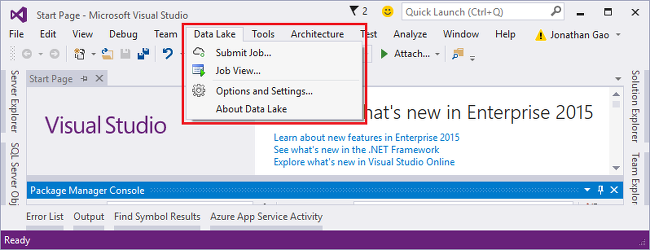

<properties
   pageTitle="Analisar os logs de site usando a análise do Azure dados Lucerne | Azure"
   description="Aprenda a analisar logs de site usando a análise de dados Lucerne. "
   services="data-lake-analytics"
   documentationCenter=""
   authors="edmacauley"
   manager="jhubbard"
   editor="cgronlun"/>

<tags
   ms.service="data-lake-analytics"
   ms.devlang="na"
   ms.topic="article"
   ms.tgt_pltfrm="na"
   ms.workload="big-data"
   ms.date="05/16/2016"
   ms.author="edmaca"/>

# Tutorial: Analisar logs de site usando a análise de Lucerne de dados do Azure

Aprenda a analisar logs de site usando a análise de dados Lucerne, especialmente em descobrir quais Referenciadores encontrou erros quando eles tentaram visitar o site.

>[AZURE.NOTE] Se você quiser ver o aplicativo trabalhando, economiza tempo para dar uma olhada em [usar Azure dados Lucerne Analytics interativos tutoriais](data-lake-analytics-use-interactive-tutorials.md). Este tutorial se baseia o mesmo cenário e o mesmo código. O objetivo deste tutorial é dar aos desenvolvedores a experiência de criação e executando um aplicativo de análise de Lucerne de dados de ponta a ponta.

## Pré-requisitos:

- **Visual Studio 2015, Visual Studio 2013 atualizar 4, ou Visual Studio 2012 com Visual C++ instalado**.
- **SDK do Microsoft Azure para .NET versão 2.5 ou acima**.  Instalá-lo usando o [instalador de plataforma da Web](http://www.microsoft.com/web/downloads/platform.aspx).
- **[Ferramentas de dados Lucerne para Visual Studio](http://aka.ms/adltoolsvs)**.

    Quando dados Lucerne ferramentas para Visual Studio estiver instalada, você verá um menu **Lucerne de dados** no Visual Studio:

    

- **Conhecimento básico de análise de Lucerne de dados e as ferramentas de Lucerne dados para Visual Studio**. Para começar, consulte:

    - [Introdução ao Azure dados Lucerne análise usando o Portal do Azure](data-lake-analytics-get-started-portal.md).
    - [Script de desenvolver U-SQL usando ferramentas de dados Lucerne para Visual Studio](data-lake-analytics-data-lake-tools-get-started.md).

- **Uma conta de dados Lucerne Analytics.**  Consulte [criar uma conta de análise de Lucerne de dados do Azure](data-lake-analytics-get-started-portal.md#create_adl_analytics_account).

    As ferramentas de Lucerne de dados não dá suporte a criar contas de dados Lucerne Analytics.  Portanto, você precisa criá-lo usando o Portal Azure, o PowerShell do Azure, o SDK do .NET ou o CLI do Azure.
- **Carregue os dados de exemplo para a conta de dados Lucerne Analytics.** Consulte [SearchLog.tsv carregar para a conta de armazenamento de Lucerne de dados padrão](data-lake-analytics-get-started-portal.md#update-data-to-the-default-adl-storage-account).

    Para executar um trabalho de análise de Lucerne de dados, você precisará alguns dados. Embora as ferramentas de Lucerne dados tem suporte para carregamento de dados, você usará o portal para carregar os dados de exemplo para fazer este tutorial mais fácil de acompanhar.

## Conectar ao Azure

Antes de criar e testar qualquer scripts U-SQL, você deve primeiro conectar ao Azure.

**Para se conectar a dados Lucerne Analytics**

1. Abra o Visual Studio.
2. No menu **Lucerne de dados** , clique em **Opções e configurações**.
4. Clique em **Sign In**ou **Alterar usuário** se alguém tiver conectado e siga as instruções.
5. Clique **Okey** para fechar a caixa de diálogo Opções e configurações.

**Para procurar suas contas de dados Lucerne Analytics**

1. No Visual Studio, abra **Server Explorer** pressione **CTRL + ALT + S**.
2. No **Server Explorer**, expanda **Azure**e expanda **Lucerne a análise de dados**. Você deverá ver uma lista de suas contas de dados Lucerne Analytics se houver algum. Você não pode criar contas de dados Lucerne análise do studio. Para criar uma conta, consulte [Introdução ao Azure dados Lucerne análise usando o Portal do Azure](data-lake-analytics-get-started-portal.md) ou [Introdução ao Azure dados Lucerne análise usando o PowerShell do Azure](data-lake-analytics-get-started-powershell.md).

## Desenvolva aplicativos U-SQL

Um aplicativo de U-SQL é principalmente um script de U-SQL. Para saber mais sobre U-SQL, consulte [Introdução ao U-SQL](data-lake-analytics-u-sql-get-started.md).

Você pode adicionar operadores definidos pelo usuário de adição para o aplicativo.  Para obter mais informações, consulte [operadores para trabalhos de análise de Lucerne de dados definido pelo usuário de desenvolver U-SQL](data-lake-analytics-u-sql-develop-user-defined-operators.md).

**Criar e enviar um trabalho de dados Lucerne Analytics**

1. No menu **arquivo** , clique em **novo**e, em seguida, clique em **projeto**.
2. Selecione o tipo de projeto de U-SQL.

    

3. Clique em **Okey**. Visual studio cria uma solução com um arquivo de Script.usql.
4. Insira o seguinte script para o arquivo de Script.usql:

        // Create a database for easy reuse, so you don't need to read from a file every time.
        CREATE DATABASE IF NOT EXISTS SampleDBTutorials;

        // Create a Table valued function. TVF ensures that your jobs fetch data from the weblog file with the correct schema.
        DROP FUNCTION IF EXISTS SampleDBTutorials.dbo.WeblogsView;
        CREATE FUNCTION SampleDBTutorials.dbo.WeblogsView()
        RETURNS @result TABLE
        (
            s_date DateTime,
            s_time string,
            s_sitename string,
            cs_method string,
            cs_uristem string,
            cs_uriquery string,
            s_port int,
            cs_username string,
            c_ip string,
            cs_useragent string,
            cs_cookie string,
            cs_referer string,
            cs_host string,
            sc_status int,
            sc_substatus int,
            sc_win32status int,
            sc_bytes int,
            cs_bytes int,
            s_timetaken int
        )
        AS
        BEGIN

            @result = EXTRACT
                s_date DateTime,
                s_time string,
                s_sitename string,
                cs_method string,
                cs_uristem string,
                cs_uriquery string,
                s_port int,
                cs_username string,
                c_ip string,
                cs_useragent string,
                cs_cookie string,
                cs_referer string,
                cs_host string,
                sc_status int,
                sc_substatus int,
                sc_win32status int,
                sc_bytes int,
                cs_bytes int,
                s_timetaken int
            FROM @"/Samples/Data/WebLog.log"
            USING Extractors.Text(delimiter:' ');
            RETURN;
        END;

        // Create a table for storing referrers and status
        DROP TABLE IF EXISTS SampleDBTutorials.dbo.ReferrersPerDay;
        @weblog = SampleDBTutorials.dbo.WeblogsView();
        CREATE TABLE SampleDBTutorials.dbo.ReferrersPerDay
        (
            INDEX idx1
            CLUSTERED(Year ASC)
            PARTITIONED BY HASH(Year)
        ) AS

        SELECT s_date.Year AS Year,
            s_date.Month AS Month,
            s_date.Day AS Day,
            cs_referer,
            sc_status,
            COUNT(DISTINCT c_ip) AS cnt
        FROM @weblog
        GROUP BY s_date,
                cs_referer,
                sc_status;

    Para compreender o U-SQL, consulte [Introdução ao linguagem dados Lucerne Analytics U-SQL](data-lake-analytics-u-sql-get-started.md).    

5. Adicionar um novo script U-SQL ao seu projeto e insira o seguinte:

        // Query the referrers that ran into errors
        @content =
            SELECT *
            FROM SampleDBTutorials.dbo.ReferrersPerDay
            WHERE sc_status >=400 AND sc_status < 500;

        OUTPUT @content
        TO @"/Samples/Outputs/UnsuccessfulResponses.log"
        USING Outputters.Tsv();

6. Alternar de volta para o primeiro script U-SQL e ao lado do botão **Enviar** , especifique a sua conta de análise.
7. No **Solution Explorer**, clique com botão direito **Script.usql**e clique em **Criar Script**. Verificar os resultados no painel de saída.
8. No **Solution Explorer**, clique com botão direito **Script.usql**e clique em **Enviar Script**.
9. Verifique se que a **Conta de análise** é aquele onde você deseja executar o trabalho e clique em **Enviar**. Resultados de envio e link de trabalho estão disponíveis nas ferramentas Lucerne dados para a janela de resultados do Visual Studio quando o envio é concluído.
10. Aguarde até que o trabalho for concluído com êxito.  Se o trabalho falhou, provavelmente não tem o arquivo de origem.  Consulte a seção pré-requisito deste tutorial. Para obter informações adicionais de solução de problemas, consulte [Monitor e solucionar problemas de trabalhos de análise de Lucerne de dados do Azure](data-lake-analytics-monitor-and-troubleshoot-jobs-tutorial.md).

    Quando o trabalho for concluído, você deverá ver a tela a seguir:

    

11. Agora, repita as etapas 7 a 10 para **Script1.usql**.

>[AZURE.NOTE]Você não pode ler ou gravar a uma tabela de U-SQL que foi criada ou modificada no mesmo script.  É por isso que usar dois scripts para este exemplo.

**Para ver a saída de trabalho**

1. No **Server Explorer**, expanda **Azure**, expandir **Dados Lucerne Analytics**, expandir sua conta de dados Lucerne Analytics, expanda **Contas de armazenamento**, a conta de armazenamento de Lucerne de dados padrão de atalho e clique em **Explorer**.
2.  Clique duas vezes para abrir a pasta de **amostras** e **saídas**.
3.  Clique duas vezes em **UnsuccessfulResponsees.log**.
4.  Você pode também clicar duas vezes no arquivo de saída dentro do modo de exibição de gráfico do trabalho para navegar diretamente para a saída.

## Consulte também

Para começar a usar a análise de Lucerne dados usando ferramentas diferentes, consulte:

- [Começar a usar a análise de Lucerne dados usando o Portal do Azure](data-lake-analytics-get-started-portal.md)
- [Começar a usar a análise de Lucerne dados usando o PowerShell do Azure](data-lake-analytics-get-started-powershell.md)
- [Começar a usar a análise de Lucerne dados usando o SDK do .NET](data-lake-analytics-get-started-net-sdk.md)

Para ver mais tópicos de desenvolvimento:

- [Desenvolver scripts U-SQL usando ferramentas de Lucerne de dados para o Visual Studio](data-lake-analytics-data-lake-tools-get-started.md)
- [Começar a usar o idioma de análise de Lucerne de dados U-SQL Azure](data-lake-analytics-u-sql-get-started.md)
- [Desenvolver operadores de definidas pelo usuário U-SQL para trabalhos de dados Lucerne Analytics](data-lake-analytics-u-sql-develop-user-defined-operators.md)
