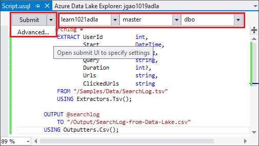
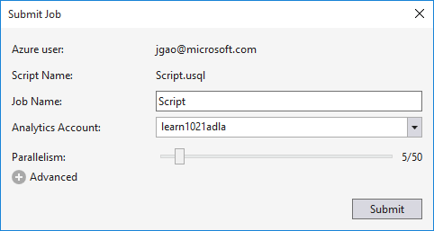
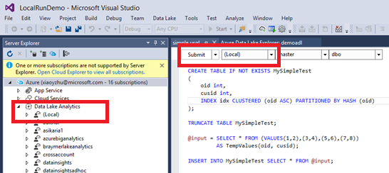

<properties
   pageTitle="Desenvolver scripts U-SQL usando ferramentas de Lucerne de dados para o Visual Studio | Azure"
   description="Saiba como instalar dados Lucerne ferramentas para Visual Studio, como desenvolver e scripts de teste U-SQL. "
   services="data-lake-analytics"
   documentationCenter=""
   authors="edmacauley"
   manager="jhubbard"
   editor="cgronlun"/>

<tags
   ms.service="data-lake-analytics"
   ms.devlang="na"
   ms.topic="get-started-article"
   ms.tgt_pltfrm="na"
   ms.workload="big-data"
   ms.date="05/16/2016"
   ms.author="edmaca"/>

# Tutorial: desenvolver scripts U-SQL usando ferramentas de Lucerne de dados para o Visual Studio

[AZURE.INCLUDE [get-started-selector](../../includes/data-lake-analytics-selector-get-started.md)]

Saiba como instalar dados Lucerne ferramentas para Visual Studio e use dados Lucerne ferramentas para Visual Studio para gravar e testar scripts U-SQL.

U-SQL é uma linguagem hyper-scalable, altamente extensível para preparar, transformação e analisar todos os dados na Lucerne dados e depois. Para obter mais informações, consulte [U-SQL referência] (http://go.microsoft.com/fwlink/p/?LinkId=691348).

##Pré-requisitos

- **Visual Studio 2015, Visual Studio 2013 atualizar 4 ou Visual Studio 2012. Enterprise (Ultimate/Premium), Professional, comunidade edições são suportadas; Não há suporte para Express edition. O Visual Studio "15" não é suportado atualmente e estamos trabalhando nisso.**
- **SDK do Microsoft Azure para .NET versão 2.7.1 ou acima**.  Instalá-lo usando o [instalador de plataforma da Web](http://www.microsoft.com/web/downloads/platform.aspx).
- **[Ferramentas de dados Lucerne para Visual Studio](http://aka.ms/adltoolsvs)**.

    Quando dados Lucerne ferramentas para Visual Studio estiver instalada, você verá um nó de "Dados Lucerne Analytics" no Server Explorer sob o nó de "Azure" (você pode abrir Server explorer pressionando Ctrl + Alt + S).

- **Percorra as duas seções a seguir na [Introdução ao Azure dados Lucerne análise usando o portal Azure](data-lake-analytics-get-started-portal.md)**.

    - [Criar uma conta de análise de Lucerne de dados do Azure](data-lake-analytics-get-started-portal.md#create_adl_analytics_account).
    - [Carregar SearchLog.tsv para a conta de armazenamento de Lucerne de dados padrão](data-lake-analytics-get-started-portal.md#update-data-to-the-default-adl-storage-account).

    Para sua conveniência, um script de amostra do PowerShell para criar um serviço de dados Lucerne analítico e carregar o arquivo de dados de origem pode ser encontrado na [amostra Appx-A PowerShell para preparar o tutorial](data-lake-analytics-data-lake-tools-get-started.md#appx-a-powershell-sample-for-preparing-the-tutorial).

    As ferramentas de Lucerne de dados não dá suporte a criar contas de dados Lucerne Analytics. Portanto, você precisa criá-lo usando o portal do Azure, Azure PowerShell, .NET SDK ou CLI do Azure. Para executar um trabalho de análise de Lucerne de dados, você precisará alguns dados. Embora as ferramentas de Lucerne dados tem suporte para carregamento de dados, você usará o portal para carregar os dados de exemplo para fazer este tutorial mais fácil de acompanhar.

## Conectar ao Azure

**Para se conectar a dados Lucerne Analytics**

1. Abra o Visual Studio.
2. No menu **Exibir** , clique em **Server Explorer** para abrir o Explorer do servidor. Ou pressione **[CTRL] + [ALT] + S**.
3. **Azure**de atalho, clique em "Conectar-se ao Microsoft Azure assinatura" e siga as instruções.
4. No **Server Explorer**, expanda **Azure**e expanda **Lucerne a análise de dados**. Você deverá ver uma lista de suas contas de dados Lucerne Analytics se houver algum. Você não pode criar contas de dados Lucerne Analytics do Visual Studio. Para criar uma conta, consulte [Introdução ao Azure dados Lucerne análise usando o portal Azure](data-lake-analytics-get-started-portal.md) ou [Introdução ao Azure dados Lucerne análise usando o PowerShell do Azure](data-lake-analytics-get-started-powershell.md).

## Carregar arquivos de dados de origem

Você carregou alguns dados na seção de **pré-requisito** anteriormente no tutorial.  

Caso você queira usar seus próprios dados, aqui estão os procedimentos para carregar dados das ferramentas do Lucerne dados.

**Carregar arquivos para a conta do Azure dados Lucerne dependente**

1. No **Server Explorer**, expanda **Azure**, expanda **Lucerne a análise de dados**, sua conta de dados Lucerne Analytics, **Contas de armazenamento**. Você deverá ver a conta de armazenamento de Lucerne de dados padrão e as contas de armazenamento de Lucerne dados vinculadas e as contas de armazenamento do Azure vinculadas. A conta padrão de dados Lucerne tem um rótulo "Conta de armazenamento padrão".
2. A conta de armazenamento de Lucerne de dados padrão de atalho e, em seguida, clique em **Explorer**.  Ele abre as ferramentas de Lucerne de dados para o painel de Visual Studio Explorer.  No lado esquerdo, ele mostra um modo de exibição de árvore, que o modo de exibição de conteúdo está à direita.
3. Navegue até a pasta onde você deseja carregar arquivos,
4. Clique com botão direito qualquer espaço em branco e, em seguida, clique em **carregar**.

    

**Carregar arquivos para uma conta de armazenamento de Blob do Azure vinculada**

1. No **Server Explorer**, expanda **Azure**, expanda **Lucerne a análise de dados**, sua conta de dados Lucerne Analytics, **Contas de armazenamento**. Você deverá ver a conta de armazenamento de Lucerne de dados padrão e as contas de armazenamento de Lucerne dados vinculadas e as contas de armazenamento do Azure vinculadas.
2. Expanda a conta de armazenamento do Azure.
3. O contêiner onde você deseja carregar arquivos de atalho e, em seguida, clique em **Explorer**. Se você não tiver um contêiner, você deve primeiro criar um usando o portal do Azure, Azure PowerShell ou outras ferramentas.
4. Navegue até a pasta onde você deseja carregar arquivos,
5. Clique com botão direito qualquer espaço em branco e, em seguida, clique em **carregar**.

## Desenvolver scripts U-SQL

Os trabalhos de dados Lucerne Analytics são gravados na linguagem SQL U. Para saber mais sobre U-SQL, consulte [referência de linguagem de U-SQL](http://go.microsoft.com/fwlink/?LinkId=691348)e [começar a usar linguagem U-SQL](data-lake-analytics-u-sql-get-started.md) .

**Criar e enviar um trabalho de dados Lucerne Analytics**

1. No menu **arquivo** , clique em **novo**e, em seguida, clique em **projeto**.
2. Selecione o tipo de **Projeto de U-SQL** .

    

3. Clique em **Okey**. Visual studio cria uma solução com um arquivo de **Script.usql** .
4. Insira o seguinte script em **Script.usql**:

        @searchlog =
            EXTRACT UserId          int,
                    Start           DateTime,
                    Region          string,
                    Query           string,
                    Duration        int?,
                    Urls            string,
                    ClickedUrls     string
            FROM "/Samples/Data/SearchLog.tsv"
            USING Extractors.Tsv();

        @res =
            SELECT *
            FROM @searchlog;        

        OUTPUT @res   
            TO "/Output/SearchLog-from-Data-Lake.csv"
        USING Outputters.Csv();

    Este script U-SQL lê o arquivo de dados de origem usando **Extractors.Tsv()**e, então, cria um arquivo csv usando **Outputters.Csv()**.

    Não modifique os dois caminhos, a menos que você copiou o arquivo de origem em um local diferente.  A análise de dados Lucerne criará a pasta de saída, se ele não existir.

    É mais simples usar caminhos relativos para arquivos armazenavam em default dados contas Lucerne. Você também pode usar caminhos absolutos.  Por exemplo

        adl://<Data LakeStorageAccountName>.azuredatalakestore.net:443/Samples/Data/SearchLog.tsv

    Você deve usar caminhos absolutos para acessar arquivos em contas de armazenamento vinculadas.  A sintaxe para arquivos armazenados em conta vinculada de armazenamento do Azure é:

        wasb://<BlobContainerName>@<StorageAccountName>.blob.core.windows.net/Samples/Data/SearchLog.tsv

    >[AZURE.NOTE] Contêiner de Blob Azure com permissões de acesso de contêineres público ou públicos blobs não são suportados no momento.  

    Observe os seguintes recursos:

    - **IntelliSense**

        Conclusão automática de nomes e os membros serão mostrados para conjunto de linhas, Classes, bancos de dados, esquemas e objetos definidos pelo usuário (UDOs).

        IntelliSense para entidades do catálogo (bancos de dados, esquemas, tabelas, UDOs etc.) está relacionada à sua conta de computação. Você pode verificar a conta ativa computação atual, o banco de dados e o esquema na barra de ferramentas superior e alterná-las por meio das listas suspensas.

    - **Expandir* colunas**

        Clique em direita da *, você deverá ver um sublinhado azul sob o *. Passe o cursor do mouse sobre o sublinhado azul e, em seguida, clique na seta para baixo.
        

        Clique em **Expandir colunas**, a ferramenta substituirão os * com os nomes de coluna.

    - **Formatação automática**

        Os usuários podem alterar o recuo do script U-SQL com base no código de estrutura em Editar -> Avançado:

        - Documento de formato (Ctrl + E, D): Formata o documento inteiro   
        - Seleção de formato (Ctrl + K, Ctrl + F): Formata a seleção. Se não houver seleção foi feita, esse atalho formata a linha que o cursor estiver no.  

        Todas as regras de formatação são configurável em Ferramentas -> Opções -> Editor de texto - > SIP -> formatação.  
    - **Recuo inteligente**

        Dados Lucerne ferramentas para Visual Studio é capaz de recuo expressões automaticamente enquanto você estiver gravando scripts. Esse recurso é desabilitado por padrão, os usuários precisam para ativá-la por meio de verificação U-SQL -> Opções e configurações -> Opções -> Habilitar recuo inteligente.

    - **Ir para definição e localizar todas as referências**

        Clicando no nome de um conjunto de linhas/parâmetro/coluna/UDO etc e clicando em Ir para definição (F12) permite que você navegue até sua definição. Clicando em localizar todas as referências (Shift + F12), mostrará todas as referências.

    - **Inserir o caminho do Azure**

        Em vez de lembrar tipo e caminho de arquivo Azure manualmente ao escrever script, dados Lucerne ferramentas para Visual Studio fornece uma maneira fácil: clique com botão direito no editor, clique em Inserir caminho do Azure. Navegue até o arquivo na caixa de diálogo Azure Blob navegador. Clique em **Okey**. o caminho do arquivo será inserido em seu código.

5. Especifica a conta dados Lucerne Analytics, banco de dados e esquema. Você pode selecionar **(local)** para executar o script localmente para a finalidade de teste. Para obter mais informações, consulte [Executar U-SQL localmente](#run-u-sql-locally).

    

    Para obter mais informações, consulte [Catálogo de uso U-SQL](data-lake-analytics-use-u-sql-catalog.md).

5. No **Solution Explorer**, clique com botão direito **Script.usql**e clique em **Criar Script**. Verifique se o resultado no painel de saída.
6. No **Solution Explorer**, clique com botão direito **Script.usql**e clique em **Enviar Script**. Opcionalmente, você também pode clicar em **Enviar** do painel de Script.usql.  Consulte a captura de tela anterior.  Clique na seta para baixo ao lado do botão Enviar para enviar usando as opções avançadas:
7. Especifique o **Nome do trabalho**, verifique se a **Conta de análise**e clique em **Enviar**. Resultados de envio e link de trabalho estão disponíveis nas ferramentas Lucerne dados para a janela de resultados do Visual Studio quando o envio é concluído.

    

8. Você deve clicar no botão Atualizar para ver o status do trabalho mais recente e atualizar a tela. Quando o sucesso do trabalho, ele mostrará o **Gráfico de trabalho**, **Operações de dados de Meta**, **Histórico de estado**, **diagnósticos**:

    

    * Resumo de trabalho. Mostrar as informações de resumo de trabalho atual, por exemplo: estado andamento, tempo de execução, nome de tempo de execução, emissor etc.   
    * Detalhes de trabalho. Informações detalhadas sobre esse trabalho são fornecidas, incluindo o script, recurso, modo de exibição de execução de vértice.
    * Gráfico de trabalho. Quatro gráficos são fornecidos para visualizar informações do trabalho: progresso, leitura de dados, dados gravados, tempo de execução, tempo de execução médio por nó, taxa de transferência de entrada, taxa de transferência de saída.
    * Operações de metadados. Ela mostra todas as operações de metadados.
    * Histórico de estado.
    * Diagnóstico. Dados Lucerne ferramentas para Visual Studio será diagnosticar execução de trabalho automaticamente. Você receberá alertas quando há alguns erros ou problemas de desempenho em seus trabalhos. Consulte trabalho parte de diagnóstico (link a ser definido) para obter mais informações.

**Para verificar o estado de trabalho**

1. Do Server Explorer, expanda **Azure**, **Dados Lucerne Analytics**, o nome da conta dados Lucerne Analytics
2. Clique duas vezes em **trabalhos** para listar os trabalhos.
2. Clique em um trabalho para ver o status.

**Para ver a saída de trabalho**

1. No **Server Explorer**, expanda **Azure**, expandir **Dados Lucerne Analytics**, expandir sua conta de dados Lucerne Analytics, expanda **Contas de armazenamento**, a conta de armazenamento de Lucerne de dados padrão de atalho e clique em **Explorer**.
2.  Clique duas vezes para abrir a pasta de **saída**
3.  Clique duas vezes **SearchLog do adltools.csv**.

###Reprodução de trabalho

Reprodução de trabalho permite que você assista o andamento da execução de trabalho e visualmente detectar gargalos e problemas de desempenho. Esse recurso pode ser usado antes do trabalho conclui a execução (isto é, durante o tempo em que o trabalho está executando ativamente) bem como após a execução. Fazer reprodução durante a execução do trabalho permitirá que o usuário reproduzir o andamento até a hora atual.

**Para exibir o andamento da execução de trabalho**  

1. Clique em **Carregar perfil** no canto superior direito. Consulte a tela anterior captura.
2. Clique no botão Reproduzir no canto inferior esquerdo para analisar o andamento da execução de trabalho.
3. Durante a reprodução, clique em **Pausar** para interrompê-lo ou diretamente, arraste a barra de andamento para posições específicas.

###Mapa de calor

Ferramentas de Lucerne de dados para o Visual Studio fornece sobreposições de cor selecionável pelo usuário no modo de exibição de trabalho para indicar o andamento, dados e/s, tempo de execução, produtividade e/s de cada estágio. Por meio de isso, os usuários podem descobrir possíveis problemas e distribuição das propriedades de trabalho diretamente e intuitiva. Você pode escolher uma fonte de dados para exibir na lista suspensa.  

## Executar U-SQL localmente

Usando o local de U-SQL executar experiência no Visual Studio, você pode:

- Execute scripts de U-SQL localmente, juntamente com c# conjuntos.
- Depure c# conjuntos localmente.
- Criar/excluir/exibição bancos de dados locais, conjuntos, esquemas e tabelas no Server Explorer exatamente como você pode fazer para serviço Azure dados Lucerne Analytics.

Você verá uma conta *Local* no Visual Studio, e o instalador cria uma *DataRoot* pasta localizada *C:\LocalRunRoot*. A pasta DataRoot será usada:

- Armazenar metadados incluindo tabelas, bancos de dados, TVFs, etc.
- Para um determinado script: se um caminho relativo é referenciado em caminhos de entrada/saída, vamos para cima a DataRoot (bem como caminho do script se o it da entrada)
- A pasta DataRoot não será referenciada se você estiver tentando registrar um assembly e usar um caminho relativo (consulte a parte "usar conjuntos quando executar local fazendo" para obter mais detalhes)

O vídeo a seguir demonstra o recurso de execução local U-SQL:

>[AZURE.VIDEO usql-localrun]

### Problemas conhecidos e limitações

- Não é possível criar tabela/DB etc no Server Explorer para a conta local.
- Quando um caminho relativo é referenciado:

    - Na entrada de script (EXTRAIR * FROM "/ caminho/abc")-o caminho DataRoot e o caminho do script serão pesquisados.
    - Na saída de script (saída para "caminho/abc"): o caminho DataRoot será usado como a pasta de saída.
    - No registro de assembly (xyz CREATE ASSEMBLY de "/ caminho/abc"): o caminho do script será pesquisado, mas não a DataRoot.
    - Em registrados TVF/modo de exibição ou outras entidades de metadados: o caminho DataRoot será pesquisado, mas não o caminho de script.

    Para scripts executados no serviço de dados Lucerne, a conta de armazenamento padrão será usada como pasta raiz e será pesquisada adequadamente.

### Testar U-SQL scripts localmente
Para obter instruções sobre como desenvolver scripts U-SQL, consulte [scripts desenvolver U-SQL](#develop-and-test-u-sql-scripts). Para criar e executar U-SQL scripts localmente, selecione **(Local)** na lista suspensa cluster e clique em **Enviar**. Verifique se você tem os dados corretos referenciados - seja Consulte para o caminho absoluto ou colocar os dados na pasta DataRoot.

Você pode também um script de atalho e clique em **Executar planta de locais** no menu de contexto ou pressione **CTRL + F5** para local de disparador executar.

### Usar conjuntos no local executar

Há duas maneiras de executar os arquivos personalizados c#:

- Escrever conjuntos no arquivo code-behind e os conjuntos serão automaticamente registrados e descartados após o script está concluído.
- Criar um projeto de assembly c# e registrar a dll de saída à conta local por meio de um script como abaixo. Observe que o caminho é relativo o script em vez da pasta DataRoot.

### Depurar scripts e c# montagens localmente

Você pode depurar c# conjuntos sem enviar e registrando-o para o serviço de análise do Azure dados Lucerne. Você pode definir pontos de interrupção em ambos os arquivo code-behind e em um projeto c# referenciado.

**Depurar código local no arquivo code-behind**
1.  Definir pontos de interrupção no arquivo code-behind.
2.  Pressione **F5** para depurar o script localmente.

O procedimento a seguir só funciona no Visual Studio 2015. No Visual Studio mais antigos talvez você precise adicionar manualmente os arquivos pdb.

**Depurar código local em um projeto c# referenciado**
1.  Criar um projeto de Assembly c# e construir para gerar a dll de saída.
2.  Registre a dll usando uma instrução SQL U:

        CREATE ASSEMBLY assemblyname FROM @"..\..\path\to\output\.dll";
3.  Definir pontos de interrupção no código c#.
4.  Pressione **F5** para depurar script com referência c# dll localmente.  

##Consulte também

Para começar a usar a análise de Lucerne dados usando ferramentas diferentes, consulte:

- [Começar a usar a análise de Lucerne dados usando o portal do Azure](data-lake-analytics-get-started-portal.md)
- [Começar a usar a análise de Lucerne dados usando o PowerShell do Azure](data-lake-analytics-get-started-powershell.md)
- [Começar a usar a análise de Lucerne dados usando o SDK do .NET](data-lake-analytics-get-started-net-sdk.md)
- [Depurar código c# em trabalhos de U-SQL](data-lake-analytics-debug-u-sql-jobs.md)

Para ver mais tópicos de desenvolvimento:

- [Analisar weblogs usando a análise de dados Lucerne](data-lake-analytics-analyze-weblogs.md)
- [Desenvolver scripts U-SQL usando ferramentas de Lucerne de dados para o Visual Studio](data-lake-analytics-data-lake-tools-get-started.md)
- [Começar a usar o idioma de análise de Lucerne de dados U-SQL Azure](data-lake-analytics-u-sql-get-started.md)
- [Desenvolver operadores de definidas pelo usuário U-SQL para trabalhos de dados Lucerne Analytics](data-lake-analytics-u-sql-develop-user-defined-operators.md)

##Amostra de PowerShell AppX-A para preparar o tutorial

O seguinte script do PowerShell prepara uma conta de análise de Lucerne de dados do Azure e os dados de origem para você, para que você pode pular para [scripts desenvolver U-SQL](data-lake-analytics-data-lake-tools-get-started.md#develop-u-sql-scripts).

    #region - used for creating Azure service names
    $nameToken = "<Enter an alias>"
    $namePrefix = $nameToken.ToLower() + (Get-Date -Format "MMdd")
    #endregion

    #region - service names
    $resourceGroupName = $namePrefix + "rg"
    $dataLakeStoreName = $namePrefix + "adas"
    $dataLakeAnalyticsName = $namePrefix + "adla"
    $location = "East US 2"
    #endregion

    # Treat all errors as terminating
    $ErrorActionPreference = "Stop"

    #region - Connect to Azure subscription
    Write-Host "`nConnecting to your Azure subscription ..." -ForegroundColor Green
    try{Get-AzureRmContext}
    catch{Login-AzureRmAccount}
    #endregion

    #region - Create an Azure Data Lake Analytics service account
    Write-Host "Create a resource group ..." -ForegroundColor Green
    New-AzureRmResourceGroup `
        -Name  $resourceGroupName `
        -Location $location

    Write-Host "Create a Data Lake account ..."  -ForegroundColor Green
    New-AzureRmDataLakeStoreAccount `
        -ResourceGroupName $resourceGroupName `
        -Name $dataLakeStoreName `
        -Location $location

    Write-Host "Create a Data Lake Analytics account ..."  -ForegroundColor Green
    New-AzureRmDataLakeAnalyticsAccount `
        -Name $dataLakeAnalyticsName `
        -ResourceGroupName $resourceGroupName `
        -Location $location `
        -DefaultDataLake $dataLakeStoreName

    Write-Host "The newly created Data Lake Analytics account ..."  -ForegroundColor Green
    Get-AzureRmDataLakeAnalyticsAccount `
        -ResourceGroupName $resourceGroupName `
        -Name $dataLakeAnalyticsName  
    #endregion

    #region - prepare the source data
    Write-Host "Import the source data ..."  -ForegroundColor Green
    $localFolder = "C:\Tutorials\Downloads\" # A temp location for the file.
    $storageAccount = "adltutorials"  # Don't modify this value.
    $container = "adls-sample-data"  #Don't modify this value.

    # Create the temp location  
    New-Item -Path $localFolder -ItemType Directory -Force

    # Download the sample file from Azure Blob storage
    $context = New-AzureStorageContext -StorageAccountName $storageAccount -Anonymous
    $blobs = Azure\Get-AzureStorageBlob -Container $container -Context $context
    $blobs | Get-AzureStorageBlobContent -Context $context -Destination $localFolder

    # Upload the file to the default Data Lake Store account    
    Import-AzureRmDataLakeStoreItem -AccountName $dataLakeStoreName -Path $localFolder"SearchLog.tsv" -Destination "/Samples/Data/SearchLog.tsv"

    Write-Host "List the source data ..."  -ForegroundColor Green
    Get-AzureRmDataLakeStoreChildItem -Account $dataLakeStoreName -Path  "/Samples/Data/"
    #endregion
