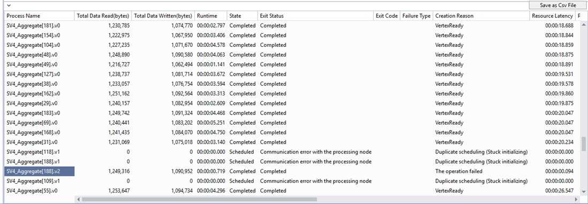

<properties 
   pageTitle="Usar o modo de exibição de execução de vértice em dados Lucerne ferramentas para Visual Studio | Microsoft Azure" 
   description="Saiba como usar o modo de exibição de execução de vértice para trabalhos de dados Lucerne Analytics exame." 
   services="data-lake-analytics" 
   documentationCenter="" 
   authors="mumian" 
   manager="jhubbard" 
   editor="cgronlun"/>
 
<tags
   ms.service="data-lake-analytics"
   ms.devlang="na"
   ms.topic="article"
   ms.tgt_pltfrm="na"
   ms.workload="big-data" 
   ms.date="10/13/2016"
   ms.author="jgao"/>

# Usar o modo de exibição de execução de vértice em dados Lucerne ferramentas para Visual Studio

Saiba como usar o modo de exibição de execução de vértice para trabalhos de dados Lucerne Analytics exame.

## Pré-requisitos

- Algum conhecimento básico do uso de ferramentas de Lucerne de dados para o Visual Studio para desenvolver script U-SQL.  Consulte [Tutorial: desenvolver scripts U-SQL usando ferramentas de Lucerne de dados para o Visual Studio](data-lake-analytics-data-lake-tools-get-started.md).

## Abrir o modo de exibição de execução de vértice

Para um determinado trabalho, você pode clicar no link "Visualização de execução de vértice" no canto inferior esquerdo. Você pode ser solicitado a carregar perfis primeiro e pode demorar algum tempo dependendo de sua conectividade de rede.

## Noções básicas sobre o modo de exibição de execução de vértice

Depois de inserir o modo de exibição de execução de vértice, há três partes:

- Seletor de vértice: À esquerda é o seletor de vértice.  Você pode selecionar os vértices pelos recursos (como os 10 principais dados ler ou escolha por estágio).

    Um dos filtros usados mais comuns é os vértices no caminho crítico. Caminho crítico é o caminho mais longo de um trabalho U-SQL. É útil para otimizar seus trabalhos Verificando qual vértice demora mais.

- O painel central superior:

    

    Este modo de exibição também mostra o status de todos os vértices execução. Ele converte a hora adequadamente para seu computador local e mostra o status diferente em cores diferentes.

- Painel central do inferior:

    

    - Nome do processo: O nome da instância do vértice. Ele é composto por diferentes partes em StageName | VertexName | VertexRunInstance. Por exemplo, o vértice de .v1 [62] SV7_Split representa a segunda instância de execução (.v1, índice começando de 0) de número de vértice 62 em SV7_Split de estágio.
    - Total dados leitura/gravação: Os dados foram lidos/gravados por este vértice.
    - Status de estado/sair: O status final quando o vértice é encerrado.
    - Tipo de falha do código de saída: O erro quando o vértice falha.
    - Motivo de criação: Por que o vértice foi criado.
    - Latência de fila de latência/NP de latência/processo de recurso: o tempo gasto do vértice aguardar para recursos, para processar dados e permanecer na fila.
    - GUID de processo/criador: GUID no vértice em execução atual ou seu criador.
    - Versão: a enésima instância do vértice em execução (o sistema pode agendar novas instâncias de um vértice por vários motivos, por exemplo, failover, calcular redundância, etc.)
    - Versão criada tempo.
    - Criar Iniciar processo de horário/enfileirados/processo de horário Iniciar/processo de horário concluída do processo tempo: quando o processo de vértice inicia criação; Quando o processo de vértice começa na fila; Quando o determinado processo de vértice começa; Quando o determinadas vértice é concluída.

## Próximas etapas

- Para obter uma visão geral de análise de Lucerne de dados, consulte [Visão geral de análise de Lucerne de dados do Azure](data-lake-analytics-overview.md).
- Para começar a desenvolver aplicativos U-SQL, consulte [scripts de desenvolver U-SQL usando ferramentas de Lucerne de dados para o Visual Studio](data-lake-analytics-data-lake-tools-get-started.md).
- Para saber U-SQL, consulte [Introdução ao idioma do Azure dados Lucerne Analytics U-SQL](data-lake-analytics-u-sql-get-started.md).
- Tarefas de gerenciamento, consulte [Gerenciar o Azure dados Lucerne análise usando o portal Azure](data-lake-analytics-manage-use-portal.md).
- Para registrar informações de diagnóstico, consulte [Acessando logs de diagnóstico para análise de Lucerne de dados do Azure](data-lake-analytics-diagnostic-logs.md)
- Para ver uma consulta mais complexa, consulte [logs de site de análise usando análise de Lucerne de dados do Azure](data-lake-analytics-analyze-weblogs.md).
- Para exibir detalhes do trabalho, consulte o [navegador de trabalho de uso e modo de exibição de trabalho para trabalhos de análise de Lucerne de dados do Azure](data-lake-analytics-data-lake-tools-view-jobs.md)