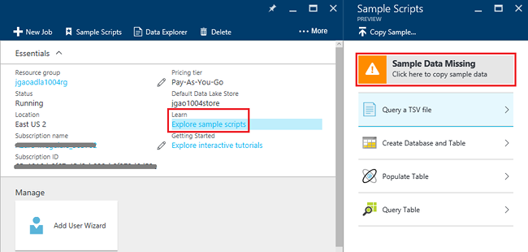

<properties 
   pageTitle="Introdução ao Azure dados Lucerne análise usando o portal Azure | Azure" 
   description="Saiba como usar o portal do Azure para criar uma conta de análise de Lucerne de dados, criar um trabalho de dados Lucerne análise usando U-SQL e enviar o trabalho. " 
   services="data-lake-analytics" 
   documentationCenter="" 
   authors="edmacauley" 
   manager="jhubbard" 
   editor="cgronlun"/>
 
<tags
   ms.service="data-lake-analytics"
   ms.devlang="na"
   ms.topic="hero-article"
   ms.tgt_pltfrm="na"
   ms.workload="big-data" 
   ms.date="10/06/2016"
   ms.author="edmaca"/>

# Tutorial: Introdução ao Azure dados Lucerne análise usando o portal do Azure

[AZURE.INCLUDE [get-started-selector](../../includes/data-lake-analytics-selector-get-started.md)]

Saiba como usar o portal do Azure para criar contas de análise de Lucerne de dados do Azure, definir trabalhos de dados Lucerne Analytics em [U-SQL](data-lake-analytics-u-sql-get-started.md)e enviar trabalhos no serviço de dados Lucerne Analytics. Para obter mais informações sobre a análise de dados Lucerne, consulte [Visão geral de análise de Lucerne de dados do Azure](data-lake-analytics-overview.md).

Neste tutorial, você desenvolver um trabalho que lê uma guia do arquivo de valores (TSV) separados e converte-o em um arquivo CSV (valores) de separados por vírgulas. Para percorrer o tutorial mesmo usando outras ferramentas compatíveis, clique nas guias na parte superior desta seção. Depois que o primeiro trabalho estiver concluído, você pode começar a escrever transformações de dados mais complexas com U-SQL.

##Pré-requisitos

Antes de começar este tutorial, você deve ter os seguintes itens:

- **Assinatura de um Azure**. Consulte [avaliação gratuita do Azure obter](https://azure.microsoft.com/pricing/free-trial/).

##Criar conta de dados Lucerne Analytics

Você deve ter uma conta de dados Lucerne Analytics antes de poder executar todos os trabalhos.

Cada conta dados Lucerne Analytics tem uma dependência de conta de [Armazenamento de Lucerne de dados do Azure]() .  Essa conta é conhecida como a conta de armazenamento de Lucerne de dados padrão.  Você pode criar a conta de armazenamento de Lucerne dados antecipadamente ou quando você cria sua conta de dados Lucerne Analytics. Neste tutorial, você irá criar a conta de armazenamento de Lucerne de dados com a conta de dados Lucerne Analytics.

**Para criar uma conta de dados Lucerne Analytics**

1. Entre [portal do Azure](https://portal.azure.com).
2. Clique em **novo**, clique **inteligência + análise**e clique em **Análise de Lucerne de dados**.
3. Digite ou selecione os valores a seguir:

    

    - **Nome**: nome para a conta de dados Lucerne Analytics.
    - **Assinatura**: escolha a assinatura Azure usada para a conta de análise.
    - **Grupo de recursos**. Selecione um grupo de recursos do Azure existente ou crie um novo. Gerenciador de recursos de Azure permite que você trabalhe com os recursos em seu aplicativo como um grupo. Para obter mais informações, consulte [Visão geral do Gerenciador de recursos do Azure](resource-group-overview.md). 
    - **Local**. Selecione um centro de dados do Azure para a conta de dados Lucerne Analytics. 
    - **Armazenamento de dados de Lucerne**: a análise Lucerne dados cada conta tem uma conta de armazenamento de Lucerne dados dependente. A conta de dados Lucerne Analytics e a conta de armazenamento de Lucerne dados dependente devem estar localizados no mesmo Azure data center. Siga as instruções para criar uma nova conta de armazenamento de Lucerne de dados, ou selecione um existente.

8. Clique em **criar**. Você será levado para a tela inicial do portal. Um novo bloco é adicionado ao StartBoard com o rótulo mostrando "Implantando Azure dados Lucerne Analytics". Demora alguns momentos para criar uma conta de dados Lucerne Analytics. Quando a conta for criada, o portal abre a conta em um novo blade.

Depois de uma conta de dados Lucerne Analytics for criada, você pode adicionar contas de armazenamento do Azure e contas adicionais de armazenamento de Lucerne de dados. Para obter instruções, consulte [Gerenciar a análise de dados Lucerne fontes de dados de conta](data-lake-analytics-manage-use-portal.md#manage-account-data-sources).

##Preparar dados de origem

Neste tutorial, você processar alguns logs de pesquisa.  O log de pesquisa pode ser armazenado no repositório de dData Lucerne ou armazenamento de Blob do Azure. 

O portal do Azure fornece uma interface de usuário para copiar alguns arquivos de dados de exemplo para a conta de armazenamento de Lucerne de dados padrão, que incluem um arquivo de log de pesquisa.

**Para copiar arquivos de dados de exemplo**

1. No [portal do Azure](https://portal.azure.com), abra sua conta de dados Lucerne Analytics.  Consulte [Gerenciar a análise de dados Lucerne contas](data-lake-analytics-get-started-portal.md#manage-accounts) para criar uma e abrir a conta no portal.
3. Expandir o painel **Essentials** e clique em **explorar scripts de exemplo**. Ele abre outra blade chamado **Scripts de exemplo**.

    

4. Clique em **Falta de dados de exemplo** para copiar os arquivos de dados de exemplo. Quando estiver pronto, o portal mostra **dados de exemplo atualizados com êxito**.
7. Da lâmina dados Lucerne analytics conta, clique em **Explorador de dados** na parte superior. 

    

    Ele abre duas lâminas. Uma é **Explorador de dados**e a outra é a conta de armazenamento de Lucerne de dados padrão.
8. Na lâmina padrão dados Lucerne repositório conta, clique em **amostras** para expandir a pasta e clique em **dados** para expandir a pasta. Você deverá ver os seguintes arquivos e pastas:

    - AmbulanceData /
    - AdsLog.tsv
    - SearchLog.tsv
    - Version.txt
    - WebLog.log
    
    Neste tutorial, você deve usar SearchLog.tsv.

Na prática, você ou programa seus aplicativos para gravar dados em uma conta de armazenamento vinculado ou carregar dados. Para carregar arquivos, consulte [carregar dados para armazenamento de dados de Lucerne](data-lake-analytics-manage-use-portal.md#upload-data-to-adls) ou [carregar dados para o armazenamento de Blob](data-lake-analytics-manage-use-portal.md#upload-data-to-wasb).

##Criar e enviar trabalhos de dados Lucerne Analytics

Após preparar os dados de origem, você pode começar a desenvolver um script U-SQL.  

**Para enviar um trabalho**

1. Da lâmina do conta de análise Lucerne de dados no portal, clique em **Nova tarefa**. 

    

    Se você não vir a lâmina, consulte [Abrir uma conta de dados Lucerne Analytics do portal](data-lake-analytics-manage-use-portal.md#access-adla-account).
2. Insira o **Nome de trabalho**e o script de U-SQL a seguir:

        @searchlog =
            EXTRACT UserId          int,
                    Start           DateTime,
                    Region          string,
                    Query           string,
                    Duration        int?,
                    Urls            string,
                    ClickedUrls     string
            FROM "/Samples/Data/SearchLog.tsv"
            USING Extractors.Tsv();
        
        OUTPUT @searchlog   
            TO "/Output/SearchLog-from-Data-Lake.csv"
        USING Outputters.Csv();

    

    Este script U-SQL lê o arquivo de dados de origem usando **Extractors.Tsv()**e, então, cria um arquivo csv usando **Outputters.Csv()**. 
    
    Não modifique os dois caminhos, a menos que você copia o arquivo de origem para um local diferente.  A análise de dados Lucerne cria a pasta de saída, se ele não existir.  Nesse caso, estamos usando caminhos simples relativos.  
    
    É mais simples usar caminhos relativos para os arquivos armazenados em contas de dados Lucerne padrão. Você também pode usar caminhos absolutos.  Por exemplo 
    
        adl://<Data LakeStorageAccountName>.azuredatalakestore.net:443/Samples/Data/SearchLog.tsv
      

    Para obter mais informações sobre U-SQL, consulte [referência de linguagem de U-SQL](http://go.microsoft.com/fwlink/?LinkId=691348)e [começar a usar o idioma de análise de Lucerne de dados U-SQL Azure](data-lake-analytics-u-sql-get-started.md) .
     
3. Clique em **Enviar trabalho** da parte superior.   
4. Aguarde até que o status do trabalho é alterado para **êxito**. Você pode ver que o trabalho levou cerca de um minuto para ser concluída.
    
    Caso o trabalho falhou, consulte [Monitor e solucionar problemas de trabalhos de dados Lucerne Analytics](data-lake-analytics-monitor-and-troubleshoot-jobs-tutorial.md).

5. Na parte inferior da lâmina, clique na guia de **saída** e clique em **SearchLog de dados Lake.csv**. Você pode visualizar, baixar, renomear e excluir o arquivo de saída.

    

##Consulte também

- Para ver uma consulta mais complexa, consulte [logs de site de análise usando análise de Lucerne de dados do Azure](data-lake-analytics-analyze-weblogs.md).
- Para começar a desenvolver aplicativos U-SQL, consulte [scripts de desenvolver U-SQL usando ferramentas de Lucerne de dados para o Visual Studio](data-lake-analytics-data-lake-tools-get-started.md).
- Para saber U-SQL, consulte [Introdução ao idioma do Azure dados Lucerne Analytics U-SQL](data-lake-analytics-u-sql-get-started.md).
- Tarefas de gerenciamento, consulte [Gerenciar o Azure dados Lucerne análise usando o portal Azure](data-lake-analytics-manage-use-portal.md).
- Para obter uma visão geral de análise de Lucerne de dados, consulte [Visão geral de análise de Lucerne de dados do Azure](data-lake-analytics-overview.md).
- Para ver o mesmo tutorial usando outras ferramentas, clique em seletores de guia no topo da página.
- Para registrar informações de diagnóstico, consulte [Acessando logs de diagnóstico para análise de Lucerne de dados do Azure](data-lake-analytics-diagnostic-logs.md)
