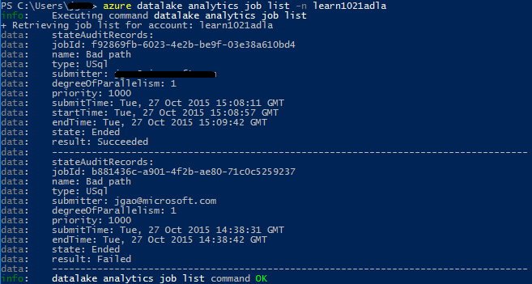

<properties 
   pageTitle="Gerenciar Azure dados Lucerne análise usando a Interface de linha de comando do Azure | Azure" 
   description="Saiba como gerenciar contas de dados Lucerne Analytics, fontes de dados, trabalhos e usuários usando CLI do Azure" 
   services="data-lake-analytics" 
   documentationCenter="" 
   authors="edmacauley" 
   manager="jhubbard" 
   editor="cgronlun"/>
 
<tags
   ms.service="data-lake-analytics"
   ms.devlang="na"
   ms.topic="article"
   ms.tgt_pltfrm="na"
   ms.workload="big-data" 
   ms.date="05/16/2016"
   ms.author="edmaca"/>

# Gerenciar Azure dados Lucerne análise usando a Interface de linha de comando (CLI) do Azure

[AZURE.INCLUDE [manage-selector](../../includes/data-lake-analytics-selector-manage.md)]

Saiba como gerenciar contas de análise de Lucerne de dados do Azure, fontes de dados, os usuários e trabalhos usando o Azure. Para ver o tópico de gerenciamento usando outras ferramentas, clique em Selecionar guia acima.

**Pré-requisitos**

Antes de começar este tutorial, você deve ter o seguinte:

- **Assinatura de um Azure**. Consulte [avaliação gratuita do Azure obter](https://azure.microsoft.com/pricing/free-trial/).
- **CLI azure**. Consulte [instalar e configurar o Azure CLI](../xplat-cli-install.md).
    - Baixe e instale o **pré-lançamento** [do Azure CLI ferramentas](https://github.com/MicrosoftBigData/AzureDataLake/releases) para concluir esta demonstração.
- **Autenticação**, usando o seguinte comando:

        azure login
    Para obter mais informações sobre a autenticação usando uma conta corporativa ou escolar, consulte [conectar a uma assinatura do Azure da CLI Azure](../xplat-cli-connect.md).
- **Alternar para o modo do Gerenciador de recursos do Azure**, usando o seguinte comando:

        azure config mode arm

**Para listar os comandos de armazenamento de Lucerne de dados e análise de Lucerne de dados:**

    azure datalake store
    azure datalake analytics

<!-- ################################ -->
<!-- ################################ -->
## Gerenciar contas

Antes de executar qualquer trabalhos de análise de Lucerne de dados, você deve ter uma conta de dados Lucerne Analytics. Ao contrário de Azurehdinsight, você não pagar por uma conta de análise quando ele não estiver executando um trabalho.  Você paga somente a hora quando um trabalho está funcionando.  Para obter mais informações, consulte [Visão geral de análise de Lucerne de dados do Azure](data-lake-analytics-overview.md).  

###Criar contas

    azure datalake analytics account create "<Data Lake Analytics Account Name>" "<Azure Location>" "<Resource Group Name>" "<Default Data Lake Account Name>"

###Atualizar contas

O comando a seguir atualiza as propriedades de uma conta de análise de Lucerne de dados existente
    
    azure datalake analytics account set "<Data Lake Analytics Account Name>"

###Lista de contas

Contas de análise Lucerne de dados de lista 

    azure datalake analytics account list

Contas de análise de lista dados Lucerne dentro de um grupo de recursos específicos

    azure datalake analytics account list -g "<Azure Resource Group Name>"

Obter detalhes de uma conta de dados Lucerne Analytics específica

    azure datalake analytics account show -g "<Azure Resource Group Name>" -n "<Data Lake Analytics Account Name>"

###Excluir dados Lucerne Analytics contas

    azure datalake analytics account delete "<Data Lake Analytics Account Name>"

<!-- ################################ -->
<!-- ################################ -->
## Gerenciar fontes de dados de conta

Dados Lucerne Analytics atualmente oferece suporte a fontes de dados a seguir:

- [Armazenamento de Lucerne de dados do Azure](../data-lake-store/data-lake-store-overview.md)
- [Armazenamento do Azure](../storage/storage-introduction.md)

Quando você cria uma conta de análise, você deve designar uma conta de armazenamento de Lucerne de dados do Azure para ser a conta de armazenamento padrão. A conta de armazenamento ADL padrão é usada para armazenar os logs de auditoria de trabalho e metadados de trabalho. Após ter criado uma conta de análise, você pode adicionar contas adicionais de armazenamento de Lucerne de dados e/ou conta de armazenamento do Azure. 

### Localize a conta de armazenamento ADL padrão

    azure datalake analytics account show "<Data Lake Analytics Account Name>"

O valor será listado propriedades: datalakeStoreAccount:name.

### Adicionar contas adicionais de armazenamento de Blob do Azure

    azure datalake analytics account datasource add -n "<Data Lake Analytics Account Name>" -b "<Azure Blob Storage Account Short Name>" -k "<Azure Storage Account Key>"

>[AZURE.NOTE] Somente Blob storage nomes curtos são suportados.  Não use o FQDN, por exemplo "myblob.blob.core.windows.net".

### Adicionar contas adicionais de armazenamento de Lucerne de dados

    azure datalake analytics account datasource add -n "<Data Lake Analytics Account Name>" -l "<Data Lake Store Account Name>" [-d]

[-d] é uma opção para indicar se o Lucerne dados sendo adicionado é a conta de dados Lucerne padrão. 

### Atualizar a fonte de dados existente

Para definir uma conta existente do repositório de Lucerne de dados padrão:

    azure datalake analytics account datasource set -n "<Data Lake Analytics Account Name>" -l "<Azure Data Lake Store Account Name>" -d
      
Para atualizar uma chave de conta de armazenamento de Blob existente:

    azure datalake analytics account datasource set -n "<Data Lake Analytics Account Name>" -b "<Blob Storage Account Name>" -k "<New Blob Storage Account Key>"

### Lista de fontes de dados:

    azure datalake analytics account show "<Data Lake Analytics Account Name>"
    

### Exclua fontes de dados:

Para excluir uma conta de armazenamento de Lucerne de dados:

    azure datalake analytics account datasource delete "<Data Lake Analytics Account Name>" "<Azure Data Lake Store Account Name>"

Para excluir uma conta de armazenamento de Blob:

    azure datalake analytics account datasource delete "<Data Lake Analytics Account Name>" "<Blob Storage Account Name>"

## Gerenciar trabalhos

Você deve ter uma conta de dados Lucerne Analytics antes de criar um trabalho.  Para obter mais informações, consulte [Gerenciar a análise de dados Lucerne contas](#manage-accounts).

### Lista de trabalhos

    azure datalake analytics job list -n "<Data Lake Analytics Account Name>"

### Obter detalhes de trabalho

    azure datalake analytics job show -n "<Data Lake Analytics Account Name>" -j "<Job ID>"
    
### Enviar trabalhos

> [AZURE.NOTE] A prioridade padrão de um trabalho é 1000 e o grau de padrão de paralelismo para um trabalho é 1.

    azure datalake analytics job create  "<Data Lake Analytics Account Name>" "<Job Name>" "<Script>"

### Cancelar trabalhos

Use o comando de lista para localizar a id de trabalho e em seguida, utilize Cancelar para cancelar o trabalho.

    azure datalake analytics job list -n "<Data Lake Analytics Account Name>"
    azure datalake analytics job cancel "<Data Lake Analytics Account Name>" "<Job ID>"

## Gerenciar catálogo

O catálogo de U-SQL é usado para estruturar dados e código, para que eles podem ser compartilhados por scripts U-SQL. O catálogo permite o melhor desempenho possível com dados em Lucerne de dados do Azure. Para obter mais informações, consulte [Catálogo de uso U-SQL](data-lake-analytics-use-u-sql-catalog.md).
 
###Itens de catálogo de lista

    #List databases
    azure datalake analytics catalog list -n "<Data Lake Analytics Account Name>" -t database

    #List tables
    azure datalake analytics catalog list -n "<Data Lake Analytics Account Name>" -t table
    
Os tipos incluem o banco de dados, esquema, assembly, fonte de dados externa, tabela, função com valor de tabela ou estatísticas da tabela.

###Criar segredo de catálogo

    azure datalake analytics catalog secret create -n "<Data Lake Analytics Account Name>" <databaseName> <hostUri> <secretName>

### Modificar segredo de catálogo

    azure datalake analytics catalog secret set -n "<Data Lake Analytics Account Name>" <databaseName> <hostUri> <secretName>

###Excluir segredo de catálogo

    azure datalake analytics catalog secrete delete -n "<Data Lake Analytics Account Name>" <databaseName> <hostUri> <secretName>

<!-- ################################ -->
<!-- ################################ -->
## Usar grupos ARM

Aplicativos geralmente são compostos de muitos componentes, por exemplo um aplicativo web, banco de dados, servidor de banco de dados, armazenamento e 3º serviços de terceiros. Azure Resource Manager (ARM) permite que você trabalhe com os recursos em seu aplicativo como um grupo, chamado de um grupo de recursos do Azure. Você pode implantar, atualizar, monitorar ou excluir todos os recursos do aplicativo em uma operação única e coordenado. Usar um modelo para implantação e esse modelo pode servir para diferentes ambientes como teste, teste e produção. Você pode esclarecer cobrança para sua organização exibindo os custos acumulados para o grupo inteiro. Para obter mais informações, consulte [Visão geral do Gerenciador de recursos do Azure](../azure-resource-manager/resource-group-overview.md). 

Um serviço de dados Lucerne Analytics pode incluir os seguintes componentes:

- Conta de análise Lucerne de dados do Azure
- Conta de armazenamento do Azure dados Lucerne padrão necessários
- Contas de armazenamento Lucerne de dados do Azure adicionais
- Contas adicionais de armazenamento do Azure

Você pode criar todos esses componentes em um grupo ARM para torná-las mais fácil de gerenciar.

Uma conta de dados Lucerne análise e as contas de armazenamento dependentes devem ser colocadas no mesmo Azure data center.
O grupo de BRAÇO Entretanto pode estar localizado em uma central de dados diferentes.  

##Consulte também 

- [Visão geral de análise de Lucerne de dados do Microsoft Azure](data-lake-analytics-overview.md)
- [Começar a usar a análise de Lucerne dados usando o Portal do Azure](data-lake-analytics-get-started-portal.md)
- [Gerenciar Azure dados Lucerne análise usando o Portal do Azure](data-lake-analytics-manage-use-portal.md)
- [Monitorar e solucionar problemas de trabalhos de análise de Lucerne de dados do Azure usando o Portal do Azure](data-lake-analytics-monitor-and-troubleshoot-jobs-tutorial.md)

