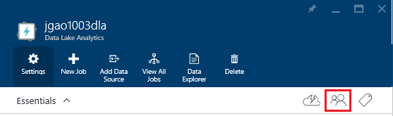
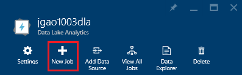
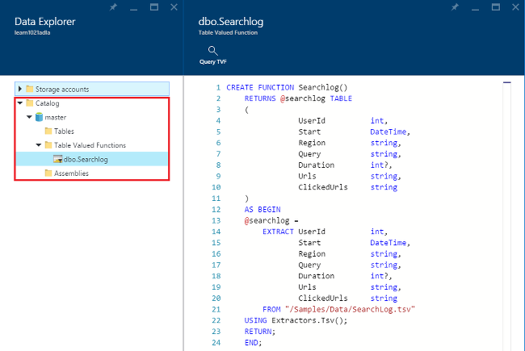

<properties 
   pageTitle="Gerenciar Azure dados Lucerne análise usando o portal de Azure | Azure" 
   description="Saiba como gerenciar dados Lucerne Analytics contas, fontes de dados, os usuários e trabalhos." 
   services="data-lake-analytics" 
   documentationCenter="" 
   authors="edmacauley" 
   manager="jhubbard" 
   editor="cgronlun"/>
 
<tags
   ms.service="data-lake-analytics"
   ms.devlang="na"
   ms.topic="article"
   ms.tgt_pltfrm="na"
   ms.workload="big-data" 
   ms.date="10/06/2016"
   ms.author="edmaca"/>

# Gerenciar Azure dados Lucerne análise usando o portal do Azure

[AZURE.INCLUDE [manage-selector](../../includes/data-lake-analytics-selector-manage.md)]

Saiba como gerenciar contas de análise de Lucerne de dados do Azure, fontes de dados de conta, os usuários e trabalhos usando o portal do Azure. Para ver os tópicos de gerenciamento usando outras ferramentas, clique no seletor de tabulação no topo da página.

**Pré-requisitos**

Antes de começar este tutorial, você deve ter os seguintes itens:

- **Assinatura de um Azure**. Consulte [avaliação gratuita do Azure obter](https://azure.microsoft.com/pricing/free-trial/).

<!-- ################################ -->
<!-- ################################ -->
## Gerenciar contas

Antes de executar qualquer trabalhos de análise de Lucerne de dados, você deve ter uma conta de dados Lucerne Analytics. Ao contrário de Azurehdinsight, você paga apenas para uma conta de dados Lucerne Analytics quando você executa um trabalho.  Você paga somente a hora quando um trabalho está funcionando.  Para obter mais informações, consulte [Visão geral de análise de Lucerne de dados do Azure](data-lake-analytics-overview.md).  

**Para criar uma conta de dados Lucerne Analytics**

1. Entre [portal do Azure](https://portal.azure.com).
2. Clique em **novo**, clique **inteligência + análise**e clique em **Análise de Lucerne de dados**.
3. Digite ou selecione os valores a seguir:

    

    - **Nome**: nome para a conta de dados Lucerne Analytics.
    - **Assinatura**: escolha a assinatura Azure usada para a conta de análise.
    - **Grupo de recursos**. Selecione um grupo de recursos do Azure existente ou crie um novo. Gerenciador de recursos de Azure permite que você trabalhe com os recursos em seu aplicativo como um grupo. Para obter mais informações, consulte [Visão geral do Gerenciador de recursos do Azure](resource-group-overview.md). 
    - **Local**. Selecione um centro de dados do Azure para a conta de dados Lucerne Analytics. 
    - **Armazenamento de dados de Lucerne**: a análise Lucerne dados cada conta tem uma conta de armazenamento de Lucerne dados dependente. A conta de dados Lucerne Analytics e a conta de armazenamento de Lucerne dados dependente devem estar localizados no mesmo Azure data center. Siga as instruções para criar uma nova conta de armazenamento de Lucerne de dados, ou selecione um existente.

8. Clique em **criar**. Você será levado para a tela inicial do portal. Um novo bloco é adicionado ao StartBoard com o rótulo mostrando "Implantando Azure dados Lucerne Analytics". Demora alguns momentos para criar uma conta de dados Lucerne Analytics. Quando a conta for criada, o portal abre a conta em um novo blade.

Depois de uma conta de dados Lucerne Analytics for criada, você pode adicionar contas de armazenamento do Azure e contas adicionais de armazenamento de Lucerne de dados. Para obter instruções, consulte [Gerenciar a análise de dados Lucerne fontes de dados de conta](data-lake-analytics-manage-use-portal.md#manage-account-data-sources).

**Para acesso/abrir uma conta de dados Lucerne Analytics**

1. Entre [portal do Azure](https://portal.azure.com/).
2. Clique em **Análise de Lucerne de dados** no menu à esquerda.  Se você não estiver visível, clique **mais serviços**e clique em **Análise de Lucerne dados** em **inteligência + Analytics**.
3. Clique na conta de análise de Lucerne de dados que você deseja acessar. Ele abre a conta em uma nova lâmina.

**Para excluir uma conta de dados Lucerne Analytics**

1. Abra a conta de análise de Lucerne de dados que você deseja excluir. Para obter instruções, consulte [contas de análise de Lucerne de dados do Access](#access-adla-account).
2. Clique em **Excluir** no menu do botão na parte superior a lâmina.
3. Digite o nome da conta e clique em **Excluir**.

Excluindo uma conta de dados Lucerne Analytics não exclui as contas de armazenamento de Lucerne dados dependentes. Para obter instruções de exclusão de contas de armazenamento de Lucerne de dados, consulte [Excluir dados Lucerne repositório conta](data-lake-store-get-started-portal.md#delete-azure-data-lake-store-account).

<!-- ################################ -->
<!-- ################################ -->
## Gerenciar fontes de dados de conta

Dados Lucerne Analytics atualmente oferece suporte a fontes de dados a seguir:

- [Armazenamento de Lucerne de dados do Azure](../data-lake-store/data-lake-store-overview.md)
- [Armazenamento do Azure](../storage/storage-introduction.md)

Quando você cria uma conta de análise de Lucerne de dados, você deve designar uma conta de armazenamento de Lucerne de dados do Azure para ser a conta de armazenamento padrão. A conta de armazenamento de dados de Lucerne padrão é usada para armazenar os logs de auditoria de trabalho e metadados de trabalho. Após ter criado uma conta de análise de Lucerne de dados, você pode adicionar contas adicionais de armazenamento de Lucerne de dados e/ou conta de armazenamento do Azure. 

**Para localizar a conta de armazenamento de dados Lucerne padrão**

- Abra a conta de análise de Lucerne de dados que você deseja gerenciar. Para obter instruções, consulte [contas de análise de Lucerne de dados do Access](#access-adla-account). O armazenamento de dados Lucerne padrão é mostrado no **essenciais**:

    

**Para adicionar fontes de dados adicionais**

1. Abra a conta de análise de Lucerne de dados que você deseja gerenciar. Para obter instruções, consulte [contas de análise de Lucerne de dados do Access](#access-adla-account).
2. Clique em **configurações** e clique em **Fontes de dados**. Você deverá ver a conta de armazenamento de Lucerne de dados padrão na lista. 
3. Clique em **adicionar fonte de dados**.

    

    Para adicionar uma conta de armazenamento de Lucerne de dados do Azure, é necessário que a conta de nome e acesso à conta para poder consultá-lo.
    Para adicionar um armazenamento de Blob do Azure, é necessário a conta de armazenamento e a chave de conta, que pode ser encontrada navegando para a conta de armazenamento no portal.

**Para explorar a fontes de dados**  

1. Abra a conta de análise que você deseja gerenciar. Para obter instruções, consulte [contas de análise de Lucerne de dados do Access](#access-adla-account).
2. Clique em **configurações** e clique em **Explorador de dados**. 
 
    
    
3. Clique em uma conta de armazenamento de Lucerne de dados para abrir a conta.

    
    
    Para cada conta de armazenamento de Lucerne de dados, você pode
    
    - **Nova pasta**: Adicionar nova pasta.
    - **Carregar**: Carregue arquivos para a conta de armazenamento de sua estação de trabalho.
    - **Acesso**: configurar o acesso permissões.
    - **Renomear pasta**: renomear uma pasta.
    - **Propriedades da pasta**: Mostrar propriedades de arquivo ou pasta, como WASB caminho, WEBHDFS, hora da última modificação e assim por diante.
    - **Excluir pasta**: excluir uma pasta.

**Carregar arquivos a conta de armazenamento de Lucerne de dados**

1. No Portal, clique em **Procurar** , no menu à esquerda e, em seguida, clique em **Dados Lucerne repositório**.
2. Clique na conta de armazenamento de Lucerne de dados que você deseja carregar dados. Para localizar a conta de armazenamento de Lucerne de dados padrão, consulte [aqui](#default-adl-account).
3. Clique em **Gerenciador de dados** no menu superior.
4. Clique em **Nova pasta** para criar uma nova pasta, ou clique em um nome de pasta para alterar pasta.
6. No menu superior para carregar o arquivo, clique em **carregar** .

**Para carregar arquivos para a conta de armazenamento de Blob do Azure**

Consulte [carregar dados para trabalhos de Hadoop em HDInsight](../hdinsight/hdinsight-upload-data.md).  As informações se aplica ao Lucerne a análise de dados.

## Gerenciar usuários

Dados Lucerne Analytics usa o controle de acesso baseado em função com o Active Directory do Azure. Quando você cria uma conta de dados Lucerne análise, uma função de "Assinatura administradores" é adicionada à conta. Você pode adicionar mais usuários e grupos de segurança com as seguintes funções:

|Função|Descrição|
|----|-----------|
|Proprietário|Permitem que você gerencie tudo, inclusive acesso aos recursos.|
|Colaborador|Acessar o portal; Enviar e monitorar trabalhos. Para poder enviar trabalhos, um colaborador necessidades a permissão de leitura ou de gravação para as contas de armazenamento de Lucerne de dados.|
|DataLakeAnalyticsDeveloper | Enviar, monitorar e cancelar trabalhos.  Esses usuários podem cancelar somente seus próprios trabalhos. Eles não podem gerenciar sua própria conta, por exemplo, adicionar usuários, alterar permissões ou excluir a conta. Para poder executar trabalhos, que precisam de acesso de leitura ou gravação para as contas de armazenamento de Lucerne de dados     | 
|Leitor|Permite que você exibir tudo, mas não fazer alterações.|  
|DevTest Labs usuário|Permite exibir tudo e se conectar, iniciar, reinicialização e desligamento máquinas virtuais.|  
|Administrador de acesso do usuário|Permite que você gerencie o acesso do usuário aos recursos Azure.|  

Para obter informações sobre como criar usuários do Active Directory do Azure e grupos de segurança, consulte [o que é o Active Directory do Azure](../active-directory/active-directory-whatis.md).

**Para adicionar usuários ou grupos de segurança para uma conta de dados Lucerne Analytics**

1. Abra a conta de análise que você deseja gerenciar. Para obter instruções, consulte [contas de análise de Lucerne de dados do Access](#access-adla-account).
2. Clique em **configurações**e, em seguida, clique em **usuários**. Você também pode clicar em **acesso** na barra de título do **Essentials** , conforme mostrado na seguinte captura de tela:

    
3. Da lâmina do **usuário** , clique em **Adicionar**.
4. Selecione uma função e adicionar um usuário e clique em **Okey**.

**Observação: Se esse usuário ou grupo de segurança precisa enviar trabalhos, precisam ser concedeu permissão no repositório Lucerne dados também. Para obter mais informações, consulte [proteger os dados armazenados no repositório de Lucerne de dados](../data-lake-store/data-lake-store-secure-data.md).**

<!-- ################################ -->
<!-- ################################ -->
## Gerenciar trabalhos

Você deve ter uma conta de dados Lucerne Analytics antes de executar qualquer trabalhos U-SQL.  Para obter mais informações, consulte [Gerenciar a análise de dados Lucerne contas](#manage-data-lake-analytics-accounts).

**Para criar um trabalho**

1. Abra a conta de análise que você deseja gerenciar. Para obter instruções, consulte [contas de análise de Lucerne de dados do Access](#access-adla-account).
2. Clique em **nova tarefa**.

    

    Você deverá ver uma nova lâmina semelhante a:

    

    Para cada tarefa, você pode configurar

  	|Nome|Descrição|
  	|----|-----------|
  	|Nome do trabalho|Insira o nome do trabalho.|
  	|Prioridade|Número menor tem a prioridade mais alta. Se dois trabalhos são ambos enfileirados, aquele com menor prioridade é executado pela primeira vez|
  	|Paralelismo |Número máximo de processos de computação que podem ocorrer ao mesmo tempo. Aumentar esse número pode melhorar o desempenho, mas também pode aumentar o custo.|
  	|Script|Insira o script U-SQL para o trabalho.|

    Usando a mesma interface, você pode também explorar as fontes de dados do link e adicionar outros arquivos a fontes de dados vinculados. 
3. Clique em **Enviar trabalho** se quiser enviar o trabalho.

**Para enviar um trabalho**

Consulte [criar a análise de dados Lucerne trabalhos](#create-job).

**Monitorar trabalhos**

1. Abra a conta de análise que você deseja gerenciar. Para obter instruções, consulte [contas de análise de Lucerne de dados do Access](#access-adla-account). O painel de gerenciamento de trabalho mostra as informações básicas de trabalho:

    

3. Clique em **Gerenciamento de trabalho** , conforme mostrado na captura de tela anterior.

    

4. Clique em um trabalho nas listas. Ou clique em **filtro** para ajudá-lo a encontrar os trabalhos:

    

    Você pode filtrar tarefas por **Intervalo de tempo**, **Nome do trabalho**e **autor**.
5. Clique em **Reenviar** se você deseja reenviar o trabalho.

**Reenviar um trabalho**

Consulte [Monitor dados Lucerne Analytics trabalhos](#monitor-jobs).

##Monitore o uso de conta

**Para monitorar o uso da conta**

1. Abra a conta de análise que você deseja gerenciar. Para obter instruções, consulte [contas de análise de Lucerne de dados do Access](#access-adla-account). O painel de uso mostra a utilização:

    

2. Clique duas vezes o painel para ver mais detalhes.

##Exibir o catálogo de U-SQL

O [Catálogo de U-SQL](data-lake-analytics-use-u-sql-catalog.md) é usado para estruturar dados e código, para que eles podem ser compartilhados por scripts U-SQL. O catálogo permite o melhor desempenho possível com dados em Lucerne de dados do Azure. Azure no portal do, você é capazes de exibir o catálogo de U-SQL.

**Para procurar catálogo U-SQL**

1. Abra a conta de análise que você deseja gerenciar. Para obter instruções, consulte [contas de análise de Lucerne de dados do Access](#access-adla-account).
2. Clique em **Gerenciador de dados** no menu superior.
3. Expanda **catálogo**, **mestre**, **tabelas, ou **funções com valor de tabela**, ou **conjuntos * *. A captura de tela a seguir mostra uma função com valor de tabela.

    

<!-- ################################ -->
<!-- ################################ -->
## Usar grupos de Gerenciador de recursos do Azure

Aplicativos geralmente são compostos de muitos componentes, por exemplo um aplicativo web, banco de dados, servidor de banco de dados, armazenamento e serviços de terceiros. Gerenciador de recursos de Azure permite que você trabalhe com os recursos em seu aplicativo como um grupo, chamado de um grupo de recursos do Azure. Você pode implantar, atualizar, monitorar ou excluir todos os recursos para seu aplicativo em uma operação única e coordenado. Usar um modelo para implantação e esse modelo pode servir para diferentes ambientes como teste, teste e produção. Você pode esclarecer cobrança para sua organização exibindo os custos acumulados para o grupo inteiro. Para obter mais informações, consulte [Visão geral do Gerenciador de recursos do Azure](../azure-resource-manager/resource-group-overview.md). 

Um serviço de dados Lucerne Analytics pode incluir os seguintes componentes:

- Conta de análise Lucerne de dados do Azure
- Padrão necessários conta de armazenamento de Lucerne de dados do Azure
- Contas adicionais Azure dados Lucerne Store
- Contas adicionais de armazenamento do Azure

Você pode criar todos esses componentes em um grupo de gerenciamento de recursos para torná-las mais fácil de gerenciar.

Uma conta de dados Lucerne análise e as contas de armazenamento dependentes devem ser colocadas no mesmo Azure data center.
O grupo de gerenciamento de recursos no entanto pode estar localizado em uma central de dados diferentes.  

##Consulte também 

- [Visão geral de análise de Lucerne de dados do Microsoft Azure](data-lake-analytics-overview.md)
- [Começar a usar a análise de Lucerne dados usando o portal do Azure](data-lake-analytics-get-started-portal.md)
- [Gerenciar Azure dados Lucerne análise usando o PowerShell do Azure](data-lake-analytics-manage-use-powershell.md)
- [Monitorar e solucionar problemas de trabalhos de análise de Lucerne de dados do Azure usando o portal do Azure](data-lake-analytics-monitor-and-troubleshoot-jobs-tutorial.md)

