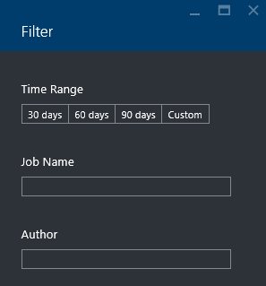

<properties 
   pageTitle="Solucionar problemas de trabalhos de análise de Lucerne de dados do Azure usando o Portal do Azure | Azure" 
   description="Saiba como usar o Portal do Azure para solucionar trabalhos de análise de Lucerne de dados. " 
   services="data-lake-analytics" 
   documentationCenter="" 
   authors="edmacauley" 
   manager="jhubbard" 
   editor="cgronlun"/>
 
<tags
   ms.service="data-lake-analytics"
   ms.devlang="na"
   ms.topic="article"
   ms.tgt_pltfrm="na"
   ms.workload="big-data" 
   ms.date="05/16/2016"
   ms.author="edmaca"/>

# Solucionar problemas de trabalhos de análise de Lucerne de dados do Azure usando o Portal do Azure

Saiba como usar o Portal do Azure para solucionar trabalhos de análise de Lucerne de dados.

Neste tutorial, você irá configurar um problema de arquivo de fonte ausente e usar o Portal do Azure para solucionar o problema.

**Pré-requisitos**

Antes de começar este tutorial, você deve ter o seguinte:

- **Processo de trabalho de Conhecimento básico de dados Lucerne Analytics**. Consulte [Introdução ao Azure dados Lucerne análise usando o Portal do Azure](data-lake-analytics-get-started-portal.md).
- **Análise de Lucerne de dados de uma conta**. Consulte [Introdução ao Azure dados Lucerne análise usando o Portal do Azure](data-lake-analytics-get-started-portal.md#create-adl-analytics-account).
- **Copie os dados de exemplo para a conta de armazenamento de dados de Lucerne padrão**.  Consulte [preparar dados de origem](data-lake-analytics-get-started-portal.md#prepare-source-data)

##Enviar um trabalho de dados Lucerne Analytics

Agora você criará um trabalho U-SQL com um nome de arquivo de origem inválido.  

**Para enviar o trabalho**

1. Azure no Portal do, clique em **Microsoft Azure** no canto superior esquerdo.
2. Clique no bloco com seu nome de conta de dados Lucerne Analytics.  Ele foi fixado aqui quando a conta foi criada.
Se a conta não está fixada lá, consulte [Abrir uma conta de análise do portal](data-lake-analytics-manage-use-portal.md#access-adla-account).
3. Clique em **Nova tarefa** no menu superior.
4. Insira um nome de trabalho e o script de U-SQL a seguir:

        @searchlog =
            EXTRACT UserId          int,
                    Start           DateTime,
                    Region          string,
                    Query           string,
                    Duration        int?,
                    Urls            string,
                    ClickedUrls     string
            FROM "/Samples/Data/SearchLog.tsv1"
            USING Extractors.Tsv();
        
        OUTPUT @searchlog   
            TO "/output/SearchLog-from-adls.csv"
        USING Outputters.Csv();

    O arquivo de origem definido no script é **/Samples/Data/SearchLog.tsv1**, onde ele deverá ser **/Samples/Data/SearchLog.tsv**.
     
5. Clique em **Enviar trabalho** da parte superior. Um novo painel de detalhes de trabalho é aberta. Na barra de título, ele mostra o status do trabalho. Leva alguns minutos para concluir. Você pode clicar em **Atualizar** para obter o status mais recente.
6. Aguarde até que o status de trabalho é alterado para **Failed**.  Se o trabalho **com êxito**, é porque você não remover a pasta de /Samples. Consulte a seção de **pré-requisito** no começo do tutorial.

Você deve estar se perguntando - por que demora tanto para um trabalho pequeno.  Lembre-se de que a análise de dados Lucerne é projetada para processar dados grandes.  Ele se destaca ao processar uma grande quantidade de dados usando o seu sistema distribuído.

Vamos supor que você enviou o trabalho e feche o portal.  Na próxima seção, você aprenderá como solucionar problemas com o trabalho.

## Solucionar problemas do trabalho

Na seção anterior, você enviou um trabalho e o trabalho falhou.  

**Para ver todos os trabalhos**

1. Azure no portal do, clique em **Microsoft Azure** no canto superior esquerdo.
2. Clique no bloco com seu nome de conta de dados Lucerne Analytics.  O trabalho Resumo é mostrado no bloco **Gerenciamento de trabalho** .

    
    
    O gerenciamento de trabalho oferece rapidamente o status de trabalho. Observe que há um trabalho falhou.
   
3. Clique no bloco de **Gerenciamento de trabalho** para ver os trabalhos. Os trabalhos são categorizados em **execução**, **enfileirados**e **concluído**. Você deverá ver seu trabalho falha na seção **concluído** . Ela deverá ser uma primeira na lista. Quando você tem muitas trabalhos, você pode clicar em **filtro** para ajudar você a localizar trabalhos.

    

4. Clique no trabalho falha na lista para abrir os detalhes de trabalho em uma nova lâmina:

    
    
    Observe o botão **Reenviar** . Após corrigir o problema, você pode reenviar o trabalho.

5. Clique em part realçado na captura de tela anterior para abrir os detalhes do erro.  Você deverá ver algo como:

    

    Ele informa que a pasta de origem não foi encontrada.
    
6. Clique em **Duplicar Script**.
7. Atualize o caminho **FROM** ao seguinte:

    "/ Samples/Data/SearchLog.tsv"

8. Clique em **Enviar trabalho**.

##Consulte também

- [Visão geral de análise de Lucerne de dados do Azure](data-lake-analytics-overview.md)
- [Introdução ao Azure dados Lucerne análise usando o PowerShell do Azure](data-lake-analytics-get-started-powershell.md)
- [Introdução ao Azure dados Lucerne Analytics e U-SQL usando o Visual Studio](data-lake-analytics-u-sql-get-started.md)
- [Gerenciar Azure dados Lucerne análise usando o Portal do Azure](data-lake-analytics-manage-use-portal.md)

