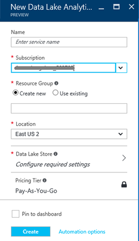

<properties 
   pageTitle="Aprenda a análise de dados Lucerne e U-SQL usando os tutoriais interativos de Portal do Azure | Azure" 
   description="Início rápido com aprendendo a análise de dados Lucerne e U-SQL. " 
   services="data-lake-analytics" 
   documentationCenter="" 
   authors="edmacauley" 
   manager="jhubbard" 
   editor="cgronlun"/>
 
<tags
   ms.service="data-lake-analytics"
   ms.devlang="na"
   ms.topic="get-started-article"
   ms.tgt_pltfrm="na"
   ms.workload="big-data" 
   ms.date="05/16/2016"
   ms.author="edmaca"/>

# Use tutoriais interativos Azure dados Lucerne Analytics

O Portal do Azure fornece um tutorial interativo para você começar a usar a análise de dados Lucerne. Este artigo mostra como percorrer o tutorial para analisar os logs de site.

>[AZURE.NOTE]Se desejar percorrer o tutorial mesmo usando o Visual Studio, consulte [logs de site de análise usando a análise de dados Lucerne](data-lake-analytics-analyze-weblogs.md).
>Tutoriais mais interativos a ser adicionado ao portal.

Para outros tutoriais, consulte:

- [Começar a usar a análise de Lucerne dados usando o Portal do Azure](data-lake-analytics-get-started-portal.md)
- [Começar a usar a análise de Lucerne dados usando o PowerShell do Azure](data-lake-analytics-get-started-powershell.md)
- [Começar a usar a análise de Lucerne dados usando o SDK do .NET](data-lake-analytics-get-started-net-sdk.md)
- [Desenvolver scripts U-SQL usando ferramentas de Lucerne de dados para o Visual Studio](data-lake-analytics-data-lake-tools-get-started.md) 

**Pré-requisitos**

Antes de começar este tutorial, você deve ter o seguinte:

- **Análise de Lucerne de dados de uma conta**.  Consulte [Introdução ao Azure dados Lucerne análise usando o Portal do Azure](data-lake-analytics-get-started-portal.md).

##Criar conta de dados Lucerne Analytics 

Você deve ter uma conta de dados Lucerne Analytics antes de poder executar todos os trabalhos.

Cada conta dados Lucerne Analytics tem uma dependência de conta de [Armazenamento de Lucerne de dados do Azure](../data-lake-store/data-lake-store-overview.md) .  Essa conta é conhecida como a conta de armazenamento de Lucerne de dados padrão.  Você pode criar a conta de armazenamento de Lucerne dados antecipadamente ou quando você cria sua conta de dados Lucerne Analytics. Neste tutorial, você irá criar a conta de armazenamento de Lucerne de dados com a conta de análise

**Para criar uma conta de dados Lucerne Analytics**

1. Entre [Portal do Azure](https://portal.azure.com/signin/index/?Microsoft_Azure_Kona=true&Microsoft_Azure_DataLake=true&hubsExtension_ItemHideKey=AzureDataLake_BigStorage%2cAzureKona_BigCompute).
2. Clique em **Microsoft Azure** no canto superior esquerdo para abrir o StartBoard.
3. Clique no bloco do **Marketplace** .  
3. Digite **Azure dados Lucerne Analytics** na caixa de pesquisa em lâmina **tudo** e pressione **ENTER**. Você deverá ver **A análise do Azure dados Lucerne** na lista.
4. Clique em **Análise de Lucerne de dados do Azure** na lista.
5. Clique em **criar** na parte inferior da lâmina.
6. Digite ou selecione o seguinte:

    

    - **Nome**: nome para a conta de análise.
    - **Armazenamento de dados de Lucerne**: a análise Lucerne dados cada conta tem uma conta de armazenamento de Lucerne dados dependente. A conta de dados Lucerne Analytics e a conta de armazenamento de Lucerne dados dependente devem estar localizados no mesmo Azure data center. Siga as instruções para criar uma nova conta de armazenamento de Lucerne de dados, ou selecione um existente.
    - **Assinatura**: escolha a assinatura Azure usada para a conta de análise.
    - **Grupo de recursos**. Selecione um grupo de recursos do Azure existente ou crie um novo. Aplicativos geralmente são compostos de muitos componentes, por exemplo um aplicativo web, banco de dados, servidor de banco de dados, armazenamento e 3º serviços de terceiros. Azure Resource Manager (ARM) permite que você trabalhe com os recursos em seu aplicativo como um grupo, chamado de um grupo de recursos do Azure. Você pode implantar, atualizar, monitorar ou excluir todos os recursos do aplicativo em uma operação única e coordenado. Usar um modelo para implantação e esse modelo pode servir para diferentes ambientes como teste, teste e produção. Você pode esclarecer cobrança para sua organização exibindo os custos acumulados para o grupo inteiro. Para obter mais informações, consulte [Visão geral do Gerenciador de recursos do Azure](azure-resource-manager/resource-group-overview.md). 
    - **Local**. Selecione um centro de dados do Azure para a conta de dados Lucerne Analytics. 
7. Selecione **Fixar em Startboard**. Isso é necessário para seguindo este tutorial.
8. Clique em **criar**. Você será levado para o portal StartBoard. Um novo bloco é adicionado à Home page com o rótulo mostrando "Implantando Azure dados Lucerne Analytics". Demora alguns momentos para criar uma conta de dados Lucerne Analytics. Quando a conta for criada, o portal abre a conta em um novo blade.

    

##Executar o tutorial interativo de análise de Log de site

**Para abrir o tutorial interativo de análise de Log de site**

1. No Portal, clique em **Microsoft Azure** no menu à esquerda para abrir o StartBoard.
2. Clique no bloco que esteja vinculado à sua conta de dados Lucerne Analytics.
3. Clique em **explorar interativos tutoriais** da barra de ferramentas **Essentials** .

    

4. Se você vir um dizendo aviso laranja "amostras não estiverem configuradas, clique em...", clique em **Copiar dados de amostra** para copiar os dados de exemplo para a conta de armazenamento de Lucerne de dados padrão. O tutorial interativo precisa de dados para executar.
5. Da lâmina **Tutoriais interativos** , clique em **Análise de Log do site**. O portal abre o tutorial em uma nova lâmina portal.
5. Clique em **1 Introdução** e siga as instruções

##Consulte também

- [Visão geral de análise de Lucerne de dados do Microsoft Azure](data-lake-analytics-overview.md)
- [Começar a usar a análise de Lucerne dados usando o Portal do Azure](data-lake-analytics-get-started-portal.md)
- [Começar a usar a análise de Lucerne dados usando o PowerShell do Azure](data-lake-analytics-get-started-powershell.md)
- [Desenvolver scripts U-SQL usando ferramentas de Lucerne de dados para o Visual Studio](data-lake-analytics-data-lake-tools-get-started.md)
- [Analisar os logs de site usando a análise de Lucerne de dados do Azure](data-lake-analytics-analyze-weblogs.md)
