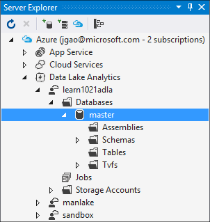

<properties
   pageTitle="Apresentar o catálogo de análise de Lucerne de dados U-SQL Azure | Azure"
   description="Apresentar o catálogo de dados Lucerne Analytics U-SQL do Azure"
   services="data-lake-analytics"
   documentationCenter=""
   authors="edmacauley"
   manager="jhubbard"
   editor="cgronlun"/>

<tags
   ms.service="data-lake-analytics"
   ms.devlang="na"
   ms.topic="article"
   ms.tgt_pltfrm="na"
   ms.workload="big-data"
   ms.date="05/16/2016"
   ms.author="edmaca"/>

# Usar o catálogo de U-SQL

O catálogo de U-SQL é usado para estruturar dados e código, para que eles podem ser compartilhados por scripts U-SQL. O catálogo permite o melhor desempenho possível com dados em Lucerne de dados do Azure.

Cada conta do Azure dados Lucerne Analytics tem exatamente um catálogo de U-SQL associada a ele. Você não pode excluir o catálogo de U-SQL. Atualmente, catálogos de U-SQL não podem ser compartilhados entre contas de armazenamento de Lucerne de dados.

Cada catálogo U-SQL contém um banco de dados chamado **mestre**. O banco de dados mestre não podem ser excluído.  Cada catálogo U-SQL pode conter mais de bancos de dados adicionais.

Banco de dados SQL U contém:

- Conjuntos – compartilhe código .NET entre scripts U-SQL.
- Funções de valores da tabela – compartilhe código U-SQL entre scripts U-SQL.
- Tabelas – compartilhe dados entre scripts U-SQL.
- Esquemas - compartilhar esquemas de tabela entre scripts U-SQL.

## Gerenciar catálogos
Cada conta do Azure dados Lucerne Analytics tem uma conta de armazenamento do Azure dados Lucerne padrão associada a ele. Esta conta de armazenamento de Lucerne de dados é conhecida como a conta de armazenamento de Lucerne de dados padrão. U-SQL catálogo é armazenado na conta de armazenamento de Lucerne de dados padrão sob a pasta /catalog. Não exclua todos os arquivos na pasta /catalog.

### Usar o portal do Azure

Consulte [Gerenciar a análise de dados Lucerne usando o portal](data-lake-analytics-manage-use-portal.md#view-u-sql-catalog)

### Use ferramentas de Lucerne de dados para o Visual Studio.

Você pode usar ferramentas de Lucerne de dados para o Visual Studio para gerenciar o catálogo.  Para obter mais informações sobre as ferramentas, consulte [Usando dados Lucerne ferramentas para Visual Studio](data-lake-analytics-data-lake-tools-get-started.md).

**Gerenciar o catálogo**

1. Abra o Visual Studio e conecte ao azure. Para obter as instruções, consulte [conectar ao Azure](data-lake-analytics-data-lake-tools-get-started.md#connect-to-azure).
1. Abrir o **Server Explorer** , pressione **CTRL + ALT + S**.
2. No **Server Explorer**, expanda **Azure**, expanda **A análise de dados Lucerne**, expandir sua conta de dados Lucerne Analytics, expanda **bancos de dados**e expanda **mestre**.

    - Para adicionar um novo banco de dados, clique com botão direito **banco de dados**e clique em **Criar banco de dados**.
    - Para adicionar um novo assembly, **montagens**de atalho e, em seguida, clique em **Registrar Assembly**.
    - Para adicionar um novo esquema, **esquemas**de atalho e, em seguida, clique em "Criar esquema * *.
    - Para adicionar uma nova tabela, **tabelas**de atalho e, em seguida, clique em "" criar tabela * *.
    - Para adicionar uma nova função com valor de tabela, consulte [operadores para trabalhos de análise de Lucerne de dados definido pelo usuário de desenvolver U-SQL](data-lake-analytics-u-sql-develop-user-defined-operators.md).

## Consulte também

- Introdução
    - [Começar a usar a análise de Lucerne dados usando o portal do Azure](data-lake-analytics-get-started-portal.md)
    - [Começar a usar a análise de Lucerne dados usando o PowerShell do Azure](data-lake-analytics-get-started-powershell.md)
    - [Começar a usar a análise de Lucerne dados usando o SDK do Azure .NET](data-lake-analytics-get-started-net-sdk.md)
    - [Desenvolver scripts U-SQL usando ferramentas de Lucerne de dados para o Visual Studio](data-lake-analytics-data-lake-tools-get-started.md)
    - [Começar a usar o idioma de análise de Lucerne de dados U-SQL Azure](data-lake-analytics-u-sql-get-started.md)

- U-SQL & desenvolvimento
    - [Começar a usar o idioma de análise de Lucerne de dados U-SQL Azure](data-lake-analytics-u-sql-get-started.md)
    - [Usar funções de janela U-SQL para trabalhos de análise de Lucerne de dados do Azure](data-lake-analytics-use-window-functions.md)
    - [Desenvolver operadores de definidas pelo usuário U-SQL para trabalhos de dados Lucerne Analytics](data-lake-analytics-u-sql-develop-user-defined-operators.md)

- Gerenciamento
    - [Gerenciar Azure dados Lucerne análise usando o portal do Azure](data-lake-analytics-manage-use-portal.md)
    - [Gerenciar Azure dados Lucerne análise usando o PowerShell do Azure](data-lake-analytics-manage-use-powershell.md)
    - [Monitorar e solucionar problemas de trabalhos de análise de Lucerne de dados do Azure usando o portal do Azure](data-lake-analytics-monitor-and-troubleshoot-jobs-tutorial.md)

- Tutorial de ponta a ponta
    - [Use tutoriais interativos Azure dados Lucerne Analytics](data-lake-analytics-use-interactive-tutorials.md)
    - [Analisar os logs de site usando a análise de Lucerne de dados do Azure](data-lake-analytics-analyze-weblogs.md)
