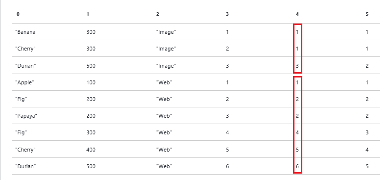

<properties 
   pageTitle="Usando funções de janela U-SQL Azure dados Lucerne Aanlytics trabalhos | Azure" 
   description="Saiba como usar funções de janela U-SQL. " 
   services="data-lake-analytics" 
   documentationCenter="" 
   authors="edmacauley" 
   manager="jhubbard" 
   editor="cgronlun"/>
 
<tags
   ms.service="data-lake-analytics"
   ms.devlang="na"
   ms.topic="article"
   ms.tgt_pltfrm="na"
   ms.workload="big-data" 
   ms.date="05/16/2016"
   ms.author="edmaca"/>

# Usando funções de janela U-SQL para trabalhos de análise de Lucerne de dados do Azure  

Funções de janela introduzidas ISO/ANSI SQL padrão no 2003. U-SQL adota um subconjunto de funções de janela, conforme definido pelo ANSI SQL padrão.

Janela funções são usadas para fazer a computação em conjuntos de linhas chamados *windows*. Windows são definidas pela cláusula acima. Funções de janela solucionar alguns cenários importantes de maneira altamente eficiente.

Este guia de aprendizagem usa dois conjuntos de dados de exemplo para orientá-lo através de alguns cenários de exemplo onde você pode aplicar funções de janela. Para obter mais informações, consulte [referência U-SQL](http://go.microsoft.com/fwlink/p/?LinkId=691348).

As funções de janela são categorizadas em: 

- [Funções de agregação de relatório](#reporting-aggregation-functions), como soma ou média
- [Funções de classificação](#ranking-functions), como DENSE_RANK, Núm_lin, NTILE e classificação
- [Funções analíticas](#analytic-functions), como distribuição cumulativa, percentuais ou acessa os dados de uma linha anterior no mesmo resultado defina sem o uso de uma associação a mesmo

**Pré-requisitos:**

- Percorra os seguintes dois tutoriais:

    - [Introdução ao uso de ferramentas de Lucerne de dados do Azure para Visual Studio](data-lake-analytics-data-lake-tools-get-started.md).
    - [Começar a usar o U-SQL para trabalhos de análise de Lucerne de dados do Azure](data-lake-analytics-u-sql-get-started.md).
- Crie uma conta de dados Lucerne analítico conforme as instruções em [começar a usar ferramentas de Lucerne de dados do Azure para Visual Studio](data-lake-analytics-data-lake-tools-get-started.md).
- Crie um projeto do Visual Studio U-SQL conforme as instruções em [começar a usar o U-SQL para trabalhos de análise de Lucerne de dados do Azure](data-lake-analytics-u-sql-get-started.md).

## Conjuntos de dados de exemplo

Este tutorial usa dois conjuntos de dados:

- QueryLog 

    QueryLog representa uma lista dos quais pessoas pesquisado em mecanismo de pesquisa. Cada log de consulta inclui:
    
        - Query - What the user was searching for.
        - Latency - How fast the query came back to the user in milliseconds.
        - Vertical - What kind of content the user was interested in (Web links, Images, Videos).
    
    Copie e cole o seguinte script em seu projeto U-SQL para construir o conjunto de linhas de QueryLog:
    
        @querylog = 
            SELECT * FROM ( VALUES
                ("Banana"  , 300, "Image" ),
                ("Cherry"  , 300, "Image" ),
                ("Durian"  , 500, "Image" ),
                ("Apple"   , 100, "Web"   ),
                ("Fig"     , 200, "Web"   ),
                ("Papaya"  , 200, "Web"   ),
                ("Avocado" , 300, "Web"   ),
                ("Cherry"  , 400, "Web"   ),
                ("Durian"  , 500, "Web"   ) )
            AS T(Query,Latency,Vertical);
    
    Na prática, os dados provavelmente estão armazenados em um arquivo de dados. Você deseja acessar os dados dentro de um arquivo separado por tabulação usando o seguinte código: 
    
        @querylog = 
        EXTRACT 
            Query    string, 
            Latency  int, 
            Vertical string
        FROM "/Samples/QueryLog.tsv"
        USING Extractors.Tsv();

- Funcionários

    O conjunto de dados do funcionário inclui os seguintes campos:
   
        - EmpID - Employee ID.
        - EmpName  Employee name.
        - DeptName - Department name. 
        - DeptID - Deparment ID.
        - Salary - Employee salary.

    Copie e cole o seguinte script em seu projeto U-SQL para construcint o conjunto de linhas de funcionários:

        @employees = 
            SELECT * FROM ( VALUES
                (1, "Noah",   "Engineering", 100, 10000),
                (2, "Sophia", "Engineering", 100, 20000),
                (3, "Liam",   "Engineering", 100, 30000),
                (4, "Emma",   "HR",          200, 10000),
                (5, "Jacob",  "HR",          200, 10000),
                (6, "Olivia", "HR",          200, 10000),
                (7, "Mason",  "Executive",   300, 50000),
                (8, "Ava",    "Marketing",   400, 15000),
                (9, "Ethan",  "Marketing",   400, 10000) )
            AS T(EmpID, EmpName, DeptName, DeptID, Salary);
    
    A instrução a seguir demonstra a criação de conjunto de linhas extraindo-a partir de um arquivo de dados.
    
        @employees = 
        EXTRACT 
            EmpID    int, 
            EmpName  string, 
            DeptName string, 
            DeptID   int, 
            Salary   int
        FROM "/Samples/Employees.tsv"
        USING Extractors.Tsv();

Quando você testar as amostras tutorial, você deve incluir as definições de conjunto de linhas. U-SQL requer que você definir apenas os conjuntos de linhas que são usados. Alguns exemplos só precisarão de um conjunto de linhas.

Você também deve adicionar a seguinte instrução para o conjunto de linhas de resultado para um arquivo de dados de saída:

    OUTPUT @result TO "/wfresult.csv" 
        USING Outputters.Csv();
 
 A maioria dos exemplos use a variável chamada **@result** para os resultados.

## Comparar funções de janela para agrupamento

Janelas e agrupamento conceitualmente relacionados por também diferentes. É importante entender essa relação.

### Agregação de uso e agrupamento

A consulta a seguir usa uma agregação para calcular o salário total para todos os funcionários:

    @result = 
        SELECT 
            SUM(Salary) AS TotalSalary
        FROM @employees;
    
>[AZURE.NOTE] Para obter instruções para testar e verificar a saída, consulte [Introdução ao uso U-SQL para trabalhos de análise de Lucerne de dados do Azure](data-lake-analytics-u-sql-get-started.md).

O resultado é uma única linha com uma única coluna. O 165000 $ é a soma do valor salário da tabela inteira. 

|TotalSalary
|-----------
|165000

>[AZURE.NOTE] Se você estiver começando a usar funções do windows, é útil lembrar os números nas saídas.  

A seguinte instrução use a cláusula GROUP BY para calcular o total salery para cada departamento:

    @result=
        SELECT DeptName, SUM(Salary) AS SalaryByDept
        FROM @employees
        GROUP BY DeptName;

Os resultados são:

|DeptName|SalaryByDept
|--------|------------
|Engenharia|60000
|HR|30000
|Executivo|50000
|Marketing|25000

A soma da coluna SalaryByDept é r $165000, que corresponde a quantidade no último script.
 
Em ambos os casos estas o número de lá estão menos linhas de saída de linhas de entrada:
 
- Sem GROUP BY, a agregação recolhe todas as linhas em uma única linha. 
- Com GROUP BY, há linhas de saída de N, onde N é o número de valores distintos que aparecem nos dados, nesse caso, que você obterá 4 linhas na saída.

###  Usar uma função de janela

A cláusula de sobre no exemplo a seguir está vazia. Isso define a "janela" para incluir todas as linhas. A soma neste exemplo é aplicada a cláusula sobre ela precede.

Você pode ler esta consulta como: "A soma de salário sobre uma janela de todas as linhas".

    @result=
        SELECT
            EmpName,
            SUM(Salary) OVER( ) AS SalaryAllDepts
        FROM @employees;

Ao contrário de GROUP BY, existem como muitas linhas como linhas de entrada de saída: 

|EmpName|TotalAllDepts
|-------|--------------------
|Noah|165000
|Sophia|165000
|Liam|165000
|Emma|165000
|Jacó|165000
|Olivia|165000
|Mason|165000
|Ava|165000
|Ethan|165000

O valor de 165000 (o total de todos os salários) é colocado em cada linha de saída. Esse total é proveniente de "janela" de todas as linhas, para que ele inclui todos os salários. 

O exemplo a seguir demonstra como refinar "janela" para listar todos os funcionários, o departamento e o salário total para o departamento. PARTIÇÃO por é adicionada à cláusula acima.

    @result=
    SELECT
        EmpName, DeptName,
        SUM(Salary) OVER( PARTITION BY DeptName ) AS SalaryByDept
    FROM @employees;

Os resultados são:

|EmpName|DeptName|SalaryByDep
|-------|--------|-------------------
|Noah|Engenharia|60000
|Sophia|Engenharia|60000
|Liam|Engenharia|60000
|Mason|Executivo|50000
|Emma|HR|30000
|Jacó|HR|30000
|Olivia|HR|30000
|Ava|Marketing|25000
|Ethan|Marketing|25000

Novamente, há o mesmo número de linhas de entrada como linhas de saída. No entanto, cada linha tem um salário total para o departamento de correspondente.

## Funções de agregação de relatório

Funções de janela também suportam as agregações a seguintes:

- CONTAGEM
- SOMA
- MIN
- MAX
- AVG
- DESVPAD
- VAR

A sintaxe:

    <AggregateFunction>( [DISTINCT] <expression>) [<OVER_clause>]

Observação: 

- Por padrão, funções de agregação, exceto contagem, ignoram valores nulos.
- Quando funções de agregação são especificadas juntamente com a cláusula sobre, a cláusula ORDER BY não é permitida na cláusula acima.

### Use soma

O exemplo a seguir adiciona um total salário por departamento para cada linha de entrada:
 
    @result=
        SELECT 
            *,
            SUM(Salary) OVER( PARTITION BY DeptName ) AS TotalByDept
        FROM @employees;

Aqui está a saída:

|EmpID|EmpName|DeptName|DeptID|Salário|TotalByDept
|-----|-------|--------|------|------|-----------
|1|Noah|Engenharia|100|10000|60000
|2|Sophia|Engenharia|100|20000|60000
|3|Liam|Engenharia|100|30000|60000
|7|Mason|Executivo|300|50000|50000
|4|Emma|HR|200|10000|30000
|5|Jacó|HR|200|10000|30000
|6|Olivia|HR|200|10000|30000
|8|Ava|Marketing|400|15000|25000
|9|Ethan|Marketing|400|10000|25000

### Contagem de uso

O exemplo a seguir adiciona um campo extra para cada linha para mostrar o número total de funcionários em cada departamento.

    @result =
        SELECT *, 
            COUNT(*) OVER(PARTITION BY DeptName) AS CountByDept 
        FROM @employees;

O resultado:

|EmpID|EmpName|DeptName|DeptID|Salário|CountByDept
|-----|-------|--------|------|------|-----------
|1|Noah|Engenharia|100|10000|3
|2|Sophia|Engenharia|100|20000|3
|3|Liam|Engenharia|100|30000|3
|7|Mason|Executivo|300|50000|1
|4|Emma|HR|200|10000|3
|5|Jacó|HR|200|10000|3
|6|Olivia|HR|200|10000|3
|8|Ava|Marketing|400|15000|2
|9|Ethan|Marketing|400|10000|2

### Usar mínimo e máximo

O exemplo a seguir adiciona um campo extra para cada linha para mostrar o salário mais baixo de cada departamento:

    @result =
        SELECT 
            *,
            MIN(Salary) OVER( PARTITION BY DeptName ) AS MinSalary
        FROM @employees;

Os resultados:

|EmpID|EmpName|DeptName|DeptID|Salário|MinSalary
|-----|-------|--------|------|-------------|----------------
|1|Noah|Engenharia|100|10000|10000
|2|Sophia|Engenharia|100|20000|10000
|3|Liam|Engenharia|100|30000|10000
|7|Mason|Executivo|300|50000|50000
|4|Emma|HR|200|10000|10000
|5|Jacó|HR|200|10000|10000
|6|Olivia|HR|200|10000|10000
|8|Ava|Marketing|400|15000|10000
|9|Ethan|Marketing|400|10000|10000

Substitua MIN MAX e, em seguida, experimente.

## Funções de classificação

Funções de classificação retornam um valor de classificação (um longo) para cada linha de cada partição conforme definido por partição por e sobre cláusulas. A ordenação da classificação é controlada pelo ORDER BY na cláusula acima.

A seguir é suportada funções de classificação:

- CLASSIFICAÇÃO
- DENSE_RANK 
- NTILE
- NÚM_LIN

**Sintaxe:**

    [ RANK() | DENSE_RANK() | ROW_NUMBER() | NTILE(<numgroups>) ]
        OVER (
            [PARTITION BY <identifier, > …[n]]
            [ORDER BY <identifier, > …[n] [ASC|DESC]] 
    ) AS <alias>

- A cláusula ORDER BY é opcional para funções de classificação. Se ORDER BY for especificado determina a ordem de classificação. Se ORDER BY não for especificado, U-SQL atribui valores com base na ordem de ele lê registro. Portanto, resultando em não determinante valor de número de linha, classificação ou Condensado denso classificação no caso foram ordem por cláusula não for especificada.
- NTILE requer uma expressão avaliada como um inteiro positivo. Este número Especifica o número de grupos em que cada partição deve ser dividida. Esse identificador é usado somente com o NTILE função de classificação. 

Para obter mais detalhes sobre a cláusula sobre, consulte [referência de U-SQL]().

Núm_lin, ordem e DENSE_RANK atribuem números de linhas em uma janela. Em vez de abordá-los separadamente, é mais intuitiva para ver como elas responderem à mesma entrada.

    @result =
    SELECT 
        *,
        ROW_NUMBER() OVER (PARTITION BY Vertical ORDER BY Latency) AS RowNumber,
        RANK() OVER (PARTITION BY Vertical ORDER BY Latency) AS Rank, 
        DENSE_RANK() OVER (PARTITION BY Vertical ORDER BY Latency) AS DenseRank 
    FROM @querylog;
        
Observe que as cláusulas sobre são idênticas. O resultado:

|Consulta|Latência: int|Vertical|NúmeroLinhas|Classificação|DenseRank
|-----|-----------|--------|--------------|---------|--------------
|Banana|300|Imagem|1|1|1
|Cherry|300|Imagem|2|1|1
|Durian|500|Imagem|3|3|2
|Apple|100|Web|1|1|1
|Fig.|200|Web|2|2|2
|Papaya|200|Web|3|2|2
|Fig.|300|Web|4|4|3
|Cherry|400|Web|5|5|4
|Durian|500|Web|6|6|5

### NÚM_LIN

Dentro de cada janela (Vertical, imagem ou Web), a linha número aumenta em 1 ordenadas pela latência.  

### CLASSIFICAÇÃO

Diferente de ROW_NUMBER(), RANK() leva em consideração o valor da latência que é especificada na cláusula ORDER BY para a janela.

CLASSIFICAÇÃO começa com (1,1,3) porque os dois primeiros valores de latência são os mesmos. Em seguida, o próximo valor é 3 porque o valor de latência movido até 500. A tecla ponto sendo que apesar de valores duplicados são fornecidos na mesma ordem, o número da classificação "ignorará" para o próximo valor de Núm_lin. Você pode ver esse padrão Repita com a sequência (2,2,4) na vertical na Web.

### DENSE_RANK
    
DENSE_RANK é exatamente como classificar, exceto que ele não "ignora" para o próximo Núm_lin, em vez disso, ele vai para o próximo número na sequência. Observe as sequências (1, 1,2) e (2,2,3) na amostra.

### Comentários

- Se ORDER BY não for especificada de função de classificação será aplicada ao conjunto de linhas sem qualquer ordenação. Isso resultará em comportamento não determinante em como a função de classificação é aplicado
- Não há nenhuma garantia de que as linhas retornadas por uma consulta usando Núm_lin serão ordenadas exatamente o mesmo com cada execução, a menos que as seguintes condições são verdadeiras.

    - Valores da coluna dividida são exclusivos.
    - Os valores das colunas ORDER BY são exclusivos.
    - Combinações de valores da coluna de partição e ORDER BY colunas são exclusivas.

### NTILE

NTILE distribui as linhas em uma partição de ordenada em um número especificado de grupos. Os grupos são numerados, começando por um. 

O exemplo a seguir divide o conjunto de linhas em cada partição (vertical) 4 grupos na ordem a latência da consulta e retorna o número de grupo para cada linha. 

Vertical imagem tem 3 linhas, portanto, ele tem 3 grupos. 

Vertical Web tem 6 linhas, as duas linhas adicionais são distribuídas para os dois primeiros grupos. Que tem Agrupar por que há 2 linhas no grupo 1 e grupo 2 e apenas 1 linha em 4 de grupo e 3.  

    @result =
        SELECT 
            *,
            NTILE(4) OVER(PARTITION BY Vertical ORDER BY Latency) AS Quartile   
        FROM @querylog;
        
Os resultados:

|Consulta|Latência|Vertical|Quartil
|-----|-----------|--------|-------------
|Banana|300|Imagem|1
|Cherry|300|Imagem|2
|Durian|500|Imagem|3
|Apple|100|Web|1
|Fig.|200|Web|1
|Papaya|200|Web|2
|Fig.|300|Web|2
|Cherry|400|Web|3
|Durian|500|Web|4

NTILE assume um parâmetro ("numgroups"). Numgroups é um int positivo ou expressão de tempo constante que especifica o número de grupos em que cada partição deve ser dividida. 

- Se o número de linhas na partição for divisível por numgroups os grupos terão tamanho igual. 
- Se o número de linhas em uma partição não for divisível por numgroups, isso fará grupos de dois tamanhos diferentes por um membro. Grupos maiores vêm antes de grupos menores na ordem especificada pela cláusula acima. 

Por exemplo:

- 100 linhas divididas em 4 grupos: [25, 25, 25, 25]
- 102 linhas devided em 4 grupos: [26, 26, 25, 25]

### N principais registros por partição via ordem, DENSE_RANK ou Núm_lin

Muitos usuários desejam selecionar somente linhas SUPERIORES n por grupo. Isso não é possível com tradicional GROUP BY. 

Você já viu o exemplo a seguir no início da seção de funções de classificação. Ela não mostra registros de N principais para cada partição:

    @result =
    SELECT 
        *,
        ROW_NUMBER() OVER (PARTITION BY Vertical ORDER BY Latency) AS RowNumber,
        RANK() OVER (PARTITION BY Vertical ORDER BY Latency) AS Rank,
        DENSE_RANK() OVER (PARTITION BY Vertical ORDER BY Latency) AS DenseRank
    FROM @querylog;

Os resultados:

|Consulta|Latência|Vertical|Classificação|DenseRank|NúmeroLinhas
|-----|-----------|--------|---------|--------------|--------------
|Banana|300|Imagem|1|1|1
|Cherry|300|Imagem|1|1|2
|Durian|500|Imagem|3|2|3
|Apple|100|Web|1|1|1
|Fig.|200|Web|2|2|2
|Papaya|200|Web|2|2|3
|Fig.|300|Web|4|3|4
|Cherry|400|Web|5|4|5
|Durian|500|Web|6|5|6

### TOP N com condensado da classificação

O exemplo a seguir retorna os registros de 3 superiores de cada grupo sem intervalos na ordem sequencial numeração de linhas em cada partição de janelas.

    @result =
    SELECT 
        *,
        DENSE_RANK() OVER (PARTITION BY Vertical ORDER BY Latency) AS DenseRank
    FROM @querylog;
    
    @result = 
        SELECT *
        FROM @result
        WHERE DenseRank <= 3;

Os resultados:

|Consulta|Latência|Vertical|DenseRank
|-----|-----------|--------|--------------
|Banana|300|Imagem|1
|Cherry|300|Imagem|1
|Durian|500|Imagem|2
|Apple|100|Web|1
|Fig.|200|Web|2
|Papaya|200|Web|2
|Fig.|300|Web|3

### TOP N com classificação

    @result =
        SELECT 
            *,
            RANK() OVER (PARTITION BY Vertical ORDER BY Latency) AS Rank
        FROM @querylog;
    
    @result = 
        SELECT *
        FROM @result
        WHERE Rank <= 3;

Os resultados:    

|Consulta|Latência|Vertical|Classificação
|-----|-----------|--------|---------
|Banana|300|Imagem|1
|Cherry|300|Imagem|1
|Durian|500|Imagem|3
|Apple|100|Web|1
|Fig.|200|Web|2
|Papaya|200|Web|2

### TOP N com Núm_lin

    @result =
        SELECT 
            *,
            ROW_NUMBER() OVER (PARTITION BY Vertical ORDER BY Latency) AS RowNumber
        FROM @querylog;
    
    @result = 
        SELECT *
        FROM @result
        WHERE RowNumber <= 3;

Os resultados:   
    
|Consulta|Latência|Vertical|NúmeroLinhas
|-----|-----------|--------|--------------
|Banana|300|Imagem|1
|Cherry|300|Imagem|2
|Durian|500|Imagem|3
|Apple|100|Web|1
|Fig.|200|Web|2
|Papaya|200|Web|3

### Atribuir o número da linha exclusivo

Muitas vezes é útil atribuir um número exclusivo para cada linha. É fácil (e mais eficiente usando um redutor) com as funções de classificação.

    @result =
        SELECT 
            *,
            ROW_NUMBER() OVER () AS RowNumber
        FROM @querylog;

<!-- ################################################### -->
## Funções analíticas

Funções analíticas são usadas para entender as distribuições de valores no windows. O cenário mais comum para usar funções analíticas é o cálculo de percentuais.

**Suporte para funções de janela analítico**

- CUME_DIST 
- PERCENT_RANK
- PERCENTILE_CONT
- PERCENTILE_DISC

### CUME_DIST  

CUME_DIST calcula a posição relativa de um valor especificado em um grupo de valores. Ele calcula a porcentagem de consultas que têm uma latência menor ou igual à latência da consulta atual no mesmo vertical. Para uma linha, R, considerando que em ordem crescente de pedidos, que o CUME_DIST de R é o número de linhas com valores menores ou iguais ao valor de R, dividido pelo número de linhas avaliada no conjunto de resultados partição ou consulta. CUME_DIST retorna números no intervalo de 0 < x < = 1.

**Sintaxe**

    CUME_DIST() 
        OVER (
            [PARTITION BY <identifier, > …[n]]
            ORDER BY <identifier, > …[n] [ASC|DESC] 
    ) AS <alias>

O exemplo a seguir usa a função CUME_DIST para calcular o percentil de latência para cada consulta dentro de uma vertical. 

    @result=
        SELECT 
            *,
            CUME_DIST() OVER(PARTITION BY Vertical ORDER BY Latency) AS CumeDist
        FROM @querylog;

Os resultados:
    
|Consulta|Latência|Vertical|CumeDist
|-----|-----------|--------|---------------
|Durian|500|Imagem|1
|Banana|300|Imagem|0.666666666666667
|Cherry|300|Imagem|0.666666666666667
|Durian|500|Web|1
|Cherry|400|Web|0.833333333333333
|Fig.|300|Web|0.666666666666667
|Fig.|200|Web|0,5
|Papaya|200|Web|0,5
|Apple|100|Web|0.166666666666667

Não existem 6 linhas na partição onde chave da partição é "Web" (4º de linha e para baixo):

- Não existem 6 linhas com valor igual ou menor que 500, para que o CUME_DIST é igual a 6/6 = 1
- Há 5 linhas com valor igual ou menor 400, para que o CUME_DIST é igual a 5/6 = 0,83
- Há 4 linhas com valor igual ou menor que 300, para que o CUME_DIST é igual a 4/6 = 0.66
- Existem 3 linhas com valor igual ou menor 200, para que o CUME_DIST é igual a 3/6 = 0,5. Há duas linhas com o mesmo valor de latência.
- Há 1 linha com valor igual ou menor que 100, para que o CUME_DIST é igual a 1/6 = 0,16. 

**Notas de uso:**

- Valores de TIe sempre avaliam como o mesmo valor de distribuição cumulativa.
- Valores nulos são tratados como os possíveis valores mais baixos.
- Especifique a cláusula ORDER BY para calcular CUME_DIST.
- CUME_DIST é semelhante à função PERCENT_RANK

Observação: A cláusula ORDER BY não é permitida se a instrução SELECT não é seguida pela saída. Portanto, a cláusula ORDER BY na instrução saída determina a ordem de exibição do conjunto de linhas resultante.

### PERCENT_RANK

PERCENT_RANK calcula a posição relativa de uma linha dentro de um grupo de linhas. PERCENT_RANK é usada para avaliar a posição relativa de um valor em um conjunto de linhas ou uma partição. O intervalo de valores retornados por PERCENT_RANK for maior que 0 e menor ou igual a 1. Ao contrário de CUME_DIST, PERCENT_RANK é sempre 0 para a primeira linha.
    
**Sintaxe**

    PERCENT_RANK() 
        OVER (
            [PARTITION BY <identifier, > …[n]]
            ORDER BY <identifier, > …[n] [ASC|DESC] 
        ) AS <alias>

**Anotações**

- A primeira linha em qualquer conjunto tem um PERCENT_RANK de 0.
- Valores nulos são tratados como os possíveis valores mais baixos.
- Especifique a cláusula ORDER BY para calcular PERCENT_RANK.
- CUME_DIST é semelhante à função PERCENT_RANK 

O exemplo a seguir usa a função PERCENT_RANK para calcular o percentil de latência para cada consulta dentro de uma vertical. 

A cláusula partição BY é especificada para partição as linhas no resultado definido pelo vertical. A cláusula ORDER BY na cláusula sobre ordens as linhas em cada partição. 

O valor retornado pela função PERCENT_RANK representa a posição de latência das consultas dentro de uma vertical como uma porcentagem. 

    @result=
        SELECT 
            *,
            PERCENT_RANK() OVER(PARTITION BY Vertical ORDER BY Latency) AS PercentRank
        FROM @querylog;

Os resultados:

|Consulta|Latência: int|Vertical|PORCENTUAL
|-----|-----------|--------|------------------
|Banana|300|Imagem|0
|Cherry|300|Imagem|0
|Durian|500|Imagem|1
|Apple|100|Web|0
|Fig.|200|Web|0,2
|Papaya|200|Web|0,2
|Fig.|300|Web|0,6
|Cherry|400|Web|0,8
|Durian|500|Web|1

### PERCENTILE_CONT & PERCENTILE_DISC

Essas duas funções calcula um percentil com base em uma distribuição contínua ou discreta dos valores de coluna.

**Sintaxe**

    [PERCENTILE_CONT | PERCENTILE_DISC] ( numeric_literal ) 
        WITHIN GROUP ( ORDER BY <identifier> [ ASC | DESC ] )
        OVER ( [ PARTITION BY <identifier,>…[n] ] ) AS <alias>

**numeric_literal** - o percentil para calcular. O valor deve variar entre 0,0 e 1,0.

GRUPO (ORDER BY <identifier> [ASC | DESC]) - especifica uma lista de valores numéricos, classificar e calcular o percentil sobre. Identificador de apenas uma coluna é permitida. A expressão deve ser avaliada como um tipo numérico. Outros tipos de dados não são permitidos. A ordem de classificação padrão é crescente.

SOBRE ([partição por < identificador, >... [n]]) - divide o conjunto de linhas de entrada em partições de acordo com as a chave da partição ao qual a função percentil é aplicada. Para obter mais informações, consulte a seção deste documento de classificação.
Observação: Qualquer nulos no conjunto de dados são ignorados.

**PERCENTILE_CONT** calcula um percentil com base em uma distribuição contínua do valor da coluna. O resultado é interpolado e não pode ser igual a qualquer um dos valores específicos na coluna. 

**PERCENTILE_DISC** calcula o percentil com base em uma distribuição discreta dos valores de coluna. O resultado é igual a um valor específico na coluna. Em outras palavras, PERCENTILE_DISC, em contraste para PERCENTILE_CONT, sempre retorna uma real (entrada original) valor.

Você pode ver como ambos funcionam no exemplo abaixo quais tenta localizar a mediana (percentil = 0,50) valor para latência dentro de cada Vertical

    @result = 
        SELECT 
            Vertical, 
            Query,
            PERCENTILE_CONT(0.5) 
                WITHIN GROUP (ORDER BY Latency)
                OVER ( PARTITION BY Vertical ) AS PercentileCont50,
            PERCENTILE_DISC(0.5) 
                WITHIN GROUP (ORDER BY Latency) 
                OVER ( PARTITION BY Vertical ) AS PercentileDisc50 
        
        FROM @querylog;

Os resultados:

|Consulta|Latência: int|Vertical|PercentileCont50|PercentilDisc50
|-----|-----------|--------|-------------------|----------------
|Banana|300|Imagem|300|300
|Cherry|300|Imagem|300|300
|Durian|500|Imagem|300|300
|Apple|100|Web|250|200
|Fig.|200|Web|250|200
|Papaya|200|Web|250|200
|Fig.|300|Web|250|200
|Cherry|400|Web|250|200
|Durian|500|Web|250|200

Para PERCENTILE_CONT porque valores podem ser interpolados, a mediana para web é 250 Embora nenhuma consulta na web vertical tinha uma latência de 250. 

PERCENTILE_DISC não interpolar valores, portanto, a mediana para Web é 200 - o que é um real valor encontrado na entrada linhas.

## Consulte também

- [Visão geral de análise de Lucerne de dados do Microsoft Azure](data-lake-analytics-overview.md)
- [Começar a usar a análise de Lucerne dados usando o Portal do Azure](data-lake-analytics-get-started-portal.md)
- [Começar a usar a análise de Lucerne dados usando o PowerShell do Azure](data-lake-analytics-get-started-powershell.md)
- [Desenvolver scripts U-SQL usando ferramentas de Lucerne de dados para o Visual Studio](data-lake-analytics-data-lake-tools-get-started.md)
- [Use tutoriais interativos Azure dados Lucerne Analytics](data-lake-analytics-use-interactive-tutorials.md)
- [Analisar os logs de site usando a análise de Lucerne de dados do Azure](data-lake-analytics-analyze-weblogs.md)
- [Começar a usar o idioma de análise de Lucerne de dados U-SQL Azure](data-lake-analytics-u-sql-get-started.md)
- [Gerenciar Azure dados Lucerne análise usando o Portal do Azure](data-lake-analytics-manage-use-portal.md)
- [Gerenciar Azure dados Lucerne análise usando o PowerShell do Azure](data-lake-analytics-manage-use-powershell.md)
- [Monitorar e solucionar problemas de trabalhos de análise de Lucerne de dados do Azure usando o Portal do Azure](data-lake-analytics-monitor-and-troubleshoot-jobs-tutorial.md)
