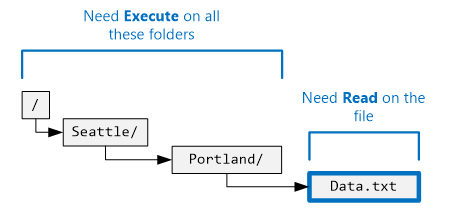
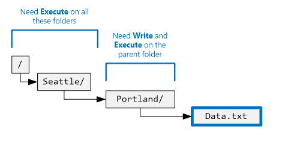
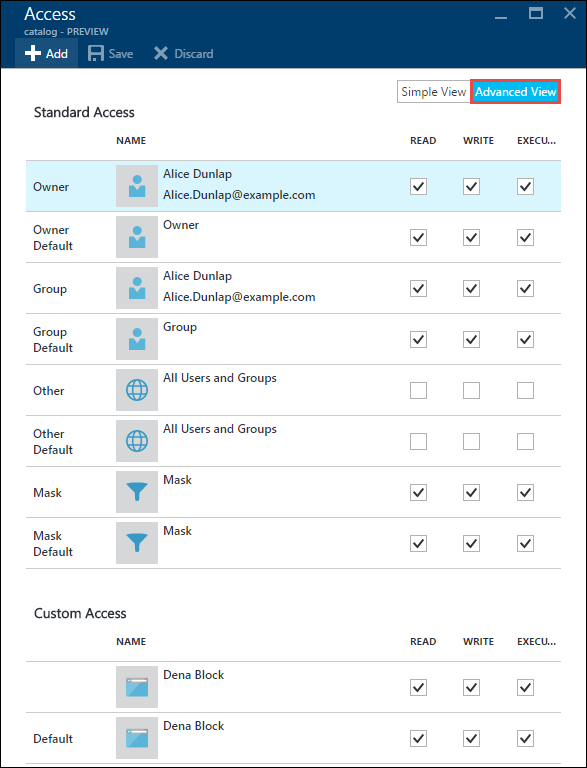

<properties
   pageTitle="Visão geral do controle de acesso no repositório de Lucerne dados | Microsoft Azure"
   description="Entender como controle de acesso no repositório de Lucerne de dados do Azure"
   services="data-lake-store"
   documentationCenter=""
   authors="nitinme"
   manager="jhubbard"
   editor="cgronlun"/>

<tags
   ms.service="data-lake-store"
   ms.devlang="na"
   ms.topic="get-started-article"
   ms.tgt_pltfrm="na"
   ms.workload="big-data"
   ms.date="09/06/2016"
   ms.author="nitinme"/>

# Controle de acesso no repositório de Lucerne de dados do Azure

Armazenamento de dados de Lucerne implementa um modelo de controle de acesso que deriva de HDFS, em vez, o modelo de controle de acesso POSIX. Este artigo resume as Noções básicas para o modelo de controle de acesso para armazenamento de Lucerne de dados. Para saber mais sobre o HDFS controle de acesso modelo consulte [Guia de permissões do HDFS](https://hadoop.apache.org/docs/current/hadoop-project-dist/hadoop-hdfs/HdfsPermissionsGuide.html).

## Listas de controle de acesso em arquivos e pastas

Há dois tipos de acesso listas de controle (ACLs) - **ACLs de acesso** e **ACLs padrão**.

* **Acesso ACLs** – essas controlam acesso a um objeto. Arquivos e pastas tem acesso ACLs.

* **ACLs padrão** – um "modelo" de ACLs associado a uma pasta que determinam as ACLs de acesso para itens filho criados nessa pasta. Arquivos não têm ACLs padrão.

ACLs de acesso e ACLs padrão têm a mesma estrutura.

>[AZURE.NOTE] Alterar o ACL padrão em um pai não afeta o acesso ACL ou ACL padrão de itens filho que já existem.

## Usuários e identidades

Cada arquivo e pasta tem permissões distintas para essas identidades:

* O usuário proprietário do arquivo
* O grupo proprietário
* Usuários nomeados
* Grupos nomeados
* Todos os outros usuários

As identidades dos usuários e grupos são identidades do Azure Active Directory (AAD) portanto, a menos que seja observado o contrário um "usuário", no contexto Lucerne de repositório de dados, seja significa um usuário do AAD ou um grupo de segurança AAD.

## Permissões

As permissões em um objeto de sistema de arquivos são **ler**, **gravar**, e **Execute** e eles podem ser usados em arquivos e pastas, conforme mostrado na tabela a seguir.

|            |    Arquivo     |   Pasta |
|------------|-------------|----------|
| **Read (R)** | Pode ler o conteúdo de um arquivo | Requer **ler** e **Executar** , listar o conteúdo da pasta.|
| **Gravação (W)** | Pode escrever ou anexar um arquivo | Requer **gravar e executar** criar filho itens em uma pasta. |
| **Executar (X)** | Não significa que qualquer coisa no contexto Lucerne de repositório de dados | Necessário para percorrer os itens filho de uma pasta. |

### Formulários curtos para permissões

**RWX**é usada para indicar **leitura + escrita + executar**. Existe um formulário de numérico mais compacta na qual **leitura = 4**, **escrever = 2**, e **Execute = 1** e sua soma representa as permissões. A seguir estão alguns exemplos.

| Formulário numérico | Forma abreviada |      O que significa     |
|--------------|------------|------------------------|
| 7            | RWX        | Leitura + escrita + executar |
| 5            | R-X        | Leitura + executar         |
| 4            | R-        | Leitura                   |
| 0            | ---        | Sem permissões         |

### Não herdam permissões

No modelo de estilo POSIX usado por dados Lucerne loja, permissões para um item são armazenadas no próprio item. Em outras palavras, as permissões para um item não podem ser herdadas de itens pai.

## Cenários comuns relacionados a permissões

Aqui estão alguns cenários comuns para entender quais permissões são necessárias para realizar determinadas operações em uma conta de armazenamento de Lucerne de dados.

### Permissões necessárias para ler um arquivo

* Para o arquivo a ser lido - o chamador precisa ter permissões de **leitura**
* Para todas as pastas na estrutura da pasta que contém o arquivo - o chamador precisa ter permissões de **execução**

### Permissões necessárias para acrescentar a um arquivo

* Para o arquivo a ser anexado ao - o chamador precisa ter permissões de **gravação**
* Para todas as pastas que contêm o arquivo - o chamador precisa ter permissões de **execução**

### Permissões necessárias para excluir um arquivo

* Para a pasta pai - o chamador precisa ter permissões de **gravação + executar**
* Para todas as outras pastas no caminho do arquivo - o chamador precisa ter permissões de **execução**

>[AZURE.NOTE] Escreva permissões no arquivo não é necessário para excluir o arquivo como acima duas condições são verdadeiras.

### Permissões necessárias para enumerar uma pasta

* Para a pasta para enumerar - o chamador precisa ter permissões de **leitura + executar**
* Para todas as pastas de ancestral - o chamador precisa ter permissões de **execução**

## Exibindo permissões no portal do Azure

Da lâmina do **Explorador de dados** da conta de armazenamento de Lucerne de dados, clique em **acesso** para ver as ACLs para um arquivo ou uma pasta. A captura de tela abaixo, clique em acesso para ver as ACLs para a pasta de **catálogo** sob a conta **mydatastore** .

Depois disso, da lâmina do **Access** , clique em **Modo de exibição simples** para ver o modo de exibição mais simples.

Clique em **Modo de exibição avançado** para ver o modo de exibição mais avançado.

## O usuário super

Um usuário super tem mais direitos de todos os usuários na loja de Lucerne de dados. Um usuário super:

* tem permissões de RWX para **todos os** arquivos e pastas
* pode alterar as permissões em qualquer arquivo ou pasta.
* pode alterar o proprietário de usuário ou grupo proprietário de qualquer arquivo ou pasta.

No Azure, uma conta de armazenamento de Lucerne de dados tem várias funções Azure:

* Proprietários
* Colaboradores
* Leitores
* Etc.

Todos na função **proprietários** para uma conta de armazenamento de Lucerne de dados são automaticamente um usuário super para essa conta. Para saber mais sobre o Azure função com base em acesso controle (RBAC) consulte [controle de acesso baseado em função](../active-directory/role-based-access-control-configure.md).

## O usuário proprietário

O usuário que criou o item é automaticamente o usuário proprietário do item. Um usuário proprietário pode:

* Alterar as permissões de um arquivo que pertence
* Altere o grupo proprietário de um arquivo que pertence, desde que o usuário proprietário também é membro do grupo de destino.

>[AZURE.NOTE] O usuário proprietário **não pode** alterar o usuário proprietário de outro arquivo de propriedade. Somente usuários super podem alterar o usuário proprietário de um arquivo ou pasta.

## O grupo proprietário

Nas ACLs POSIX, cada usuário está associado um "grupo primário". Por exemplo, o usuário "alice" pode pertencer ao grupo "finance". Alice pode pertencer a vários grupos, mas um grupo será sempre designado como seu grupo primário. POSIX, quando Alice cria um arquivo, o grupo proprietário desse arquivo está definido para seu grupo primário, nesse caso, é "finance".
 
Quando um novo item de sistema de arquivos é criado, o armazenamento de dados de Lucerne atribui um valor ao grupo proprietário. 

* **Caso 1** - pasta raiz "/". Esta pasta é criada quando uma conta de armazenamento de Lucerne de dados é criada. Nesse caso, o grupo proprietário está definido para o usuário que criou a conta.
* **Caso 2** (todos os outros casos) - quando um novo item é criado, o grupo proprietário é copiado da pasta pai.

O grupo proprietário pode ser alterado por:
* Todos os usuários super
* O usuário proprietário, se o usuário proprietário também é membro do grupo de destino.

## Algoritmo de seleção de acesso

A ilustração a seguir representa o algoritmo de seleção do access para contas de armazenamento de Lucerne de dados.

## A máscara e "permissões efetivas"

A **máscara** é um valor RWX que é usado para limitar o acesso para **chamado usuários**, o **proprietário do grupo**e **grupos nomeados** ao executar o algoritmo de acesso verificar. Aqui estão os principais conceitos para a máscara. 

* A máscara cria "permissões efetivas", ou seja, ele modifica as permissões no momento do Access Check.
* A máscara pode ser editada diretamente por proprietário do arquivo e quaisquer usuários super.
* A máscara tem a capacidade de remover permissões para criar a permissão efetiva. A máscara **não pode** adicionar permissões à permissão efetiva. 

Vejamos alguns exemplos. Abaixo, a máscara é definida como **RWX**, que significa que a máscara não remove todas as permissões. Observe que as permissões efetivas de usuário nomeado, grupo proprietário e grupo nomeado não são alteradas durante a verificação de acesso.

No exemplo abaixo, a máscara é definida como **R-X**. Portanto, ele **desativa a permissão de gravação** para **chamado user**, **proprietário do grupo**e **denominado grupo** no momento do acesso verificar.

Para referência, veja aqui onde a máscara para um arquivo ou pasta aparece no Portal do Azure.

>[AZURE.NOTE] Para uma nova conta de armazenamento de Lucerne de dados, a máscara de acesso ACL de ACL padrão da pasta raiz ("/") são incluídos por padrão para RWX.

## Permissões em novos arquivos e pastas

Quando um novo arquivo ou pasta é criada em uma pasta existente, determina o ACL padrão na pasta pai:

* ACL padrão e acesso ACL de uma pasta filho
* Filho acesso ACL de um arquivo (arquivos não têm uma ACL padrão)

### Um arquivo filho ou acesso ACL da pasta

Quando uma pasta ou um arquivo filho é criado, ACL de padrão do pai é copiada como o arquivo filho ou de acesso ACL da pasta. Além disso, se **outro** usuário tiver permissões de RWX no ACL de padrão do pai, ele é completamente removido da ACL de acesso do item filho.

Na maioria dos cenários, as informações acima são tudo o que você deve precisa saber sobre como um filho item acesso ACL é determinado. No entanto, se você estiver familiarizado com sistemas POSIX e entender detalhadamente como essa transformação é alcançada, consulte a seção [função do Umask na criação de ACL acesso para arquivos e pastas](#umasks-role-in-creating-the-access-acl-for-new-files-and-folders) neste artigo.
 

### ACL padrão de uma pasta filho

Quando uma pasta filho é criada em uma pasta pai, ACL de padrão da pasta pai é copiada, como está, para ACL de padrão da pasta filho.

## Tópicos avançados para compreender ACLs no repositório de Lucerne de dados

A seguir estão alguns tópicos avançados para ajudá-lo a compreender como ACLs são determinadas por dados Lucerne armazenar arquivos ou pastas.

### Função do umask na criação de ACL acesso para arquivos e pastas

Em um sistema compatível com POSIX, o conceito geral é que umask um valor de 9 bits na pasta pai usado para transformar a permissão para o **usuário proprietário**, **proprietário do grupo**e **outros** em um novo arquivo de filho ou de acesso ACL da pasta. Os bits de um umask identificam quais bits desativar na ACL de acesso do item filho. Portanto, é usado para impedir a propagação de permissões para usuário, proprietário do grupo, proprietário, seletivamente e outros.
  
Em um sistema HDFS, o umask costuma ser uma opção de configuração de todo o site que é controlada por administradores. Armazenamento de dados de Lucerne usa um **umask toda a conta** não pode ser alterado. A tabela a seguir mostra umask do armazenamento de dados Lucerne.

| Grupo de usuários  | Configuração | Efeito no acesso ACL do novo filho item |
|------------ |---------|---------------------------------------|
| Usuário proprietário | ---     | Nenhum efeito                             |
| Grupo proprietário| ---     | Nenhum efeito                             |
| Outros       | RWX     | Remover leitura + escrita + executar         | 

A ilustração a seguir mostra este umask em ação. O resultado é remover **leitura + escrita + executar** para **outro** usuário. Desde que a umask não especificou bits para **usuário proprietário** e o **proprietário do grupo**, essas permissões não são transformadas.

 

### O bit conjunta

O bit conjunta é um recurso mais avançado de um sistema de arquivos POSIX. No contexto Lucerne de repositório de dados, é provável que o bit aderência serão necessárias.

A tabela a seguir mostra como o bit conjunta funciona no repositório de Lucerne de dados.

| Grupo de usuários         | Arquivo    | Pasta |
|--------------------|---------|-------------------------|
| Bit conjunta **desativado** | Nenhum efeito   | Nenhum efeito           |
| Bit conjunta **ativado**  | Nenhum efeito   | Impede que qualquer pessoa, exceto **usuários super** e o **usuário proprietário** de um item de filho de excluir ou renomear item filho.               |

O bit conjunta não é mostrado no Portal do Azure.

## Perguntas comuns para ACLs no repositório de Lucerne de dados

Aqui estão algumas perguntas que aparecem com muitas vezes relacionadas com ACLs no repositório de Lucerne de dados.

### É necessário ativar o suporte para ACLs?

Não. Controle de acesso por meio de ACLs sempre está ativado para uma conta de armazenamento de Lucerne de dados.

### Quais permissões são necessárias para excluir repetidamente uma pasta e seu conteúdo?

* A pasta pai deve ter **escrever + executar**.
* A pasta a ser excluída e cada pasta dentro dela, requer **leitura + escrita + executar**.
>[AZURE.NOTE] Excluir os arquivos em pastas não exige gravação nesses arquivos. Além disso, a pasta raiz "/" **nunca** pode ser excluída.

### Quem está definido como o proprietário de um arquivo ou pasta?

O criador de um arquivo ou pasta se torna o proprietário.

### Quem está definido como o grupo proprietário de um arquivo ou pasta na criação?

Ele é copiado do grupo proprietário da pasta pai sob o qual o novo arquivo ou pasta é criada.

### Eu sou o usuário proprietário de um arquivo, mas eu não tem as permissões de RWX que necessárias. O que fazer?

O usuário proprietário simplesmente pode alterar as permissões do arquivo para dar a mesmo as permissões de RWX que precisam.

### Armazenamento de dados de Lucerne dá suporte a herança de ACLs?

Não.

### Qual é a diferença entre máscara e umask?

| máscara | umask|
|------|------|
| A propriedade **máscara** está disponível em cada arquivo e pasta. | O **umask** é uma propriedade da conta de armazenamento de Lucerne de dados. Portanto, há apenas uma única umask na loja de Lucerne de dados.    |
| A propriedade máscara em um arquivo ou pasta pode ser alterada pelo usuário proprietário ou grupo proprietário de um arquivo ou um usuário super. | A propriedade umask não pode ser modificada por qualquer usuário, mesmo um usuário super. Ele é um valor constante, ser trocado.|
| A propriedade máscara é usada para durante o algoritmo Verificar acesso em tempo de execução para determinar se um usuário tem o direito de executar em operação em um arquivo ou pasta. A função da máscara é criar "permissões efetivas" no momento da verificação de acesso. | O umask não é usado durante acesso verificar todo. O umask é usada para determinar o acesso de ACL de novos itens filho de uma pasta. |
| A máscara é um valor RWX 3 bits que se aplica ao usuário nomeado, grupo nomeado e usuário proprietário no momento da verificação de acesso.| O umask é um valor de bit 9 que se aplica ao usuário proprietário, grupo proprietário e um novo filho dos outros.| 

### Onde posso saber mais sobre o modelo de controle de acesso POSIX?

* [http://www.vanemery.com/Linux/ACL/POSIX_ACL_on_Linux.HTML](http://www.vanemery.com/Linux/ACL/POSIX_ACL_on_Linux.html)

* [Guia de permissão HDFS](http://hadoop.apache.org/docs/current/hadoop-project-dist/hadoop-hdfs/HdfsPermissionsGuide.html) 

* [PERGUNTAS FREQUENTES DE POSIX](http://www.opengroup.org/austin/papers/posix_faq.html)

* [POSIX 1003.1 2008](http://standards.ieee.org/findstds/standard/1003.1-2008.html)

* [POSIX 1003.1e 1997](http://users.suse.com/~agruen/acl/posix/Posix_1003.1e-990310.pdf)

* [ACL POSIX no Linux](http://users.suse.com/~agruen/acl/linux-acls/online/)

* [ACL usando listas de controle de acesso no Linux](http://bencane.com/2012/05/27/acl-using-access-control-lists-on-linux/)

## Consulte também

* [Visão geral do Azure Lucerne de repositório de dados](data-lake-store-overview.md)

* [Introdução ao Azure dados Lucerne Analytics](../data-lake-analytics/data-lake-analytics-get-started-portal.md)

