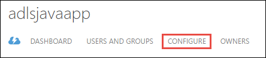

<properties
   pageTitle="Autenticar com armazenamento de Lucerne de dados usando o Active Directory | Microsoft Azure"
   description="Saiba como autenticar com armazenamento de Lucerne de dados usando o Active Directory"
   services="data-lake-store"
   documentationCenter=""
   authors="nitinme"
   manager="jhubbard"
   editor="cgronlun"/>

<tags
   ms.service="data-lake-store"
   ms.devlang="na"
   ms.topic="article"
   ms.tgt_pltfrm="na"
   ms.workload="big-data"
   ms.date="10/17/2016"
   ms.author="nitinme"/>

# Autenticação de serviço ao serviço com armazenamento de Lucerne de dados usando o Active Directory do Azure

> [AZURE.SELECTOR]
- [Serviço de autenticação](data-lake-store-authenticate-using-active-directory.md)
- [Autenticação de usuário final](data-lake-store-end-user-authenticate-using-active-directory.md)

Armazenamento de Lucerne de dados do Azure usa Azure Active Directory para autenticação. Antes de criar um aplicativo que funciona com o Azure Data Lucerne Store ou Azure dados Lucerne Analytics, primeiro você deve decidir como você gostaria de autenticar seu aplicativo com o Azure Active Directory (AD Azure). As duas principais opções disponíveis são:

* Autenticação de usuário final, e 
* Serviço de autenticação. 

Ambas as essas opções resultam em seu aplicativo sendo fornecido com um token OAuth 2.0, que obtém anexado a cada solicitação feita para Azure Data Lucerne Store ou Azure dados Lucerne Analytics.

Fala este artigo sobre como cria um aplicativo web do Azure AD para o serviço de autenticação. Para obter instruções sobre configuração de aplicativo do Azure AD para autenticação de usuário final, consulte [autenticação de usuário final com armazenamento de Lucerne de dados usando o Azure Active Directory](data-lake-store-end-user-authenticate-using-active-directory.md).

## Pré-requisitos

* Uma assinatura do Azure. Consulte [avaliação gratuita do Azure obter](https://azure.microsoft.com/pricing/free-trial/).
* Sua ID de assinatura. Você poderá recuperá-la a partir do Portal do Azure. Por exemplo, ele está disponível da lâmina de conta do repositório de Lucerne de dados.

    

* Seu nome de domínio do Azure AD. Você poderá recuperá-la passando o mouse no canto superior direito do Portal do Azure. Na captura de tela abaixo, o nome de domínio é **contoso.microsoft.com**e o GUID colchetes é a ID do locatário. 

    

## Serviço de autenticação

Essa é a abordagem recomendada se quiser que seu aplicativo para autenticar automaticamente com o Azure AD, sem a necessidade de um usuário final fornecer suas credenciais. Seu aplicativo será capaz de autenticar para desde que suas credenciais são válidas, que pode ser personalizada em questão anos.

### O que eu preciso para usar essa abordagem?

* Nome de domínio AD Azure. Isso já está listado no pré-requisito deste artigo.

* Azure AD **aplicativo web**.

* ID do cliente para o aplicativo do Azure AD da web.

* Segredo do cliente para o aplicativo da web de Azure AD.

* Ponto de extremidade token para o aplicativo da web de Azure AD.

* Habilitar o acesso para o aplicativo da web de Azure AD em do arquivo/pasta dados Lucerne Store ou a conta de análise de Lucerne de dados que você deseja trabalhar com.

Para obter instruções sobre como criar um aplicativo web do Azure AD e configurá-lo para os requisitos listados acima, consulte a seção abaixo a [criar um aplicativo do Active Directory](#create-an-active-directory-application) .

>[AZURE.NOTE] Por padrão, o aplicativo do Azure AD está configurado para usar o segredo de cliente, o qual você pode recuperar a partir do aplicativo do Azure AD. No entanto, se quiser que o aplicativo do Azure AD para usar um certificado em vez disso, você deve criar o aplicativo web do Azure AD usando o PowerShell do Azure, conforme descrito em [criar um serviço principal com o certificado](../resource-group-authenticate-service-principal.md#create-service-principal-with-certificate).

## Criar um aplicativo do Active Directory

Nesta seção nós Saiba mais sobre como criar e configurar um aplicativo web do Azure AD para o serviço de autenticação com armazenamento de Lucerne de dados do Azure usando o Active Directory do Azure. 

### Etapa 1: Criar um aplicativo do Active Directory do Azure

>[AZURE.NOTE] As etapas abaixo usam o Portal do Azure. Você também pode criar um aplicativo do Azure AD usando [Azure PowerShell](../resource-group-authenticate-service-principal.md) ou [CLI do Azure](../resource-group-authenticate-service-principal-cli.md).

1. Faça logon em sua conta do Azure por meio do [portal clássico](https://manage.windowsazure.com/).

2. Selecione o **Active Directory** no painel esquerdo.

     
     
3. Selecione o Active Directory que você deseja usar para criar o novo aplicativo. Se você tiver mais de um Active Directory, geralmente você deseja criar o aplicativo no diretório onde reside a sua assinatura. Você só pode conceder acesso ao recurso em sua assinatura de aplicativos na mesma pasta que sua assinatura.  

     
    
    
3. Para exibir os aplicativos no seu diretório, clique em **aplicativos**.

     

4. Se você ainda não criou um aplicativo no diretório antes de você verá algo semelhante a imagem a seguir. Clique em **Adicionar um aplicativo**

     

     Ou, clique em **Adicionar** no painel inferior.

     

6. Forneça um nome para o aplicativo e selecione o tipo de aplicativo que você deseja criar. Para este tutorial, crie uma **WEB APPLICATION e/ou WEB API** e clique no botão Avançar.

     

7. Preencha as propriedades para o aplicativo. Para **URL de SIGN-ON**, forneça o URI a um site que descreva o seu aplicativo. A existência do site da web não é validada. Para **URI de ID do aplicativo**, forneça a URI que identifica seu aplicativo.

     

    Clique na marca de seleção para concluir o assistente e criar o aplicativo.

### Etapa 2: Obtenha id do cliente, segredo cliente e ponto de extremidade de token

Quando o registro em log programaticamente no, você precisa da identificação do aplicativo. Se o aplicativo é executado em seus próprio credenciais, você precisará também uma chave de autenticação.

1. Clique na guia **Configurar** para configurar senha do seu aplicativo.

     

2. Copie o **código do cliente**.
  
     

3. Se o aplicativo será executado em seus próprio credenciais, role até a seção de **chaves** e selecione por quanto tempo você gostaria que sua senha seja válida.

     

4. Selecione **Salvar** para criar sua chave.

    

    A chave salva é exibida e você poderá copiá-lo. Você não poderá recuperar a chave mais tarde, portanto deve copiá-lo agora.

    

5. Recupere o ponto de extremidade token selecionando **pontos de extremidade do modo de exibição** na parte inferior da tela e recuperar o valor do campo de **Ponto de extremidade Token OAuth 2.0** , conforme mostrado abaixo.  

    

### Etapa 3: Atribuir o aplicativo do Azure AD para o arquivo de conta de armazenamento do Azure dados Lucerne ou pasta (somente para o serviço de autenticação)

1. Entre novo [Portal do Azure](https://portal.azure.com) e abra a conta de armazenamento de Lucerne de dados do Azure que você deseja associar o aplicativo do Active Directory do Azure que você criou anteriormente.

1. No seu blade de conta de armazenamento de Lucerne de dados, clique em **Explorador de dados**.

    ![Criar pastas na conta de armazenamento de Lucerne de dados] (./media/data-lake-store-authenticate-using-active-directory/adl.start.data.explorer.png "Criar pastas na conta Lucerne de dados")

2. Na lâmina **Explorador de dados** , clique no arquivo ou pasta para a qual você deseja fornecer acesso ao aplicativo do Azure AD e, em seguida, clique em **Access**. Para configurar o acesso a um arquivo, você deve clicar em **acesso** da lâmina **Visualização do arquivo** .

    ![Definir ACLs no sistema de arquivos de dados Lucerne] (./media/data-lake-store-authenticate-using-active-directory/adl.acl.1.png "Definir ACLs no sistema de arquivos de dados Lucerne")

3. A lâmina de **acesso** lista o acesso padrão e personalizados já atribuídas à raiz. Clique no ícone **Adicionar** para adicionar ACLs nível personalizado.

    ![Acesso à lista padrão e personalizado] (./media/data-lake-store-authenticate-using-active-directory/adl.acl.2.png "Acesso à lista padrão e personalizado")

4. Clique no ícone **Adicionar** para abrir a lâmina **Adicionar acesso de personalizado** . Neste lâmina, clique em **Selecionar usuário ou grupo**e em lâmina **Selecione usuário ou grupo** , procure o grupo de segurança que você criou anteriormente no Active Directory do Azure. Se você tiver muitos grupos da pesquisa, use a caixa de texto na parte superior para filtrar no nome do grupo. Clique no grupo que você deseja adicionar e clique em **Selecionar**.

    ![Adicionar um grupo] (./media/data-lake-store-authenticate-using-active-directory/adl.acl.3.png "Adicionar um grupo")

5. Clique em **Selecionar permissões**, selecione as permissões e se você deseja atribuir as permissões como uma ACL padrão, acessar ACL, ou ambos. Clique em **Okey**.

    ![Atribuir permissões ao grupo] (./media/data-lake-store-authenticate-using-active-directory/adl.acl.4.png "Atribuir permissões ao grupo")

    Para obter mais informações sobre permissões no repositório de Lucerne de dados e ACLs padrão de acesso, consulte [Controle de acesso no repositório de Lucerne de dados](data-lake-store-access-control.md).

6. Na lâmina **Adicionar acesso de personalizada** , clique em **Okey**. Grupo recém-adicionado, com as permissões associadas, agora será listado na lâmina **acesso** .

    ![Atribuir permissões ao grupo] (./media/data-lake-store-authenticate-using-active-directory/adl.acl.5.png "Atribuir permissões ao grupo") 

## Próximas etapas

Neste artigo, você criou um aplicativo web do Azure AD e reuniu as informações que necessárias em seus aplicativos de cliente que você cria usando o SDK do .NET, Java SDK, etc. Agora, você poderá os seguintes artigos que falar sobre como usar o aplicativo da web Azure AD para autenticar primeiro com armazenamento de Lucerne de dados e, em seguida, executar outras operações no repositório.

- [Introdução ao armazenamento de Lucerne de dados do Azure usando o SDK do .NET](data-lake-store-get-started-net-sdk.md)
- [Introdução ao armazenamento de Lucerne de dados do Azure usando o SDK Java](data-lake-store-get-started-java-sdk.md)
