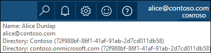

<properties
   pageTitle="Autenticar com armazenamento de Lucerne de dados usando o Active Directory | Microsoft Azure"
   description="Saiba como autenticar com armazenamento de Lucerne de dados usando o Active Directory"
   services="data-lake-store"
   documentationCenter=""
   authors="nitinme"
   manager="jhubbard"
   editor="cgronlun"/>

<tags
   ms.service="data-lake-store"
   ms.devlang="na"
   ms.topic="article"
   ms.tgt_pltfrm="na"
   ms.workload="big-data"
   ms.date="10/17/2016"
   ms.author="nitinme"/>

# Autenticação de usuário final com armazenamento de Lucerne de dados usando o Active Directory do Azure

> [AZURE.SELECTOR]
- [Serviço de autenticação](data-lake-store-authenticate-using-active-directory.md)
- [Autenticação de usuário final](data-lake-store-end-user-authenticate-using-active-directory.md)

Armazenamento de Lucerne de dados do Azure usa Azure Active Directory para autenticação. Antes de criar um aplicativo que funciona com o Azure Data Lucerne Store ou Azure dados Lucerne Analytics, primeiro você deve decidir como você gostaria de autenticar seu aplicativo com o Azure Active Directory (AD Azure). As duas principais opções disponíveis são:

* Autenticação de usuário final, e 
* Serviço de autenticação. 

Ambas as essas opções resultam em seu aplicativo sendo fornecido com um token OAuth 2.0, que obtém anexado a cada solicitação feita para Azure Data Lucerne Store ou Azure dados Lucerne Analytics.

Fala este artigo sobre como cria um aplicativo web do Azure AD para autenticação de usuário final. Para obter instruções sobre configuração de aplicativo do Azure AD para o serviço de autenticação consulte [autenticação de serviço para com armazenamento de Lucerne de dados usando o Active Directory do Azure](data-lake-store-authenticate-using-active-directory.md).

## Pré-requisitos

* Uma assinatura do Azure. Consulte [avaliação gratuita do Azure obter](https://azure.microsoft.com/pricing/free-trial/).
* Sua ID de assinatura. Você poderá recuperá-la a partir do Portal do Azure. Por exemplo, ele está disponível da lâmina de conta do repositório de Lucerne de dados.

    

* Seu nome de domínio do Azure AD. Você poderá recuperá-la passando o mouse no canto superior direito do Portal do Azure. Na captura de tela abaixo, o nome de domínio é **contoso.microsoft.com**e o GUID colchetes é a ID do locatário. 

    

## Autenticação de usuário final

Essa é a abordagem recomendada se quiser que um usuário final para efetuar login no seu aplicativo por meio do Azure AD. Seu aplicativo poderão acessar recursos Azure com o mesmo nível de acesso do usuário final que conectado. O usuário final precisará fornecer suas credenciais periodicamente em ordem para seu aplicativo para manter o acesso.

O resultado de ter o usuário final login é que seu aplicativo recebe um token de acesso e um token de atualização. O token de acesso obtém anexado a cada solicitação feita para Data Lucerne Store ou Lucerne a análise de dados, e ele é válido para uma hora por padrão. O token de atualização pode ser usado para obter um novo token de acesso, e é válido para até duas semanas por padrão, se usada regularmente. Você pode usar duas abordagens diferentes de login do usuário final.

### Usando o pop-up OAuth 2.0

Seu aplicativo pode acionar um OAuth 2.0 autorização pop-up, em que o usuário final pode inserir suas credenciais. Este pop-up também funciona com o processo de autenticação do Azure AD fator duplo (2FA), se necessário. 

>[AZURE.NOTE] Este método ainda não é suportado no Azure biblioteca de autenticação (ADAL) AD para Python ou Java.

### Passando diretamente as credenciais do usuário

Seu aplicativo diretamente pode fornecer credenciais de usuário para o Azure AD. Este método só funcionará com contas de usuário de ID organizacionais; não é compatível com personal / contas de usuário "live ID", inclusive aqueles que terminam em @outlook.com ou @live.com. Além disso, esse método não é compatível com contas de usuário que exijam autenticação do Azure AD fator duplo (2FA).

### O que eu preciso para usar essa abordagem?

* Nome de domínio AD Azure. Isso já está listado no pré-requisito deste artigo.

* **Aplicativo web** do Azure AD

* ID do cliente para o aplicativo da web de Azure AD

* Resposta URI do aplicativo da web Azure AD

* Definir delegada permissões

Para obter instruções sobre como criar um aplicativo web do Azure AD e configurá-lo para os requisitos listados acima, consulte a seção abaixo a [criar um aplicativo do Active Directory](#create-an-active-directory-application) . 

## Criar um aplicativo do Active Directory

Nesta seção nós Saiba mais sobre como criar e configurar um aplicativo web do Azure AD para autenticação de usuário final com armazenamento de Lucerne de dados do Azure usando o Active Directory do Azure.

### Etapa 1: Criar um aplicativo do Active Directory do Azure

>[AZURE.NOTE] As etapas abaixo usam o Portal do Azure. Você também pode criar um aplicativo do Azure AD usando [Azure PowerShell](../resource-group-authenticate-service-principal.md) ou [CLI do Azure](../resource-group-authenticate-service-principal-cli.md).

1. Faça logon em sua conta do Azure por meio do [portal clássico](https://manage.windowsazure.com/).

2. Selecione o **Active Directory** no painel esquerdo.

     
     
3. Selecione o Active Directory que você deseja usar para criar o novo aplicativo. Se você tiver mais de um Active Directory, geralmente você deseja criar o aplicativo no diretório onde reside a sua assinatura. Você só pode conceder acesso ao recurso em sua assinatura de aplicativos na mesma pasta que sua assinatura.  

     
    
    
3. Para exibir os aplicativos no seu diretório, clique em **aplicativos**.

     

4. Se você ainda não criou um aplicativo no diretório antes de você verá algo semelhante a imagem a seguir. Clique em **Adicionar um aplicativo**

     

     Ou, clique em **Adicionar** no painel inferior.

     

6. Forneça um nome para o aplicativo e selecione o tipo de aplicativo que você deseja criar. Para este tutorial, crie uma **WEB APPLICATION e/ou WEB API** e clique no botão Avançar.

     

7. Preencha as propriedades para o aplicativo. Para **URL de SIGN-ON**, forneça o URI a um site que descreva o seu aplicativo. A existência do site da web não é validada. Para **URI de ID do aplicativo**, forneça a URI que identifica seu aplicativo.

     

    Clique na marca de seleção para concluir o assistente e criar o aplicativo.

### Etapa 2: Obter id do cliente, responder URI e definir permissões de delegado

1. Clique na guia **Configurar** para configurar senha do seu aplicativo.

     

2. Copie o **código do cliente**.
  
     

3. Sob a seção de **logon único** , copie o **URI de resposta**.

    

4. Em **permissões para outros aplicativos**, clique em **Adicionar aplicativo**

    

5. No Assistente de **permissões para outros aplicativos** , selecione **Lucerne de dados do Azure** e do **Windows** **Azure API de gerenciamento de serviço**e clique na marca de seleção.

6. Por padrão, as **Permissões delegada** para os serviços recém-adicionado é definido como zero. Clique nas **Permissões delegada** suspensa para Lucerne de dados do Azure e o serviço de gerenciamento do Windows Azure e marque as caixas de seleção disponíveis para definir os valores para 1. O resultado deve ter esta aparência.

     

7. Clique em **Salvar**.

## Próximas etapas

Neste artigo, você criou um aplicativo web do Azure AD e reuniu as informações que necessárias em seus aplicativos de cliente que você cria usando o SDK do .NET, Java SDK, etc. Agora, você poderá os seguintes artigos que falar sobre como usar o aplicativo da web Azure AD para autenticar primeiro com armazenamento de Lucerne de dados e, em seguida, executar outras operações no repositório.

- [Introdução ao armazenamento de Lucerne de dados do Azure usando o SDK do .NET](data-lake-store-get-started-net-sdk.md)
- [Introdução ao armazenamento de Lucerne de dados do Azure usando o SDK Java](data-lake-store-get-started-java-sdk.md)
