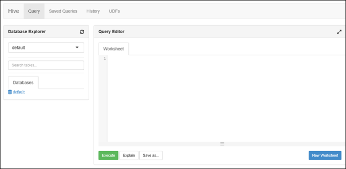

<properties
   pageTitle="Criar clusters de HDInsight com armazenamento de Lucerne de dados do Azure usando o portal | Azure"
   description="Usar o Portal do Azure para criar e usar clusters HDInsight com armazenamento de Lucerne de dados do Azure"
   services="data-lake-store,hdinsight" 
   documentationCenter=""
   authors="nitinme"
   manager="jhubbard"
   editor="cgronlun"/>

<tags
   ms.service="data-lake-store"
   ms.devlang="na"
   ms.topic="article"
   ms.tgt_pltfrm="na"
   ms.workload="big-data"
   ms.date="10/21/2016"
   ms.author="nitinme"/>

# Criar um cluster de HDInsight com armazenamento de Lucerne de dados usando o Portal do Azure

> [AZURE.SELECTOR]
- [Usando o Portal](data-lake-store-hdinsight-hadoop-use-portal.md)
- [Usando o PowerShell](data-lake-store-hdinsight-hadoop-use-powershell.md)
- [Usando o Gerenciador de recursos](data-lake-store-hdinsight-hadoop-use-resource-manager-template.md)

Saiba como usar o Portal do Azure para criar um cluster de HDInsight (Hadoop, HBase, Spark ou tempestade) com acesso ao repositório de Lucerne de dados do Azure. Algumas considerações importantes para esta versão:

* **Para Spark clusters (Linux) e clusters de Hadoop (Windows e Linux)**, o armazenamento de dados Lucerne só pode ser usado como uma conta de armazenamento adicional. A conta de armazenamento padrão para esses clusters ainda será Blobs de armazenamento do Azure (WASB).

* **Para tempestade clusters (Windows e Linux)**, o armazenamento de Lucerne de dados pode ser usado para gravar os dados de uma topologia de tempestade. Armazenamento de dados de Lucerne também podem ser usado para armazenar dados de referência que, em seguida, podem ser lido por uma topologia de tempestade. Para obter mais informações, consulte [Usar o armazenamento de Lucerne de dados em uma topologia de tempestade](#use-data-lake-store-in-a-storm-topology).

* **Para HBase clusters (Windows e Linux)**, o armazenamento de Lucerne de dados pode ser usado como um armazenamento padrão, bem como o armazenamento adicional. Para obter mais informações, consulte [Usar dados Lucerne armazenamento com clusters HBase](#use-data-lake-store-with-hbase-clusters).

> [AZURE.NOTE] Alguns pontos importantes nota. 
> 
> * Opção para criar clusters de HDInsight com acesso ao repositório de Lucerne de dados está disponível somente para versões de HDInsight 3,2 e 3.4 (para Hadoop, HBase e tempestade clusters no Windows, bem como Linux). Para clusters Spark no Linux, esta opção só está disponível em HDInsight 3.4 clusters.
>
> * Conforme mencionado acima, armazenamento de dados de Lucerne está disponível como armazenamento padrão para alguns tipos de cluster (HBase) e armazenamento adicional para outros tipos de cluster (Hadoop, Spark, tempestade). Usar o armazenamento de Lucerne de dados como uma conta de armazenamento adicional não afeta o desempenho ou a capacidade de leitura/gravação ao armazenamento do cluster. Em um cenário onde os dados Lucerne Store é usado como armazenamento adicional, arquivos relacionados ao cluster (como logs, etc.) são gravados o armazenamento de padrão (Blobs do Azure), enquanto os dados que você deseja processar podem ser armazenados em uma conta de armazenamento de Lucerne de dados.

## Pré-requisitos

Antes de começar este tutorial, você deve ter o seguinte:

- **Assinatura de um Azure**. Consulte [avaliação gratuita do Azure obter](https://azure.microsoft.com/pricing/free-trial/).

- **Conta de armazenamento de Lucerne de dados do azure**. Siga as instruções contidas em [Introdução ao armazenamento de Lucerne de dados do Azure usando o Portal do Azure](data-lake-store-get-started-portal.md). 

- **Carregar alguns dados de exemplo à sua conta de armazenamento de Lucerne de dados do Azure**. Depois de criar a conta, execute as seguintes tarefas para carregar alguns dados de exemplo. Você precisará esses dados posteriormente no tutorial para executar trabalhos de um cluster de HDInsight com acesso a dados no repositório de Lucerne dados.

    * [Criar uma pasta em seu armazenamento de Lucerne de dados](data-lake-store-get-started-portal.md#createfolder).
    * [Carregar um arquivo para seu armazenamento de Lucerne de dados](data-lake-store-get-started-portal.md#uploaddata). Se você estiver procurando por alguns dados de exemplo carregar, você pode obter a pasta **Ambulância dados** do [Azure dados Lucerne gito repositório](https://github.com/Azure/usql/tree/master/Examples/Samples/Data/AmbulanceData).

- **Principais de serviço do azure Active Directory**. As etapas deste tutorial fornecem instruções sobre como criar uma entidade de serviço no Azure AD. No entanto, você deve ser um administrador do Azure AD para poder criar uma entidade de segurança do serviço. Se você for um administrador do Azure AD, você pode ignorar esse pré-requisito e continuar com o tutorial.
    
    **Se você estiver não um administrador do Azure AD**, não será capaz de executar as etapas necessárias para criar uma entidade de segurança do serviço. Nesse caso, o administrador do Azure AD deve primeiro criar uma entidade de serviço antes de criar um cluster de HDInsight com armazenamento de Lucerne de dados. Além disso, o capital de serviço deve ser criado usando um certificado, conforme descrito em [criar um serviço principal com o certificado](../resource-group-authenticate-service-principal.md#create-service-principal-with-certificate).

## Aprender mais rápido com vídeos?

Assista aos seguintes vídeos para entender como provisionar clusters de HDInsight com acesso ao repositório de Lucerne de dados.

* [Criar um cluster de HDInsight com acesso ao repositório de Lucerne de dados](https://mix.office.com/watch/l93xri2yhtp2)
* Depois que o cluster estiver configurado, [dados do Access no repositório de Lucerne de dados usando os scripts de seção e porco](https://mix.office.com/watch/1n9g5w0fiqv1q)

## Criar um cluster de HDInsight com acesso ao repositório de Lucerne de dados do Azure

Nesta seção, você criar um cluster de HDInsight Hadoop que usa o armazenamento de Lucerne de dados como um armazenamento adicional. Nesta versão, para um cluster de Hadoop, dados Lucerne Store só pode ser usado como um armazenamento adicional para o cluster. O armazenamento padrão ainda será os blobs de armazenamento do Azure (WASB). Portanto, vamos primeiro criar a conta de armazenamento e contêineres de armazenamento necessários para o cluster.

1. Entrar novo [Portal Azure](https://portal.azure.com).

2. Siga as etapas em [criar Hadoop clusters no HDInsight](../hdinsight/hdinsight-provision-clusters.md#create-using-the-preview-portal) para iniciar um cluster de HDInsight de provisionamento.

3. Na lâmina **Configuração opcional** , clique em **Fonte de dados**. Na lâmina **Fonte de dados** , especifique os detalhes para a conta de armazenamento e o contêiner de armazenamento, especifique o **local** como **Leste dos EUA 2**e clique em **Cluster AAD identidade**.

    ![Adicionar serviço principal para cluster de HDInsight] (./media/data-lake-store-hdinsight-hadoop-use-portal/hdi.adl.1.png "Adicionar serviço principal para cluster de HDInsight")

4. Na lâmina **Cluster AAD identidade** , você pode optar por selecionar uma entidade de serviço existente ou crie um novo.

    * **Criar um novo objeto de serviço**

        * Na lâmina **Cluster AAD identidade** , clique em **Criar novo**, clique **Principal do serviço**e na lâmina **criar uma entidade de serviço** , forneça os valores para criar um novo objeto de serviço. Como parte do que, um certificado e um aplicativo do Azure Active Directory também é criado. Clique em **criar**.

            ![Adicionar serviço principal para cluster de HDInsight] (./media/data-lake-store-hdinsight-hadoop-use-portal/hdi.adl.2.png "Adicionar serviço principal para cluster de HDInsight")

        * Na lâmina **Cluster AAD identidade** , clique em **Gerenciar o acesso de ADLS**. O painel mostra as contas de armazenamento de Lucerne dados associadas a assinatura. No entanto, você pode definir as permissões somente para a conta que você criou. Selecione permissões de leitura/gravação/execução para a conta que você deseja associar o cluster HDInsight e clique em **Salvar permissões**.

            ![Adicionar serviço principal para cluster de HDInsight] (./media/data-lake-store-hdinsight-hadoop-use-portal/hdi.adl.3.png "Adicionar serviço principal para cluster de HDInsight")

        * Na lâmina **Cluster AAD identidade** , clique em **Baixar o certificado** para baixar o certificado associado ao serviço principal que você criou. Isso é útil se você quiser usar a mesma entidade de serviço no futuro, ao criar clusters de HDInsight adicionais. Clique em **Selecionar**.

            ![Adicionar serviço principal para cluster de HDInsight] (./media/data-lake-store-hdinsight-hadoop-use-portal/hdi.adl.4.png "Adicionar serviço principal para cluster de HDInsight")

    * **Escolha um capital de serviço existente**

        * Na lâmina **Cluster AAD identidade** , clique em **Usar existente**, clique **Principal do serviço**e na lâmina **Selecionar uma entidade de serviço** , procure por uma entidade de serviço existente. Clique em um nome de serviço principal e clique em **Selecionar**.

            ![Adicionar serviço principal para cluster de HDInsight] (./media/data-lake-store-hdinsight-hadoop-use-portal/hdi.adl.5.png "Adicionar serviço principal para cluster de HDInsight")

        * Na lâmina **Cluster AAD identidade** , carregue o certificado (. pfx) associado a entidade de serviço selecionado e, em seguida, forneça a senha do certificado.

5. Clique em **Gerenciar o acesso de ADLS** e clique em **Selecionar permissões de arquivo**. 

    ![Adicionar serviço principal para cluster de HDInsight] (./media/data-lake-store-hdinsight-hadoop-use-portal/hdi.adl.5.existing.save.png "Adicionar serviço principal para cluster de HDInsight")

6. Na lâmina **Selecione permissões do arquivo** , da lista suspensa **conta** , selecione a conta de armazenamento de Lucerne de dados que você deseja associado ao cluster HDInsight. A lâmina lista os arquivos e pastas disponíveis na conta do repositório de Lucerne de dados selecionada. 
 
    ![Fornecer acesso aos dados Lucerne Store] (./media/data-lake-store-hdinsight-hadoop-use-portal/hdi-adl-permission-1.png "Fornecer acesso aos dados Lucerne Store")

    Depois disso, determinar as permissões para ser fornecido aos arquivos e pastas selecionados. Para pastas, também especifica se as permissões se aplicam à pasta apenas ou para a pasta e todos os itens filho na pasta. Você pode fazer esta seleção, selecionando o valor apropriado de **Aplicar a** lista suspensa. Para remover uma permissão, clique no ícone **Excluir**

    ![Fornecer acesso aos dados Lucerne Store] (./media/data-lake-store-hdinsight-hadoop-use-portal/hdi-adl-permission-2.png "Fornecer acesso aos dados Lucerne Store")

    Repita essas etapas para arquivos e pastas associados de outras contas de armazenamento de Lucerne de dados também. Quando você tiver concluído a atribuição de permissões, clique em **Selecione** na parte inferior da lâmina.

7. Na lâmina **atribuir permissões selecionadas** , revise as permissões que você forneceu e clique em **Executar** para conceder as permissões.

    ![Fornecer acesso aos dados Lucerne Store] (./media/data-lake-store-hdinsight-hadoop-use-portal/hdi-adl-permission-3.png "Fornecer acesso aos dados Lucerne Store")

    A coluna de status exibe o andamento. Depois que todas as permissões são atribuídas com êxito, clique em **concluído**. 

6. Clique em **Selecionar** nos blades **Cluster AAD identidade** e **Fonte de dados** e, em seguida, continue com criação de cluster conforme descrito em [Hadoop criar clusters no HDInsight](../hdinsight/hdinsight-hadoop-create-linux-clusters-portal.md).

7. Depois de cluster está configurado, você pode confirmar que a entidade de serviço está associada ao cluster HDInsight. Para fazer isso, da lâmina cluster, clique em **Cluster AAD identidade** para ver o capital de serviço associado.

    ![Adicionar serviço principal para cluster de HDInsight] (./media/data-lake-store-hdinsight-hadoop-use-portal/hdi.adl.6.png "Adicionar serviço principal para cluster de HDInsight")

## Executar trabalhos de teste no cluster HDInsight para usar o armazenamento de Lucerne de dados do Azure

Depois que você configurou um cluster de HDInsight, você pode executar trabalhos de teste no cluster para testar que o cluster HDInsight pode acessar dados no repositório de Lucerne de dados do Azure. Para fazer isso, vamos executar algumas consultas de seção que o armazenamento de Lucerne de dados de destino.

### Para um cluster de Linux

1. Abra a lâmina de cluster para cluster que você acabou de provisionado e clique em **Painel de controle**. Isso abre Ambari para o cluster Linux. Quando estiver acessando Ambari, você será solicitado a autenticar para o site. Digite admin (admin de padrão), nome e senha que você usou quando criar o cluster de conta.

    ![Iniciar o painel de controle de cluster] (./media/data-lake-store-hdinsight-hadoop-use-portal/hdiadlcluster1.png "Iniciar o painel de controle de cluster")

    Você também pode navegar diretamente para Ambari indo para https://CLUSTERNAME.azurehdinsight.net em um navegador da web (onde **CLUSTERNAME** é o nome do seu cluster HDInsight).

2. Abra o modo de exibição de seção. Selecione o conjunto de quadrados no menu página (ao lado do link de **Administração** e o botão à direita da página,) disponível modos de exibição de lista. Selecione o modo de exibição de **seção** .

    

3. Você deve ver uma página semelhante ao seguinte:

    

4. Na seção de **Editor de consultas** da página, cole a seguinte instrução de HiveQL na planilha:

        CREATE EXTERNAL TABLE vehicles (str string) LOCATION 'adl://mydatalakestore.azuredatalakestore.net:443/mynewfolder'

5. Clique no botão **Executar** na parte inferior do **Editor de consultas** para iniciar a consulta. Uma seção de **Resultados do processo de consulta** deve aparecem abaixo do **Editor de consultas** e exibir informações sobre o trabalho.

6. Quando tiver terminado a consulta, a seção de **Resultados do processo de consulta** exibirá os resultados da operação. Na guia **resultados** deve conter as seguintes informações:

7. Execute a seguinte consulta para verificar se a tabela foi criada.

        SHOW TABLES;

    Na guia **resultados** deverá exibir o seguinte:

        hivesampletable
        vehicles

    **veículos** é a tabela que você criou anteriormente. **hivesampletable** é um exemplo de tabela disponível em todos os clusters de HDInsight por padrão.

8. Você também pode executar uma consulta para recuperar dados da tabela de **veículos** .

        SELECT * FROM vehicles LIMIT 5;

### Para um cluster do Windows

1. Abra a lâmina de cluster para cluster que você acabou de provisionado e clique em **Painel de controle**.

    ![Iniciar o painel de controle de cluster] (./media/data-lake-store-hdinsight-hadoop-use-portal/hdiadlcluster1.png "Iniciar o painel de controle de cluster")

    Quando solicitado, digite as credenciais de administrador para o cluster.

2. Isso abre o Console de consulta do Microsoft Azure HDInsight. Clique em **Editor de seção**.

    ![Editor de seção aberta] (./media/data-lake-store-hdinsight-hadoop-use-portal/hdiadlcluster2.png "Editor de seção aberta")

3. No Editor de seção, insira a seguinte consulta e clique em **Enviar**.

        CREATE EXTERNAL TABLE vehicles (str string) LOCATION 'adl://mydatalakestore.azuredatalakestore.net:443/mynewfolder'

    Nesta seção consulta, podemos criar uma tabela de dados armazenados no repositório de Lucerne de dados em `adl://mydatalakestore.azuredatalakestore.net:443/mynewfolder`. Esse local tem um arquivo de dados de exemplo que você deve carregou anteriormente.

    A tabela de **Sessão de trabalho** na parte inferior mostra o status do trabalho de alteração de **inicialização**, para **execução**, como **concluído**. Você também pode clicar em **Exibir detalhes** para ver mais informações sobre o trabalho concluído.

    ![Criar tabela] (./media/data-lake-store-hdinsight-hadoop-use-portal/hdiadlcluster3.png "Criar tabela")

4. Execute a seguinte consulta para verificar se a tabela foi criada.

        SHOW TABLES;

    Clique em **Exibir detalhes** correspondente a essa consulta e a saída deve mostrar o seguinte:

        hivesampletable
        vehicles

    **veículos** é a tabela que você criou anteriormente. **hivesampletable** é um exemplo de tabela disponível em todos os clusters de HDInsight por padrão.

5. Você também pode executar uma consulta para recuperar dados da tabela de **veículos** .

        SELECT * FROM vehicles LIMIT 5;

## Acessar dados Lucerne Store usando os comandos HDFS

Depois de ter configurado o cluster HDInsight para usar dados Lucerne Store, você pode usar os comandos do shell HDFS para acessar o repositório.

### Para um cluster de Linux

Nesta seção, você irá SSH em cluster e executar os comandos HDFS. Windows não oferece um cliente SSH interno. Recomendamos o uso de **Acabamento**, que pode ser baixado em [http://www.chiark.greenend.org.uk/~sgtatham/putty/download.html](http://www.chiark.greenend.org.uk/~sgtatham/putty/download.html).

Para obter mais informações sobre como usar o acabamento, consulte [Usar SSH com baseado em Linux Hadoop em HDInsight do Windows](../hdinsight/hdinsight-hadoop-linux-use-ssh-windows.md).

Uma vez conectado, use o seguinte comando de sistema de arquivos HDFS para listar os arquivos no repositório Lucerne dados.

    hdfs dfs -ls adl://<Data Lake Store account name>.azuredatalakestore.net:443/

Isso deve listar o arquivo que você carregou anteriormente ao armazenamento de Lucerne de dados.

    15/09/17 21:41:15 INFO web.CaboWebHdfsFileSystem: Replacing original urlConnectionFactory with org.apache.hadoop.hdfs.web.URLConnectionFactory@21a728d6
    Found 1 items
    -rwxrwxrwx   0 NotSupportYet NotSupportYet     671388 2015-09-16 22:16 adl://mydatalakestore.azuredatalakestore.net:443/mynewfolder

Você também pode usar o `hdfs dfs -put` comando carregar alguns arquivos ao armazenamento de Lucerne de dados e depois use `hdfs dfs -ls` para verificar se os arquivos foram carregados com êxito.

### Para um cluster do Windows

1. Entrar novo [Portal Azure](https://portal.azure.com).

2. Clique em **Procurar**, clique em **clusters de HDInsight**e clique em cluster HDInsight que você criou.

3. Na lâmina cluster, clique em **Área de trabalho remota**e na lâmina **Área de trabalho remota** , clique em **Conectar**.

    ![Remoto em cluster HDI] (./media/data-lake-store-hdinsight-hadoop-use-portal/ADL.HDI.PS.Remote.Desktop.png "Criar um grupo de recursos do Azure")

    Quando solicitado, digite as credenciais fornecidas para o usuário de desktop remoto.

4. Na sessão remota, iniciar o Windows PowerShell e use os comandos de sistema de arquivos HDFS para listar os arquivos no repositório de Lucerne de dados do Azure.

        hdfs dfs -ls adl://<Data Lake Store account name>.azuredatalakestore.net:443/

    Isso deve listar o arquivo que você carregou anteriormente ao armazenamento de Lucerne de dados.

        15/09/17 21:41:15 INFO web.CaboWebHdfsFileSystem: Replacing original urlConnectionFactory with org.apache.hadoop.hdfs.web.URLConnectionFactory@21a728d6
        Found 1 items
        -rwxrwxrwx   0 NotSupportYet NotSupportYet     671388 2015-09-16 22:16 adl://mydatalakestore.azuredatalakestore.net:443/mynewfolder

    Você também pode usar o `hdfs dfs -put` comando carregar alguns arquivos ao armazenamento de Lucerne de dados e depois use `hdfs dfs -ls` para verificar se os arquivos foram carregados com êxito.

## Usar dados Lucerne armazenamento com cluster Spark

Nesta seção, use Jupyter notebook disponível com HDInsight Spark clusters para executar um trabalho que lê dados de uma conta de armazenamento de Lucerne de dados que você associado com um cluster de HDInsight Spark, em vez da conta padrão do Azure Blob de armazenamento.

1. Copie sobre alguns dados de exemplo da conta padrão do armazenamento (WASB) associada ao cluster Spark para a conta de armazenamento Lucerne de dados do Azure associado ao cluster. Você pode usar a [ferramenta de ADLCopy](http://aka.ms/downloadadlcopy) para fazê-lo. Baixe e instale a ferramenta do link.

2. Abra um prompt de comando e navegue até a pasta onde AdlCopy é instalado, normalmente `%HOMEPATH%\Documents\adlcopy`.

3. Execute o seguinte comando para copiar um blob específico do contêiner de origem para um armazenamento de Lucerne de dados:

        AdlCopy /source https://<source_account>.blob.core.windows.net/<source_container>/<blob name> /dest swebhdfs://<dest_adls_account>.azuredatalakestore.net/<dest_folder>/ /sourcekey <storage_account_key_for_storage_container>

    Para este tutorial, copie o arquivo de dados de amostra **HVAC.csv** em **/HdiSamples/HdiSamples/SensorSampleData/hvac/** para a conta de armazenamento de Lucerne de dados do Azure. O trecho de código deve parecer com:

        AdlCopy /Source https://mydatastore.blob.core.windows.net/mysparkcluster/HdiSamples/HdiSamples/SensorSampleData/hvac/HVAC.csv /dest swebhdfs://mydatalakestore.azuredatalakestore.net/hvac/ /sourcekey uJUfvD6cEvhfLoBae2yyQf8t9/BpbWZ4XoYj4kAS5Jf40pZaMNf0q6a8yqTxktwVgRED4vPHeh/50iS9atS5LQ==

    >[AZURE.WARNING] Verifique se você que os nomes de arquivo e caminho são a primeira letra em maiuscula.

4. Você será solicitado a inserir as credenciais para a Azure de assinatura em que você possui sua conta de armazenamento de Lucerne de dados. Você verá uma saída semelhante à seguinte:

        Initializing Copy.
        Copy Started.
        100% data copied.
        Copy Completed. 1 file copied.

    O arquivo de dados (**HVAC.csv**) será copiado em uma pasta **/hvac** na conta de armazenamento de Lucerne de dados.

4. No [Portal do Azure](https://portal.azure.com/), do startboard, clique no bloco para o seu cluster Spark (se você fixados-lo a startboard). Você também pode navegar para o seu cluster em **Procurar tudo** > **HDInsight Clusters**.   

2. Da lâmina cluster Spark, clique em **Links rápidos**e clique em **Bloco de anotações de Jupyter**da lâmina do **Painel de controle de Cluster** . Se solicitado, digite as credenciais de administrador para o cluster.

    > [AZURE.NOTE] Você também pode atingir o bloco de anotações de Jupyter para o seu cluster abrindo a seguinte URL no seu navegador. Substitua o nome do seu cluster __CLUSTERNAME__ :
    >
    > `https://CLUSTERNAME.azurehdinsight.net/jupyter`

2. Crie um novo bloco de anotações. Clique em **novo**e, em seguida, clique em **PySpark**.

    ![Criar um novo bloco de anotações de Jupyter] (./media/data-lake-store-hdinsight-hadoop-use-portal/hdispark.note.jupyter.createnotebook.png "Criar um novo bloco de anotações de Jupyter")

3. Um novo bloco de anotações será criado e aberto com o nome **Untitled.pynb**. 

4. Como você criou um bloco de anotações usando o núcleo PySpark, você não precisa criar qualquer contextos explicitamente. Os contextos Spark e seção serão automaticamente criados para você quando você executa a primeira célula de código. Você pode começar importando os tipos necessários para esse cenário. Para fazer isso, cole o trecho de código a seguir em uma célula e pressione **SHIFT + ENTER**.

        from pyspark.sql.types import *
        
    Sempre que você executar um trabalho em Jupyter, seu título de janela do navegador da web mostrará um status **(ocupado)** junto com o título do bloco de anotações. Você também verá um círculo sólido ao lado do texto **PySpark** no canto superior direito. Depois que o trabalho está concluído, isso mudará para um círculo vazio.

     ![Status de um trabalho de bloco de anotações de Jupyter] (./media/data-lake-store-hdinsight-hadoop-use-portal/hdispark.jupyter.job.status.png "Status de um trabalho de bloco de anotações de Jupyter")

4. Carregar dados de amostra para uma tabela temporária usando o arquivo de **HVAC.csv** que foi copiado para a conta de armazenamento de Lucerne de dados. Você pode acessar os dados na conta de armazenamento de Lucerne de dados usando o padrão de URL a seguir.

        adl://<data_lake_store_name>.azuredatalakestore.net/<path_to_file>

    Em uma célula vazia, cole o código de exemplo a seguir, substitua **MYDATALAKESTORE** por nome de sua conta de armazenamento de Lucerne de dados e pressione **SHIFT + ENTER**. Este exemplo de código registra os dados em uma tabela temporária chamada **hvac**.

        # Load the data
        hvacText = sc.textFile("adl://MYDATALAKESTORE.azuredatalakestore.net/hvac/HVAC.csv")
        
        # Create the schema
        hvacSchema = StructType([StructField("date", StringType(), False),StructField("time", StringType(), False),StructField("targettemp", IntegerType(), False),StructField("actualtemp", IntegerType(), False),StructField("buildingID", StringType(), False)])
        
        # Parse the data in hvacText
        hvac = hvacText.map(lambda s: s.split(",")).filter(lambda s: s[0] != "Date").map(lambda s:(str(s[0]), str(s[1]), int(s[2]), int(s[3]), str(s[6]) ))
        
        # Create a data frame
        hvacdf = sqlContext.createDataFrame(hvac,hvacSchema)
        
        # Register the data fram as a table to run queries against
        hvacdf.registerTempTable("hvac")

5. Porque você está usando um núcleo PySpark, você pode agora diretamente executar uma consulta SQL na tabela temporária **hvac** que você acabou de criar usando o `%%sql` mágico. Para obter mais informações sobre o `%%sql` mágico, bem como outras magics disponíveis com núcleo PySpark, consulte [Kernels disponíveis nos notebooks Jupyter com clusters Spark HDInsight](hdinsight-apache-spark-jupyter-notebook-kernels.md#why-should-i-use-the-new-kernels).
        
        %%sql
        SELECT buildingID, (targettemp - actualtemp) AS temp_diff, date FROM hvac WHERE date = \"6/1/13\"

5. Depois que o trabalho é concluído com êxito, a seguinte saída tabular é exibida por padrão.

    ![Saída de tabela de resultado da consulta] (./media/data-lake-store-hdinsight-hadoop-use-portal/tabular.output.png "Saída de tabela de resultado da consulta")

    Você também pode ver os resultados em outras visualizações também. Por exemplo, um gráfico de área para a mesma saída ficaria a seguir.

    ![Gráfico de área de resultado da consulta] (./media/data-lake-store-hdinsight-hadoop-use-portal/area.output.png "Gráfico de área de resultado da consulta")

6. Após terminar de executar o aplicativo, você deve desligar o bloco de anotações para liberar os recursos. Para fazer isso, no menu **arquivo** no bloco de anotações, clique em **Fechar e parar**. Este será desligar e feche o bloco de anotações.

## Usar dados Lucerne armazenamento em uma topologia de tempestade

Você pode usar o armazenamento de dados Lucerne gravar dados de uma topologia de tempestade. Para obter instruções sobre como alcançar este cenário, consulte [Usar Azure dados Lucerne armazenamento com tempestade Apache com HDInsight](../hdinsight/hdinsight-storm-write-data-lake-store.md).

## Usar dados Lucerne armazenamento com clusters HBase

Com HBase clusters, você pode usar o armazenamento de Lucerne de dados como um armazenamento padrão, bem como o armazenamento adicional. Para fazer isso:

1.  Na lâmina **Fonte de dados** , para **HBase dados local**, selecione **Data Lucerne Store** .
2.  Selecione o nome do armazenamento de Lucerne de dados que você deseja usar ou criar um novo.
3.  Por fim, especifique a **Pasta raiz de HBase** armazém de Lucerne de dados. Se a conta de armazenamento de Lucerne de dados não tem uma pasta raiz, crie um novo.

    ![HBase com armazenamento de Lucerne de dados] (./media/data-lake-store-hdinsight-hadoop-use-portal/hbase-data-lake-store.png "Criar um grupo de recursos do Azure")

### Considerações ao usar o armazenamento de dados de Lucerne como armazenamento padrão para HBase clusters

* Você pode usar a mesma conta de armazenamento de Lucerne de dados para mais de um cluster de HBase. No entanto, a **Pasta raiz de HBase** que você fornecer para o cluster (etapa # 4 na captura de tela acima) deve ser exclusivo. Você **não deve** usar a mesma pasta raiz em dois clusters HBase diferentes.
* Apesar de você usa conta de armazenamento de Lucerne de dados como armazenamento padrão, os arquivos de log de cluster HBase ainda são armazenados no Azure armazenamento Blobs (WASB) associado ao cluster. Isso é realçado na caixa azul na captura de tela acima.

## Consulte também

* [PowerShell: Criar um cluster de HDInsight para usar dados Lucerne Store](data-lake-store-hdinsight-hadoop-use-powershell.md)

[makecert]: https://msdn.microsoft.com/library/windows/desktop/ff548309(v=vs.85).aspx
[pvk2pfx]: https://msdn.microsoft.com/library/windows/desktop/ff550672(v=vs.85).aspx
