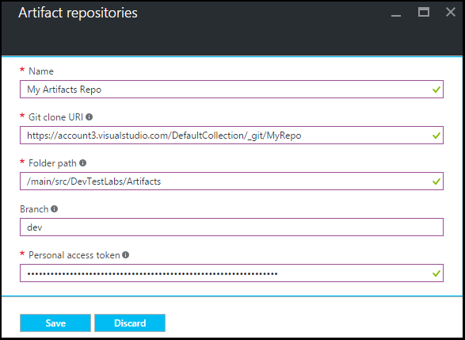

<properties
    pageTitle="Adicionar um repositório de artefato gito a um laboratório nos exercícios do Azure DevTest | Microsoft Azure"
    description="Adicionar um repositório GitHub ou Visual Studio equipe serviços gito para sua fonte de artefatos personalizado nos exercícios de DevTest do Azure"
    services="devtest-lab,virtual-machines,visual-studio-online"
    documentationCenter="na"
    authors="tomarcher"
    manager="douge"
    editor=""/>

<tags
    ms.service="devtest-lab"
    ms.workload="na"
    ms.tgt_pltfrm="na"
    ms.devlang="na"
    ms.topic="article"
    ms.date="09/06/2016"
    ms.author="tarcher"/>

# Adicionar um repositório de artefato gito a um laboratório nos exercícios de DevTest do Azure

> [AZURE.VIDEO how-to-add-your-private-artifacts-repository-in-a-devtest-lab]

Nos exercícios de DevTest do Azure, artefatos são *ações* - como instalar o software ou executar scripts e comandos - quando uma máquina virtual é criada. Por padrão, um laboratório inclui artefatos do repositório do artefato oficial do Azure DevTest Labs. Você pode adicionar um repositório de artefato gito ao seu laboratório para incluir os artefatos que sua equipe cria. O repositório pode ser hospedado em [GitHub](https://github.com) ou em [Equipe serviços VSTS (Visual Studio)](https://visualstudio.com).

- Para saber como criar um repositório de GitHub, consulte [GitHub Bootcamp](https://help.github.com/categories/bootcamp/).
- Para saber como criar um projeto de serviços de equipe com um repositório gito, consulte [conectar aos serviços de equipe do Visual Studio](https://www.visualstudio.com/get-started/setup/connect-to-visual-studio-online).

A captura de tela a seguir mostra um exemplo de como um repositório contendo artefatos fica no GitHub:  

## Obtenha as informações de repositório e credenciais

Para adicionar um repositório de artefato ao seu laboratório, você deve primeiro obter determinadas informações de seu repositório. As seções a seguir guiará obter essas informações para repositórios de artefato hospedado no GitHub e os serviços de equipe do Visual Studio.

### Obter a URL do GitHub repositório clonar e acesso pessoal token

Para obter a clonar de repositório GitHub URL e token de acesso pessoal, siga estas etapas:

1. Navegue até a home page do repositório GitHub que contém as definições de artefato.

1. Selecione **clonar ou download**.

1. Selecione o botão Copiar a **url de clonar HTTPS** na área de transferência e salve a URL para uso posterior.

1. Selecione a imagem de perfil no canto superior direito da GitHub e selecione **configurações**.

1. No menu **configurações pessoais** à esquerda, selecione **tokens de acesso pessoal**.

1. Selecione **novo símbolo de gerar**.

1. Na página **novo token de acesso pessoal** , insira uma **Descrição de Token**, aceite os itens padrão em **Selecionar escopos**e escolha **Gerar Token**.

1. Salve o token gerado precisá-la mais tarde.

1. Você pode fechar GitHub agora.   

1. Prossiga para a seção de [conectar seu laboratório no repositório de artefato](#connect-your-lab-to-the-artifact-repository) .

### Obter a URL do Visual Studio Team Services repositório clonar e acesso pessoal token

Para obter a URL do Visual Studio Team Services repositório clonar e o símbolo de acesso pessoal, siga estas etapas:

1. Abra a home page do seu conjunto de equipe (por exemplo, `https://contoso-web-team.visualstudio.com`) e, em seguida, selecione o projeto de artefato.

1. Na home page do projeto, selecione **código**.

1. Para exibir a URL de clonar, na página de **código** do projeto, selecione **clonar**.

1. Salve a URL precisá-la mais tarde neste tutorial.

1. Para criar um Token de acesso pessoal, selecione **Meu perfil** no menu de lista suspensa de conta de usuário.

1. Na página de informações do perfil, selecione **segurança**.

1. Na guia **segurança** , selecione **Adicionar**.

1. Na página **criar um token de acesso pessoal** :

    - Insira uma **Descrição** para o token.
    - Selecione **180 dias** **Expirar na** lista.
    - Escolha **todas as contas acessíveis** na lista de **contas** .
    - Escolha a opção de **todos os escopos** .
    - Escolha **criar Token**.

1. Quando terminar, o novo token aparece na lista **Pessoal Tokens de acesso** . Selecione **Token de cópia**e, em seguida, salve o valor de token para uso posterior.

1. Prossiga para a seção de [conectar seu laboratório no repositório de artefato](#connect-your-lab-to-the-artifact-repository) .

##Conectar seu laboratório ao repositório artefato

1. Entrar no [portal do Azure](http://go.microsoft.com/fwlink/p/?LinkID=525040).

1. Selecione **Mais serviços**e, em seguida, selecione **DevTest Labs** na lista.

1. Na lista de laboratórios, selecione o laboratório desejado.   

1. Na lâmina do laboratório, selecione **a configuração**.

1. Na lâmina de **configuração** do laboratório, selecione **Repositórios de artefatos**.

1. Na lâmina **Repositórios de artefatos** , selecione **+ Adicionar**.

    
 
1. Na segunda lâmina **Repositórios de artefatos** , especifique o seguinte:

    - **Nome** - Insira um nome para o repositório.
    - **Url de clonar gito** - insira a URL de clonar gito HTTPS que você copiou anteriormente do GitHub ou Visual Studio Team Services. 
    - **Caminho da pasta** - insira o caminho da pasta em relação a URL de clonar que contém suas definições de artefato.
    - **Ramificação** - insira a ramificação para acessar suas definições de artefato.
    - **O Token de acesso pessoal** - insira o token de acesso pessoal você obtido anteriormente o GitHub ou Visual Studio Team Services. 
     
    

1. Selecione **Salvar**.

[AZURE.INCLUDE [devtest-lab-try-it-out](../../includes/devtest-lab-try-it-out.md)]

## Postagens no blog relacionados
- [Como solucionar problemas de falhando artefatos no AzureDevTestLabs](http://www.visualstudiogeeks.com/blog/DevOps/How-to-troubleshoot-failing-artifacts-in-AzureDevTestLabs)
- [Ingressar em uma máquina virtual a domínio AD existente usando o modelo ARM no laboratório de teste de desenvolvimento do Azure](http://www.visualstudiogeeks.com/blog/DevOps/Join-a-VM-to-existing-AD-domain-using-ARM-template-AzureDevTestLabs)