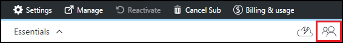

<properties
    pageTitle="Adicionar proprietários e usuários nos exercícios do Azure DevTest | Microsoft Azure"
    description="Adicionar proprietários e usuários nos exercícios de DevTest do Azure usando o portal do Azure ou PowerShell"
    services="devtest-lab,virtual-machines"
    documentationCenter="na"
    authors="tomarcher"
    manager="douge"
    editor=""/>

<tags
    ms.service="devtest-lab"
    ms.workload="na"
    ms.tgt_pltfrm="na"
    ms.devlang="na"
    ms.topic="article"
    ms.date="09/12/2016"
    ms.author="tarcher"/>

# Adicionar proprietários e usuários nos exercícios de DevTest do Azure

> [AZURE.VIDEO how-to-set-security-in-your-devtest-lab]

Acesso nos Azure DevTest exercícios é controlado pelo [Controle de acesso de Azure Role-Based (RBAC)](../active-directory/role-based-access-control-what-is.md). Usando RBAC, você pode separar os deveres dentro de sua equipe em *funções* onde você concede apenas a quantidade de acesso necessário aos usuários para executar suas tarefas. Três dessas funções RBAC são *proprietário*, *DevTest Labs usuário*e *Colaborador*. Neste artigo, você saiba quais ações podem ser executadas em cada uma das três funções RBAC principais. A partir daí, você saiba como adicionar usuários a um laboratório - através do portal e por meio de um script do PowerShell e como adicionar usuários do nível de assinatura.

## Ações que podem ser executadas em cada função

Há três funções principais que você pode atribuir um usuário:

- Proprietário
- DevTest Labs usuário
- Colaborador

A tabela a seguir ilustra as ações que podem ser executadas por usuários em cada uma dessas funções:

| **Ações os usuários nessa função podem realizar** | **DevTest Labs usuário**            | **Proprietário** | **Colaborador** |
|---|---|---|---|
| **Tarefas do laboratório**                          |                              |       |             |
| Adicionar usuários a um laboratório                     | Não                           | Sim   | Não          |
| Atualizar configurações de custo                   | Não                           | Sim   | Sim         |
| **Tarefas de base de máquina virtual**                      |                              |       |             |
| Adicionar e remover imagens personalizadas           | Não                           | Sim   | Sim         |
| Adicionar, atualizar e excluir fórmulas       | Sim                          | Sim   | Sim         |
| Imagens de branca Azure Marketplace     | Não                           | Sim   | Sim         |
| **Tarefas de máquina virtual**                           |                              |       |             |
| Criar VMs                             | Sim                          | Sim   | Sim         |
| Iniciar, parar e excluir VMs            | Somente VMs criadas pelo usuário | Sim   | Sim         |
| Atualizar diretivas de máquina virtual                     | Não                           | Sim   | Sim         |
| Adicionar/remover discos de dados de/para VMs      | Somente VMs criadas pelo usuário | Sim   | Sim         |
| **Tarefas de artefato**                     |                              |       |             |
| Adicionar e remover repositórios de artefato   | Não                           | Sim   | Sim         |
| Aplicar artefatos                        | Sim                          | Sim   | Sim         |

> [AZURE.NOTE] Quando um usuário cria uma máquina virtual, esse usuário é automaticamente atribuído à função de **proprietário** da máquina virtual criado.

## Adicionar um proprietário ou usuário do nível de laboratório

Proprietários e usuários podem ser adicionados no nível de laboratório através do portal Azure. Isso inclui usuários externos com uma [conta da Microsoft (MSA)](devtest-lab-faq.md#what-is-a-microsoft-account)de válida.
As etapas a seguir irão orientá-lo durante o processo de adicionar um proprietário ou usuário a um laboratório nos Azure DevTest exercícios:

1. Entrar no [portal do Azure](http://go.microsoft.com/fwlink/p/?LinkID=525040).

1. Selecione **mais serviços**e, em seguida, selecione **DevTest Labs** na lista.

1. Na lista de laboratórios, selecione o laboratório desejado.

1. Na lâmina do laboratório, selecione **a configuração**. 

1. Na lâmina **configuração** , selecione **usuários**.

1. Na lâmina **usuários** , selecione **+ Adicionar**.

    

1. Na lâmina **Selecione uma função** , selecione a função desejada. A seção [ações que podem ser executadas em cada função](#actions-that-can-be-performed-in-each-role) listas as várias ações que podem ser executadas por usuários no proprietário, DevTest usuário e funções de Colaborador.

1. Na lâmina **Adicionar usuários** , insira o endereço de email ou nome do usuário que você deseja adicionar na função especificada. Se o usuário não pode ser encontrado, uma mensagem de erro explica o problema. Se o usuário for encontrado, esse usuário é listado e selecionado. 

1. **Selecione.**

1. Selecione **Okey** para fechar a lâmina de **acesso de adicionar** .

1. Ao retornar para a lâmina de **usuários** , o usuário foi adicionado.  

## Adicionar um usuário externo para um laboratório usando o PowerShell

Além de adicionar usuários no portal do Azure, você pode adicionar um usuário externo para seu laboratório usando um script do PowerShell. No exemplo a seguir, basta modificar os valores de parâmetro sob o comentário de **valores para alterar** .
Você pode recuperar o `subscriptionId`, `labResourceGroup`, e `labName` valores da lâmina laboratório no portal do Azure.

> [AZURE.NOTE]
> O script de exemplo pressupõe que o usuário especificado foi adicionado como um convidado para o Active Directory e falhará se esse não for o caso. Para adicionar um usuário não no Active Directory a um laboratório, use o portal do Azure para atribuir o usuário a uma função, conforme ilustrado na seção, [Adicionar um proprietário ou usuário do nível de laboratório](#add-an-owner-or-user-at-the-lab-level).   

    # Add an external user in DevTest Labs user role to a lab
    # Ensure that guest users can be added to the Azure Active directory:
    # https://azure.microsoft.com/en-us/documentation/articles/active-directory-create-users/#set-guest-user-access-policies

    # Values to change
    $subscriptionId = "<Enter Azure subscription ID here>"
    $labResourceGroup = "<Enter lab's resource name here>"
    $labName = "<Enter lab name here>"
    $userDisplayName = "<Enter user's display name here>"

    # Log into your Azure account
    Login-AzureRmAccount
    
    # Select the Azure subscription that contains the lab. 
    # This step is optional if you have only one subscription.
    Select-AzureRmSubscription -SubscriptionId $subscriptionId
    
    # Retrieve the user object
    $adObject = Get-AzureRmADUser -SearchString $userDisplayName
    
    # Create the role assignment. 
    $labId = ('subscriptions/' + $subscriptionId + '/resourceGroups/' + $labResourceGroup + '/providers/Microsoft.DevTestLab/labs/' + $labName)
    New-AzureRmRoleAssignment -ObjectId $adObject.Id -RoleDefinitionName 'DevTest Labs User' -Scope $labId

## Adicionar um proprietário ou usuário do nível de assinatura

Permissões Azure são propagadas de escopo pai para escopo filho no Azure. Portanto, proprietários de uma assinatura do Azure que contém laboratórios são automaticamente proprietários desses laboratórios. Eles também possuem VMs e outros recursos criados por usuários do laboratório e o serviço do Azure DevTest Labs. 

Você pode adicionar proprietários adicionais para um laboratório via blade do laboratório no [portal do Azure](http://go.microsoft.com/fwlink/p/?LinkID=525040). No entanto, escopo do proprietário adicionado de administração é mais estreito que escopo do proprietário assinatura. Por exemplo, os proprietários adicionados não tem acesso completo a alguns dos recursos que são criados na assinatura pelo serviço DevTest Labs. 

Para adicionar um proprietário de uma assinatura do Azure, siga estas etapas:

1. Entrar no [portal do Azure](http://go.microsoft.com/fwlink/p/?LinkID=525040).

1. Selecione **Mais serviços**e, em seguida, selecione **assinaturas** na lista.

1. Selecione a assinatura desejada.

1. Selecione o ícone do **Access** . 

    

1. Na lâmina **usuários** , selecione **Adicionar**.

    

1. Na lâmina **Selecione uma função** , selecione o **proprietário**.

1. Na lâmina **Adicionar usuários** , insira o endereço de email ou nome do usuário que você deseja adicionar como um proprietário. Se o usuário não pode ser encontrado, você obterá uma mensagem de erro explicando o problema. Se o usuário for encontrado, esse usuário é listado sob a caixa de texto do **usuário** .

1. Selecione o nome de usuário localizada.

1. **Selecione.**

1. Selecione **Okey** para fechar a lâmina de **acesso de adicionar** .

1. Ao retornar para a lâmina de **usuários** , o usuário foi adicionado como um proprietário. Este usuário agora é o proprietário de todos os laboratórios criada sob esta assinatura e, portanto, poderá executar tarefas de proprietário. 

[AZURE.INCLUDE [devtest-lab-try-it-out](../../includes/devtest-lab-try-it-out.md)]
