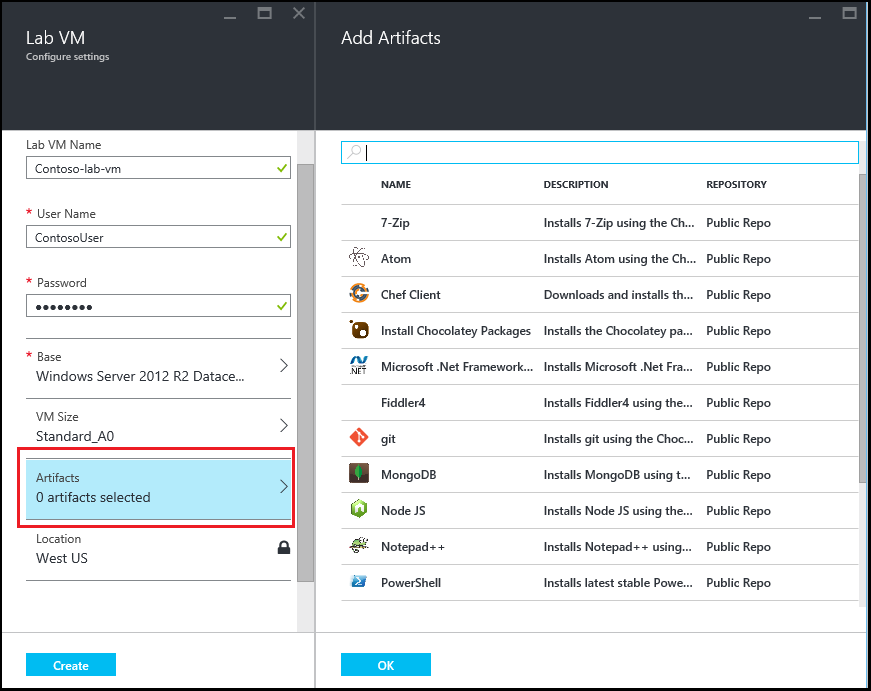
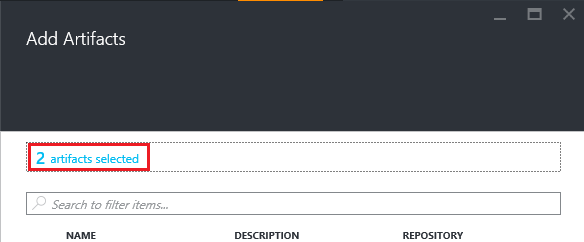

<properties
    pageTitle="Adicionar uma máquina virtual com artefatos a um laboratório nos exercícios do Azure DevTest | Microsoft Azure"
    description="Saiba como adicionar uma máquina virtual com artefatos nos exercícios de DevTest do Azure"
    services="devtest-lab,virtual-machines"
    documentationCenter="na"
    authors="tomarcher"
    manager="douge"
    editor=""/>

<tags
    ms.service="devtest-lab"
    ms.workload="na"
    ms.tgt_pltfrm="na"
    ms.devlang="na"
    ms.topic="article"
    ms.date="08/30/2016"
    ms.author="tarcher"/>

# Adicionar uma máquina virtual com artefatos a um laboratório nos exercícios de DevTest do Azure

> [AZURE.VIDEO how-to-create-vms-with-artifacts-in-a-devtest-lab]

Você pode criar uma máquina virtual em um laboratório de uma *base* que é uma [imagem personalizada](./devtest-lab-create-template.md), [fórmula](./devtest-lab-manage-formulas.md)ou [imagem de Marketplace](./devtest-lab-configure-marketplace-images.md).

DevTest Labs *artefatos* permitem especificar *ações* que são executadas quando a máquina virtual é criada. 

Ações de artefato podem realizar procedimentos como executar scripts do Windows PowerShell, executando Bash comandos e instalar o software. 

Artefato *parâmetros* permitem que você personalizar o artefato para sua situação específica.

Este artigo mostra como criar uma máquina virtual no seu laboratório com artefatos.

## Adicionar uma máquina virtual com artefatos

1. Entrar no [portal do Azure](http://go.microsoft.com/fwlink/p/?LinkID=525040).

1. Selecione **Mais serviços**e, em seguida, selecione **DevTest Labs** na lista.

1. Na lista de laboratórios, selecione o laboratório no qual você deseja criar a máquina virtual.  

1. Na lâmina de **Visão geral** do laboratório, selecione **+ Máquina Virtual**.  
    

1. Na lâmina **Escolher uma base** , selecione uma base para a máquina virtual.

1. Na **Máquina Virtual** lâmina, insira um nome para a nova máquina virtual na caixa de texto **nome da máquina Virtual** .

    

1. Insira um **Nome de usuário** que será concedido privilégios de administrador na máquina virtual.  

1. Se você quiser usar uma senha armazenada no seu *repositório secreto*, selecione **Use segredos meu Store secreta**e especificar um valor de chave que corresponde ao seu segredo (senha). Caso contrário, simplesmente digite uma senha no campo de texto, **Digite um valor**de rotulado.
 
1. Selecione o **tamanho da máquina Virtual** e selecione um dos itens predefinidos que especificar as cores de processador, tamanho de RAM e o tamanho do disco rígido da máquina virtual para criar.

1. Selecione a **rede Virtual** e a rede virtual desejada.

1. Selecione **sub-rede** e sub-rede.

1. Se a política de laboratório está definida para permitir que os endereços IP públicos sub-rede selecionada, especifique se deseja que o endereço IP a ser pública selecionando **Sim** ou **não**. Caso contrário, essa opção está desabilitada e selecionada como **não**. 

1. Selecione **artefatos** - na lista de artefatos - selecione e configurar os artefatos que você deseja adicionar à imagem base. 
**Observação:** Se você está começando a DevTest Labs ou artefatos configurando, pule para a seção [Adicionar um artefato existente para uma máquina virtual](#add-an-existing-artifact-to-a-vm) e retornar aqui quando terminar.

1. Se você quiser exibir ou copie o modelo do Gerenciador de recursos do Azure, pule para a seção do [Gerenciador de recursos do Azure Salvar modelo](#save-arm-template) e retornar aqui quando terminar.

1. Selecione **criar** para adicionar a máquina virtual especificada ao laboratório.

1. A lâmina de laboratório exibe o status de criação da VM; primeiro como **Criando**, em seguida, como a **execução** após a máquina virtual foi iniciado.

1. Vá para a seção [Próximas etapas](#next-steps) . 

## Adicionar um artefato existente a uma máquina virtual

Ao criar uma máquina virtual, você pode adicionar artefatos existentes. Cada laboratório inclui artefatos do público DevTest Labs artefato repositório bem como artefatos que você criou e adicionados ao seu próprio repositório artefato.
Para descobrir como criar artefatos, consulte o artigo, [Aprenda a criar seus próprio artefatos para uso com DevTest Labs](devtest-lab-artifact-author.md).

1. Na **Máquina Virtual** lâmina, selecione **artefatos**. 

1. Na lâmina **Adicionar artefatos** , selecione o artefato desejado.  

    

1. Insira os valores de parâmetro necessário e quaisquer parâmetros opcionais que você precisa.  

1. Selecione **Adicionar** para adicionar o artefato e retornar para a lâmina **Adicionar artefatos** .

1. Continue adicionando artefatos conforme necessário para sua máquina virtual.

1. Depois que você adicionou seu artefatos, você pode [alterar a ordem na qual os artefatos são executados](#change-the-order-in-which-artifacts-are-run). Você também pode ir novamente para [Exibir ou modificar um artefato](#view-or-modify-an-artifact).

## Alterar a ordem na qual artefatos são executados

Por padrão, as ações de artefatos são executadas na ordem em que eles são adicionados para a máquina virtual. As etapas a seguir ilustram como alterar a ordem na qual os artefatos são executados.

1. Na parte superior da lâmina **Artefatos adicionar** , selecione o link indicando o número de artefatos que foram adicionados para a máquina virtual.

    

1. Para especificar a ordem na qual os artefatos são executados, arraste e solte os artefatos na ordem desejada. **Observação:** Se você tiver conseguindo arrastando o artefato, certifique-se de que você está arrastando do lado esquerdo do artefato. 

1. Selecione **Okey** quando terminar.  

## Exibir ou modificar um artefato

As etapas a seguir ilustram como exibir ou modificar os parâmetros de um artefato:

1. Na parte superior da lâmina **Artefatos adicionar** , selecione o link indicando o número de artefatos que foram adicionados para a máquina virtual.

    

1. Na lâmina **Artefatos selecionada** , selecione o artefato que você deseja exibir ou editar.  

1. Na lâmina **Adicionar artefato** , faça as alterações necessárias e selecione **Okey** para fechar a lâmina **Adicionar artefato** .

1. Selecione **Okey** para fechar a lâmina **Artefatos selecionado** .

## Salvar modelo do Gerenciador de recursos do Azure

Um modelo do Gerenciador de recursos do Azure fornece uma maneira declarativa para definir uma implantação repetitiva. As etapas a seguir explicam como salvar o modelo do Gerenciador de recursos do Azure para a máquina virtual está sendo criada.
Depois de salvar, você pode usar o modelo do Gerenciador de recursos do Azure para [implantar novas VMs com o PowerShell do Azure](../azure-resource-manager/resource-group-overview.md#template-deployment).

1. Na **Máquina Virtual** lâmina, selecione **Modelo de exibição de ARM**.

1. No **modelo de exibição do Gerenciador de recursos de Azure blade**, selecione o texto do modelo.

1. Copie o texto selecionado para a área de transferência.

1. Selecione **Okey** para fechar o **modelo de exibição do Gerenciador de recursos de Azure blade**.

1. Abra um editor de texto.

1. Colar o texto do modelo da área de transferência.

1. Salve o arquivo para uso posterior.

[AZURE.INCLUDE [devtest-lab-try-it-out](../../includes/devtest-lab-try-it-out.md)]

## Próximas etapas

- Depois que a máquina virtual tiver sido criada, você pode conectar-se para a máquina virtual selecionando **Conectar** na lâmina da VM.
- Saiba como [criar artefatos personalizados para sua máquina virtual laboratórios de DevTest](devtest-lab-artifact-author.md).
- Explore a [Galeria de modelos de início rápido do DevTest Labs BRAÇO](https://github.com/Azure/azure-devtestlab/tree/master/ARMTemplates)