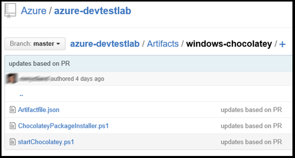

<properties 
    pageTitle="Criar artefatos personalizados para sua máquina virtual laboratórios de DevTest | Microsoft Azure"
    description="Aprenda a criar seus próprio artefatos para uso com DevTest Labs"
    services="devtest-lab,virtual-machines"
    documentationCenter="na"
    authors="tomarcher"
    manager="douge"
    editor=""/>

<tags
    ms.service="devtest-lab"
    ms.workload="na"
    ms.tgt_pltfrm="na"
    ms.devlang="na"
    ms.topic="article"
    ms.date="08/25/2016"
    ms.author="tarcher"/>

#Criar artefatos personalizados para sua máquina virtual laboratórios de DevTest

> [AZURE.VIDEO how-to-author-custom-artifacts] 

## Visão geral
**Artefatos** são usadas para implementar e configurar o seu aplicativo após uma máquina virtual está provisionada. Um artefato consiste em um arquivo de definição de artefato e outros arquivos de script que estão armazenados em uma pasta em um repositório gito. Arquivos de definição de artefato consistem em JSON e expressões que você pode usar para especificar o que você deseja instalar em uma máquina virtual. Por exemplo, você pode definir o nome do artefato, comando para executar e parâmetros que são disponibilizados quando o comando é executado. Você pode fazer referência a outros arquivos de script dentro do arquivo de definição de artefato por nome.

##Formato de arquivo de definição de artefato
O exemplo a seguir mostra as seções que compõem a estrutura básica de um arquivo de definição.

    {
      "$schema": "https://raw.githubusercontent.com/Azure/azure-devtestlab/master/schemas/2015-01-01/dtlArtifacts.json",
      "title": "",
      "description": "",
      "iconUri": "",
      "targetOsType": "",
      "parameters": {
        "<parameterName>": {
          "type": "",
          "displayName": "",
          "description": ""
        }
      },
      "runCommand": {
        "commandToExecute": ""
      }
    }

| Nome do elemento | Necessário? | Descrição
| ------------ | --------- | -----------
| $schema      | Não        | Local do arquivo do esquema JSON que ajuda no teste a validade do arquivo de definição de.
| título        | Sim       | Nome do artefato exibido no laboratório.
| Descrição  | Sim       | Descrição do artefato exibido no laboratório.
| iconUri      | Não        | URI do ícone exibido no laboratório.
| targetOsType | Sim       | Sistema operacional da máquina virtual onde artefato será instalado. Opções com suporte são: Windows e Linux.
| parâmetros   | Não        | Valores que são fornecidos quando o comando de instalação de artefato é executado em uma máquina. Isso ajuda a personalizar seu artefato.
| ExecutarComando   | Sim       | Artefato instalar o comando que é executado em uma máquina virtual.

###Parâmetros de artefato

Na seção parâmetros do arquivo de definição de, você especifica quais valores de um usuário pode inserir ao instalar um artefato. Você pode consultar esses valores no comando Instalar artefato.

Você define parâmetros será a seguinte estrutura.

    "parameters": {
        "<parameterName>": {
          "type": "<type-of-parameter-value>",
          "displayName": "<display-name-of-parameter>",
          "description": "<description-of-parameter>"
        }
      }

| Nome do elemento | Necessário? | Descrição
| ------------ | --------- | -----------
| tipo         | Sim       | Tipo de valor do parâmetro. Consulte a lista abaixo para tipos permitidos:
| displayName Sim       | Nome do parâmetro que é exibido para um usuário no laboratório.
| Descrição  | Sim       | Descrição do parâmetro que é exibido no laboratório.

Os tipos permitidos são:

- cadeia de caracteres – qualquer cadeia de caracteres JSON válida
- int – qualquer inteiro JSON válido
- bool – qualquer booliana JSON válido
- matriz – qualquer matriz JSON válido

##Funções e expressões de artefato

Você pode usar expressões e funções para construir o artefato o comando de instalação.
Expressões são colocadas entre colchetes ([e]) e são avaliados quando o artefato está instalado. Expressões podem aparecer em qualquer lugar em um valor de cadeia de caracteres JSON e retornar sempre outro valor JSON. Se você precisa usar uma cadeia de caracteres literal que começa com um colchete [, você deve usar dois colchetes [[.
Normalmente, você usar expressões com funções para construir um valor. Assim como em JavaScript, chamadas de função são formatadas como functionName(arg1,arg2,arg3)

A lista a seguir mostra funções comuns.

- Parameters(ParameterName) - retorna um valor de parâmetro que é fornecido quando o comando de artefato é executado.
- concat (arg1, arg2, arg3, …) combina vários valores de cadeia de caracteres. Esta função pode levar qualquer número de argumentos.

O exemplo a seguir mostra como usar expressões e funções para construir um valor.

    runCommand": {
         "commandToExecute": "[concat('powershell.exe -File startChocolatey.ps1'
    , ' -RawPackagesList ', parameters('packages')
    , ' -Username ', parameters('installUsername')
    , ' -Password ', parameters('installPassword'))]"
    }

##Criar um artefato personalizado

Crie seu artefato personalizado seguindo as etapas abaixo:

1. Instalar um editor de JSON, você precisará de um editor de JSON para trabalhar com arquivos de definição de artefato. É recomendável usar o [Código do Visual Studio](https://code.visualstudio.com/), que está disponível para Windows, Linux e OS X.

1. Obter um artifactfile.json de amostra - Check-out os artefatos criados pela equipe de Azure DevTest Labs em nosso [repositório GitHub](https://github.com/Azure/azure-devtestlab) onde criamos uma biblioteca avançada artefatos que ajudará você a criar suas própria artefatos. Baixe um arquivo de definição de artefato e fazer alterações a ele para criar seus próprio artefatos.

1. Certifique-se de usar do IntelliSense - Aproveite o IntelliSense para ver elementos válidos que podem ser usados para construir um arquivo de definição de artefato. Você também pode ver as diferentes opções para valores de um elemento. Por exemplo, IntelliSense mostram as duas opções do Windows ou Linux ao editar o elemento **targetOsType** .

1. Armazene o artefato em um repositório gito
    1. Crie um diretório separado para cada artefato onde o nome do diretório é a mesma que o nome de artefato.
    1. Armazene o arquivo de definição de artefato (artifactfile.json) na pasta que você criou.
    1. Armazene os scripts referenciadas do comando Instalar artefato.

    Aqui está um exemplo de como uma pasta de artefato pode parecer:

    

1. Adicionar o repositório de artefatos ao laboratório - consultem o artigo, [Adicionar um repositório de artefato gito para um laboratório](devtest-lab-add-artifact-repo.md).

[AZURE.INCLUDE [devtest-lab-try-it-out](../../includes/devtest-lab-try-it-out.md)]

## Postagens no blog relacionados
- [Como solucionar problemas de falhando artefatos no AzureDevTestLabs](http://www.visualstudiogeeks.com/blog/DevOps/How-to-troubleshoot-failing-artifacts-in-AzureDevTestLabs)
- [Ingressar em uma máquina virtual a domínio AD existente usando o modelo ARM no laboratório de teste de desenvolvimento do Azure](http://www.visualstudiogeeks.com/blog/DevOps/Join-a-VM-to-existing-AD-domain-using-ARM-template-AzureDevTestLabs)

## Próximas etapas

- Saiba como [Adicionar um repositório de artefato gito para um laboratório](devtest-lab-add-artifact-repo.md).
