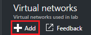
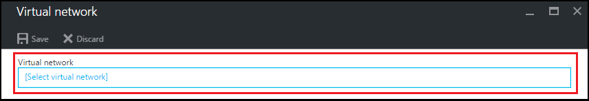

<properties
    pageTitle="Configurar uma rede virtual nos exercícios do Azure DevTest | Microsoft Azure"
    description="Saiba como configurar uma rede virtual existente e sub-rede e usá-las em uma máquina virtual com laboratórios de DevTest do Azure"
    services="devtest-lab,virtual-machines"
    documentationCenter="na"
    authors="tomarcher"
    manager="douge"
    editor=""/>

<tags
    ms.service="devtest-lab"
    ms.workload="na"
    ms.tgt_pltfrm="na"
    ms.devlang="na"
    ms.topic="article"
    ms.date="09/06/2016"
    ms.author="tarcher"/>

# Configurar uma rede virtual nos exercícios de DevTest do Azure

Conforme explicado no artigo, [Adicionar uma máquina virtual com artefatos para um laboratório](devtest-lab-add-vm-with-artifacts.md), quando você cria uma máquina virtual em um laboratório, você pode especificar uma rede virtual configurada. Um cenário para fazer isso é se você precisa para acessar os recursos da sua rede corporativa de suas VMs usando a rede virtual que foi configurada com rota expressa ou -to-site VPN. As seções a seguir ilustram como adicionar sua rede virtual existente em configurações de rede Virtual de um laboratório para que fique disponível para escolher ao criar VMs.

## Configurar uma rede virtual para um laboratório usando o portal do Azure
As etapas a seguir orientam com adicionando uma rede virtual existente (e sub-rede) para um laboratório para que ele pode ser usado durante a criação de uma máquina virtual no mesmo laboratório. 

1. Entrar no [portal do Azure](http://go.microsoft.com/fwlink/p/?LinkID=525040).

1. Selecione **Mais serviços**e, em seguida, selecione **DevTest Labs** na lista.

1. Na lista de laboratórios, selecione o laboratório desejado. 

1. Na lâmina do laboratório, selecione **a configuração**.

1. Na lâmina de **configuração** do laboratório, selecione **redes virtuais**.

1. A lâmina de **redes virtuais** , você veja uma lista de redes virtuais configurados para o laboratório atual, bem como a rede virtual padrão que é criada para seu laboratório. 

1. Selecione **+ Adicionar**.

    
    
1. Na lâmina **rede Virtual** , selecione **[rede virtual]**.

    
    
1. Na lâmina **Escolher uma rede virtual** , selecione a rede virtual desejada. A lâmina mostra todas as redes virtuais que estão sob a mesma região na assinatura como o laboratório.  

1. Depois de selecionar uma rede virtual, você voltará para a lâmina de **rede Virtual** e vários campos são habilitados.  

    

1. Especifique uma descrição para sua rede virtual / combinação de laboratório.

1. Para permitir que uma sub-rede a ser usado em laboratório de criação de máquina virtual, selecione **Usar em criação de máquina VIRTUAL**.

1. Para permitir que os endereços IP públicos de uma sub-rede, selecione **Permitir IP público**.

1. No campo **Máximo máquinas virtuais por usuário** , especifique as VMs máximos por usuário para cada sub-rede. Se desejar que um número irrestrito de VMs, deixe este campo em branco.

1. Selecione **Salvar**.

1. Agora que a rede virtual estiver configurada, ele pode ser selecionado ao criar uma máquina virtual. Para saber como criar uma máquina virtual e especificar uma rede virtual, consulte o artigo [Adicionar uma máquina virtual com artefatos para um laboratório](devtest-lab-add-vm-with-artifacts.md). 

[AZURE.INCLUDE [devtest-lab-try-it-out](../../includes/devtest-lab-try-it-out.md)]

## Próximas etapas

Depois que você adicionou a rede virtual desejada para seu laboratório, a próxima etapa é [Adicionar uma máquina virtual para seu laboratório](devtest-lab-add-vm-with-artifacts.md).