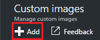

<properties
    pageTitle="Gerenciar imagens personalizadas do Azure DevTest Labs para criar VMs | Microsoft Azure"
    description="Saiba como criar uma imagem personalizada a partir de um arquivo VHD ou uma máquina virtual existente nos exercícios de DevTest do Azure"
    services="devtest-lab,virtual-machines"
    documentationCenter="na"
    authors="tomarcher"
    manager="douge"
    editor=""/>

<tags
    ms.service="devtest-lab"
    ms.workload="na"
    ms.tgt_pltfrm="na"
    ms.devlang="na"
    ms.topic="article"
    ms.date="09/07/2016"
    ms.author="tarcher"/>

# Gerenciar imagens personalizadas do Azure DevTest Labs para criar VMs

Nos exercícios de DevTest do Azure, imagens personalizadas permitem criar VMs rapidamente sem aguardar todos os softwares necessários ser instalado na máquina de destino. Imagens personalizadas permitem previamente instalar todo o software que você precisa em um arquivo VHD e, em seguida, usam o arquivo VHD para criar uma máquina virtual. Como o software já estiver instalado, a hora de criação de máquina virtual é muito mais rápida. Além disso, as imagens personalizadas são usadas para clonar VMs, criando uma imagem personalizada a partir de uma máquina virtual e, em seguida, criando VMs partir dessa imagem personalizada.

Neste artigo, você vai aprender como:

- [Criar uma imagem personalizada de um arquivo VHD](#create-a-custom-image-from-a-vhd-file) para que você pode criar uma máquina virtual de imagem personalizada. 
- [Criar uma imagem personalizada de uma máquina virtual](#create-a-custom-image-from-a-vm) para clonagem rápida de máquina virtual.

## Criar uma imagem personalizada de um arquivo VHD

Nesta seção, você verá como criar uma imagem personalizada de um arquivo VHD.
Você precisa de acesso para um arquivo VHD válido para realizar todas as etapas nesta seção.   

1. Entrar no [portal do Azure](http://go.microsoft.com/fwlink/p/?LinkID=525040).

1. Selecione **mais serviços**e, em seguida, selecione **DevTest Labs** na lista.

1. Na lista de laboratórios, selecione o laboratório desejado.  

1. Na lâmina do laboratório, selecione **a configuração**. 

1. Na lâmina **configuração** laboratório, selecione **imagens de personalizado**.

1. Na lâmina **imagens personalizadas** , selecione **+ imagem personalizada**.

    

1. Insira o nome da imagem personalizada. Esse nome é exibido na lista de imagens de base ao criar uma máquina virtual.

1. Insira a descrição da imagem personalizada. Essa descrição é exibida na lista de imagens de base ao criar uma máquina virtual.

1. Selecione o **arquivo VHD**.

1. Se você tiver acesso a um arquivo VHD que não esteja listado, adicioná-la seguindo as instruções na seção [carregar um arquivo VHD](#upload-a-vhd-file) e retorne aqui quando terminar.

1. Selecione o arquivo VHD desejado.

1. Selecione **Okey** para fechar o **Arquivo VHD** blade.

1. Selecione **a configuração do sistema operacional**.

1. Na guia **Configuração do sistema operacional** , selecione **Windows** ou **Linux**.

1. Se o **Windows** está selecionado, especifique via a caixa de seleção se *Sysprep* foi executado na máquina.

1. Selecione **Okey** para fechar a lâmina de **Configuração do sistema operacional** .

1. Selecione **Okey** para criar a imagem personalizada.

1. Vá para a seção [Próximas etapas](#next-steps) .

###Carregar um arquivo VHD

Para adicionar uma imagem personalizada, você precisa ter acesso a um arquivo VHD.

1. Na lâmina **Arquivo VHD** , selecione **carregar um arquivo VHD usando o PowerShell**.

    

1. A próxima lâmina exibirão instruções para modificar e executar um script do PowerShell que carrega à sua assinatura do Azure um arquivo VHD. 
**Observação:** Esse processo pode ser demorado dependendo do tamanho do arquivo VHD e a velocidade de sua conexão.

## Criar uma imagem personalizada a partir de uma máquina virtual
Se você tiver uma máquina virtual que já está configurada, você pode criar uma imagem personalizada a partir dessa máquina virtual e depois usar imagem personalizada para criar outras VMs idênticos. As etapas a seguir ilustram como criar uma imagem personalizada de uma máquina virtual:

1. Entrar no [portal do Azure](http://go.microsoft.com/fwlink/p/?LinkID=525040).

1. Selecione **mais serviços**e, em seguida, selecione **DevTest Labs** na lista.

1. Na lista de laboratórios, selecione o laboratório desejado.  

1. Na lâmina do laboratório, selecione **Minhas máquinas virtuais**.
 
1. Na lâmina **Minhas máquinas virtuais** , selecione a máquina virtual do qual você deseja criar a imagem personalizada.

1. Na lâmina da VM, selecione **Criar imagem personalizada (VHD)**.

    

1. Na lâmina **Criar imagem** , insira um nome e uma descrição para sua imagem personalizada. Essas informações são exibidas na lista de bases quando você cria uma máquina virtual.

    

1. Selecione se sysprep foi executado na máquina virtual. Se o sysprep não foi executado na máquina virtual, especifique se você deseja sysprep executado quando uma máquina virtual é criada a partir dessa imagem personalizada.

1. Selecione **Okey** quando terminar de criar a imagem personalizada.

[AZURE.INCLUDE [devtest-lab-try-it-out](../../includes/devtest-lab-try-it-out.md)]

## Postagens no blog relacionados

- [Imagens personalizadas ou fórmulas?](https://blogs.msdn.microsoft.com/devtestlab/2016/04/06/custom-images-or-formulas/)
- [Copiando imagens personalizadas entre Azure DevTest laboratórios](http://www.visualstudiogeeks.com/blog/DevOps/How-To-Move-CustomImages-VHD-Between-AzureDevTestLabs#copying-custom-images-between-azure-devtest-labs)

##Próximas etapas

Depois de adicionar uma imagem personalizada para usar ao criar uma máquina virtual, a próxima etapa é [Adicionar uma máquina virtual para seu laboratório](./devtest-lab-add-vm-with-artifacts.md).