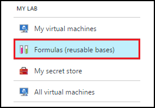

<properties
    pageTitle="Gerenciar fórmulas nos exercícios de DevTest do Azure para criar VMs | Microsoft Azure"
    description="Aprenda a criar, atualizar e remova Azure DevTest Labs fórmulas e usá-los para criar novas VMs."
    services="devtest-lab,virtual-machines"
    documentationCenter="na"
    authors="tomarcher"
    manager="douge"
    editor=""/>

<tags
    ms.service="devtest-lab"
    ms.workload="na"
    ms.tgt_pltfrm="na"
    ms.devlang="na"
    ms.topic="article"
    ms.date="08/30/2016"
    ms.author="tarcher"/>

# Gerenciar fórmulas de DevTest Labs para criar VMs

Uma fórmula nos Azure DevTest exercícios é uma lista de valores de propriedade padrão usado para criar uma máquina virtual (VM). Ao criar uma máquina virtual de uma fórmula, os valores padrão podem ser usados como-é ou modificado. Como [imagens personalizadas](./devtest-lab-create-template.md) e [imagens do Marketplace](./devtest-lab-configure-marketplace-images.md), fórmulas fornecem um mecanismo de provisionamento rápido de máquina virtual.  

Neste artigo, você aprenderá a executar as seguintes tarefas:

- [Criar uma fórmula](#create-a-formula)
- [Usar uma fórmula para provisionar uma máquina virtual](#use-a-formula-to-provision-a-vm)
- [Modificar uma fórmula](#modify-a-formula)
- [Excluir uma fórmula](#delete-a-formula)

> [AZURE.NOTE] Fórmulas - como [imagens personalizadas](./devtest-lab-create-template.md) - permitem que você criar uma imagem base de um arquivo VHD. A imagem base, em seguida, pode ser usada para provisionar uma nova VM. Para ajudar a decidir o que é adequado para seu ambiente específico, consulte o artigo [imagens personalizadas comparando e fórmulas nos exercícios de DevTest](./devtest-lab-comparing-vm-base-image-types.md).

## Criar uma fórmula
Qualquer pessoa com permissões de DevTest Labs *usuários* é capaz de criar VMs usando uma fórmula como base. Há duas maneiras de criar fórmulas: 

- A partir de uma base - Use quando desejar definir todas as características da fórmula.
- De um laboratório existente máquina virtual - Use quando desejar criar uma fórmula com base nas configurações de uma máquina virtual existente.

### Criar uma fórmula de uma base
As etapas a seguir orientação você durante o processo de criação de uma fórmula de uma imagem personalizada, imagem Marketplace ou outra fórmula.

1. Entrar no [portal do Azure](http://go.microsoft.com/fwlink/p/?LinkID=525040).

1. Selecione **Mais serviços**e, em seguida, selecione **DevTest Labs** na lista.

1. Na lista de laboratórios, selecione o laboratório desejado.  

1. Na lâmina do laboratório, selecione **fórmulas (bases reutilizáveis)**.

    

1. Na lâmina **fórmulas de laboratório** , selecione **+ Adicionar**.

    

1. Na lâmina **Escolher uma base** , selecione a base (imagem personalizada, imagem Marketplace ou fórmula) do qual você deseja criar a fórmula.

    

1. Na lâmina **Criar fórmula** , especifique os seguintes valores:

    - **Nome de fórmula** - Insira um nome para sua fórmula. Este valor será exibido na lista de imagens base quando você cria uma máquina virtual. O nome é validado conforme você digita-la e se não é válido, uma mensagem indicará os requisitos para um nome válido.
    - **Descrição** - insira uma descrição significativa para sua fórmula. Este valor está disponível no menu de contexto da fórmula quando você cria uma máquina virtual.
    - **Nome de usuário** - Insira um nome de usuário que será concedido privilégios de administrador.
    - **Senha** - Insira - ou selecione na lista suspensa - um valor que está associado com o segredo (senha) que você deseja usar para o usuário especificado.  
    - **Imagem** - este campo exibe o nome da imagem base selecionado na lâmina anterior. 
    - **Tamanho da máquina Virtual** - selecione um dos itens predefinidos que especificar as cores de processador, tamanho de RAM e o tamanho do disco rígido da máquina virtual para criar.
    - **Rede Virtual** - especificar a rede virtual desejada.
    - **Sub-rede** - especificar a sub-rede desejada.
    - **Endereço IP público** - se a política de laboratório é definida para permitir endereços IP públicos sub-rede selecionada, especifique se deseja que o endereço IP a ser pública selecionando **Sim** ou **não**. Caso contrário, essa opção está desabilitada e selecionada como **não**.
    - **Artefatos** - selecionar e configurar os artefatos que você deseja adicionar à imagem base. Proteger a cadeia de caracteres de valores não são salvos com a fórmula. Portanto, os parâmetros de artefato que são cadeias de caracteres de seguras não são exibidos. 

        

1. Selecione **criar** para criar a fórmula.

### Criar uma fórmula de uma máquina virtual
As etapas a seguir irão orientá-lo durante o processo de criação de uma fórmula com base em uma máquina virtual existente. 

> [AZURE.NOTE] Para criar uma fórmula de uma máquina virtual, a máquina virtual deve ter sido criada após 30 de março de 2016. 

1. Entrar no [portal do Azure](http://go.microsoft.com/fwlink/p/?LinkID=525040).

1. Selecione **Mais serviços**e, em seguida, selecione **DevTest Labs** na lista.

1. Na lista de laboratórios, selecione o laboratório desejado.  

1. Na lâmina de **Visão geral** do laboratório, selecione a máquina virtual do qual você deseja criar a fórmula.

    

1. Na lâmina da VM, selecione **Criar fórmula (base reutilizável)**.

    

1. Na lâmina **Criar fórmula** , insira um **nome** e uma **Descrição** para sua nova fórmula.

    

1. Selecione **Okey** para criar a fórmula.

## Usar uma fórmula para provisionar uma máquina virtual
Depois de criar uma fórmula, você pode criar uma máquina virtual com base na fórmula. A seção [Adicionar uma máquina virtual com artefatos](devtest-lab-add-vm-with-artifacts.md#add-a-vm-with-artifacts) orienta você pelo processo.

## Modificar uma fórmula
Para modificar uma fórmula, siga estas etapas:

1. Entrar no [portal do Azure](http://go.microsoft.com/fwlink/p/?LinkID=525040).

1. Selecione **Mais serviços**e, em seguida, selecione **DevTest Labs** na lista.

1. Na lista de laboratórios, selecione o laboratório desejado.  

1. Na lâmina do laboratório, selecione **fórmulas (bases reutilizáveis)**.

    

1. Na lâmina **fórmulas de laboratório** , selecione a fórmula que você deseja modificar.

1. Na lâmina **atualizar fórmula** , faça as edições desejadas e selecione **Atualizar**.

## Excluir uma fórmula 
Para excluir uma fórmula, siga estas etapas:

1. Entrar no [portal do Azure](http://go.microsoft.com/fwlink/p/?LinkID=525040).

1. Selecione **Mais serviços**e, em seguida, selecione **DevTest Labs** na lista.

1. Na lista de laboratórios, selecione o laboratório desejado.  

1. Na lâmina laboratório **configurações** , selecione **fórmulas**.

    

1. Na lâmina **fórmulas de laboratório** , selecione as reticências à direita da fórmula que você deseja excluir.

    

1. No menu de contexto da fórmula, selecione **Excluir**.

    

1. Selecione **Sim** na caixa de diálogo de confirmação de exclusão.

[AZURE.INCLUDE [devtest-lab-try-it-out](../../includes/devtest-lab-try-it-out.md)]

## Postagens no blog relacionados

- [Imagens personalizadas ou fórmulas?](https://blogs.msdn.microsoft.com/devtestlab/2016/04/06/custom-images-or-formulas/)

## Próximas etapas
Quando você tiver criado uma fórmula para usar ao criar uma máquina virtual, a próxima etapa é [Adicionar uma máquina virtual para seu laboratório](./devtest-lab-add-vm-with-artifacts.md).