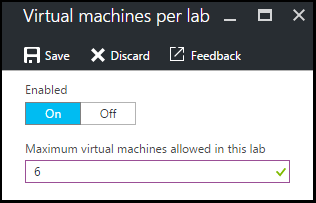

<properties
    pageTitle="Definir políticas de laboratório nos exercícios do Azure DevTest | Microsoft Azure"
    description="Aprenda a definir políticas de laboratório como tamanhos de máquina virtual, VMs máximos por usuário e a automação de desligamento."
    services="devtest-lab,virtual-machines"
    documentationCenter="na"
    authors="tomarcher"
    manager="douge"
    editor=""/>

<tags
    ms.service="devtest-lab"
    ms.workload="na"
    ms.tgt_pltfrm="na"
    ms.devlang="na"
    ms.topic="article"
    ms.date="09/12/2016"
    ms.author="tarcher"/>

# Definir políticas de laboratório nos exercícios de DevTest do Azure

> [AZURE.VIDEO how-to-set-vm-policies-in-a-devtest-lab]

Azure Labs DevTest permite que você especifique as diretivas de chave que ajudam você a controlar custos e minimizar desperdício nos seus exercícios. Essas políticas de laboratório incluem o número máximo de VMs criado por usuário e por laboratório e diversas opções de autodesligamento e início automático. 

## Acessando políticas de um laboratório nos exercícios de DevTest do Azure

As etapas a seguir guiará configurando políticas para um laboratório nos Azure DevTest exercícios:

Para exibir (e alterar) as políticas para um laboratório, siga estas etapas:

1. Entrar no [portal do Azure](http://go.microsoft.com/fwlink/p/?LinkID=525040).

1. Selecione **mais serviços**e, em seguida, selecione **DevTest Labs** na lista.

1. Na lista de laboratórios, selecione o laboratório desejado.   

1. Selecione **configurações de política**.

1. A lâmina de **configurações de política** contém um menu de configurações que você pode especificar: 

    

    Para saber mais sobre como definir uma política, selecione-o na lista a seguir:

    - [Tamanhos de máquina virtual permitidos](#set-allowed-virtual-machine-sizes) - selecione a lista de tamanhos de máquina virtual permitida no laboratório. Um usuário pode criar VMs somente a partir dessa lista.

    - [Máquinas virtuais por usuário](#set-virtual-machines-per-user) - especifique o número máximo de VMs que podem ser criados por um usuário. 

    - [Máquinas virtuais por laboratório](#set-virtual-machines-per-lab) - especificar o número máximo de VMs que pode ser criada para um laboratório. 

    - [Autodesligamento](#set-auto-shutdown) - especifique o horário quando o laboratório atual do VMs desligadas automaticamente.

    - [Início automático](#set-auto-start) - especifique o horário quando VMs do laboratório atual inicializam automaticamente o.

## Definir permitido tamanhos de máquina virtual

A política de configuração os tamanhos de máquina virtual permitidos ajuda a minimizar desperdício de laboratório, permitindo que você especifique quais tamanhos de máquina virtual são permitidos no laboratório. Se esta política estiver ativada, apenas os tamanhos de máquina virtual dessa lista podem ser usados para criar VMs.

1. Na lâmina de **configurações de política** do laboratório, selecione **tamanhos de máquinas virtuais do permitidos**.

    
 
1. Selecione **** para habilitar essa política e **Desativar** para desabilitá-lo.

1. Se você habilitar esta política, selecione um ou mais tamanhos de máquina virtual que podem ser criados em seu laboratório.

1. Selecione **Salvar**.

## Conjunto de máquinas virtuais por usuário

A política para **máquinas virtuais por usuário** permite especificar o número máximo de VMs que podem ser criados por um usuário individual. Se um usuário tentar criar uma máquina virtual quando o limite de usuário foi atendido, uma mensagem de erro indica que a máquina virtual não pode ser criada. 

1. Na lâmina de **configurações de política** do laboratório, selecione **máquinas virtuais por usuário**.

    

1. Selecione **** para habilitar essa política e **Desativar** para desabilitá-lo.

1. Se você habilitar esta política, insira um valor numérico que indica o número máximo de VMs que podem ser criados por um usuário. Se você inserir um número que não é válido, a interface do usuário exibe o número máximo permitido para este campo.

1. Selecione **Salvar**.

## Conjunto de máquinas virtuais por laboratório

A política de **máquinas virtuais por laboratório** permite especificar o número máximo de VMs que podem ser criadas para o laboratório atual. Se um usuário tentar criar uma máquina virtual quando o limite de laboratório foi atendido, uma mensagem de erro indica que a máquina virtual não pode ser criada. 

1. Na lâmina de **configurações de política** do laboratório, selecione **máquinas virtuais por laboratório**.

    

1. Selecione **** para habilitar essa política e **Desativar** para desabilitá-lo.

1. Se você habilitar esta política, insira um valor numérico que indica o número máximo de VMs que podem ser criadas para o laboratório atual. Se você inserir um número que não é válido, a interface do usuário exibe o número máximo permitido para este campo.

1. Selecione **Salvar**.

## Definir autodesligamento

A política de desligamento automático ajuda a minimizar desperdício de laboratório, permitindo que você especifique o tempo que VMs deste laboratório desligadas.

1. Na lâmina de **configurações de política** do laboratório, selecione **desligamento automático**.

    

1. Selecione **** para habilitar essa política e **Desativar** para desabilitá-lo.

1. Se você habilitar esta política, especifique o horário local para desligar todas VMs no laboratório atual.

1. Selecione **Salvar**.

1. Por padrão, uma vez habilitada, esta política se aplica a todas as VMs no laboratório atual. Para remover esta configuração de uma máquina virtual específica, abra blade da VM e altere a configuração de **desligamento automático** 

## Definir início automático

A política de início automático permite especificar quando as VMs no laboratório atual devem ser iniciadas.  

1. Na lâmina de **configurações de política** do laboratório, selecione **início automático**.

    

1. Selecione **** para habilitar essa política e **Desativar** para desabilitá-lo.

1. Se você habilitar esta política, especifique o local agendado começar a hora e os dias da semana em que o tempo se aplica. 

1. Selecione **Salvar**.

1. Quando ativada, essa política não é automaticamente aplicada a qualquer VMs no laboratório atual. Para aplicar essa configuração a uma máquina virtual específica, abra blade da VM e altere a configuração de **início automático** 

[AZURE.INCLUDE [devtest-lab-try-it-out](../../includes/devtest-lab-try-it-out.md)]

## Próximas etapas

Depois de definido e aplicado as diversas configurações de política de máquina virtual para seu laboratório, aqui estão algumas coisas para experimentar Avançar:

- [Configurar gerenciamento de custos](./devtest-lab-configure-cost-management.md) - ilustra como usar o gráfico de **Tendência de custo estimado mensal**  
Para exibir o mês atual do estimada custo acumulado e o custo projetado de final de mês.
- [Criar imagem personalizada](./devtest-lab-create-template.md) - quando você cria uma máquina virtual, você especificar uma base, que pode ser uma imagem personalizada ou uma imagem de Marketplace. Este artigo ilustra como criar uma imagem personalizada de um arquivo VHD.
- [Imagens do Marketplace configurar](./devtest-lab-configure-marketplace-images.md) - Azure DevTest Labs dá suporte à criação de VMs com base em imagens do Azure Marketplace. Este artigo ilustra como especificar que, se houver, imagens do Azure Marketplace podem ser usadas ao criar VMs em um laboratório.
- [Criar uma máquina virtual em um laboratório](./devtest-lab-add-vm-with-artifacts.md) - ilustra como criar uma máquina virtual de uma imagem base (qualquer personalizada ou Marketplace) e como trabalhar com artefatos em sua máquina virtual.
