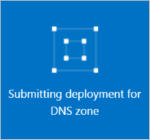

<properties
   pageTitle="Como criar e gerenciar uma zona DNS no portal do Azure | Microsoft Azure"
   description="Aprenda a criar zonas DNS para o DNS do Azure. Este é um guia passo a passo para criar e gerenciar seu DNS primeiro e iniciar o seu domínio DNS usando o portal de Azure de hospedagem."
   services="dns"
   documentationCenter="na"
   authors="sdwheeler"
   manager="carmonm"
   editor=""
   tags="azure-resource-manager"/>

<tags
   ms.service="dns"
   ms.devlang="na"
   ms.topic="article"
   ms.tgt_pltfrm="na"
   ms.workload="infrastructure-services"
   ms.date="08/16/2016"
   ms.author="sewhee"/>

# Criar uma zona DNS no portal do Azure

> [AZURE.SELECTOR]
- [Portal do Azure](dns-getstarted-create-dnszone-portal.md)
- [PowerShell](dns-getstarted-create-dnszone.md)
- [CLI Azure](dns-getstarted-create-dnszone-cli.md)

Este artigo o orientará pelas etapas para criar uma zona DNS usando o portal do Azure. Você também pode criar uma zona DNS usando o PowerShell ou CLI.

[AZURE.INCLUDE [dns-create-zone-about](../../includes/dns-create-zone-about-include.md)]

### Sobre marcas para DNS Azure

Marcas são uma lista de pares de valor de nome e são usadas pelo Gerenciador de recursos do Azure para os recursos de etiqueta para fins de cobranças ou de agrupamento. Para obter mais informações sobre marcas, consulte o artigo [usando marcas para organizar seus recursos Azure](../resource-group-using-tags.md).

Você pode adicionar marcas no portal do Azure usando a lâmina de **configurações** para a zona DNS.

## Criar uma zona DNS

1. Entre portal do Azure

2. No menu Hub, clique em e em **Novo > rede >** e, em seguida, clique em **zona de DNS** para abrir a lâmina de zona DNS.

    

3. Na lâmina **zona DNS** , clique em **criar** na parte inferior. Isso abrirá a lâmina de **zona DNS criar** .

    

4. Na **zona DNS criar** lâmina, Nomeie sua zona DNS. Por exemplo, *contoso.com*. Consulte [Sobre nomes de zona de DNS](#names) na seção acima.

5. Em seguida, especifique o grupo de recursos que você deseja usar. Você pode criar um novo grupo de recursos, ou selecione um já existente.

6. No menu suspenso de **local** , especifique o local do grupo de recursos. Observe que essa configuração refere-se para o local do grupo de recursos, não o local de zona DNS. O recurso de zona DNS real é automaticamente "global" e não é algo que você pode (ou precisa) especificar no portal.

7. Você pode deixar a caixa de seleção **Fixar a painel** selecionada se você quiser localizar facilmente a sua nova região em seu painel. Clique em **criar**.

    

8. Após você clicar em criar, você verá sua nova zona sejam configurada no painel.

    

9. Quando sua nova zona tiver sido criada, a lâmina para sua nova zona será aberto no painel.

## Exibir registros

Criando uma zona DNS também cria os registros a seguir:

- O registro de "Início de autoridade" (SOA). A SOA está presente na raiz de cada zona DNS.
- Os registros de servidor de (nomes NS) autoritativas nome. Eles mostram quais servidores de nome estiver hospedando a zona. DNS Azure usa um pool de servidores de nomes e tão diferentes servidores de nomes podem ser atribuídos para diferentes regiões no Azure DNS. Consulte o [representante um domínio ao Azure DNS](dns-domain-delegation.md) para obter mais informações.

Você pode exibir os registros do portal do Azure

1. Da sua lâmina de **zona DNS** , clique em **todas as configurações** para abrir a **lâmina de configurações** para a zona DNS.

    

2. Na parte inferior do painel Essentials, você pode ver que o registro define para a zona DNS.

    

## Teste

Você pode testar sua zona DNS usando ferramentas de DNS como nslookup, cavar ou o [cmdlet do PowerShell DnsName resolver](https://technet.microsoft.com/library/jj590781.aspx).

Se você ainda não tiver delegada seu domínio para usar a nova zona no Azure DNS, você precisará direcionar a consulta DNS diretamente para um dos servidores de nomes para sua região. Os servidores de nomes para sua zona recebem nos registros NS, conforme listado por `Get-AzureRmDnsRecordSet` acima. Certifique-se a substituir os valores corretos para sua região para o comando a seguir.

    nslookup
    > set type=SOA
    > server ns1-01.azure-dns.com
    > contoso.com

    Server: ns1-01.azure-dns.com
    Address:  208.76.47.1

    contoso.com
            primary name server = ns1-01.azure-dns.com
            responsible mail addr = msnhst.microsoft.com
            serial  = 1
            refresh = 900 (15 mins)
            retry   = 300 (5 mins)
            expire  = 604800 (7 days)
            default TTL = 300 (5 mins)

## Excluir uma zona DNS

Você pode excluir a zona DNS diretamente do portal. Antes de excluir uma zona DNS no DNS do Azure, você precisará excluir todos os conjuntos de registros, exceto para os registros NS e SOA na raiz da zona que foram criados automaticamente quando a zona foi criada.

1. Localize a lâmina de **zona de DNS** para a zona que você deseja excluir e, em seguida, clique em **Excluir** na parte superior da lâmina.

2. Será exibida uma mensagem informando que você deve excluir todos os conjuntos de registros, exceto os registros NS e SOA que foram criados automaticamente. Se você tiver excluído seus conjuntos de registros, clique em **Sim**. Observe que, ao excluir uma zona DNS a partir do portal, grupo de recursos que a zona DNS está associada não será excluído.

## Próximas etapas

Depois de criar uma zona DNS, crie [conjuntos de registro e registros](dns-getstarted-create-recordset-portal.md) para iniciar a resolução de nomes do seu domínio da Internet.
