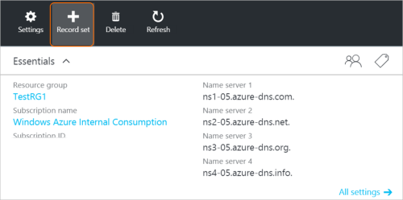

<properties
   pageTitle="Criar registros de uma zona de DNS usando o portal do Azure e um conjunto de registros | Microsoft Azure"
   description="Como criar registros de host DNS do Azure e criar conjuntos de registros e registros usando o portal do Azure"
   services="dns"
   documentationCenter="na"
   authors="sdwheeler"
   manager="carmonm"
   editor=""
   tags="azure-resource-manager"/>

<tags
   ms.service="dns"
   ms.devlang="na"
   ms.topic="article"
   ms.tgt_pltfrm="na"
   ms.workload="infrastructure-services"
   ms.date="08/16/2016"
   ms.author="sewhee"/>

# Criar conjuntos de registros de DNS e registros usando o portal do Azure

> [AZURE.SELECTOR]
- [Portal do Azure](dns-getstarted-create-recordset-portal.md)
- [PowerShell](dns-getstarted-create-recordset.md)
- [CLI Azure](dns-getstarted-create-recordset-cli.md)

Este artigo conduz você pelo processo de criação de registros e conjuntos de registros usando o portal do Azure. Depois de criar sua zona DNS, você adiciona os registros DNS do seu domínio. Para fazer isso, primeiro é necessário entender os registros DNS e conjuntos de registros.

[AZURE.INCLUDE [dns-about-records-include](../../includes/dns-about-records-include.md)]

## Criar um conjunto de registros e registro

O exemplo a seguir orienta você pelo processo de criação de um conjunto de registros e um registro usando o portal do Azure. Vamos usar o tipo de registro de DNS "A".

1. Entre portal.

2. Vá para a lâmina de **zona DNS** na qual você deseja criar um conjunto de registros.

3. Na parte superior da lâmina **zona DNS** , selecione o **registro definido** para abrir a lâmina **Definir adicionar registro** .

    

4. Na lâmina **Adicionar registro definir** , nomeie seu conjunto de registros. Por exemplo, você pode nomear seu conjunto de registros "**www**".

    

5. Selecione o tipo de registro que você deseja criar. Por exemplo, selecione **um**.

6. Defina o **TTL**. O horário padrão do Live no portal é uma hora.

7. Adicione os endereços IP, um endereço IP por linha. Quando você usa o nome do conjunto de registros sugeridos e o tipo de registro descrito anteriormente, você adicione os endereços de IP IPv4 para **o registro para o conjunto de registros www** .

8. Após concluir a adição de endereços IP, selecione **Okey** na parte inferior da lâmina. O conjunto de registros de DNS será criado.

## Próximas etapas

Para gerenciar seu conjunto de registros e registros, consulte [Gerenciar DNS registros e registro define usando o portal do Azure](dns-operations-recordsets-portal.md).

Para obter mais informações sobre o DNS do Azure, consulte [Visão geral do DNS do Azure](dns-overview.md).
