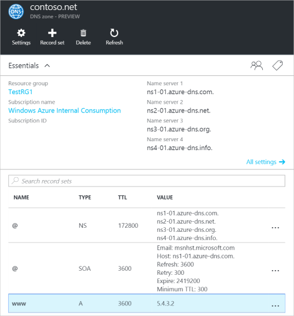
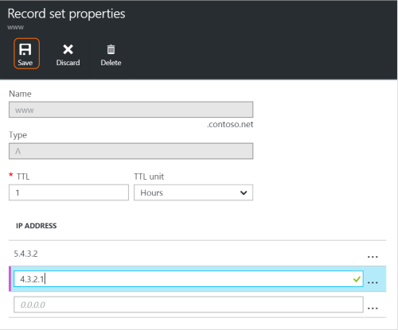

<properties
   pageTitle="Gerenciar conjuntos de registros de DNS e registros usando o portal do Azure | Microsoft Azure"
   description="Gerenciando o DNS registro define e registros quando o seu domínio no Azure DNS de hospedagem."
   services="dns"
   documentationCenter="na"
   authors="sdwheeler"
   manager="carmonm"
   editor=""
   tags="azure-resource-manager"/>

<tags
   ms.service="dns"
   ms.devlang="na"
   ms.topic="article"
   ms.tgt_pltfrm="na"
   ms.workload="infrastructure-services"
   ms.date="08/16/2016"
   ms.author="sewhee"/>

# Gerenciar registros DNS e conjuntos de registro usando o portal do Azure

> [AZURE.SELECTOR]
- [Portal do Azure](dns-operations-recordsets-portal.md)
- [CLI Azure](dns-operations-recordsets-cli.md)
- [PowerShell](dns-operations-recordsets.md)

Este artigo mostra como gerenciar conjuntos de registro e registros de zona DNS usando o portal do Azure.

É importante compreender a diferença entre os conjuntos de registro de DNS e registros DNS individuais. Um conjunto de registros é um conjunto de registros em uma zona que têm o mesmo nome e são do mesmo tipo. Para obter mais informações, consulte [registros usando o portal do Azure e conjuntos de registros de DNS de criar](dns-getstarted-create-recordset-portal.md).

## Criar um novo conjunto de registro e registro

Para criar um conjunto de registros em portal do Azure, consulte [criar registros DNS usando o portal do Azure.](dns-getstarted-create-recordset-portal.md)

## Exibir um conjunto de registros

1. No portal do Azure, vá para a lâmina de **zona DNS** .

2. Pesquise o conjunto de registros e selecioná-lo. Isso abre as propriedades do conjunto de registros.

    

## Adicionar um novo registro para um conjunto de registros

Você pode adicionar até 20 registros a qualquer conjunto de registros. Um conjunto de registros não pode conter dois registros idênticos. Os conjuntos de registro vazios (com zero records) podem ser criados, mas não aparecem nos servidores de nomes DNS do Azure. Conjuntos de registros do tipo CNAME podem conter no máximo um registro.

1. Na lâmina **registro definir propriedades** para sua zona DNS, clique no conjunto de registro que você deseja adicionar um registro a.

    

2. Especifique o registro define propriedades preenchendo os campos.

    

2. Clique em **Salvar** na parte superior da lâmina para salvar suas configurações. Feche a lâmina.

3. No canto, você verá que o registro está salvando.

    

Após ter sido salvo o registro, os valores na **zona DNS** lâmina refletirão o novo registro.

## Atualizar um registro

Quando você atualiza um registro em um conjunto de registros existente, os campos que você pode atualizar dependem o tipo de registro que você está trabalhando.

1. Na lâmina **registro definir propriedades** para seu conjunto de registros, procure o registro.

2. Modificar o registro. Quando você modifica um registro, você pode alterar as configurações disponíveis para o registro. No exemplo a seguir, o campo **endereço IP** está selecionado e o endereço IP está sendo modificado.

    

3. Clique em **Salvar** na parte superior da lâmina para salvar suas configurações. No canto superior direito, você verá a notificação de que o registro foi salvo.

    

Após ter sido salvo o registro, os valores para o registro definido na **zona DNS** lâmina refletirão o registro atualizado.

## Remover um registro de um conjunto de registros

Você pode usar o portal do Azure para remover registros de um conjunto de registros. Observe que removendo o último registro de um conjunto de registros não exclui o conjunto de registros.

1. Na lâmina **registro definir propriedades** para seu conjunto de registros, procure o registro.

2. Clique no registro que você deseja remover. Em seguida, selecione **Remover**.

    

3. Clique em **Salvar** na parte superior da lâmina para salvar suas configurações.

3. Depois que o registro tenha sido removido, os valores para o registro na **zona DNS** lâmina refletirão a remoção.

## Excluir um conjunto de registros

1. O **registro definir propriedades** lâmina para seu registro definir, clique em **Excluir**.

    

2. Será exibida uma mensagem perguntando se você deseja excluir o conjunto de registros.

3. Verifique se o nome corresponde o conjunto de registros que você deseja excluir e clique em **Sim**.

4. Na lâmina **zona DNS** , verifique se o conjunto de registros não está mais visível.

## Trabalhar com registros NS e SOA

Registros NS e SOA que são criados automaticamente são gerenciados Diferentemente de outros tipos de registro.

### Modificar registros SOA

Você não pode adicionar ou remover registros do registro SOA criado automaticamente definida como a apex zone (nome = "@"). No entanto, você pode modificar qualquer um dos parâmetros dentro do registro SOA (exceto "Host") e o registro definir TTL.

### Modificar registros NS na apex de zona

Você não pode adicionar, para remover ou modificar os registros no registro NS criado automaticamente definida como a apex zona (nome = "@"). A única alteração que é permitida é modificar o conjunto de registros TTL.

### Excluir conjuntos de registros SOA ou NS

Não é possível excluir a SOA e registro NS define no apex a zona (nome = "@") que são criados automaticamente quando a zona é criada. Eles são excluídos automaticamente quando você exclui a zona.

## Próximas etapas

-   Para obter mais informações sobre o DNS do Azure, consulte [Visão geral do DNS do Azure](dns-overview.md).
-   Para obter mais informações sobre como automatizar DNS, consulte [usando o SDK do .NET de conjuntos de zonas DNS criando e registro](dns-sdk.md).
-   Para obter mais informações sobre os registros DNS reverso, consulte [como gerenciar registros DNS reverso para seus serviços usando o PowerShell](dns-reverse-dns-record-operations-ps.md).
