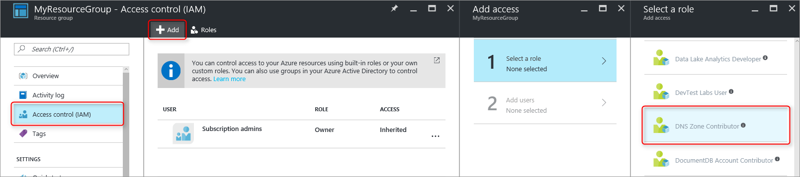
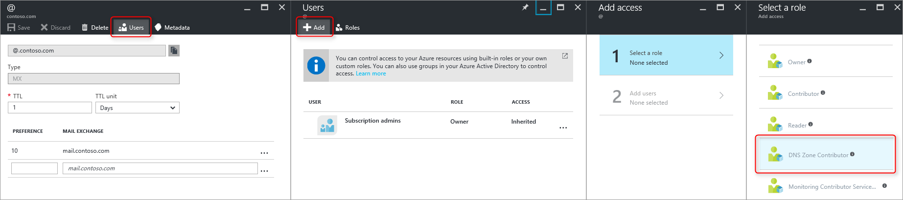
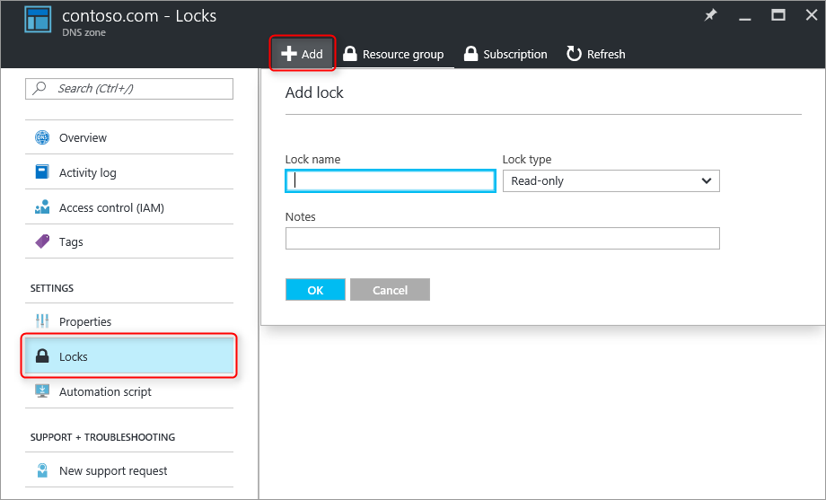

<properties 
   pageTitle="Protegendo zonas DNS e registros | Microsoft Azure" 
   description="Como proteger os conjuntos de registro no Microsoft Azure DNS e zonas DNS." 
   services="dns" 
   documentationCenter="na" 
   authors="jtuliani" 
   manager="carmonm" 
   editor=""/>

<tags
   ms.service="dns"
   ms.devlang="na"
   ms.topic="article"
   ms.tgt_pltfrm="na"
   ms.workload="infrastructure-services" 
   ms.date="10/20/2016"
   ms.author="jtuliani"/>

# Como proteger registros e zonas DNS

Registros e zonas DNS são recursos críticos. Excluir uma zona DNS ou mesmo apenas um único registro DNS pode resultar em uma interrupção do serviço total.  Portanto, é importante que críticas zonas DNS e registros são protegidos contra alterações acidentais ou não autorizadas.

Este artigo explica como o DNS do Azure permite que você proteja suas zonas DNS e registros em relação a essas alterações.  Podemos aplicar dois recursos de segurança poderosos fornecidos pelo Gerenciador de recursos do Azure: [controle de acesso baseado em função](../active-directory/role-based-access-control-what-is.md) e [bloqueios de recursos](../resource-group-lock-resources.md).

## Controle de acesso baseado em função

Azure controle de acesso baseado em função (RBAC) permite o gerenciamento de acesso refinados para usuários do Azure, grupos e recursos. Usando RBAC, você pode conceder precisamente a quantidade de acesso que os usuários precisam para realizar seus trabalhos. Para obter mais informações sobre como o RBAC ajuda você a gerenciar o acesso, consulte [o que é o controle de acesso baseado em função](../active-directory/role-based-access-control-what-is.md).

### A função 'Colaborador de zona de DNS'

A função 'Colaborador de zona de DNS' é uma função interna fornecida pelo Azure para gerenciar recursos DNS.  Atribuindo permissões de Colaborador de zona de DNS para um usuário ou grupo permite que o grupo gerenciar recursos DNS, mas não os recursos de qualquer outro tipo.

Por exemplo, suponha que o grupo de recursos 'myzones' contém cinco zonas para Contoso Corporation. Conceder o administrador DNS permissões 'Colaborador de zona de DNS' para esse grupo de recursos, permite que o controle total sobre essas zonas DNS. Ele também evita concedendo permissões desnecessárias, por exemplo, o administrador DNS não pode criar ou parar máquinas virtuais.

A maneira mais simples para atribuir permissões de RBAC é [por meio do portal do Azure](../active-directory/role-based-access-control-configure.md).  Abra lâmina 'Controle de acesso (IAM)' para o grupo de recursos, em seguida, clique em 'Adicionar', e em seguida, selecione a função de 'Colaborador de zona de DNS' e selecione necessários usuários ou grupos para conceder permissões.

As permissões também podem ser [concedido usando o PowerShell do Azure](../active-directory/role-based-access-control-manage-access-powershell.md):

    # Grant 'DNS Zone Contributor' permissions to all zones in a resource group
    New-AzureRmRoleAssignment -SignInName <user email address> -RoleDefinitionName "DNS Zone Contributor" -ResourceGroupName <resource group name>

O comando equivalente também está [disponível por meio da CLI Azure](../active-directory/role-based-access-control-manage-access-azure-cli.md):

    # Grant 'DNS Zone Contributor' permissions to all zones in a resource group
    azure role assignment create --signInName  <user email address> --roleName "DNS Zone Contributor" --resourceGroup <resource group name>

### Nível de zona RBAC

Regras RBAC Azure podem ser aplicadas a uma assinatura, um grupo de recursos ou para um recurso individual. No caso de DNS do Azure, esse recurso pode ser uma zona DNS individual ou até mesmo um conjunto de registros individual.

Por exemplo, suponha que o grupo de recursos 'myzones' contém o zona contoso.com e uma subzona 'customers.contoso.com' no qual os registros CNAME são criados para cada conta de cliente.  A conta usada para gerenciar esses registros CNAME deve ser atribuída permissões para criar registros 'customers.contoso.com' somente na região, ele não deve ter acesso às outras zonas.

Nível de zona RBAC podem ser concedidas por meio do portal do Azure.  Abra a lâmina 'Controle de acesso (IAM)' para a zona, depois clique em 'Adicionar', e em seguida, selecione a função de 'Colaborador de zona de DNS' e selecione necessários usuários ou grupos para conceder permissões.

As permissões também podem ser [concedido usando o PowerShell do Azure](../active-directory/role-based-access-control-manage-access-powershell.md):

    # Grant 'DNS Zone Contributor' permissions to a specific zone
    New-AzureRmRoleAssignment -SignInName <user email address> -RoleDefinitionName "DNS Zone Contributor" -ResourceGroupName <resource group name> -ResourceName <zone name> -ResourceType Microsoft.Network/DNSZones

O comando equivalente também está [disponível por meio da CLI Azure](../active-directory/role-based-access-control-manage-access-azure-cli.md):

    # Grant 'DNS Zone Contributor' permissions to a specific zone
    azure role assignment create --signInName <user email address> --roleName "DNS Zone Contributor" --resource-name <zone name> --resource-type Microsoft.Network/DNSZones --resource-group <resource group name>

### Registro de define o nível de RBAC

Nós pode ir além. Considere a possibilidade do administrador de emails para Contoso Corporation, quem precisa de acesso para os registros MX e TXT na apex da zona 'contoso.com'.  Ela não precisa de acesso para quaisquer outros registros MX ou TXT, ou para todos os registros de qualquer outro tipo.  Azure DNS permite que você atribuir permissões no nível do conjunto de registros, com precisão a registros que o administrador de email precisa acessar.  O administrador de email é concedido precisamente o controle que ela precisa e não pode fazer outras alterações.
  
Permissões RBAC no nível do conjunto de registros podem ser definidas por meio do portal do Azure, usando o botão 'Usuários' na lâmina conjunto de registros:

Permissões RBAC no nível do conjunto de registros também podem ser [concedido usando o PowerShell do Azure](../active-directory/role-based-access-control-manage-access-powershell.md):

    # Grant permissions to a specific record set
    New-AzureRmRoleAssignment -SignInName <user email address> -RoleDefinitionName "DNS Zone Contributor" -Scope "/subscriptions/<subscription id>/resourceGroups/<resource group name>/providers/Microsoft.Network/dnszones/<zone name>/<record type>/<record name>" 

O comando equivalente também está [disponível por meio da CLI Azure](../active-directory/role-based-access-control-manage-access-azure-cli.md):

    # Grant permissions to a specific record set
    azure role assignment create --signInName <user email address> --roleName "DNS Zone Contributor" --scope "/subscriptions/<subscription id>/resourceGroups/<resource group name>/providers/Microsoft.Network/dnszones/<zone name>/<record type>/<record name>"

### Funções personalizadas

A função de 'Colaborador de zona de DNS' interna permite controle total sobre um recurso DNS. Também é possível criar seu próprio cliente funções Azure, para fornecer um controle mais refinados mesmo.

Considere novamente o exemplo em que um registro CNAME na zona 'customers.contoso.com' é criado para cada conta de cliente Contoso Corporation.  A conta usada para gerenciar esses CNAMEs deve ter permissão para gerenciar somente registros CNAME.  Em seguida, é possível modificar os registros de outros tipos (como alterar os registros MX) ou executar operações de nível de zona como excluir zona.

O exemplo a seguir mostra uma definição de função personalizada para gerenciar somente registros CNAME:

    {
        "Name": "DNS CNAME Contributor",
        "Id": "",
        "IsCustom": true,
        "Description": "Can manage DNS CNAME records only.",
        "Actions": [
            "Microsoft.Network/dnsZones/CNAME/*",
            "Microsoft.Network/dnsZones/read",
            "Microsoft.Authorization/*/read",
            "Microsoft.Insights/alertRules/*",
            "Microsoft.ResourceHealth/availabilityStatuses/read",
            "Microsoft.Resources/deployments/*",
            "Microsoft.Resources/subscriptions/resourceGroups/read",
            "Microsoft.Support/*"
        ],
        "NotActions": [
        ],
        "AssignableScopes": [
            "/subscriptions/ c276fc76-9cd4-44c9-99a7-4fd71546436e"
        ]
    }

A propriedade de ações define as seguintes permissões específicas do DNS:

- `Microsoft.Network/dnsZones/CNAME/*`concede controle total sobre registros CNAME
- `Microsoft.Network/dnsZones/read`concede permissão para ler zonas DNS, mas não para modificá-los, permitindo que você veja a zona na qual o CNAME está sendo criado.

As ações restantes são copiadas da [função interna Colaborador de zona de DNS](../active-directory/role-based-access-built-in-roles.md#dns-zone-contributor).

>[AZURE.NOTE] Usando uma função RBAC personalizada para impedir a exclusão de conjuntos de registros enquanto ainda permitindo que eles sejam atualizadas não é um controle eficaz. Impede que conjuntos de registro está sendo excluído, mas ela não impede que eles sejam modificados.  Modificações permitidas incluem adicionar e remover registros de conjunto de registros, incluindo a remoção de todos os registros para deixar um conjunto de registros 'empty'. Isso tem o mesmo efeito que excluir o registro do conjunto de um ponto de vista de resolução DNS.

Definições de função personalizada atualmente não podem ser definidas por meio do portal do Azure. Uma função personalizada com base nessa definição de função pode ser criada usando o PowerShell do Azure:

    # Create new role definition based on input file
    New-AzureRmRoleDefinition -InputFile <file path>

Ele também pode ser criado por meio da CLI Azure:

    # Create new role definition based on input file
    azure role create –inputfile <file path>

Em seguida, pode ser atribuída a função da mesma maneira como funções internas, conforme descrito neste artigo.

Para obter mais informações sobre como criar, gerenciar e atribuir funções personalizadas, consulte [Funções personalizadas no Azure RBAC](../active-directory/role-based-access-control-custom-roles.md).

## Bloqueios de recursos

Além de RBAC, o Gerenciador de recursos do Azure oferece suporte a outro tipo de controle de segurança, ou seja, a capacidade de recursos de 'lock'. Onde as regras RBAC permitem controlar as ações de usuários e grupos específicos, bloqueios de recursos são aplicados ao recurso e são eficientes em todos os usuários e funções. Para obter mais informações, consulte [recursos de bloqueio com o Gerenciador de recursos do Azure](../resource-group-lock-resources.md).

Há dois tipos de bloqueio de recurso: **DoNotDelete** e **somente leitura**. Elas podem ser aplicadas para uma zona DNS, ou um conjunto de registros individual.  As seções a seguir descrevem vários cenários comuns e como para suportá-los usando bloqueios de recursos.

### Proteção contra todas as alterações

Para impedir que quaisquer alterações sejam feitas, aplique um bloqueio de somente leitura à zona.  Isso impede que novos conjuntos de registro conjuntos de registros criados e existentes sejam modificadas ou excluídas.

Os bloqueios de recursos de nível de zona podem ser criados por meio do portal do Azure.  Da lâmina zona DNS, clique em 'Bloqueios', em seguida, 'Adicionar':

Recurso bloqueios também podem ser criados por meio do PowerShell do Azure de nível de zona:

    # Lock a DNS zone
    New-AzureRmResourceLock -LockLevel <lock level> -LockName <lock name> -ResourceName <zone name> -ResourceType Microsoft.Network/DNSZones -ResourceGroupName <resource group name> 

Não é suportado atualmente ao configurar bloqueios de recursos Azure por meio da CLI do Azure.

### Protegendo registros individuais
Para impedir que um registro DNS existente definir contra modificação, aplique um bloqueio de somente leitura para o conjunto de registros.

>[AZURE.NOTE] Aplicando um bloqueio de DoNotDelete a um conjunto de registros não é um controle eficaz. Impede que o conjunto seja excluído de registros, mas ele não impede que ele está sendo modificado.  Modificações permitidas incluem adicionar e remover registros de conjunto de registros, incluindo a remoção de todos os registros para deixar um conjunto de registros 'empty'. Isso tem o mesmo efeito que excluir o registro do conjunto de um ponto de vista de resolução DNS.

Os bloqueios de recursos de nível de conjunto de registros podem atualmente só ser configurado usando o PowerShell do Azure.  Eles não são suportados no portal do Azure ou CLI do Azure.

    # Lock a DNS record set
    New-AzureRmResourceLock -LockLevel <lock level> -LockName <lock name> -ResourceName <zone name>/<record set name> -ResourceType Microsoft.Network/DNSZones/<record type> -ResourceGroupName <resource group name> 

### Proteção contra exclusão de zona

Quando uma zona é excluída no Azure DNS, todos os conjuntos de registro na zona também são excluídos.  Esta operação não pode ser desfeita.  Excluir acidentalmente uma zona crítica tem o potencial para ter um impacto significativa de negócios.  Portanto é muito importante para se proteger contra exclusão acidental de zona.

Aplicando um bloqueio de DoNotDelete a uma zona impede que a zona está sendo excluído.  No entanto, desde que bloqueios são herdados pelos recursos de filho, ele também impede que todos os conjuntos de registro na zona seja excluído, que pode ser indesejável.  Além disso, conforme descrito na observação acima, também é ineficaz desde registros ainda podem ser removidos dos conjuntos de registro existentes.

Como alternativa, considere a aplicação de um bloqueio de DoNotDelete a um registro definir na zona, como o conjunto de registros SOA.  Desde que a zona não pode ser excluída sem excluir também os conjuntos de registros, isso protege contra exclusão de zona, permitindo ainda conjuntos de registros dentro da região para ser modificada livremente. Se uma tentativa de excluir a zona, o Gerenciador de recursos do Azure detecta isso também seria excluir o conjunto de registros SOA e bloqueará a chamada porque a SOA está bloqueado.  Não há conjuntos de registros são excluídos.

O seguinte comando do PowerShell cria um bloqueio de DoNotDelete contra o registro SOA da zona determinado:

    # Protect against zone delete with DoNotDelete lock on the record set
    New-AzureRmResourceLock -LockLevel DoNotDelete -LockName <lock name> -ResourceName <zone name>/@ -ResourceType Microsoft.Network/DNSZones/SOA -ResourceGroupName <resource group name> 

Outra maneira de impedir exclusões acidentais zona está usando uma função personalizada para garantir que o operador e contas de serviço usadas para gerenciar suas zonas não possuem zona excluir as permissões. Quando você precisar excluir uma zona, você pode impor uma exclusão de duas etapas, primeiro concedendo permissões de exclusão de zona (com o escopo de zona, para evitar a exclusão de zona errada) e o segundo para excluir a zona.

Essa abordagem segunda tem a vantagem que funciona para todas as zonas acessadas por essas contas, sem precisar se lembrar criar qualquer bloqueios. Ela tem a desvantagem que todas as contas com permissões de exclusão de zona, como o proprietário da assinatura, podem excluir ainda acidentalmente uma zona crítica.

É possível usar as duas abordagens - bloqueios de recursos e funções personalizadas - ao mesmo tempo, como uma abordagem de defesa em profundidade para proteção de zona DNS.

## Próximas etapas

- Para obter mais informações sobre como trabalhar com RBAC, consulte [Introdução ao gerenciamento de acesso no portal do Azure](../active-directory/role-based-access-control-what-is.md). 
- Para obter mais informações sobre como trabalhar com bloqueios de recursos, consulte [recursos de bloqueio com o Gerenciador de recursos do Azure](../resource-group-lock-resources.md).
- Para obter mais informações sobre como proteger seus recursos Azure, consulte [Considerações de segurança para o Gerenciador de recursos do Azure](../best-practices-resource-manager-security.md).
