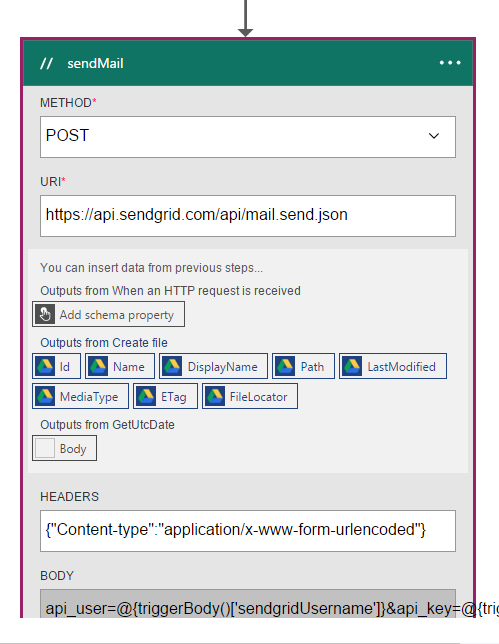
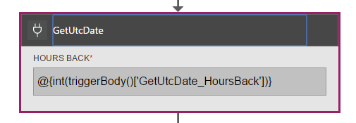
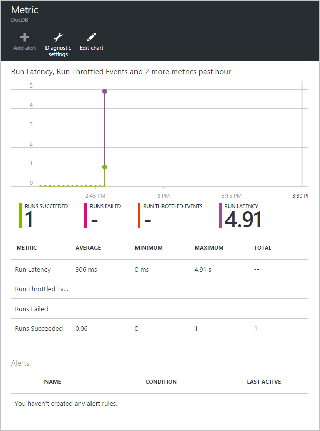
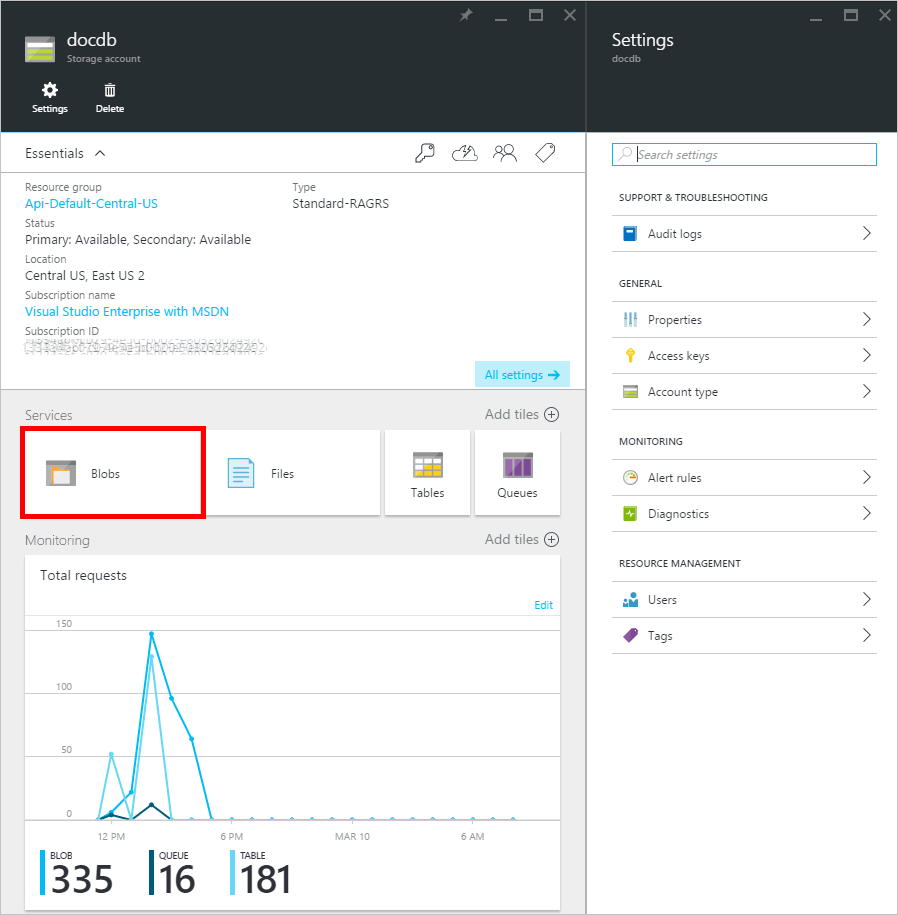

<properties 
    pageTitle="Usando aplicativos de lógica de notificações de alteração de DocumentDB | Microsoft Azure" 
    description="." 
    keywords="notificação de alteração"
    services="documentdb" 
    authors="hedidin" 
    manager="jhubbard" 
    editor="mimig" 
    documentationCenter=""/>

<tags 
    ms.service="documentdb" 
    ms.workload="data-services" 
    ms.tgt_pltfrm="na" 
    ms.devlang="rest-api" 
    ms.topic="article" 
    ms.date="09/23/2016" 
    ms.author="b-hoedid"/>

# <a name="notifications-for-new-or-changed-documentdb-resources-using-logic-apps"></a>Notificações de novas ou alteradas recursos DocumentDB usando aplicativos de lógica

Este artigo é proveniente uma pergunta que vi postada dentre os fóruns da comunidade DocumentDB do Azure. A pergunta foi **DocumentDB dá suporte a notificações para recursos modificados**?

Eu tiver trabalhado com o BizTalk Server por muitos anos, e este é um cenário muito comum ao usar o [Adaptador de LOB do WCF](https://msdn.microsoft.com/library/bb798128.aspx). Portanto eu decidiu ver se eu poderia duplicar essa funcionalidade no DocumentDB para documentos novos e/ou modificadas.

Este artigo fornece uma visão geral dos componentes da solução de notificação de alteração, que inclui um [disparador](documentdb-programming.md#trigger) e um [Aplicativo de lógica](../app-service-logic/app-service-logic-what-are-logic-apps.md). Importante trechos de código são fornecidos embutidos e a solução inteira está disponível no [GitHub](https://github.com/HEDIDIN/DocDbNotifications).

## <a name="use-case"></a>Caso de uso

A história a seguir é o caso de uso para este artigo.

DocumentDB é o repositório de documentos de integridade nível sete internacional (HL7) Fast saúde interoperabilidade recursos (FHIR). Vamos supor que seu banco de dados DocumentDB combinado com sua API e o aplicativo de lógica formam um servidor de FHIR HL7.  Um recurso de saúde está armazenando dados de pacientes no DocumentDB banco de dados "Pacientes". Há várias coleções no banco de dados paciente; Clínicos, identificação, etc. Informações de pacientes cai em identificação.  Você tem uma coleção denominada "Paciente".

O departamento de cardiologia está acompanhando o dados pessoais de integridade e exercícios. Procurando registros de pacientes novos ou modificados é demorado. Eles solicitado o departamento de TI se houvesse uma forma que eles podem receber uma notificação para registros de pacientes novos ou modificados.  

O departamento de TI disse que eles podem facilmente fornecem isso. Também, eles dizem que eles podem push os documentos para o [Armazenamento de Blob do Azure](https://azure.microsoft.com/services/storage/) para que o departamento de cardiologia poderia acessá-los facilmente.

## <a name="how-the-it-department-solved-the-problem"></a>Como o departamento de TI resolvido o problema

Para criar este aplicativo, o departamento de TI decidiu modelá-lo primeiro.  O bom sobre como usar o modelo de processo de negócios e BPMN (Notation) é que as pessoas tanto técnicas e podem facilmente entendê-lo. Esse processo de notificação inteira é considerado um processo de negócios. 

## <a name="high-level-view-of-notification-process"></a>Visão geral do processo de notificação

1. Você começar com um aplicativo de lógica que tem um gatilho de timer. Por padrão, o disparador é executado a cada hora.
2. Em seguida você faça uma POSTAGEM HTTP para o aplicativo de lógica.
3. O aplicativo de lógica faz todo o trabalho.


### <a name="lets-take-a-look-at-what-this-logic-app-does"></a>Vamos dar uma olhada no que significa esse aplicativo de lógica
Se você examinar a figura a seguir há várias etapas do fluxo de trabalho LogicApp.


As etapas são da seguinte maneira:

1. Você precisa obter o DateTime UTC atual de um API App.  O valor padrão é uma hora anterior.

2. O DateTime UTC é convertido em um formato de carimbo de hora do Unix. Este é o formato padrão para carimbos de hora em DocumentDB.

3. O valor que você posta um App API, que faz uma DocumentDB consulta. O valor é usado em uma consulta.

    ```SQL
        SELECT * FROM Patients p WHERE (p._ts >= @unixTimeStamp)
    ```

    > [AZURE.NOTE] O _ts representa os metadados de carimbo de hora para todos os recursos de DocumentDB.

4. Se houver documentos encontrados, o corpo de resposta é enviado ao seu armazenamento de Blob do Azure.

    > [AZURE.NOTE] Armazenamento de blob requer uma conta de armazenamento do Azure. Você precisa configurar uma conta de armazenamento de Blob do Azure e adicionar um novo Blob denominado pacientes. Para obter mais informações, consulte [contas de armazenamento sobre Azure](../storage/storage-create-storage-account.md) e [começar a usar o armazenamento de Blob do Azure](../storage/storage-dotnet-how-to-use-blobs.md).

5. Finalmente, um email é enviado que notifica o destinatário do número de documentos encontrados. Se não foram encontrados documentos, o corpo do email seria "0 documentos encontrado". 

Agora que você tem uma ideia do que faz o fluxo de trabalho, vamos dar uma olhada em como você implementar.

### <a name="lets-start-with-the-main-logic-app"></a>Vamos começar com o aplicativo de lógica principal

Se você não estiver familiarizado com aplicativos de lógica, elas estão disponíveis no [Azure Marketplace](https://portal.azure.com/)e você pode saber mais sobre eles no [quais são os aplicativos de lógica?](../app-service-logic/app-service-logic-what-are-logic-apps.md)

Quando você cria um novo aplicativo de lógica, você será solicitado **como você deseja iniciar?**

Quando você clica dentro da caixa de texto, você tem uma opção de eventos. Para este aplicativo lógica, selecione **Manual - solicitação HTTP um quando for recebida** conforme mostrado abaixo.


### <a name="design-view-of-your-completed-logic-app"></a>Modo de design do aplicativo lógica concluída
Vamos pular e examinar o modo de exibição de design concluído para o aplicativo de lógica, que é chamado DocDB.


Ao editar as ações no Designer de aplicativo de lógica, você tem a opção de selecionar **saídas** de solicitação de HTTP ou da ação anterior, conforme mostrado na ação sendMail abaixo.



Antes de cada ação em seu fluxo de trabalho, você pode tomar uma decisão; **Adicionar uma ação** ou **Adicionar uma condição** conforme mostrado na figura a seguir.


Se você selecionar **Adicionar uma condição**, são apresentadas com um formulário, conforme mostrado na figura a seguir, insira sua lógica.  Isso é essencialmente, uma regra de negócio.  Se você clicar dentro de um campo, você tem uma opção de selecionar parâmetros a ação anterior. Você também pode inserir os valores diretamente.


> [AZURE.NOTE] Você também tem a capacidade de inserir tudo no modo de exibição de código.

Vamos dar uma olhada no aplicativo lógica concluída no modo de exibição de código.  

```JSON
   
    "$schema": "https://schema.management.azure.com/providers/Microsoft.Logic/schemas/2015-08-01-preview/workflowdefinition.json#",
    "actions": {
        "Conversion": {
            "conditions": [
                {
                    "dependsOn": "GetUtcDate"
                }
            ],
            "inputs": {
                "method": "post",
                "queries": {
                    "currentdateTime": "@{body('GetUtcDate')}"
                },
                "uri": "https://docdbnotificationapi-debug.azurewebsites.net/api/Conversion"
            },
            "metadata": {
                "apiDefinitionUrl": "https://docdbnotificationapi-debug.azurewebsites.net/swagger/docs/v1",
                "swaggerSource": "custom"
            },
            "type": "Http"
        },
        "Createfile": {
            "conditions": [
                {
                    "expression": "@greater(length(body('GetDocuments')), 0)"
                },
                {
                    "dependsOn": "GetDocuments"
                }
            ],
            "inputs": {
                "body": "@body('GetDocuments')",
                "host": {
                    "api": {
                        "runtimeUrl": "https://logic-apis-westus.azure-apim.net/apim/azureblob"
                    },
                    "connection": {
                        "name": "@parameters('$connections')['azureblob']['connectionId']"
                    }
                },
                "method": "post",
                "path": "/datasets/default/files",
                "queries": {
                    "folderPath": "/patients",
                    "name": "Patient_@{guid()}.json"
                }
            },
            "type": "ApiConnection"
        },
        "GetDocuments": {
            "conditions": [
                {
                    "dependsOn": "Conversion"
                }
            ],
            "inputs": {
                "method": "post",
                "queries": {
                    "unixTimeStamp": "@body('Conversion')"
                },
                "uri": "https://docdbnotificationapi-debug.azurewebsites.net/api/Patient"
            },
            "metadata": {
                "apiDefinitionUrl": "https://docdbnotificationapi-debug.azurewebsites.net/swagger/docs/v1",
                "swaggerSource": "custom"
            },
            "type": "Http"
        },
        "GetUtcDate": {
            "conditions": [],
            "inputs": {
                "method": "get",
                "queries": {
                    "hoursBack": "@{int(triggerBody()['GetUtcDate_HoursBack'])}"
                },
                "uri": "https://docdbnotificationapi-debug.azurewebsites.net/api/Authorization"
            },
            "metadata": {
                "apiDefinitionUrl": "https://docdbnotificationapi-debug.azurewebsites.net/swagger/docs/v1",
                "swaggerSource": "custom"
            },
            "type": "Http"
        },
        "sendMail": {
            "conditions": [
                {
                    "dependsOn": "GetDocuments"
                }
            ],
            "inputs": {
                "body": "api_user=@{triggerBody()['sendgridUsername']}&api_key=@{triggerBody()['sendgridPassword']}&from=@{parameters('fromAddress')}&to=@{triggerBody()['EmailTo']}&subject=@{triggerBody()['Subject']}&text=@{int(length(body('GetDocuments')))} Documents Found",
                "headers": {
                    "Content-type": "application/x-www-form-urlencoded"
                },
                "method": "POST",
                "uri": "https://api.sendgrid.com/api/mail.send.json"
            },
            "type": "Http"
        }
    },
    "contentVersion": "1.0.0.0",
    "outputs": {
        "Results": {
            "type": "String",
            "value": "@{int(length(body('GetDocuments')))} Records Found"
        }
    },
    "parameters": {
        "$connections": {
            "defaultValue": {},
            "type": "Object"
        },
        "fromAddress": {
            "defaultValue": "user@msn.com",
            "type": "String"
        },
        "toAddress": {
            "defaultValue": "XXXXX@XXXXXXX.net",
            "type": "String"
        }
    },
    "triggers": {
        "manual": {
            "inputs": {
                "schema": {
                    "properties": {},
                    "required": [],
                    "type": "object"
                }
            },
            "type": "Manual"
        }
    
```

Se você não estiver familiarizado com o que representa as seções diferentes no código, você pode visualizar a documentação de [Linguagem de definição de fluxo de trabalho de aplicativo de lógica](http://aka.ms/logicappsdocs) .

Para este fluxo de trabalho, você está usando um [Gatilho de Webhook HTTP](https://sendgrid.com/blog/whats-webhook/). Se você examinar o código acima, você verá parâmetros como o exemplo a seguir.

```C#

    =@{triggerBody()['Subject']}

```

O `triggerBody()` representa os parâmetros que estão incluídos no corpo de uma POSTAGEM de restante à API REST lógica de aplicativo. O `()['Subject']` representa o campo. Todos esses parâmetros constituem o JSON formatados corpo. 

> [AZURE.NOTE] Usando um gancho de Web, você pode ter acesso total ao cabeçalho e o corpo da solicitação do disparador. Neste aplicativo desejado no corpo.

Conforme mencionado anteriormente, você pode usar o designer para atribuir parâmetros ou fazê-lo no modo de exibição de código.
Se você fizê-lo no modo de exibição de código, você definir quais propriedades exigem um valor, conforme mostrado no exemplo de código a seguir. 

```JSON

    "triggers": {
        "manual": {
            "inputs": {
            "schema": {
                "properties": {
            "Subject": {
                "type" : "String"   

            }
            },
                "required": [
            "Subject"
                 ],
                "type": "object"
            }
            },
            "type": "Manual"
        }
        }
```

Que você está fazendo é criando um esquema JSON que será passado do corpo da POSTAGEM HTTP.
Para ativar o disparador, você precisará de uma URL de retorno de chamada.  Você aprenderá a gerá-la mais tarde no tutorial.  

## <a name="actions"></a>Ações
Vamos ver o que faz cada ação no nosso aplicativo de lógica.

### <a name="getutcdate"></a>GetUTCDate

**Modo de exibição Designer**



**Modo de exibição de código**

```JSON

    "GetUtcDate": {
            "conditions": [],
            "inputs": {
            "method": "get",
            "queries": {
                "hoursBack": "@{int(triggerBody()['GetUtcDate_HoursBack'])}"
            },
            "uri": "https://docdbnotificationapi-debug.azurewebsites.net/api/Authorization"
            },
            "metadata": {
            "apiDefinitionUrl": "https://docdbnotificationapi-debug.azurewebsites.net/swagger/docs/v1"
            },
            "type": "Http"
        },

```

Esta ação HTTP executa uma operação GET.  Ele chama o método de API aplicativo GetUtcDate. O Uri usa a propriedade de 'GetUtcDate_HoursBack' passada para o corpo do disparador.  O valor de 'GetUtcDate_HoursBack' está definido no primeiro aplicativo lógica. Você aprenderá mais sobre o aplicativo de lógica disparador posteriormente no tutorial.

Esta ação chama o App API para retornar o valor de cadeia de caracteres de data UTC.

#### <a name="operations"></a>Operações

**Solicitação**

```JSON

    {
        "uri": "https://docdbnotificationapi-debug.azurewebsites.net/api/Authorization",
        "method": "get",
        "queries": {
          "hoursBack": "24"
        }
    }

```

**Resposta**

```JSON

    {
        "statusCode": 200,
        "headers": {
          "pragma": "no-cache",
          "cache-Control": "no-cache",
          "date": "Fri, 26 Feb 2016 15:47:33 GMT",
          "server": "Microsoft-IIS/8.0",
          "x-AspNet-Version": "4.0.30319",
          "x-Powered-By": "ASP.NET"
        },
        "body": "Fri, 15 Jan 2016 23:47:33 GMT"
    }

```

A próxima etapa é converter o valor de DateTime UTC para o carimbo de hora do Unix, que é um tipo de dupla .NET.

### <a name="conversion"></a>Conversão

##### <a name="designer-view"></a>Modo de exibição Designer


##### <a name="code-view"></a>Modo de exibição de código

```JSON

    "Conversion": {
        "conditions": [
        {
            "dependsOn": "GetUtcDate"
        }
        ],
        "inputs": {
        "method": "post",
        "queries": {
            "currentDateTime": "@{body('GetUtcDate')}"
        },
        "uri": "https://docdbnotificationapi-debug.azurewebsites.net/api/Conversion"
        },
        "metadata": {
        "apiDefinitionUrl": "https://docdbnotificationapi-debug.azurewebsites.net/swagger/docs/v1"
        },
        "type": "Http"
    },

```

Nesta etapa você passar o valor retornado do GetUTCDate.  Não há uma condição dependsOn, o que significa que a ação GetUTCDate deve ser concluída com êxito. Caso contrário, em seguida, essa ação será ignorada. 

Esta ação chama o App API para lidar com a conversão.

#### <a name="operations"></a>Operações

##### <a name="request"></a>Solicitação

```JSON

    {
        "uri": "https://docdbnotificationapi-debug.azurewebsites.net/api/Conversion",
        "method": "post",
        "queries": {
        "currentDateTime": "Fri, 15 Jan 2016 23:47:33 GMT"
        }
    }   
```

##### <a name="response"></a>Resposta

```JSON

    {
        "statusCode": 200,
        "headers": {
          "pragma": "no-cache",
          "cache-Control": "no-cache",
          "date": "Fri, 26 Feb 2016 15:47:33 GMT",
          "server": "Microsoft-IIS/8.0",
          "x-AspNet-Version": "4.0.30319",
          "x-Powered-By": "ASP.NET"
        },
        "body": 1452901653
    }
```

A próxima ação, você fará uma operação POST nossa API App.

### <a name="getdocuments"></a>GetDocuments 

##### <a name="designer-view"></a>Modo de exibição Designer


##### <a name="code-view"></a>Modo de exibição de código

```JSON

    "GetDocuments": {
        "conditions": [
        {
            "dependsOn": "Conversion"
        }
        ],
        "inputs": {
        "method": "post",
        "queries": {
            "unixTimeStamp": "@{body('Conversion')}"
        },
        "uri": "https://docdbnotificationapi-debug.azurewebsites.net/api/Patient"
        },
        "metadata": {
        "apiDefinitionUrl": "https://docdbnotificationapi-debug.azurewebsites.net/swagger/docs/v1"
        },
        "type": "Http"
    },

```

Para a ação de GetDocuments você vai passar no corpo da resposta da ação conversão. Este é um parâmetro no Uri:

 
```C#

    unixTimeStamp=@{body('Conversion')}

```

A ação QueryDocuments faz uma operação de HTTP POST a API App. 

O método chamado é **QueryForNewPatientDocuments**.

#### <a name="operations"></a>Operações

##### <a name="request"></a>Solicitação

```JSON

    {
        "uri": "https://docdbnotificationapi-debug.azurewebsites.net/api/Patient",
        "method": "post",
        "queries": {
        "unixTimeStamp": "1452901653"
        }
    }
```

##### <a name="response"></a>Resposta

```JSON

    {
        "statusCode": 200,
        "headers": {
        "pragma": "no-cache",
        "cache-Control": "no-cache",
        "date": "Fri, 26 Feb 2016 15:47:35 GMT",
        "server": "Microsoft-IIS/8.0",
        "x-AspNet-Version": "4.0.30319",
        "x-Powered-By": "ASP.NET"
        },
        "body": [
        {
            "id": "xcda",
            "_rid": "vCYLAP2k6gAXAAAAAAAAAA==",
            "_self": "dbs/vCYLAA==/colls/vCYLAP2k6gA=/docs/vCYLAP2k6gAXAAAAAAAAAA==/",
            "_ts": 1454874620,
            "_etag": "\"00007d01-0000-0000-0000-56b79ffc0000\"",
            "resourceType": "Patient",
            "text": {
            "status": "generated",
            "div": "<div>\n      \n      <p>Henry Levin the 7th</p>\n    \n    </div>"
            },
            "identifier": [
            {
                "use": "usual",
                "type": {
                "coding": [
                    {
                    "system": "http://hl7.org/fhir/v2/0203",
                    "code": "MR"
                    }
                ]
                },
                "system": "urn:oid:2.16.840.1.113883.19.5",
                "value": "12345"
            }
            ],
            "active": true,
            "name": [
            {
                    "family": [
                        "Levin"
                    ],
                    "given": [
                        "Henry"
                    ]
                }
            ],
            "gender": "male",
            "birthDate": "1932-09-24",
            "managingOrganization": {
                "reference": "Organization/2.16.840.1.113883.19.5",
                "display": "Good Health Clinic"
            }
        },

```

A próxima ação é salvar os documentos ao [armazenamento de Blog do Azure](https://azure.microsoft.com/services/storage/). 

> [AZURE.NOTE] Armazenamento de blob requer uma conta de armazenamento do Azure. Você precisa configurar uma conta de armazenamento de Blob do Azure e adicionar um novo Blob denominado pacientes. Para obter mais informações, consulte [Introdução ao armazenamento de Blob do Azure](../storage/storage-dotnet-how-to-use-blobs.md).

### <a name="create-file"></a>Criar arquivo

##### <a name="designer-view"></a>Modo de exibição Designer


##### <a name="code-view"></a>Modo de exibição de código

```JSON

    {
    "host": {
        "api": {
            "runtimeUrl": "https://logic-apis-westus.azure-apim.net/apim/azureblob"
        },
        "connection": {
            "name": "subscriptions/fxxxxxc079-4e5d-b002-xxxxxxxxxx/resourceGroups/Api-Default-Central-US/providers/Microsoft.Web/connections/azureblob"
        }
    },
    "method": "post",
    "path": "/datasets/default/files",
    "queries": {
        "folderPath": "/patients",
        "name": "Patient_17513174-e61d-4b56-88cb-5cf383db4430.json"
    },
    "body": [
        {
            "id": "xcda",
            "_rid": "vCYLAP2k6gAXAAAAAAAAAA==",
            "_self": "dbs/vCYLAA==/colls/vCYLAP2k6gA=/docs/vCYLAP2k6gAXAAAAAAAAAA==/",
            "_ts": 1454874620,
            "_etag": "\"00007d01-0000-0000-0000-56b79ffc0000\"",
            "resourceType": "Patient",
            "text": {
                "status": "generated",
                "div": "<div>\n      \n      <p>Henry Levin the 7th</p>\n    \n    </div>"
            },
            "identifier": [
                {
                    "use": "usual",
                    "type": {
                        "coding": [
                            {
                                "system": "http://hl7.org/fhir/v2/0203",
                                "code": "MR"
                            }
                        ]
                    },
                    "system": "urn:oid:2.16.840.1.113883.19.5",
                    "value": "12345"
                }
            ],
            "active": true,
            "name": [
                {
                    "family": [
                        "Levin"
                    ],
                    "given": [
                        "Henry"
                    ]
                }
            ],
            "gender": "male",
            "birthDate": "1932-09-24",
            "managingOrganization": {
                "reference": "Organization/2.16.840.1.113883.19.5",
                "display": "Good Health Clinic"
            }
        },

```

O código é gerado de ação no designer. Você não precisa modificar o código.

Se você não estiver familiarizado com o uso da API do Azure Blob, consulte [começar a usar o armazenamento de blob do Microsoft Azure API](../connectors/connectors-create-api-azureblobstorage.md).

#### <a name="operations"></a>Operações

##### <a name="request"></a>Solicitação

```JSON

    "host": {
        "api": {
            "runtimeUrl": "https://logic-apis-westus.azure-apim.net/apim/azureblob"
        },
        "connection": {
            "name": "subscriptions/fxxxxxc079-4e5d-b002-xxxxxxxxxx/resourceGroups/Api-Default-Central-US/providers/Microsoft.Web/connections/azureblob"
        }
    },
    "method": "post",
    "path": "/datasets/default/files",
    "queries": {
        "folderPath": "/patients",
        "name": "Patient_17513174-e61d-4b56-88cb-5cf383db4430.json"
    },
    "body": [
        {
            "id": "xcda",
            "_rid": "vCYLAP2k6gAXAAAAAAAAAA==",
            "_self": "dbs/vCYLAA==/colls/vCYLAP2k6gA=/docs/vCYLAP2k6gAXAAAAAAAAAA==/",
            "_ts": 1454874620,
            "_etag": "\"00007d01-0000-0000-0000-56b79ffc0000\"",
            "resourceType": "Patient",
            "text": {
                "status": "generated",
                "div": "<div>\n      \n      <p>Henry Levin the 7th</p>\n    \n    </div>"
            },
            "identifier": [
                {
                    "use": "usual",
                    "type": {
                        "coding": [
                            {
                                "system": "http://hl7.org/fhir/v2/0203",
                                "code": "MR"
                            }
                        ]
                    },
                    "system": "urn:oid:2.16.840.1.113883.19.5",
                    "value": "12345"
                }
            ],
            "active": true,
            "name": [
                {
                    "family": [
                        "Levin"
                    ],
                    "given": [
                        "Henry"
                    ]
                }
            ],
            "gender": "male",
            "birthDate": "1932-09-24",
            "managingOrganization": {
                "reference": "Organization/2.16.840.1.113883.19.5",
                "display": "Good Health Clinic"
            }
        },….


```

##### <a name="response"></a>Resposta

```JSON

    {
        "statusCode": 200,
        "headers": {
        "pragma": "no-cache",
        "x-ms-request-id": "2b2f7c57-2623-4d71-8e53-45c26b30ea9d",
        "cache-Control": "no-cache",
        "date": "Fri, 26 Feb 2016 15:47:36 GMT",
        "set-Cookie": "ARRAffinity=29e552cea7db23196f7ffa644003eaaf39bc8eb6dd555511f669d13ab7424faf;Path=/;Domain=127.0.0.1",
        "server": "Microsoft-HTTPAPI/2.0",
        "x-AspNet-Version": "4.0.30319",
        "x-Powered-By": "ASP.NET"
        },
        "body": {
        "Id": "0B0nBzHyMV-_NRGRDcDNMSFAxWFE",
        "Name": "Patient_47a2a0dc-640d-4f01-be38-c74690d085cb.json",
        "DisplayName": "Patient_47a2a0dc-640d-4f01-be38-c74690d085cb.json",
        "Path": "/Patient/Patient_47a2a0dc-640d-4f01-be38-c74690d085cb.json",
        "LastModified": "2016-02-26T15:47:36.215Z",
        "Size": 65647,
        "MediaType": "application/octet-stream",
        "IsFolder": false,
        "ETag": "\"c-g_a-1OtaH-kNQ4WBoXLp3Zv9s/MTQ1NjUwMTY1NjIxNQ\"",
        "FileLocator": "0B0nBzHyMV-_NRGRDcDNMSFAxWFE"
        }
    }
```

A última etapa é enviar uma notificação por email

### <a name="sendemail"></a>EnviarEmail

##### <a name="designer-view"></a>Modo de exibição Designer


##### <a name="code-view"></a>Modo de exibição de código

```JSON


    "sendMail": {
        "conditions": [
        {
            "dependsOn": "GetDocuments"
        }
        ],
        "inputs": {
        "body": "api_user=@{triggerBody()['sendgridUsername']}&api_key=@{triggerBody()['sendgridPassword']}&from=@{parameters('fromAddress')}&to=@{triggerBody()['EmailTo']}&subject=@{triggerBody()['Subject']}&text=@{int(length(body('GetDocuments')))} Documents Found",
        "headers": {
            "Content-type": "application/x-www-form-urlencoded"
        },
        "method": "POST",
        "uri": "https://api.sendgrid.com/api/mail.send.json"
        },
        "type": "Http"
    }
```

Nesta ação você enviar uma notificação por email.  Você está usando [SendGrid](https://sendgrid.com/marketing/sendgrid-services?cvosrc=PPC.Bing.sendgrib&cvo_cid=SendGrid%20-%20US%20-%20Brand%20-%20&mc=Paid%20Search&mcd=BingAds&keyword=sendgrib&network=o&matchtype=e&mobile=&content=&search=1&utm_source=bing&utm_medium=cpc&utm_term=%5Bsendgrib%5D&utm_content=%21acq%21v2%2134335083397-8303227637-1649139544&utm_campaign=SendGrid+-+US+-+Brand+-+%28English%29).   

O código para isso foi gerado usando um modelo para o aplicativo de lógica e SendGrid que está no [repositório de Github 101-lógica-app-sendgrid](https://github.com/Azure/azure-quickstart-templates/tree/master/101-logic-app-sendgrid).
 
A operação HTTP é uma POSTAGEM. 

Os parâmetros de autorização estão em Propriedades do disparador

```JSON

    },
        "sendgridPassword": {
             "type": "SecureString"
         },
         "sendgridUsername": {
            "type": "String"
         }

        In addition, other parameters are static values set in the Parameters section of the Logic App. These are:
        },
        "toAddress": {
            "defaultValue": "XXXX@XXXX.com",
            "type": "String"
        },
        "fromAddress": {
            "defaultValue": "XXX@msn.com",
            "type": "String"
        },
        "emailBody": {
            "defaultValue": "@{string(concat(int(length(actions('QueryDocuments').outputs.body)) Records Found),'/n', actions('QueryDocuments').outputs.body)}",
            "type": "String"
        },

```

O emailBody é concatenando o número de documentos retornados da consulta, que pode ser "0" ou mais, juntamente com, "Registros encontrada". O restante dos parâmetros definidos dos parâmetros disparador.

Esta ação depende da ação de **GetDocuments** .

#### <a name="operations"></a>Operações

##### <a name="request"></a>Solicitação
```JSON

    {
        "uri": "https://api.sendgrid.com/api/mail.send.json",
        "method": "POST",
        "headers": {
        "Content-type": "application/x-www-form-urlencoded"
        },
        "body": "api_user=azureuser@azure.com&api_key=Biz@Talk&from=user@msn.com&to=XXXX@XXXX.com&subject=New Patients&text=37 Documents Found"
    }

```

##### <a name="response"></a>Resposta

```JSON

    {
        "statusCode": 200,
        "headers": {
        "connection": "keep-alive",
        "x-Frame-Options": "DENY,DENY",
        "access-Control-Allow-Origin": "https://sendgrid.com",
        "date": "Fri, 26 Feb 2016 15:47:35 GMT",
        "server": "nginx"
        },
        "body": {
        "message": "success"
        }
    }
```

Finalmente você deseja ser capaz de ver os resultados de seu aplicativo de lógica no Portal do Azure. Para fazer isso, você pode adicionar um parâmetro na seção de saídas.


```JSON

    "outputs": {
        "Results": {
            "type": "String",
            "value": "@{int(length(actions('QueryDocuments').outputs.body))} Records Found"
        }

```

Isso retorna o mesmo valor que é enviado no corpo do email. A figura a seguir mostra um exemplo onde "29 registros encontrada".


## <a name="metrics"></a>Métricas
Você pode configurar o monitoramento para o aplicativo de lógica principal no portal. Isso permite exibir a latência executar e outros eventos como mostrado na figura a seguir.



## <a name="docdb-trigger"></a>Gatilho de DocDb

Este aplicativo lógica é o disparador que inicia o fluxo de trabalho em seu aplicativo de lógica principal.

A figura a seguir mostra o modo de exibição do Designer.


```JSON

    {
        "$schema": "https://schema.management.azure.com/providers/Microsoft.Logic/schemas/2015-08-01-preview/workflowdefinition.json#",
        "actions": {
        "Http": {
            "conditions": [],
            "inputs": {
            "body": {
                "EmailTo": "XXXXXX@XXXXX.net",
                "GetUtcDate_HoursBack": "24",
                "Subject": "New Patients",
                "sendgridPassword": "********",
                "sendgridUsername": "azureuser@azure.com"
            },
            "method": "POST",
            "uri": "https://prod-01.westus.logic.azure.com:443/workflows/12a1de57e48845bc9ce7a247dfabc887/triggers/manual/run?api-version=2015-08-01-preview&sp=%2Ftriggers%2Fmanual%2Frun&sv=1.0&sig=ObTlihr529ATIuvuG-dhxOgBL4JZjItrvPQ8PV6973c"
            },
            "type": "Http"
        }
        },
        "contentVersion": "1.0.0.0",
        "outputs": {
        "Results": {
            "type": "String",
            "value": "@{body('Http')['status']}"
        }
        },
        "parameters": {},
        "triggers": {
        "recurrence": {
            "recurrence": {
            "frequency": "Hour",
            "interval": 24
            },
            "type": "Recurrence"
        }
        }
    }

```

O disparador é definido para uma recorrência de 24 horas. A ação é um HTTP POST que usa a URL de retorno de chamada para o aplicativo de lógica principal. Corpo contém os parâmetros especificados no esquema de JSON. 

#### <a name="operations"></a>Operações

##### <a name="request"></a>Solicitação

```JSON

    {
        "uri": "https://prod-01.westus.logic.azure.com:443/workflows/12a1de57e48845bc9ce7a247dfabc887/triggers/manual/run?api-version=2015-08-01-preview&sp=%2Ftriggers%2Fmanual%2Frun&sv=1.0&sig=ObTlihr529ATIuvuG-dhxOgBL4JZjItrvPQ8PV6973c",
        "method": "POST",
        "body": {
        "EmailTo": "XXXXXX@XXXXX.net",
        "GetUtcDate_HoursBack": "24",
        "Subject": "New Patients",
        "sendgridPassword": "********",
        "sendgridUsername": "azureuser@azure.com"
        }
    }

```

##### <a name="response"></a>Resposta

```JSON

    {
        "statusCode": 202,
        "headers": {
        "pragma": "no-cache",
        "x-ms-ratelimit-remaining-workflow-writes": "7486",
        "x-ms-ratelimit-burst-remaining-workflow-writes": "1248",
        "x-ms-request-id": "westus:2d440a39-8ba5-4a9c-92a6-f959b8d2357f",
        "cache-Control": "no-cache",
        "date": "Thu, 25 Feb 2016 21:01:06 GMT"
        }
    }
```

Agora vamos observar a API App.

## <a name="docdbnotificationapi"></a>DocDBNotificationApi

Embora existam várias operações no aplicativo, você só vai usar três.

* GetUtcDate
* ConvertToTimeStamp
* QueryForNewPatientDocuments

### <a name="docdbnotificationapi-operations"></a>Operações de DocDBNotificationApi
Vamos dar uma olhada na documentação Swagger

> [AZURE.NOTE] Para permitir que você chame as operações externamente, você precisa adicionar um CORS permitido valor de origem de "*" (sem aspas) nas configurações do seu App API conforme mostrado na figura a seguir.


#### <a name="getutcdate"></a>GetUtcDate


#### <a name="converttotimestamp"></a>ConvertToTimeStamp


#### <a name="queryfornewpatientdocuments"></a>QueryForNewPatientDocuments


Vamos dar uma olhada no code-behind essa operação.

#### <a name="getutcdate"></a>GetUtcDate

```C#

    /// <summary>
    /// Gets the current UTC Date value
    /// </summary>
    /// <returns></returns>
    [H ttpGet]
    [Metadata("GetUtcDate", "Gets the current UTC Date value minus the Hours Back")]
    [SwaggerOperation("GetUtcDate")]
    [SwaggerResponse(HttpStatusCode.OK, type: typeof (string))]
    [SwaggerResponse(HttpStatusCode.InternalServerError, "Internal Server Operation Error")]
    public string GetUtcDate(
       [Metadata("Hours Back", "How many hours back from the current Date Time")] int hoursBack)
    {


        return DateTime.UtcNow.AddHours(-hoursBack).ToString("r");
    }
```

Essa operação simplesmente retorna o retornará o DateTime UTC atual menos o valor de HoursBack.

#### <a name="converttotimestamp"></a>ConvertToTimeStamp

``` C#

        /// <summary>
        ///     Converts DateTime to double
        /// </summary>
        /// <param name="currentdateTime"></param>
        /// <returns></returns>
        [Metadata("Converts Universal DateTime to number")]
        [SwaggerResponse(HttpStatusCode.OK, null, typeof (double))]
        [SwaggerResponse(HttpStatusCode.BadRequest, "DateTime is invalid")]
        [SwaggerResponse(HttpStatusCode.InternalServerError)]
        [SwaggerOperation(nameof(ConvertToTimestamp))]
        public double ConvertToTimestamp(
            [Metadata("currentdateTime", "DateTime value to convert")] string currentdateTime)
        {
            double result;

            try
            {
                var uncoded = HttpContext.Current.Server.UrlDecode(currentdateTime);

                var newDateTime = DateTime.Parse(uncoded);
                //create Timespan by subtracting the value provided from the Unix Epoch
                var span = newDateTime - new DateTime(1970, 1, 1, 0, 0, 0, 0).ToLocalTime();

                //return the total seconds (which is a UNIX timestamp)
                result = span.TotalSeconds;
            }
            catch (Exception e)
            {
                throw new Exception("unable to convert to Timestamp", e.InnerException);
            }

            return result;
        }

```

Essa operação converte a resposta da operação GetUtcDate em um valor double.

#### <a name="queryfornewpatientdocuments"></a>QueryForNewPatientDocuments

```C#

        /// <summary>
        ///     Query for new Patient Documents
        /// </summary>
        /// <param name="unixTimeStamp"></param>
        /// <returns>IList</returns>
        [Metadata("QueryForNewDocuments",
            "Query for new Documents where the Timestamp is greater than or equal to the DateTime value in the query parameters."
            )]
        [SwaggerOperation("QueryForNewDocuments")]
        [SwaggerResponse(HttpStatusCode.OK, type: typeof (Task<IList<Document>>))]
        [SwaggerResponse(HttpStatusCode.BadRequest, "The syntax of the SQL Statement is incorrect")]
        [SwaggerResponse(HttpStatusCode.NotFound, "No Documents were found")]
        [SwaggerResponse(HttpStatusCode.InternalServerError, "Internal Server Operation Error")]
        // ReSharper disable once ConsiderUsingAsyncSuffix
        public IList<Document> QueryForNewPatientDocuments(
            [Metadata("UnixTimeStamp", "The DateTime value used to search from")] double unixTimeStamp)
        {
            var context = new DocumentDbContext();
            var filterQuery = string.Format(InvariantCulture, "SELECT * FROM Patient p WHERE p._ts >=  {0}",
                unixTimeStamp);
            var options = new FeedOptions {MaxItemCount = -1};


            var collectionLink = UriFactory.CreateDocumentCollectionUri(DocumentDbContext.DatabaseId,
                DocumentDbContext.CollectionId);

            var response =
                context.Client.CreateDocumentQuery<Document>(collectionLink, filterQuery, options).AsEnumerable();

            return response.ToList();
    }

```

Esta operação utiliza o [SDK do .NET DocumentDB](documentdb-sdk-dotnet.md) para criar uma consulta de documento. 

```C#
     CreateDocumentQuery<Document>(collectionLink, filterQuery, options).AsEnumerable();
```

A resposta da operação ConvertToTimeStamp (unixTimeStamp) é passada. A operação retorna uma lista de documentos, `IList<Document>`.

Anteriormente, vamos falar sobre o CallbackURL. Para iniciar o fluxo de trabalho em seu aplicativo de lógica principal, você precisará chamá-lo usando o CallbackURL.

## <a name="callbackurl"></a>CallbackURL

Para começar, você precisará seu Token de AD do Azure.  Pode ser difícil obter isso token. Que estava procurando um método fácil e Jeff Hollan, que é um gerente de programa de aplicativo do Azure lógica, recomendável usar o [armclient](http://blog.davidebbo.com/2015/01/azure-resource-manager-client.html) no PowerShell.  Você pode instalá-lo seguindo as instruções fornecidas.

As operações que você deseja usar são Login e Call API de ARM.
 
Login: Usar as mesmas credenciais para fazer logon Portal do Azure. 

A operação de Call BRAÇO Api é aquele que irá gerar seu CallBackURL.

No PowerShell, você chamá-lo da seguinte maneira:  

```powershell

    ArmClient.exe post https://management.azure.com/subscriptions/[YOUR SUBSCRIPTION ID/resourcegroups/[YOUR RESOURCE GROUP]/providers/Microsoft.Logic/workflows/[YOUR LOGIC APP NAME/triggers/manual/listcallbackurl?api-version=2015-08-01-preview

```

O resultado deve ter esta aparência:

```powershell

    https://prod-02.westus.logic.azure.com:443/workflows/12a1de57e48845bc9ce7a247dfabc887/triggers/manual/run?api-version=2015-08-01-prevaiew&sp=%2Ftriggers%2Fmanual%2Frun&sv=1.0&sig=XXXXXXXXXXXXXXXXXXX

```

Você pode usar uma ferramenta como [carteiro](http://www.getpostman.com/) testar principal aplicativo de lógica, conforme mostrado na figura a seguir.


A tabela a seguir lista os parâmetros de disparador que compõem o corpo do aplicativo DocDB disparador lógica.

Parâmetro | Descrição 
--- | --- 
GetUtcDate_HoursBack | Usado para definir o número de horas para a data de início de pesquisa
sendgridUsername | Usado para definir o número de horas para a data de início de pesquisa
sendgridPassword | O nome de usuário para o email de grade enviar
Emailpara | O endereço de email que receberão a notificação de email
Assunto | O assunto do email

## <a name="viewing-the-patient-data-in-the-azure-blob-service"></a>Exibir os dados de pacientes no serviço do Azure Blob

Vá para sua conta de armazenamento do Azure e selecione Blobs em serviços, conforme mostrado na figura a seguir.

 

Você poderá exibir as informações do arquivo blob pacientes conforme mostrado abaixo.


## <a name="summary"></a>Resumo

Este passo a passo, você aprendeu o seguinte:

* É possível implementar notificações no DocumentDB.
* Usando aplicativos de lógica, você pode automatizar o processo.
* Usando aplicativos de lógica, você pode reduzir o tempo necessário para produzir um aplicativo.
* Usando HTTP, você pode consumir fácil um App API dentro de um aplicativo de lógica.
* Você pode criar facilmente um CallBackURL que substitui o ouvinte HTTP.
* Você pode criar fluxos de trabalho personalizados facilmente com o Designer de aplicativos de lógica.

A chave é planejar e modelar seu fluxo de trabalho.

## <a name="next-steps"></a>Próximas etapas
Baixe e use o código de aplicativo de lógica fornecido no [Github](https://github.com/HEDIDIN/DocDbNotifications). Convido você desenvolver o aplicativo e enviar alterações para o repo. 

Para saber mais sobre DocumentDB, visite o [Caminho de aprendizagem](https://azure.microsoft.com/documentation/learning-paths/documentdb/).
