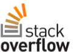

<properties
  pageTitle="DocumentDB comunidade & notícias | Microsoft Azure"
  description="Ingressar na comunidade do Azure DocumentDB para construir relações, apresentar seu trabalho e aperfeiçoe suas habilidades."
  services="documentdb"
  documentationCenter=""
  authors="aliuy"
  manager="johnmac"
  editor="mimig"/>

<tags
  ms.service="documentdb"
  ms.devlang="na"
  ms.topic="article"
  ms.tgt_pltfrm="na"
  ms.workload="data-services"
  ms.date="09/26/2016"
  ms.author="andrl"/>

# Portal de comunidade

## Destaque de comunidade

Deixe-nos Promova seu projeto! Nos mostram o impressionantes projeto que você está trabalhando com DocumentDB e ajudaremos compartilhar seu genius com o mundo. Para enviar seu projeto, envie um email para: [askdocdb@microsoft.com](mailto:askdocdb@microsoft.com).

### documentdb-lumenize

*por Maccherone Nicolau*

Agregações (agrupar por, tabela dinâmica e cubo N-dimensional) e transformações de série de tempo como procedimentos armazenados no DocumentDB.

Check-out no [Github](https://github.com/lmaccherone/documentdb-lumenize) e [npm](https://www.npmjs.com/package/lumenize).

### DocumentDB Studio

*por Ming Liu*

Um cliente gerenciamento visualizador/explorer do serviço do Microsoft Azure DocumentDB.

Check-out no [Github](https://github.com/mingaliu/DocumentDBStudio).

### DoQmentDB

*por Ariel Mashraki*

DoQmentDB é um cliente de baseado em promessa do Node. js, que fornece uma camada de MongoDB semelhante na parte superior DocumentDB.

Check-out no [Github](https://github.com/a8m/doqmentdb) e [npm](https://www.npmjs.com/package/doqmentdb).

### Swagger API REST para DocumentDB

*por Howard Edidin*

Um arquivo DocumentDB REST API Swagger que pode ser facilmente implantado como um API App.

Check-out no [Github](https://github.com/HEDIDIN/DocumentDB-REST/tree/master/DocumentDBRestApi).

### documentdb Fluent plug-in

*por Yoichi Kawasaki*

documentdb Fluent plug-in é um plug-in Fluentd de saída para DocumentDB do Azure.

Check-out no [Github](https://github.com/yokawasa/fluent-plugin-documentdb) e [rubygems](https://rubygems.org/gems/fluent-plugin-documentdb).

*Encontre mais abrir origem DocumentDB projetos no [GitHub](https://github.com/search?p=4&q=documentdb&type=Repositories).*

## Notícias, blogs e artigos

Você pode se manter atualizado com as últimas notícias DocumentDB e recursos pelo seguinte [nosso blog](https://azure.microsoft.com/blog/tag/documentdb/).

**Postagens da comunidade:**

- [**Indo Social com DocumentDB**](https://blogs.msdn.microsoft.com/mvpawardprogram/2016/03/15/going-social-with-documentdb/) - *por Matias Quarantaas*

- [**UWP, serviços de aplicativo do Azure e DocumentDB sopa: um aplicativo de compartilhamento de fotos**](https://blogs.windows.com/buildingapps/2016/03/17/uwp-azure-app-services-and-documentdb-soup-a-photo-sharing-app/) - *por Eric Langland*

- [**Notificações de novas ou alteradas recursos DocumentDB usando aplicativos de lógica**](documentdb-change-notification.md) - *por Howard Edidin*

- [**Coletar logs para DocumentDB Azure usando documentdb fluent plug-in**](http://unofficialism.info/posts/collecting-logs-into-azure-documentdb-using-fluent-plugin-documentdb/) - *por Yoichi Kawasaki*

- [**DocumentDB revisto parte 1/2 – a teoria**](https://peterintheazuresky.wordpress.com/2016/02/19/documentdb-revisited-part-12-the-theory/) - *por Peter Mannerhult*

- [**O que adora e gostam sobre DocumentDB do Azure**](http://blog.falafel.com/4-what-to-love-and-hate-about-azures-documentdb/) - *por Jorge Saadeh*

- [**Azure DocumentDB servidor script**](https://www.simple-talk.com/cloud/cloud-data/azure-documentdb-server-side-scripting/) - *por Robert Sheldon*

- [**DocumentDB como um dados PIA para análise de fluxo de Azure**](http://janatdevelopment.com/2015/12/11/documentdb-as-a-data-sink-for-azure-stream-analytics/?utm_source=twitterfeed&utm_medium=twitter) - *por Hentschel de Jan*

- [**Azure DocumentDB em produção!** ](http://blog.nexapp.ca/2015/11/30/azure-documentdb-in-production/)  -  *Alexandre Walsh e Olivier Marc Duval*

- [**Pesquisa Azure indexadores – DocumentDB consultas (espanhol)**](http://www.ealsur.com.ar/wp/index.php/2015/11/19/azure-search-indexers-documentdb-queries/) - *por Matthias Quaranta*

- [**Noções básicas de consulta do Azure SQL DocumentDB (japonês)**](http://beachside.hatenablog.com/entry/2015/12/06/000045) - *por Atsushi Yerevan*

- [**Pontos de dados - Aurelia atende DocumentDB: Jornada do criador de correspondências**](https://msdn.microsoft.com/magazine/mt620011.aspx) - *por Julie Lerman*

- [**Infraestrutura como código e implantação contínua de um Node + Azure solução DocumentDB**](http://www.talmeida.net/blog/2015/10/26/infrastructure-as-code-and-continuous-deployment-of-a-nodejs-azure-documentdb-solution) - *por Thiago Almedia*

- [**Por que DocumentDb faz sentido para os negócios para alguns projetos**](http://www.iquestllc.com/blogs/read/405/why-documentdb-makes-good-business-sense-for-some-projects) - *por Samuel Uresin*

- [**Azure DocumentDB desenvolvimento móvel encaminhar – desenvolvimento da classe do cliente (1 de 2) (japonês)**](http://beachside.hatenablog.com/entry/2015/10/01/202734) - *por Atsushi Yerevan*

- [**Coisas que você precisa saber ao usar o Azure DocumentDB (japonês)**](http://beachside.hatenablog.com/entry/2015/10/01/202734) - *por Atsushi Yerevan*

- [**Lidando com erros de RequestRateTooLarge em DocumentDB do Azure e testar o desempenho**](http://blogs.msdn.com/b/bigdatasupport/archive/2015/09/02/dealing-with-requestratetoolarge-errors-in-azure-documentdb-and-testing-documentdb-performance.aspx) - *por Azim Uddin*

- [**Pontos de dados - uma visão geral do Microsoft Azure DocumentDB**](https://msdn.microsoft.com/magazine/mt147238.aspx) - *por Julie Lerman*

- [**Usando o DocumentDB com F #**](https://jamessdixon.wordpress.com/2014/12/30/using-documentdb-with-f/) - *por Júlio Andrade*

- [**Logs de aplicativo ao analisar com DocumentDB**](http://vincentlauzon.com/2015/09/06/analysing-application-logs-with-documentdb/) - *por Philippe Vincent Lauzon*

- [**Azure DocumentDB – ponto no tempo Backups**](http://softwarejuancarlos.com/2015/09/06/azure-documentdb-point-in-time-backups/) - *por Juan Carlos Sanchez*

*Você tem uma postagem de blog, código de exemplo ou estudo de caso que você gostaria de compartilhar? [Fale conosco](mailto:askdocdb@microsoft.com)!*

## Eventos e gravações

### Eventos recentes e futuros

| Nome do evento                                                                                                                 | Alto-falante                                                     | Local             | Data                     | Hashtag |
| -------------------------------------------------------------------------------------------------------------------------- | ----------------------------------------------------------- | -------------------- | ------------------------ | ------- |
| [Acender 2016](https://myignite.microsoft.com/sessions?q=documentdb)  [Discurso: Habilitar transformação digital com a eficiência razoável de A.C.I.D Joseph Sirosh](https://myignite.microsoft.com/sessions/34953)  [Sessão: DocumentDB Azure em escala de massa: padrões de design e de sucesso do cliente com Syam Kumar Nair e Andrew Liu](https://myignite.microsoft.com/sessions/3066)  [Sessão: Gerenciar ativos de IoT com node e DocumentDB com Joshua Davis](https://myignite.microsoft.com/sessions/39704)  [Sessão: Criação de aplicativos de forma mais inteligentes e escaláveis usando os serviços de banco de dados do Microsoft Azure com Tara Jana e Moshe Gutman](https://myignite.microsoft.com/sessions/2633)| Paulo Liu, Syam Kumar Nair e Tara Jana | Rio de janeiro, RJ | 26-30 de setembro de 2016 | [#MSIgnite](https://twitter.com/MS_Ignite) |
| [Meetup em Ignite: DocumentDB: recursos avançados para aplicativos de grande escala](http://www.meetup.com/Azure-in-the-ATL/events/234252070/) | Paulo Liu, Syam Kumar Nair |  Rio de janeiro, RJ | 27 de setembro de 2016 | [#MSIgnite](https://twitter.com/MS_Ignite)[@FlatironCity](https://twitter.com/FlatironCity) |
| [Strata + Hadoop mundo](http://conferences.oreilly.com/strata/hadoop-big-data-ny/?cmp=kn-data-confreg-home-stny16_bing_branded) | Venha visite nosso estande! | Nova York, NY | 26-29 de setembro de 2016 | [#StrataConf](https://twitter.com/strataconf) |
| [Grupo de usuários do maiuscula cidade .NET](http://www.meetup.com/tally-dot-net/events/233768568/) | Santosh Hari | Tallahassee, FL | 3 de novembro de 2016 | n/d |

*Você está falando em ou um evento de hospedagem? [Fale conosco](mailto:askdocdb@microsoft.com) como podemos ajudar!*

### As gravações e eventos anteriores

| Nome do evento                                                                                                                 | Alto-falante                                                     | Local             | Data                   | Gravação |
| -------------------------------------------------------------------------------------------------------------------------- | ----------------------------------------------------------- | -------------------- | ---------------------- | --------- |
| [DevTeach](http://devteach.com/) | Ken Cenerelli  | Montreal, no Canadá | 4-8 de julho de 2016 | [NoSQL, sem problemas, usando o Azure DocumentDB](http://www.slideshare.net/KenCenerelli) |
| [Integração e IoT](http://www.btug.be/events) | Eldert Grootenboer | Kontich, Bélgica | 30 de junho de 2016 | n/d |
| [MongoDB mundo 2016](https://www.mongodb.com/world16) | Kirill Gavrylyuk | Nova York, Nova York | 28-29 de junho de 2016 | n/d |
| [Grupo de usuários de integração](http://www.integrationusergroup.com/do-logic-apps-support-error-handling/) | Howard S. Edidin | Webcast | 20 de junho de 2016 | [Lógica de aplicativos oferece suporte a manipulação de erro?](http://www.integrationusergroup.com/do-logic-apps-support-error-handling/) |
| [Meetup: Grupo de usuários Reino Unido Azure](http://www.meetup.com/UKAzureUserGroup/events/229673468/)| Paulo Liu  | Londres, Reino Unido | 12 de maio de 2016 | n/d
|[Meetup: ONETUG - Orlando .NET User Group](http://www.meetup.com/ONETUG/events/230797164/)| Santosh Hari| Orlando, FL| 12 de maio de 2016| n/d 
| [SQLBits XV](https://sqlbits.com/)                                                                                         | Paulo Liu, Aravind Ramachandran                            | Liverpool, Reino Unido        | 4-7 de maio de 2016            | n/d| 
| [Meetup: Grupo de desenvolvedores NYC .NET](http://www.meetup.com/NYC-NET-Developers/events/230396260/)                            | Leonard Lobel                                               | Nova York, NY    | 21 de abril de 2016           | n/d |
| [Grupo de usuários de integração](http://www.integrationusergroup.com/#)                                                            | Howard Edidin                                               | Webinar              | 25 de abril de 2016           | n/d |
| [Bootcamp Azure global: SoCal](http://xprs.imcreator.com/free/vishalishere/gab2016)                                        | Leonard Lobel                                               | Laranja, autoridade de certificação           | 16 de abril de 2016           | n/d |
| [Bootcamp Azure global: Redmond](https://www.eventbrite.com/e/2016-global-azure-bootcamp-redmond-wa-tickets-21387752343)   | David Makogon                                               | Redmond, Washington          | 16 de abril de 2016           | n/d |
| [SQL sábado #481-2016 Israel](http://www.sqlsaturday.com/481/Sessions/Details.aspx?sid=40912)                          | Leonard Lobel                                               | HaMerkaz, Israel     | 04 de abril de 2016         | n/d |
| [Construir 2016](https://build.microsoft.com/)                                                                                 | John Macintyre                                              | São Francisco, CA    | 31 de março de 2016         | [Fornecimento de aplicativos em escala com DocumentDB, banco de dados de documentos NoSQL do Azure](https://channel9.msdn.com/Events/Build/2016/B840)
| [SQL sábado #505 - Bélgica 2016](http://www.sqlsaturday.com/505/Sessions/Details.aspx?sid=44217)                         | Mihail Mateev                                               | Antuérpia, Bélgica     | 19 de março de 2016         | n/d |
| [Meetup: CloudTalk](http://www.meetup.com/CloudTalk/events/227963695/)                                                     | Kirat Pandya                                                | Bellevue, WA         | 3 de março de 2016          | n/d |
| [Meetup: Austin Azure](http://www.meetup.com/azureaustin/events/228209275/)                                                | Merwan Chinta                                               | Austin, Texas           | 28 de janeiro de 2016       | n/d |
| [Meetup: msdevmtl](http://www.meetup.com/msdevmtl/events/223839818/)                                                       | Carlos Philippe Lauzon                                     | Montreal, componentes Enfileirados, Canadá | 1º de dezembro de 2015       | n/d |
| [Meetup: SeattleJS](http://www.meetup.com/seattlejs/events/220102664/)                                                     | David Makogon                                               | Seattle, WA          | 12 de novembro de 2015      | n/d |
| [PASSAR Summit de 2015](http://www.sqlpass.org/summit/2015/)                                                                    | Jeff Renz, Paulo Hoh, Aravind Ramachandran, John Macintyre | Seattle, WA          | 27-30 de outubro de 2015    | [Desenvolver aplicativos modernos no Azure](https://www.youtube.com/watch?v=k5Z24HX-RyQ) |
| [CloudDevelop de 2015](http://www.clouddevelop.org/)                                                                          | David Makogon, Crawcour de Davi                                | Columbus, região         | 23 de outubro de 2015       | n/d |
| [SQL sábado #454 - Turin de 2015](http://www.sqlsaturday.com/454/Sessions/Details.aspx?sid=40130)                           | Marco De Nittis                                             | Turin, Itália         | 10 de outubro de 2015       | n/d |
| [SQL sábado #430 - Sófia de 2015](http://www.sqlsaturday.com/430/Sessions/Details.aspx?sid=36090)                           | Leonard Lobel                                               | Sófia, Bulgária      | 10 de outubro de 2015       | n/d |
| [SQL sábado #444 - cidade de Kansas de 2015](http://www.sqlsaturday.com/444/Sessions/Details.aspx?sid=38576)                     | Jeff Renz                                                   | Cidade de Kansas, MO      | 3 de outubro de 2015        | n/d |
| [SQL sábado #429 - Oporto de 2015](http://www.sqlsaturday.com/429/Sessions/Details.aspx?sid=36089)                          | Leonard Lobel                                               | Oporto, Portugal     | 3 de outubro de 2015        | n/d |
| [AzureCon](https://azure.microsoft.com/azurecon/)                                                                          | David Makogon, Crawcour de Davi, John Macintyre                | Evento virtual        | 29 de setembro de 2015     | [Plataforma Windows Azure de dados e análise](https://channel9.msdn.com/events/Microsoft-Azure/AzureCon-2015/ACON207) [Trabalhando com dados de NoSQL nos DocumentDB](https://channel9.msdn.com/Events/Microsoft-Azure/AzureCon-2015/ACON338) |
| [SQL sábado #434 - Holanda de 2015](http://www.sqlsaturday.com/434/Sessions/Details.aspx?sid=36413)                         | Leonard Lobel                                               | Utrecht, Holanda | 26 de setembro de 2015     | [Introdução ao Azure DocumentDB](https://channel9.msdn.com/Blogs/Windows-Azure/SQL-Saturday-Holland-2015-Introduction-to-Azure-DocumentDB) |
| [SQL sábado #441 - Denver de 2015](http://www.sqlsaturday.com/441/Sessions/Details.aspx?sid=39191)                          | Jeff Renz                                                   | Denver, CO           | 19 de setembro de 2015     | n/d |
| [Meetup: Área de San Francisco compartimento desenvolvedores Azure](http://www.meetup.com/bayazure/events/223943785/)                        | Paulo Liu                                                  | São Francisco, CA    | 15 de setembro de 2015     | n/d |
| [Grupo de usuários do Azure Belarus reunir-Up](https://www.facebook.com/events/786540124800276/)                                       | Alberto Zyl                                                    | Minsk, Belarus       | 9 de setembro de 2015      | [Introdução a visão geral do conceito de DocumentDB, níveis de consistência, estratégias de fragmentação](https://www.youtube.com/watch?v=Uc_qwWzJKH8) |
| [NoSQL agora!](http://nosql2015.dataversity.net/)                                                                            | David Makogon, Crawcour de Davi                                | SAN José, autoridade de certificação         | 18-20 de agosto de 2015     | n/d |
| [@ScaleSeattle](http://www.atscaleconference.com/)                                                                        | Dharma Shukla                                               | Seattle, WA          | 17 de junho de 2015          | [Independente de esquema indexação com DocumentDB Azure](https://www.youtube.com/watch?v=VJQ_5qFFVP4) |
| [Atualização de técnica de 2015](https://channel9.msdn.com/Events/DXPortugal/Tech-Refresh-2015)                                         | Bruno Lopes                                                 | Lisboa, Portugal     | 15 de junho de 2015          | [DocumentDB 101](https://channel9.msdn.com/Events/DXPortugal/Tech-Refresh-2015/DPDEV01) |
| [SQL sábado #417 - cingalesa de 2015](http://www.sqlsaturday.com/417/Sessions/Details.aspx?sid=21415)                       | Mihail Mateev                                               | Colombo, cingalesa   | 06 de junho de 2015          | n/d |
| [Meetup: Meetup de escalabilidade de Seattle](http://www.meetup.com/Seattle-Scalability-Meetup/events/204010442/)                    | Dharma Shukla                                               | Seattle, WA          | 27 de maio de 2015           | n/d |
| [SQL sábado #377 - Kiev de 2015](http://www.sqlsaturday.com/377/Sessions/Details.aspx?sid=20322)                            | Mihail Mateev                                               | Kiev, Ucrânia        | 23 de maio de 2015           | n/d |
| [Mês de banco de dados](http://www.databasemonth.com/database/azure-documentdb)                                                   | Dharma Shukla                                               | Nova York, NY         | 19 de maio de 2015           | [Azure DocumentDB: Serviço de banco de dados documento amplamente escaláveis e vários locatários](https://www.youtube.com/watch?v=iZsqBc3Dkbk) |
| [Meetup: Grupo de usuários Londres SQL Server](http://www.meetup.com/London-SQL-Server-User-Group/events/221525058/)               | Allan Mitchell                                              | Londres, Reino Unido           | 19 de maio de 2015           | n/d |
| [DevIntersection](https://devintersection.com/)                                                                            | Paulo Liu                                                  | Janeiro, RJ Scottsdale       | 18-21 de maio de 2015        | n/d |
| [Meetup: Grupo de desenvolvedores Seattle Web App](http://www.meetup.com/Seattle-Web-App-Developers-Group/events/220591071/)       | Paulo Liu                                                  | Seattle, WA          | 14 de maio de 2015           | n/d |
| [Acender](http://ignite.microsoft.com/)                                                                                     | Paulo Hoh, John Macintyre                                  | Chicago, IL          | 4-8 de maio de 2015          | [Selecione mais recente do DocumentDB vídeo](https://azure.microsoft.com/documentation/videos/microsoft-ignite-2015-select-latest-from-microsoft-azure-documentdb/) [DocumentDB e Azurehdinsight: melhor juntos vídeo](https://azure.microsoft.com/documentation/videos/microsoft-ignite-2015-microsoft-azure-documentdb-and-azure-hdinsight-better-together/) |
| [Compilação de 2015](http://www.buildwindows.com/)                                                                                 | Crawcour de Davi                                               | São Francisco, CA    | 29 de abril - 1 de maio de 2015 | [Criar a próxima novidade com o serviço do Azure NoSQL: DocumentDB](https://channel9.msdn.com/Events/Build/2015/2-729) |
| [Global 2015 Azure Bootcamp - Espanha](http://azurebootcamp.es/)                                                             | Luís Ruiz Pavon, Roberto Gonzalez                           | Madri, Espanha        | 25 de abril de 2015         | [#DEAN DocumentDB + Express + AngularJS + NodeJS em execução no Azure](https://channel9.msdn.com/events/Developers-Spain-Events/Global-Azure-Bootcamp-2015/DEAN-DocumentDB--Express--AngularJS--NodeJS-running-on-Azure) |
| [Meetup: Usergroup Azure Dinamarca](http://www.meetup.com/Azure-Usergroup-Denmark/events/221026670/)                         | Christian Holm Diget                                        | Copenhague, Dinamarca  | 16 de abril de 2015         | n/d |
| [Meetup: Nuvem da Microsoft de Charlotte](http://www.meetup.com/Charlotte-Microsoft-Cloud/events/221503519/)                     | Júlio Rance                                                 | Charlotte, NC        | 8 de abril de 2015          | n/d |
| [SQL sábado #375 - vale do silício de 2015](http://www.sqlsaturday.com/375/Sessions/Details.aspx?sid=15289)                  | IKE Ellis                                                   | Modo de exibição de montanha, autoridade de certificação    | 28 de março de 2015         | n/d |
| [Meetup: Istambul Meetup Azure](http://www.meetup.com/istanbul-azure-meetup/events/220325538/)                             | Daron Yondem                                                | Istambul, Turquia     | 7 de março de 2015          | n/d |
| [Meetup: grupo de usuários dos Grandes Lagos área .net](http://www.meetup.com/Great-Lakes-Area-NET-User-Group-MIGANG/events/220364576/) | Michael Collier                                             | Southfield, MI       | 18 de fevereiro de 2015      | n/d |
| [Azure TechX](https://www.youtube.com/channel/UCDRlI2E4z5qmHsBXTrFOE2Q)                                                    | Magnus Mårtensson                                           | Estocolmo, Suécia    | 28-29 de janeiro de 2015    | [DocumentDB no Azure o NoSQL nova opção para a nuvem](https://www.youtube.com/watch?v=Hw7hDYoChNI) |

### Vídeos e Podcasts

| programa                                        | Alto-falante                     | Data               | Episódio |
| ------------------------------------------- | --------------------------- | ------------------ | ------- |
| Canal 9: Microsoft + Abrir origem          | Jose Miguel Parrella         | 14 de abril de 2016    | [Da média para DEAN no Azure com Bitnami, conjuntos de escala de máquina virtual e DocumentDB](https://channel9.msdn.com/Blogs/Open/From-MEAN-to-DEAN-in-Azure-with-Bitnami-VM-Scale-Sets-and-DocumentDB) |
| Wired2WinWebinar                            | Sai Sankar Kunnathukuzhiyil | 9 de março de 2016      | [Desenvolvendo soluções com o Azure DocumentDB](https://www.youtube.com/watch?v=xKttEwXv_bs)
| Grupo de usuários de integração                      | Hangul Wong                    | 17 de fevereiro de 2016  | [Analisar e visualizar dados não-relacionais com DocumentDB + Power BI](http://www.integrationusergroup.com/analyze-visualize-non-relational-data-documentdb-power-bi/) |
| O Podcast Azure                           | Dimensionar oscilar                 | 14 de janeiro de 2016   | [Episódio 110: Usando DocumentDB & pesquisa](http://azpodcast.azurewebsites.net/post/Episode-110-Using-DocumentDB-Search) |
| Canal 9: Aplicativos modernos              | Tara Shankar Jana           | 13 de dezembro de 2016  | [Faça uma abordagem moderna dados em seus aplicativos](https://channel9.msdn.com/Series/Modern-Applications/Take-a-modern-approach-to-data-in-your-apps) |
| NinjaTips                                   | Miguel Quintero             | 10 de dezembro de 2015  | [DocumentDB - Un vistazo geral](https://channel9.msdn.com/Series/Ninja-Tips/31-NinjaTips-Desarrollo-DocumentDB-1-Vistazo-general) |
| Grupo de usuários de integração                      | Howard Edidin               | 9 de novembro de 2015   | [Azure DocumentDB para integração de saúde – parte 2](http://www.integrationusergroup.com/azure-documentdb-for-healthcare-integration-part-2/) |
| Grupo de usuários de integração                      | Howard Edidin               | 5 de outubro de 2015    | [Azure DocumentDB para saúde integração](http://www.integrationusergroup.com/?event=azure-documentdb-and-biztalk) |
| Itália DX - #TecHeroes                       | Alessandro Melchiori        | 2 de outubro de 2015    | [#TecHeroes - DocumentDB](https://channel9.msdn.com/Shows/TecHeroes/TecHeroes-DocumentDB) |
| Apresentação de nuvem da Microsoft - Podcast              | Paulo Liu                  | 30 de setembro de 2015 | [Episódio 099 - DocumentDB Azure com Liu Paulo](http://www.microsoftcloudshow.com/podcast/Episodes/099-azure-documentdb-with-andrew-liu) |
| .NET rocks!  -Podcast                      | Crawcour de Davi               | 29 de setembro de 2015 | [Dados em DocumentDB com CrawCour de Davi](https://www.dotnetrocks.com/?show=1197) |
| Dados expostos                                | Crawcour de Davi               | 28 de setembro de 2015 | [Novidades do Azure DocumentDB desde GA](https://channel9.msdn.com/Shows/Data-Exposed/Whats-New-with-Azure-DocumentDB-Since-GA) |
| O Podcast Azure                           | Dimensionar oscilar                 | 17 de setembro de 2015 | [Episódio 94: azpodcast.com re-arquitetura](http://azpodcast.azurewebsites.net/post/Episode-94-azpodcastcom-re-architecture) |
| Folha de rosto de nuvem                                 | Crawcour de Davi               | 4 de setembro de 2015  | [Episódio 185: Atualizações de DocumentDB com CrawCour de Davi](https://channel9.msdn.com/Shows/Cloud+Cover/Episode-185-DocDB-Updates-with-Ryan-CrawCour) |
| CodeChat 033                                | Greg Doerr                  | 28 de julho de 2015      | [Greg Doerr em DocumentDB Azure](https://channel9.msdn.com/Shows/codechat/033) |
| Central de NoSql                               | Rei Wilder                 | 25 de maio de 2015       | [Controlador de Golfe - uma visão geral em vídeo sobre como criar um aplicativo web na parte superior AngularJS, 2 WebApi e DocumentDB.](http://www.nosqlcentral.net/Story/Details/videos/kahanu/1-documentdb-golf-tracker-overview) |
| FASE de tecnologias na memória Virtual capítulo | Baron de Davi               | 25 de maio de 2015       | [DocumentDB de saudação](https://www.youtube.com/watch?v=itFXQCd9-dI) |
| Dados expostos                                | Crawcour de Davi               | 8 de abril de 2015      | [Disponibilidade geral DocumentDB e o que há de novo!](https://channel9.msdn.com/Shows/Data-Exposed/DocumentDB-General-Availability-and-Whats-New) |
| Dados expostos                                | Paulo Liu                  | 17 de março de 2015     | [Java SDK para DocumentDB](https://channel9.msdn.com/Shows/Data-Exposed/Java-SDK-for-DocumentDB) |
| #DevHangout                                 | Gustavo Alzate Sandoval     | 11 de março de 2015     | [DocumentDB, la basear datos de NoSql de Microsoft Azure](https://www.youtube.com/watch?v=8Ud3jB8KOBA) |
| Dados arquitetura Virtual capítulo passagem      | IKE Ellis                   | 25 de fevereiro de 2015  | [Introdução ao DocumentDB](https://www.youtube.com/watch?v=7BQYdFUkz6s) |

### Classes onlinehttps

| Parceiro de aprendizagem                                                                                                                                                                      | Descrição |
| ------------------------------------------------------------------------------------------------------------------------------------------------------------------------------------- | ----------- |
|  | [**Microsoft Virtual Academy**](https://mva.microsoft.com/en-US/training-courses/deploying-web-apps-to-azure-app-service-16629) oferece treinamento das pessoas que ajuda a criar DocumentDB do Azure. |
|                                                       | [**Pluralsight**](http://www.pluralsight.com/courses/azure-documentdb-introduction) é um parceiro Microsoft chave oferecendo treinamento Azure. Se você for assinante do MSDN, use seus benefícios para acessar o treinamento do Microsoft Azure. |
|                                                  | [**OpsGility**](https://www.opsgility.com/courses/player/introduction_to_azure_documentdb) fornece treinamento técnico em Microsoft Azure. Obtenha ministrado por instrutor treinamento no local ou por meio de uma sala de aula remota por seus treinadores confirmados setor. |

## Discussão

### Twitter

Siga-no twitter [@DocumentDB](https://twitter.com/DocumentDB) e se manter atualizado com a conversa mais recente sobre o hashtag [#DocumentDB](https://twitter.com/hashtag/DocumentDB) .

### Fóruns on-line

| Provedor de Fórum                                                                                                                  | Descrição |
| ------------------------------------------------------------------------------------------------------------------------------- | ----------- |
|  | Um independente de linguagem editados colaborativamente pergunta e site de resposta para programadores. Acompanhar nossa marca: [documentdb do azure](http://stackoverflow.com/questions/tagged/azure-documentdb) |
|                                 | Um bom lugar para suporte e comentários sobre os recursos do Microsoft Azure e os serviços, como Sites da Web, DocumentDB, etc. |

## Contate a equipe

Você precisa de ajuda técnica? Tem dúvidas? Quer saber se NoSQL é uma boa opção para você? Você pode [Agendar um chat de 1:1 diretamente com a equipe de engenharia de DocumentDB](http://www.askdocdb.com/). Você também pode acertar-em um [email](mailto:askdocdb@microsoft.com) ou tweet conosco em [@DocumentDB](https://twitter.com/DocumentDB). 

## Projetos de código aberto

Esses projetos ativamente são desenvolvidos pela equipe do Azure DocumentDB em colaboração com nossa comunidade de fonte aberta.

### SDKs

| Plataforma | GitHub                                                                      | Pacote |
| -------- | --------------------------------------------------------------------------- | ------- |
| Node  | [Azure-documentdb-node](https://github.com/Azure/azure-documentdb-node)     | [NPM](https://www.npmjs.com/package/documentdb) |
| Java     | [Azure-documentdb-java](https://github.com/Azure/azure-documentdb-java)     | [Maven](http://search.maven.org/#search%7Cga%7C1%7Ca%3A%22azure-documentdb%22) |
| Python   | [Azure-documentdb-python](https://github.com/Azure/azure-documentdb-python) | [PyPI](https://pypi.python.org/pypi/pydocumentdb) |

### Outros projetos

| Nome                | GitHub                                                                                            | Site |
| ------------------- | ------------------------------------------------------------------------------------------------- | ------- |
| Documentação       | [conteúdo do Azure](https://github.com/Azure/azure-content/tree/master/articles/documentdb)           | [Site de documentação](https://azure.microsoft.com/documentation/services/documentdb/) |
| Conector do Hadoop    | [Azure-documentdb-hadoop](https://github.com/Azure/azure-documentdb-hadoop)                       | [Maven](http://search.maven.org/#search%7Cga%7C1%7Ca%3A%22azure-documentdb-hadoop%22) |
| Ferramenta de migração de dados | [Azure-documentdb-datamigrationtool](https://github.com/Azure/azure-documentdb-datamigrationtool) | [Centro de download da Microsoft](http://www.microsoft.com/en-us/download/details.aspx?id=46436) |

## DocumentDB assistentes

Os assistentes do DocumentDB estão líderes de comunidade que já demonstrou um compromisso exemplar para ajudar que outras pessoas Aproveite ao máximo sua experiência com o Azure DocumentDB. Eles compartilham seus paixão excepcional, reais conhecimento e especialização técnica com a comunidade e com a equipe de DocumentDB.

Assistente | Imagem 
 --- | --- 
 [Allan Mitchell](https://twitter.com/allansqlis) |  
 [Jen Stirrup](https://twitter.com/jenstirrup) |             
 [Lenni Lobel](https://twitter.com/lennilobel) |  |          
 [Mihail Mateev](https://twitter.com/mihailmateev) |  |
 [Nicolau Maccherone](https://twitter.com/lmaccherone) |  
 [Howard Edidin](https://twitter.com/hsedidin) |  
 [Santosh Hari](https://twitter.com/_s_hari) |  

Deseja que se torne um assistente DocumentDB? Enquanto não houver nenhuma referência para se tornar um assistente DocumentDB, alguns dos critérios que podemos avaliar incluem o impacto de contribuições de um candidato para fóruns online como StackOverflow e MSDN; wikis e conteúdo online; conferências e grupos de usuários; podcasts, sites, blogs e mídia social; e artigos e livros. Você pode indicar si mesmo ou para outra pessoa enviando [-em um email](mailto:askdocdb@microsoft.com).
