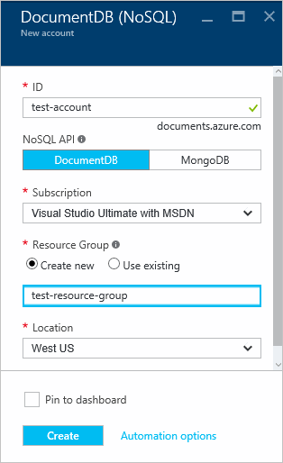
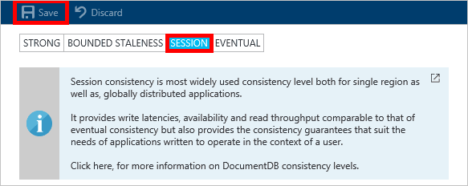

<properties
    pageTitle="Como criar uma conta de DocumentDB | Microsoft Azure"
    description="Crie um banco de dados NoSQL com DocumentDB do Azure. Siga estas instruções para criar uma conta de DocumentDB e começar a criar seu impressionante rápido, em escala global NoSQL banco de dados." 
    keywords="criar um banco de dados"
    services="documentdb"
    documentationCenter=""
    authors="mimig1"
    manager="jhubbard"
    editor="monicar"/>

<tags
    ms.service="documentdb"
    ms.workload="data-services"
    ms.tgt_pltfrm="na"
    ms.devlang="na"
    ms.topic="get-started-article"
    ms.date="10/17/2016"
    ms.author="mimig"/>

# Como criar uma conta de DocumentDB NoSQL usando o portal do Azure

> [AZURE.SELECTOR]
- [Portal do Azure](documentdb-create-account.md)
- [CLI Azure e Azure Gerenciador de recursos](documentdb-automation-resource-manager-cli.md)

Para criar um banco de dados com o Microsoft Azure DocumentDB, faça o seguinte:

- Tiver uma conta do Azure. Você pode obter uma [conta gratuita do Azure](https://azure.microsoft.com/free) caso você não tenha um. 
- Crie uma conta de DocumentDB.  

Você pode criar uma conta de DocumentDB usando o portal do Azure, modelos do Gerenciador de recursos do Azure ou Azure interface de linha (comando). Este artigo mostra como criar uma conta de DocumentDB usando o portal do Azure. Para criar uma conta usando o Gerenciador de recursos do Azure ou CLI do Azure, consulte [DocumentDB automatizar a criação de conta de banco de dados](documentdb-automation-resource-manager-cli.md).

Você está começando a usar o DocumentDB? Assista a [Este](https://azure.microsoft.com/documentation/videos/create-documentdb-on-azure/) vídeo de quatro minutos por Scott Hanselman para ver como concluir as tarefas mais comuns no portal online.

1.  Entrar no [portal do Azure](https://portal.azure.com/).
2.  No Jumpbar, clique em **novo**, clique em **bancos de dados**e clique em **DocumentDB (NoSQL)**. 

      

3. Na **nova conta** lâmina, especifique as configurações desejadas para a conta de DocumentDB.

    

    - Na caixa **ID** , insira um nome para identificar a conta de DocumentDB.  Quando a **identificação** é validada, uma marca de seleção verde aparece na caixa **ID** . O valor de **ID** se torna o nome de host dentro o URI. A **ID** pode conter apenas letras minúsculas, números e a '-' caractere e deve estar entre 3 e 50 caracteres. Observe que *documents.azure.com* é acrescentado ao nome do ponto de extremidade que você escolher, o resultado do qual se torna o ponto de extremidade de conta de DocumentDB.

    - Na caixa **NoSQL API** , selecione o modelo de programação para usar:
        - **DocumentDB**: A API DocumentDB está disponível por meio de .NET, Java, Node, Python e JavaScript [SDKs](documentdb-sdk-dotnet.md), bem como HTTP [restante](https://msdn.microsoft.com/library/azure/dn781481.aspx)e oferece acesso através de programação para todas as funcionalidades de DocumentDB. 
       
        - **MongoDB**: DocumentDB também oferece [suporte de nível de protocolo](documentdb-protocol-mongodb.md) para **MongoDB** APIs. Quando você escolhe a opção MongoDB API, você pode usar existente MongoDB SDKs e [Ferramentas](documentdb-mongodb-mongochef.md) para conversar DocumentDB. Você pode [Mover](documentdb-import-data.md) seus aplicativos MongoDB existentes para usar DocumentDB, com [nenhuma alteração de código necessária](documentdb-connect-mongodb-account.md)e tirar proveito de um banco de dados totalmente gerenciado como um serviço, com escala ilimitada, replicação global e outros recursos.

    - Para **assinatura**, selecione a assinatura Azure que você deseja usar para a conta de DocumentDB. Se a sua conta tiver apenas uma assinatura, essa conta é selecionada por padrão.

    - No **Grupo de recursos**, selecione ou crie um grupo de recursos para a sua conta de DocumentDB.  Por padrão, um novo grupo de recursos é criado. Para obter mais informações, consulte [usando o portal do Azure para gerenciar seus recursos Azure](../articles/azure-portal/resource-group-portal.md).

    - Use o **local** para especificar a localização geográfica na qual hospedar sua conta de DocumentDB. 

4.  Quando as novas opções de conta de DocumentDB estão configuradas, clique em **criar**. Para verificar o status da implantação, confira o hub de notificações.  

      

    

5.  Após a conta DocumentDB é criada, está pronto para uso com as configurações padrão. A consistência padrão da conta de DocumentDB está definida para **sessão**.  Você pode ajustar a consistência padrão clicando em **Consistência padrão** no menu do recurso. Para saber mais sobre os níveis de consistência oferecidos pelo DocumentDB, consulte [níveis de consistência em DocumentDB](documentdb-consistency-levels.md).

      

      

[How to: Create a DocumentDB account]: #Howto
[Next steps]: #NextSteps
[documentdb-manage]:../articles/documentdb/documentdb-manage.md

## Próximas etapas

Agora que você tem uma conta de DocumentDB, a próxima etapa é criar um conjunto de DocumentDB e o banco de dados. 

Você pode criar um novo conjunto e o banco de dados usando um destes procedimentos:

- O portal Azure, conforme descrito em [criar um conjunto de DocumentDB usando o portal do Azure](documentdb-create-collection.md).
- Os tutoriais completos, que incluem dados de exemplo: [.NET](documentdb-get-started.md), [.NET MVC](documentdb-dotnet-application.md), [Java](documentdb-java-application.md), [Node](documentdb-nodejs-application.md)ou [Python](documentdb-python-application.md).
- O [.NET](documentdb-dotnet-samples.md#database-examples), [Node](documentdb-nodejs-samples.md#database-examples)ou [Python](documentdb-python-samples.md#database-examples) amostra código disponível no GitHub.
- O [.NET](documentdb-sdk-dotnet.md), [Node](documentdb-sdk-node.md), [Java](documentdb-sdk-java.md), [Python](documentdb-sdk-python.md)e SDKs [restante](https://msdn.microsoft.com/library/azure/mt489072.aspx) .

Depois de criar seu banco de dados e o conjunto, você precisa [Adicionar documentos](documentdb-view-json-document-explorer.md) para as coleções de arquivos.

Depois que os documentos em um conjunto, você pode usar [DocumentDB SQL](documentdb-sql-query.md) para [executar consultas](documentdb-sql-query.md#executing-queries) em relação a seus documentos. Você pode executar consultas usando o [Explorador de consulta](documentdb-query-collections-query-explorer.md) no portal do, a [API REST](https://msdn.microsoft.com/library/azure/dn781481.aspx)ou um dos [SDKs](documentdb-sdk-dotnet.md).

### Saiba Mais

Para saber mais sobre DocumentDB, explore estes recursos:

-   [Caminho de aprendizagem para DocumentDB](https://azure.microsoft.com/documentation/learning-paths/documentdb/)
-   [Modelo de recursos hierárquica de DocumentDB e conceitos](documentdb-resources.md)
