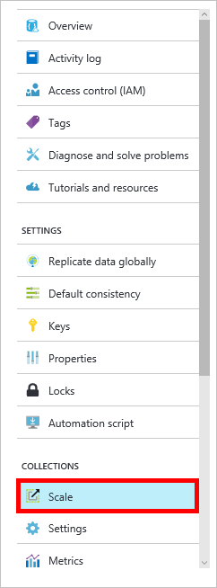

<properties 
    pageTitle="Criar um banco de dados de DocumentDB e uma coleção | Microsoft Azure" 
    description="Aprenda a criar bancos de dados NoSQL e conjuntos de documentos JSON usando o portal de serviço online para DocumentDB do Azure, uma nuvem base banco de dados do documento. Obtenha uma avaliação gratuita hoje." 
    services="documentdb" 
    authors="mimig1" 
    manager="jhubbard" 
    editor="monicar" 
    documentationCenter=""/>

<tags 
    ms.service="documentdb" 
    ms.workload="data-services" 
    ms.tgt_pltfrm="na" 
    ms.devlang="na" 
    ms.topic="article" 
    ms.date="10/17/2016" 
    ms.author="mimig"/>

# Como criar um conjunto de DocumentDB e o banco de dados usando o portal do Azure

Para usar o Microsoft Azure DocumentDB, você deve ter uma [conta de DocumentDB](documentdb-create-account.md), um banco de dados, um conjunto e documentos. Este tópico descreve como criar um conjunto de DocumentDB no portal do Azure. 

Não sabe o que uma coleção é? Consulte [o que é uma coleção de DocumentDB?](#what-is-a-documentdb-collection)

1.  No [portal do Azure](https://portal.azure.com/), em Jumpbar, clique **DocumentDB (NoSQL)**e na lâmina **DocumentDB (NoSQL)** , selecione a conta na qual deseja adicionar um conjunto. Se você não tiver quaisquer contas listadas, você precisará [criar uma conta de DocumentDB](documentdb-create-account.md).

    
    
    Se **DocumentDB (NoSQL)** não estiver visível na Jumpbar, clique em **Mais serviços** e clique em **DocumentDB (NoSQL)**. Se você não tiver quaisquer contas listadas, você precisará [criar uma conta de DocumentDB](documentdb-create-account.md).

2. Na lâmina **DocumentDB conta** para a conta selecionada, clique em **Adicionar conjunto**.

    

3. Na lâmina **Adicionar coleção** , na caixa **ID** , insira a ID para sua nova coleção. Nomes de coleção deve estar entre 1 e 255 caracteres e não pode conter `/ \ # ?` ou um espaço. Quando o nome é validado, uma marca de seleção verde aparece na caixa ID.

    

4. Por padrão, **Nível de preços** é definido como **padrão** para que você possa personalizar a produtividade e o armazenamento para o conjunto. Para obter mais informações sobre a camada de preços, consulte [níveis de desempenho em DocumentDB](documentdb-performance-levels.md).  

5. Selecione um **modo de particionamento** para a coleção, **Partição única** ou **Partitioned**. 

    Uma **única partição** tem a capacidade de armazenamento reservada de 10 GB e pode ter níveis de produtividade de unidades de solicitação de 400-10.000/segundo (RU/s). Um RU corresponde à produtividade da leitura de um documento de 1KB. Para obter mais informações sobre unidades de solicitação, consulte [unidades de solicitação](documentdb-request-units.md). 

    Uma **coleção particionada** pode dimensionar para lidar com um volume ilimitado de armazenamento para várias partições e pode ter níveis de produtividade começando em 10,100 RU/s. No portal do, o armazenamento maior, que você pode reservar é 250 GB e a maioria dos produtividade em que você pode reservar é 250.000 RU/s. Para aumentar o cota, enviar uma solicitação, conforme descrito na [solicitação de aumento DocumentDB cotas de conta](documentdb-increase-limits.md). Para obter mais informações sobre conjuntos de particionada, consulte [única partição e conjuntos de particionada](documentdb-partition-data.md#single-partition-and-partitioned-collections).

    Por padrão, a taxa de transferência para um novo conjunto de partição única é definida como 1000 RU/s com a capacidade de armazenamento de 10 GB. Para um conjunto de particionada, a taxa de transferência do conjunto é definida como 10100 RU/s com a capacidade de armazenamento de 250 GB. Você pode alterar a taxa de transferência e o armazenamento do conjunto de após a coleção é criada. 

6. Se você estiver criando um conjunto de particionada, selecione a **Chave de partição** para o conjunto. Selecionar a chave de partição correta é importante na criação de um conjunto de alto desempenho. Para obter mais informações sobre como selecionar uma chave de partição, consulte [Projetando para a partição](documentdb-partition-data.md#designing-for-partitioning).

7. Na lâmina **banco de dados** , crie um novo banco de dados ou use um existente. Nomes de banco de dados deve estar entre 1 e 255 caracteres e não pode conter `/ \ # ?` ou um espaço. Para validar o nome, clique fora da caixa de texto. Quando o nome é validado, uma marca de seleção verde aparece na caixa.

8. Clique em **Okey** na parte inferior da tela para criar o novo conjunto. 

9. O novo conjunto agora aparece nas lentes de **coleções** no blade **Visão geral** .
 
    

10. **Opcional:** Para modificar a produtividade do conjunto no portal, clique em **escala** no menu de recursos. 

    

## O que é uma coleção de DocumentDB? 

Uma coleção é um contêiner de documentos JSON e a lógica do aplicativo JavaScript associada. Uma coleção é uma entidade faturável, onde o [custo](documentdb-performance-levels.md) é determinada pela produtividade provisionada da coleção. Coleções podem abranger um ou mais partições/servidores e podem dimensionar para lidar com volumes praticamente ilimitados de armazenamento ou a produtividade.

Coleções são particionadas automaticamente em um ou mais servidores físicos por DocumentDB. Quando você cria uma coleção, você pode especificar a produtividade provisionada em termos de unidades de solicitação por segundo e uma propriedade de chave de partição. O valor desta propriedade será usado por DocumentDB para distribuir documentos entre partições e rotear solicitações como consultas. O valor de chave de partição também funciona como o limite de transação para procedimentos armazenados e disparadores. Cada coleção tem uma quantidade reservada de produtividade específica para esse conjunto, que não é compartilhado com outros conjuntos na mesma conta. Portanto, você pode dimensionar seu aplicativo tanto em termos de produtividade e de armazenamento. 

Coleções não são iguais a tabelas em bancos de dados relacionais. Coleções não impor esquema, na verdade DocumentDB não impõe qualquer esquemas, é um banco de dados livres de esquema. Portanto, você pode armazenar diferentes tipos de documentos com esquemas diversos no mesmo conjunto. Você pode optar por usar coleções para armazenar objetos de um único tipo de forma que faria com tabelas. O melhor modelo depende somente como os dados aparecem juntos em consultas e transações.

## Outras maneiras de criar um conjunto de DocumentDB

Coleções não precisam ser criados usando o portal, você também pode criá-los usando o [DocumentDB SDKs](documentdb-sdk-dotnet.md) e a API REST. 

- Para uma amostra de código c#, consulte as [amostras de conjunto c#](documentdb-dotnet-samples.md#collection-examples). 
- Para uma amostra de código Node, consulte as [amostras de conjunto de Node](documentdb-nodejs-samples.md#collection-examples).
- Para uma amostra de código Python, consulte [exemplos de conjunto de Python](documentdb-python-samples.md#collection-examples).
- Para uma amostra de API REST, consulte [criar um conjunto](https://msdn.microsoft.com/library/azure/mt489078.aspx).

## Solução de problemas

Se **Adicionar coleção** estiver desabilitada no portal do Azure, isso significa que sua conta estiver desabilitada, que normalmente ocorre quando todos os créditos de benefícios para o mês são usados.   

## Próximas etapas

Agora que você tem um conjunto, a próxima etapa é adicionar documentos ou importar documentos para o conjunto. Quando se trata de adicionar documentos a uma coleção, você tem algumas opções:

- Você pode [Adicionar documentos](documentdb-view-json-document-explorer.md) usando o Explorador de documento no portal.
- Você pode [Importar documentos e dados](documentdb-import-data.md) usando a ferramenta de migração de dados de DocumentDB, que permite que você importe arquivos JSON e CSV, bem como dados do SQL Server, MongoDB, armazenamento de tabela Azure e outros conjuntos de DocumentDB. 
- Ou você pode adicionar documentos usando um dos [SDKs DocumentDB](documentdb-sdk-dotnet.md). DocumentDB tem .NET, Java, Python, node e SDKs de API do JavaScript. Para c# exemplos de código mostrando como trabalhar com documentos usando o SDK do .NET DocumentDB, consulte as [amostras de documento c#](documentdb-dotnet-samples.md#document-examples). Para exemplos de código de Node mostrando como trabalhar com documentos usando o SDK do Node DocumentDB, consulte as [amostras de documento Node](documentdb-nodejs-samples.md#document-examples).

Depois que os documentos em um conjunto, você pode usar [DocumentDB SQL](documentdb-sql-query.md) para [executar consultas](documentdb-sql-query.md#executing-queries) em relação a seus documentos usando o [Explorador de consulta](documentdb-query-collections-query-explorer.md) no portal do, a [API REST](https://msdn.microsoft.com/library/azure/dn781481.aspx)ou um dos [SDKs](documentdb-sdk-dotnet.md). 
