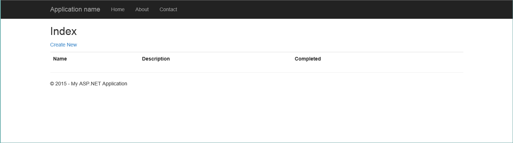
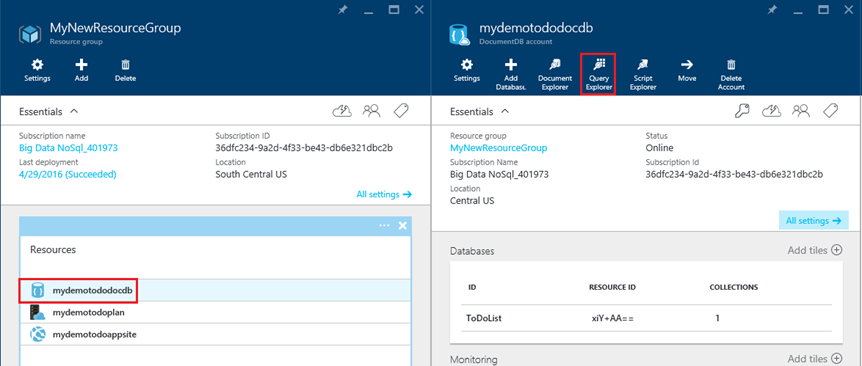

<properties 
    pageTitle="Implantar DocumentDB e Azure aplicativo de serviço Web Apps usando um modelo de Gerenciador de recursos do Azure | Microsoft Azure" 
    description="Saiba como implantar um aplicativo de web de amostra usando um modelo do Gerenciador de recursos do Azure, Azure aplicativo de serviço Web Apps e uma conta de DocumentDB." 
    services="documentdb, app-service\web" 
    authors="h0n" 
    manager="jhubbard" 
    editor="monicar" 
    documentationCenter=""/>

<tags 
    ms.service="documentdb" 
    ms.workload="data-services" 
    ms.tgt_pltfrm="na" 
    ms.devlang="na" 
    ms.topic="article" 
    ms.date="08/02/2016" 
    ms.author="hawong"/>

# Implantar DocumentDB e Azure aplicativo de serviço Web Apps usando um modelo de Gerenciador de recursos do Azure

Este tutorial mostra como usar um modelo do Gerenciador de recursos do Azure para implantar e integrar [Microsoft Azure DocumentDB](https://azure.microsoft.com/services/documentdb/), aplicativo web do [Serviço de aplicativo do Azure](http://go.microsoft.com/fwlink/?LinkId=529714) e um aplicativo da web de exemplo.

Usando modelos do Gerenciador de recursos do Azure, você pode facilmente automatizar a implantação e a configuração de seus recursos Azure.  Este tutorial mostra como implantar um aplicativo web e configurar automaticamente as informações de conexão de conta DocumentDB.

Depois de concluir este tutorial, você poderá responder às seguintes perguntas:  

-   Como posso usar um modelo do Gerenciador de recursos do Azure para implantar e integrar uma conta de DocumentDB e um aplicativo web no serviço de aplicativo do Azure?
-   Como posso usar um modelo do Gerenciador de recursos do Azure para implantar e integrar uma conta de DocumentDB, um aplicativo web no aplicativo de serviço Web Apps e um aplicativo de Webdeploy?

## Pré-requisitos
> [AZURE.TIP] Enquanto este tutorial não assumir a experiência anterior com o Gerenciador de recursos do Azure modelos ou JSON, deve que você deseja modificar os modelos referenciados ou opções de implantação, então conhecimento de cada uma dessas áreas será necessário.

Antes de seguir as instruções neste tutorial, certifique-se de que você tenha o seguinte:

- Uma assinatura do Azure. Azure é uma plataforma baseada em assinatura.  Para obter mais informações sobre como adquirir uma assinatura, consulte [Opções de compra](https://azure.microsoft.com/pricing/purchase-options/), [Oferece membro](https://azure.microsoft.com/pricing/member-offers/)ou [Avaliação gratuita](https://azure.microsoft.com/pricing/free-trial/).

##Etapa 1: Baixar os arquivos de modelo ##
Vamos começar baixando os arquivos de modelo que usaremos neste tutorial.

1. Baixe o modelo de [criar uma conta de DocumentDB, Web Apps e implantar uma amostra de aplicativo de demonstração](https://portalcontent.blob.core.windows.net/samples/DocDBWebsiteTodo.json) para uma pasta local (por exemplo, C:\DocumentDBTemplates). Este modelo implantará uma conta de DocumentDB, um serviço de aplicativo web app e um aplicativo web.  Ele também automaticamente irá configurar o aplicativo da web para conectar-se à conta DocumentDB.

2. Baixe o modelo de [criar uma conta de DocumentDB e amostras de aplicativos Web](https://portalcontent.blob.core.windows.net/samples/DocDBWebSite.json) para uma pasta local (por exemplo, C:\DocumentDBTemplates). Este modelo irá implantar uma conta de DocumentDB, um serviço de aplicativo web app e irá modificar configurações do aplicativo do site para expor facilmente informações de conexão de DocumentDB, mas não inclui um aplicativo web.  

##Etapa 2: Implantar da conta de DocumentDB, o serviço de aplicativo web app e demonstração: amostra de aplicativo

Agora vamos implantar nosso primeiro modelo.

> [AZURE.TIP] O modelo não valida que o nome do aplicativo da web e o nome de conta de DocumentDB inserido abaixo são a) válidos e b) disponíveis.  É altamente recomendável que você verificar a disponibilidade dos nomes que você planeja fornecer antes de enviar a implantação.

1. Faça login ao [Portal Azure](https://portal.azure.com), clique em novo e procure "Implantação de modelo".
    

2. Selecione o item de implantação de modelo e clique em **criar**
    

3.  Clique em **Editar modelo**, cole o conteúdo do arquivo de modelo DocDBWebsiteTodo.json e clique em **Salvar**.
    

4. Clique em **Editar parâmetros**, forneça os valores para cada um dos parâmetros obrigatórios e clique em **Okey**.  Os parâmetros são da seguinte maneira:

    1. Nome do site: Especifica o nome do aplicativo do serviço de aplicativo web e é usado para construir a URL que você usará para acessar o aplicativo da web (por exemplo, se você especificar "mydemodocdbwebapp", então a URL que você irá acessar o aplicativo web será mydemodocdbwebapp.azurewebsites.net).

    2. HOSTINGPLANNAME: Especifica o nome do plano de hospedagem de serviço de aplicativo para criar.

    3. LOCAL: Especifica o Azure local no qual deseja criar a DocumentDB e web recursos do aplicativo.

    4. DATABASEACCOUNTNAME: Especifica o nome da conta DocumentDB criar.   

    

5. Escolha um grupo de recursos existente ou forneça um nome para fazer um novo grupo de recursos e escolha um local para o grupo de recursos.
    
  
6.  Clique em **termos legais de revisão**, **compra**e clique em **criar** para iniciar a implantação.  Selecione **Fixar em dashboard** para a implantação resultante é facilmente visível na sua home page do Azure portal.
    

7.  Quando termina de implantação, abrirá a lâmina de grupo de recursos.
      

8.  Para usar o aplicativo, basta navegar para a URL do aplicativo da web (no exemplo acima, a URL seria http://mydemodocdbwebapp.azurewebsites.net).  Você verá o seguinte aplicativo web:

    

9. Ir adiante e criar algumas das tarefas no aplicativo da web e então volte para a lâmina de grupo de recursos no portal do Azure. Clique no recurso de conta DocumentDB na lista de recursos e clique em **Explorador de consulta**.
      

10. Executar a consulta padrão, "SELECT *FROM c" e inspecionar os resultados.  Observe que a consulta recuperou a representação JSON dos itens todo criado na etapa 7 acima.  Fique à vontade para experimentar as consultas; Por exemplo, tente executar SELECT* de c.isComplete de onde c = true para retornar todos os itens de todo que foram marcados como concluídos.

    

11. Fique à vontade para explorar a experiência do portal de DocumentDB ou modificar o aplicativo de Todo de amostra.  Quando você estiver pronto, vamos implantar outro modelo.
    
 
## Etapa 3: Implantar a amostra de aplicativo de conta e da web do documento

Agora vamos implantar nosso segundo modelo.  Este modelo é útil para mostrar como você pode inserir informações de conexão de DocumentDB como ponto de extremidade de conta e chave mestre em um aplicativo web, como configurações de aplicativo ou como uma cadeia de conexão personalizada. Por exemplo, talvez você tenha seu próprio aplicativo web que você gostaria de implantar com uma conta de DocumentDB e ter as informações de conexão preenchidas automaticamente durante a implantação.

> [AZURE.TIP] O modelo não valida que o nome do aplicativo da web e o nome de conta de DocumentDB inserido abaixo são a) válidos e b) disponíveis.  É altamente recomendável que você verificar a disponibilidade dos nomes que você planeja fornecer antes de enviar a implantação.

1. No [Portal do Azure](https://portal.azure.com), clique em novo e procure por "Implantação de modelo".
    

2. Selecione o item de implantação de modelo e clique em **criar**
    

3.  Clique em **Editar modelo**, cole o conteúdo do arquivo de modelo DocDBWebSite.json e clique em **Salvar**.
    

4. Clique em **Editar parâmetros**, forneça os valores para cada um dos parâmetros obrigatórios e clique em **Okey**.  Os parâmetros são da seguinte maneira:

    1. Nome do site: Especifica o nome do aplicativo do serviço de aplicativo web e é usado para construir a URL que você usará para acessar o aplicativo da web (por exemplo, se você especificar "mydemodocdbwebapp", então a URL que você irá acessar o aplicativo web será mydemodocdbwebapp.azurewebsites.net).

    2. HOSTINGPLANNAME: Especifica o nome do plano de hospedagem de serviço de aplicativo para criar.

    3. LOCAL: Especifica o Azure local no qual deseja criar a DocumentDB e web recursos do aplicativo.

    4. DATABASEACCOUNTNAME: Especifica o nome da conta DocumentDB criar.   

    

5. Escolha um grupo de recursos existente ou forneça um nome para fazer um novo grupo de recursos e escolha um local para o grupo de recursos.
    
  
6.  Clique em **termos legais de revisão**, **compra**e clique em **criar** para iniciar a implantação.  Selecione **Fixar em dashboard** para a implantação resultante é facilmente visível na sua home page do Azure portal.
    

7.  Quando termina de implantação, abrirá a lâmina de grupo de recursos.
      

8. Clique em recurso Web App na lista de recursos e clique em **configurações do aplicativo**
      

9. Observação Como existem configurações de aplicativo presentes para o ponto de extremidade de DocumentDB e cada uma das chaves mestre DocumentDB.
      

10. Fique à vontade para continuar a explorar o Portal do Azure ou siga um dos nossos DocumentDB [amostras](http://go.microsoft.com/fwlink/?LinkID=402386) para criar seu próprio aplicativo DocumentDB.

    
    

## Próximas etapas

Parabéns! Você já implantou DocumentDB, serviço de aplicativo web app e um aplicativo de web de amostra usando modelos do Gerenciador de recursos do Azure.

- Para saber mais sobre DocumentDB, clique [aqui](http://azure.com/docdb).
- Para saber mais sobre os aplicativos da Web de serviços de aplicativo do Azure, clique [aqui](http://go.microsoft.com/fwlink/?LinkId=325362).
- Para saber mais sobre modelos do Gerenciador de recursos do Azure, clique [aqui](https://msdn.microsoft.com/library/azure/dn790549.aspx).

## O que mudou
* Para um guia para a alteração de sites para o serviço de aplicativo consulte: [o serviço de aplicativo do Azure e seu impacto sobre serviços existentes do Azure](http://go.microsoft.com/fwlink/?LinkId=529714)
* Para um guia para a alteração do portal do antigo para o novo portal consulte: [referência para navegar no Portal de clássico do Azure](http://go.microsoft.com/fwlink/?LinkId=529715)

>[AZURE.NOTE] Se você quiser começar a usar o serviço de aplicativo do Azure antes de se inscrever para uma conta do Azure, vá para [Experimentar o serviço de aplicativo](http://go.microsoft.com/fwlink/?LinkId=523751), onde você pode criar imediatamente um aplicativo da web de curta duração starter no aplicativo de serviço. Não há cartões de crédito obrigatório; Não há compromissos.
 
