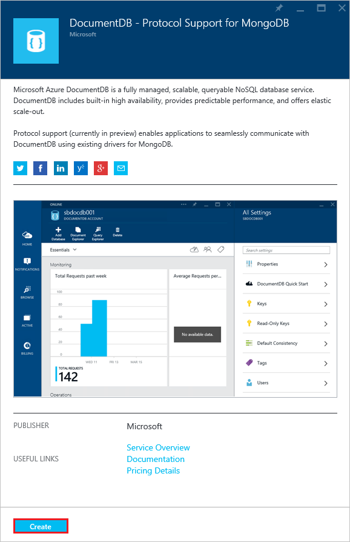
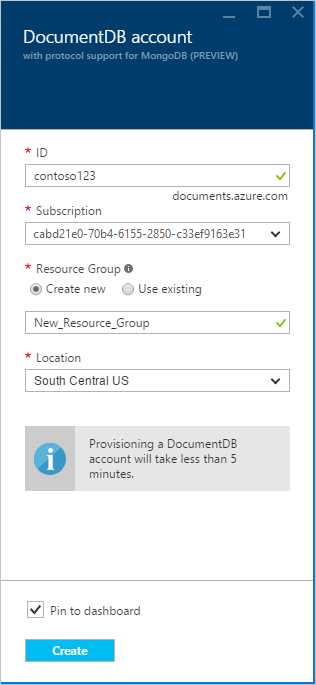

<properties 
    pageTitle="Criar uma conta de DocumentDB com suporte ao protocolo para MongoDB | Microsoft Azure" 
    description="Saiba como criar uma conta de DocumentDB com suporte ao protocolo para MongoDB, agora disponível para visualização." 
    services="documentdb" 
    authors="AndrewHoh" 
    manager="jhubbard" 
    editor="" 
    documentationCenter=""/>

<tags 
    ms.service="documentdb" 
    ms.workload="data-services" 
    ms.tgt_pltfrm="na" 
    ms.devlang="na" 
    ms.topic="article" 
    ms.date="10/20/2016" 
    ms.author="anhoh"/>

# Como criar uma conta de DocumentDB com suporte ao protocolo para MongoDB usando o portal do Azure

Para criar uma conta do Azure DocumentDB com suporte ao protocolo para MongoDB, faça o seguinte:

- Tiver uma conta do Azure. Você pode obter uma [conta gratuita do Azure](https://azure.microsoft.com/free/) caso você não tenha um.

## Criar a conta  

Para criar uma conta de DocumentDB com suporte ao protocolo para MongoDB, execute as etapas a seguir.

1. Em uma nova janela, entre no [Portal do Azure](https://portal.azure.com).
2. Clique em **novo**, clique **dados + armazenamento**, clique em **ver todos**e pesquise a categoria de **dados + armazenamento** para "DocumentDB protocolo". Clique em **DocumentDB - suporte ao protocolo para MongoDB**.

    

3. Como alternativa, na categoria de **dados + armazenamento** , em **armazenamento**, clique em **mais**e, em seguida, clique em **carregar mais** uma ou mais vezes para exibir **DocumentDB - suporte ao protocolo para MongoDB**. Clique em **DocumentDB - suporte ao protocolo para MongoDB**.

    

4. Na lâmina **DocumentDB - suporte ao protocolo para MongoDB (visualização)** , clique em **criar** para iniciar o processo de inscrição de visualização.

    

5. Na lâmina **DocumentDB conta** , clique em **inscrever-se para visualizar**. Leia as informações e clique em **Okey**.

    

6.  Após aceitar os termos de visualização, você será retornado lâmina criar.  Na lâmina **DocumentDB conta** , especifique as configurações desejadas para a conta.

    

    - Na caixa **ID** , insira um nome para identificar a conta.  Quando a **identificação** é validada, uma marca de seleção verde aparece na caixa **ID** . O valor de **ID** se torna o nome de host dentro o URI. A **ID** pode conter apenas letras minúsculas, números e a '-' caracteres e deve estar entre 3 e 50 caracteres. Observe que *documents.azure.com* é acrescentado ao nome do ponto de extremidade que você escolher, o resultado dos quais se tornarão seu ponto de extremidade de conta.

    - Para **assinatura**, selecione a assinatura Azure que você deseja usar para a conta. Se a sua conta tiver apenas uma assinatura, essa conta é selecionada por padrão.

    - No **Grupo de recursos**, selecione ou crie um grupo de recursos para a conta.  Por padrão, um grupo de recursos existente na assinatura do Azure será escolhido.  No entanto, você pode, escolher selecionar a opção para criar um novo grupo de recursos à qual você deseja adicionar a conta. Para obter mais informações, consulte [usando o portal do Azure para gerenciar seus recursos Azure](resource-group-portal.md).

    - Use o **local** para especificar a localização geográfica na qual hospedar a conta.
    
    - Opcional: Seleção **Fixar no painel de controle**. Se fixados dashboard, siga a **etapa 8** abaixo para exibir a navegação do lado esquerdo da sua nova conta.

7.  Quando as novas opções de conta estão configuradas, clique em **criar**.  Pode levar alguns minutos para criar a conta.  Se fixado ao painel, você pode monitorar o progresso de provisionamento na Startboard.  
      

    Se não fixado ao painel, você pode monitorar o andamento do hub notificações.  

      

    

8.  Para acessar sua nova conta, clique em **DocumentDB (NoSQL)** no menu à esquerda. Em sua lista de DocumentDB regular e DocumentDB com contas de suporte de protocolo Mongo, clique no nome de sua nova conta.

9.  Ele está pronto para uso com as configurações padrão. 

    
    

## Próximas etapas

- Saiba como se [Conectar](documentdb-connect-mongodb-account.md) a uma conta de DocumentDB com protocolo suporte para MongoDB.

 
