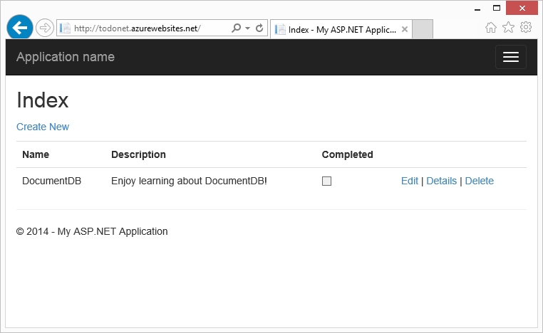
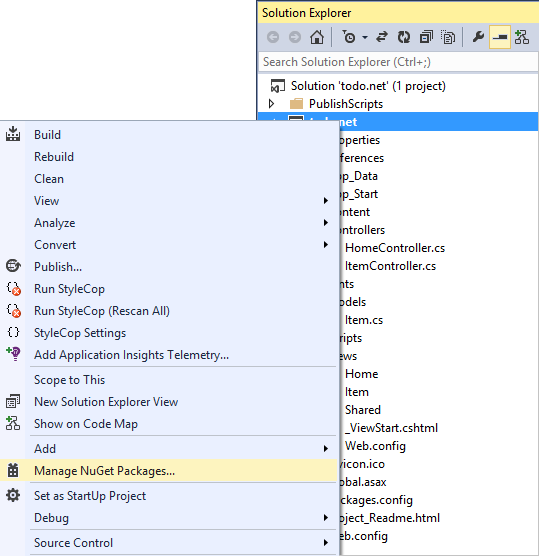
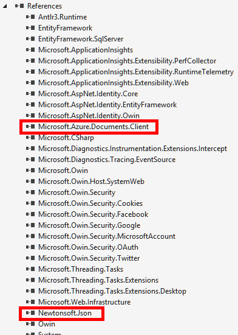
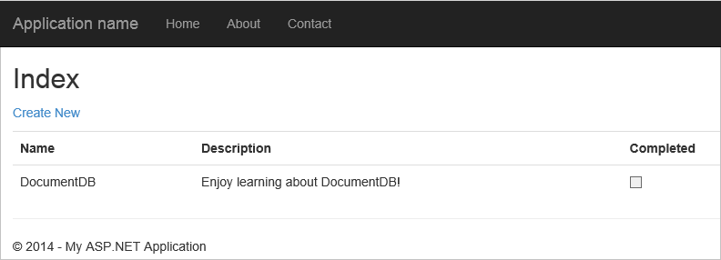

<properties 
    pageTitle="Tutorial do ASP.NET MVC para DocumentDB: desenvolvimento de aplicativos Web | Microsoft Azure" 
    description="Tutorial do ASP.NET MVC para criar um aplicativo web do MVC usando DocumentDB. Você vai JSON de armazenar e acessar dados de um aplicativo de todo hospedado em sites do Azure - tutorial ASP líquido MVC passo a passo." 
    keywords="tutorial do ASP.NET mvc, desenvolvimento de aplicativos web, aplicativo web do mvc, tutorial de mvc líquido asp passo a passo"
    services="documentdb" 
    documentationCenter=".net" 
    authors="syamkmsft" 
    manager="jhubbard" 
    editor="cgronlun"/>

<tags 
    ms.service="documentdb" 
    ms.workload="data-services" 
    ms.tgt_pltfrm="na" 
    ms.devlang="dotnet" 
    ms.topic="hero-article" 
    ms.date="08/25/2016" 
    ms.author="syamk"/>

# ASP.NET MVC Tutorial: Desenvolvimento de aplicativos de Web com DocumentDB

> [AZURE.SELECTOR]
- [.NET](documentdb-dotnet-application.md)
- [Node](documentdb-nodejs-application.md)
- [Java](documentdb-java-application.md)
- [Python](documentdb-python-application.md) 

Para destacar como você pode utilizar com eficiência DocumentDB do Azure para armazenar e consultar JSON documentos, este artigo fornece uma orientação de ponta a ponta sobre mostrando como criar um aplicativo de todo usando DocumentDB do Azure. As tarefas serão armazenadas como documentos JSON no Azure DocumentDB.

Este passo a passo mostra como usar o serviço de DocumentDB fornecido pelo Azure para armazenar e acessar dados de um aplicativo web do ASP.NET MVC hospedado no Azure. Se você estiver procurando um tutorial que se concentra somente nas DocumentDB e não os componentes do ASP.NET MVC, consulte [criar um aplicativo de console c# DocumentDB](documentdb-get-started.md).

> [AZURE.TIP] Este tutorial supõe que você tenha experiência anterior usando ASP.NET MVC e sites do Azure. Se você estiver começando a usar o ASP.NET ou as [Ferramentas de pré-requisito](#_Toc395637760), recomendamos baixando o projeto de exemplo completos do [GitHub][] e seguindo as instruções neste exemplo. Quando tiver criado, você pode examinar este artigo para Obtenha mais informações sobre o código no contexto do projeto.

## Pré-requisitos para este tutorial de banco de dados

Antes de seguir as instruções neste artigo, você deve garantir que você tenha o seguinte:

- Uma conta do Azure active. Se você não tiver uma conta, você pode criar uma conta de avaliação gratuita em apenas alguns minutos. Para obter detalhes, consulte [Avaliação gratuita do Azure](https://azure.microsoft.com/pricing/free-trial/).
- [Visual Studio 2015](http://www.visualstudio.com/) ou atualização do Visual Studio 2013 4 ou superior. Se usando Visual Studio 2013, você precisará instalar o [pacote do nuget Microsoft.Net.Compilers](https://www.nuget.org/packages/Microsoft.Net.Compilers/) para adicionar suporte para c# 6.0. 
- SDK do Azure para .NET versão 2.5.1 ou superior, disponível através de do [Microsoft Web Platform Installer][].

Todas as capturas de tela neste artigo foram tomadas usando o Visual Studio 2013 com 4 aplicados e o SDK do Azure para .NET versão 2.5.1. Se seu sistema estiver configurado com diferentes versões, é possível que as opções e telas não correspondem completamente, mas se você atender os pré-requisitos acima esta solução deve funcionar.

## Etapa 1: Criar uma conta de banco de dados de DocumentDB

Vamos começar criando uma conta de DocumentDB. Se você já tiver uma conta, você pode pular para [criar um novo aplicativo ASP.NET MVC](#_Toc395637762).

[AZURE.INCLUDE [documentdb-create-dbaccount](../../includes/documentdb-create-dbaccount.md)]

[AZURE.INCLUDE [documentdb-keys](../../includes/documentdb-keys.md)]

 
Agora vamos percorrer como criar um novo aplicativo ASP.NET MVC desde o início. 

## Etapa 2: Criar um novo aplicativo ASP.NET MVC

Agora que você tem uma conta, vamos criar nosso novo projeto do ASP.NET.

1. No Visual Studio, no menu **arquivo** , aponte para **novo**e, em seguida, clique em **projeto**.

    A caixa de diálogo **Novo projeto** aparece.
2. No painel **tipos de projeto** , expanda **modelos**, **Visual c#**, **Web**e, em seguida, selecione o **Aplicativo Web ASP.NET**.

    

3. Na caixa **nome** , digite o nome do projeto. Neste tutorial usa o nome "todo". Se você optar por usar algo diferente de isso, em seguida, sempre que este tutorial fala sobre namespace todo, você precisa ajustar as amostras de código fornecido para usar tudo o que é chamado de seu aplicativo. 

4. Clique em **Procurar** para navegar até a pasta onde você deseja criar o projeto e clique em **Okey**.

    A caixa de diálogo **Novo projeto ASP.NET** aparece.

    

5. No painel modelos, selecione **MVC**.

6. Se você planeja hospedar seu aplicativo no Azure, em seguida, selecione **Host na nuvem** na parte inferior direita ter Azure hospedar o aplicativo. Selecionamos para hospedar na nuvem e para executar o aplicativo hospedado em um site do Azure. Selecionar essa opção preprovision um site do Azure para você e facilitar a vida muito quando chegar a hora para implantar o aplicativo de trabalho final. Se você quiser hospedar essa outro lugar ou não quer configurar Azure antecipadamente, basta desmarcar **Host na nuvem**.

7. Clique em **Okey** e permitir que o Visual Studio fazer seu coisa em torno de estrutura o modelo ASP.NET MVC vazio. 

8. Se você escolheu hospedar isso na nuvem, você verá pelo menos uma tela adicional solicitando que você faça logon em sua conta do Azure e fornece alguns valores para seu novo site. Forneça todos os valores adicionais e continuar. 

    Eu ainda não tiver escolhido um "servidor de banco de dados" aqui, porque nós não estiver usando um servidor de banco de dados do SQL Azure aqui, vamos abordar a ser criando uma nova conta do Azure DocumentDB posteriormente no Portal do Azure.

    Para obter mais informações sobre como escolher um **plano de serviço de aplicativo** e o **grupo de recursos**, consulte [Visão geral detalhada de planos de serviço de aplicativo do Azure](../app-service/azure-web-sites-web-hosting-plans-in-depth-overview.md).

    

9. Quando o Visual Studio tiver terminado de criar o aplicativo MVC clichê você tem um aplicativo ASP.NET vazio que você pode executar localmente.

    Podemos irá ignorar executando o projeto localmente porque sei todos observamos ASP.NET "Olá, mundo" aplicativo. Vamos direto para adicionando DocumentDB a este projeto e criação de nosso aplicativo.

## Etapa 3: Adicionar DocumentDB ao seu projeto de aplicativo web MVC

Agora que temos a maioria dos detalhes técnicos ASP.NET MVC que precisamos para esta solução, vamos para a finalidade real deste tutorial, adicionando Azure DocumentDB aplicativo web MVC.

1. O SDK do .NET DocumentDB é empacotado e distribuído como um pacote do NuGet. Para obter o pacote NuGet no Visual Studio, use o Gerenciador de pacote do NuGet no Visual Studio clicando no projeto no **Solution Explorer** e, em seguida, clicando em **Gerenciar pacotes do NuGet**.

    

    Caixa de diálogo **Gerenciar pacotes NuGet** é exibida.

2. Na caixa NuGet **Procurar** , digite ***DocumentDB do Azure***.
    
    Dos resultados, instale o pacote de **Biblioteca de cliente do Microsoft Azure DocumentDB** . Isto irá Baixe e instale o pacote de DocumentDB, além de todas as dependências, como Newtonsoft.Json. Clique em **Okey** na janela de **visualização** e **eu aceitar** na janela de **Aceitação de licença** para concluir a instalação.

    

    Como alternativa, você pode usar o Console do Gerenciador de pacote para instalar o pacote. Para fazer isso, no menu **Ferramentas** , clique em **Gerenciador de pacote do NuGet**e clique em **Package Manager Console**. No prompt, digite o seguinte.

        Install-Package Microsoft.Azure.DocumentDB

3. Quando o pacote estiver instalado, sua solução do Visual Studio deve se parecer com o seguinte com duas novas referências adicionados, Microsoft.Azure.Documents.Client e Newtonsoft.Json.

    

##Etapa 4: Configurar o aplicativo ASP.NET MVC
 
Agora vamos adicionar os modelos, visualizações e controladores para este aplicativo MVC:

- [Adicionar um modelo](#_Toc395637764).
- [Adicionar um controlador](#_Toc395637765).
- [Modos de exibição de adicionar](#_Toc395637766).

### Adicionar um modelo de dados JSON

Vamos começar criando o **M** no MVC, o modelo. 

1. No **Solution Explorer**, clique com botão direito na pasta de **modelos** , clique em **Adicionar**e, em seguida, clique em **classe**.

    Caixa de diálogo **Adicionar Novo Item** é exibida.

2. Nomeie sua nova classe **Item.cs** e clique em **Adicionar**. 

3. Neste novo arquivo de **Item.cs** , adicione o seguinte após a última *usando instrução*.
        
        using Newtonsoft.Json;
    
4. Agora substitua este código 
        
        public class Item
        {
        }

    com o seguinte código.

        public class Item
        {
            [JsonProperty(PropertyName = "id")]
            public string Id { get; set; }
             
            [JsonProperty(PropertyName = "name")]
            public string Name { get; set; }

            [JsonProperty(PropertyName = "description")]
            public string Description { get; set; }

            [JsonProperty(PropertyName = "isComplete")]
            public bool Completed { get; set; }
        }

    Todos os dados DocumentDB é transmitidas e armazenado como JSON. Para controlar a forma como os objetos são serializados/desserializado por JSON.NET você pode usar o atributo **JsonProperty** conforme demonstrou da classe de **Item** que acabou de criar. Você não **tem** de fazer este mas quero garantir que minhas propriedades sigam as convenções de nomenclatura de camelCase JSON. 
    
    Não apenas pode você a controlar o formato do nome da propriedade quando ele entra em JSON, mas você pode renomear inteiramente suas propriedades .NET como fazia com a propriedade de **Descrição** . 
    

### Adicionar um controlador

Isso cuida do **M**, agora vamos criar o **C** no MVC, uma classe de controlador.

1. No **Solution Explorer**, clique com botão direito na pasta de **controladores** , clique em **Adicionar**e clique em **controlador**.

    A caixa de diálogo **Adicionar Scaffold** aparece.

2. Selecione **Controlador de 5 MVC - vazio** e, em seguida, clique em **Adicionar**.

    

3. Nomeie seu novo controlador, **ItemController.**

    

    Depois que o arquivo é criado, sua solução do Visual Studio deve ser semelhante a seguir com o novo arquivo de ItemController.cs no **Solution Explorer**. O novo arquivo de Item.cs criado anteriormente também é mostrado.

    

    Você pode fechar ItemController.cs, podemos será voltar a ele mais tarde. 

### Adicionar visualizações

Agora, vamos criar o **V** no MVC, os modos de exibição:

- [Adicionar um modo de exibição de índice do Item](#AddItemIndexView).
- [Adicionar um modo de exibição do novo Item](#AddNewIndexView).
- [Adicionar um modo de exibição de Editar Item](#_Toc395888515).

#### Adicionar um modo de exibição de índice do Item

1. No **Solution Explorer**, expanda a pasta de **modos de exibição** , clique com botão direito na pasta vazia do **Item** que criado Visual Studio quando você adicionou o **ItemController** anteriormente, clique em **Adicionar**e, em seguida, clique em **Exibir**.

    

2. Na caixa de diálogo **Adicionar modo de exibição** , faça o seguinte:
    - Na caixa **nome de exibição** , digite o ***índice***.
    - Na caixa **modelo** , selecione ***lista***.
    - Na caixa de **classe do modelo** , selecione ***Item (todo. Modelos)***.
    - Deixe a caixa de **classe de contexto de dados** vazia. 
    - Na caixa de página layout, digite ***~/Views/Shared/_Layout.cshtml***.
    
    

3. Assim que todos esses valores são definidos, clique em **Adicionar** e permitem que o Visual Studio crie um novo modo de exibição do modelo. Quando estiver pronta, ele abrirá o arquivo cshtml que foi criado. Nós pode fechar arquivo no Visual Studio como podemos será voltar a ele mais tarde.

#### Adicionar um modo de exibição novo Item

Semelhante a como criamos um modo de exibição de **Índice do Item** , podemos agora criará uma nova exibição para a criação de novos **itens**.

1. No **Solution Explorer**, clique com botão direito na pasta do **Item** novamente, clique em **Adicionar**e, em seguida, clique em **Exibir**.

2. Na caixa de diálogo **Adicionar modo de exibição** , faça o seguinte:
    - Na caixa **nome de exibição** , digite ***criar***.
    - Na caixa **modelo** , selecione ***criar***.
    - Na caixa de **classe do modelo** , selecione ***Item (todo. Modelos)***.
    - Deixe a caixa de **classe de contexto de dados** vazia.
    - Na caixa de página layout, digite ***~/Views/Shared/_Layout.cshtml***.
    - Clique em **Adicionar**.

#### Adicionar um modo de exibição de Editar Item

E finalmente, adicione uma última exibição para edição de um **Item** da mesma forma como antes.

1. No **Solution Explorer**, clique com botão direito na pasta do **Item** novamente, clique em **Adicionar**e, em seguida, clique em **Exibir**.

2. Na caixa de diálogo **Adicionar modo de exibição** , faça o seguinte:
    - Na caixa **nome de exibição** , digite ***Editar***.
    - Na caixa **modelo** , selecione ***Editar***.
    - Na caixa de **classe do modelo** , selecione ***Item (todo. Modelos)***.
    - Deixe a caixa de **classe de contexto de dados** vazia. 
    - Na caixa de página layout, digite ***~/Views/Shared/_Layout.cshtml***.
    - Clique em **Adicionar**.

Quando isso é feito, feche todos os documentos cshtml no Visual Studio como podemos retornarão esses modos de exibição mais tarde.

## Etapa 5: Programando DocumentDB

Agora que as coisas MVC padrão é resolvida, vamos adicionar o código para DocumentDB. 

Nesta seção, vamos adicionar código para manipular o seguinte:

- [Listando itens incompletos](#_Toc395637770).
- [Adicionando itens](#_Toc395637771).
- [Edição de itens](#_Toc395637772).

### Listando itens incompletas em seu aplicativo de web MVC

A primeira coisa a fazer aqui é adicionar uma classe que contém toda a lógica para conectar e usar DocumentDB. Para este tutorial nós será encapsular toda essa lógica na uma classe de repositório chamada DocumentDBRepository. 

1. No **Solution Explorer**, clique com botão direito no projeto, clique em **Adicionar**e, em seguida, clique em **classe**. Nomeie a nova classe **DocumentDBRepository** e clique em **Adicionar**.
 
2. No recém-criado **DocumentDBRepository** classe e adicione o seguinte *usando instruções* acima a declaração de *namespace*
        
        using Microsoft.Azure.Documents; 
        using Microsoft.Azure.Documents.Client; 
        using Microsoft.Azure.Documents.Linq; 
        using System.Configuration;
        using System.Linq.Expressions;
        using System.Threading.Tasks;

    Agora substitua este código 

        public class DocumentDBRepository
        {
        }

    com o seguinte código.

        public static class DocumentDBRepository<T> where T : class
        {
            private static readonly string DatabaseId = ConfigurationManager.AppSettings["database"];
            private static readonly string CollectionId = ConfigurationManager.AppSettings["collection"];
            private static DocumentClient client;
    
            public static void Initialize()
            {
                client = new DocumentClient(new Uri(ConfigurationManager.AppSettings["endpoint"]), ConfigurationManager.AppSettings["authKey"]);
                CreateDatabaseIfNotExistsAsync().Wait();
                CreateCollectionIfNotExistsAsync().Wait();
            }
    
            private static async Task CreateDatabaseIfNotExistsAsync()
            {
                try
                {
                    await client.ReadDatabaseAsync(UriFactory.CreateDatabaseUri(DatabaseId));
                }
                catch (DocumentClientException e)
                {
                    if (e.StatusCode == System.Net.HttpStatusCode.NotFound)
                    {
                        await client.CreateDatabaseAsync(new Database { Id = DatabaseId });
                    }
                    else
                    {
                        throw;
                    }
                }
            }
    
            private static async Task CreateCollectionIfNotExistsAsync()
            {
                try
                {
                    await client.ReadDocumentCollectionAsync(UriFactory.CreateDocumentCollectionUri(DatabaseId, CollectionId));
                }
                catch (DocumentClientException e)
                {
                    if (e.StatusCode == System.Net.HttpStatusCode.NotFound)
                    {
                        await client.CreateDocumentCollectionAsync(
                            UriFactory.CreateDatabaseUri(DatabaseId),
                            new DocumentCollection { Id = CollectionId },
                            new RequestOptions { OfferThroughput = 1000 });
                    }
                    else
                    {
                        throw;
                    }
                }
            }
        }

    > [AZURE.TIP] Ao criar um novo DocumentCollection você pode fornecer um parâmetro RequestOptions opcional de OfferType, que permite especificar o nível de desempenho da nova coleção. Se este parâmetro não for passado o tipo de oferta padrão será usado. Para obter mais informações sobre tipos de oferta DocumentDB consultem [Níveis de desempenho de DocumentDB](documentdb-performance-levels.md)

3. Nós está lendo alguns valores de configuração, abra o arquivo **Web. config** do seu aplicativo e adicione as seguintes linhas em assim o `<AppSettings>` seção.
    
        <add key="endpoint" value="enter the URI from the Keys blade of the Azure Portal"/>
        <add key="authKey" value="enter the PRIMARY KEY, or the SECONDARY KEY, from the Keys blade of the Azure  Portal"/>
        <add key="database" value="ToDoList"/>
        <add key="collection" value="Items"/>
    
4. Agora, atualize os valores de *ponto de extremidade* e *authKey* usando a lâmina de chaves do Portal do Azure. Use o **URI** da lâmina chaves como o valor da configuração do ponto de extremidade e usar a **Chave primária**ou **Chave SECUNDÁRIA** da lâmina chaves como o valor da configuração authKey.

    Que cuida da fiação backup do repositório de DocumentDB, agora vamos adicionar nossa lógica de aplicativo.

5. A primeira coisa que queremos sejam capazes de fazer com um aplicativo de lista todo é exibir os itens incompletos.  Copie e cole o seguinte trecho de código em qualquer lugar dentro da classe **DocumentDBRepository** .

        public static async Task<IEnumerable<T>> GetItemsAsync(Expression<Func<T, bool>> predicate)
        {
            IDocumentQuery<T> query = client.CreateDocumentQuery<T>(
                UriFactory.CreateDocumentCollectionUri(DatabaseId, CollectionId))
                .Where(predicate)
                .AsDocumentQuery();

            List<T> results = new List<T>();
            while (query.HasMoreResults)
            {
                results.AddRange(await query.ExecuteNextAsync<T>());
            }

            return results;
        }

6. Abra o **ItemController** adicionamos anteriormente e adicione o seguinte *usando instruções* acima a declaração de namespace.

        using System.Net;
        using System.Threading.Tasks;
        using todo.Models;

    Se seu projeto não é nomeado "todo", em seguida, você precisa atualizar usando "todo. Modelos de"; para refletir o nome do seu projeto.

    Agora substitua este código

        //GET: Item
        public ActionResult Index()
        {
            return View();
        }

    com o seguinte código.

        [ActionName("Index")]
        public async Task<ActionResult> IndexAsync()
        {
            var items = await DocumentDBRepository<Item>.GetItemsAsync(d => !d.Completed);
            return View(items);
        }
    
7. Abra **Global.asax.cs** e adicione a seguinte linha ao método **Application_Start** 
 
        DocumentDBRepository<todo.Models.Item>.Initialize();
    
Neste ponto, sua solução deve ser capaz de criar sem erros.

Se você executou o aplicativo agora, você poderia ir para **HomeController** e a exibição de **índice** de que o controlador. Este é o comportamento padrão para o projeto de modelo MVC que escolhemos no início, mas não queremos que! Vamos alterar o roteamento neste aplicativo MVC alterar esse comportamento.

Abrir ***aplicativo\_Start\RouteConfig.cs*** e localize a linha que começam com "padrões:" e altere-o para ser semelhante ao seguinte.

        defaults: new { controller = "Item", action = "Index", id = UrlParameter.Optional }

Isso agora informa ASP.NET MVC que se você não especificou um valor na URL para controlar o comportamento de roteamento que, em vez da **página inicial**, usar **Item** como o controlador e o usuário **índice** como o modo de exibição.

Agora, se você executar o aplicativo, ele chamará sua **ItemController** que ligar para a classe de repositório e use o método GetItems para retornar todos os itens incompletos para as **exibições**\\**Item**\\modo de exibição de**índice** . 

Se você criar e executa este projeto agora, agora você deve ver algo que pareça isso.    

### Adicionando itens

Vamos colocar alguns itens no nosso banco de dados, portanto, temos algo mais do que uma grade vazia para examinar.

Vamos adicionar alguns códigos para DocumentDBRepository e ItemController para manter o registro no DocumentDB.

1.  Adicione o seguinte método à sua classe **DocumentDBRepository** .

        public static async Task<Document> CreateItemAsync(T item)
        {
            return await client.CreateDocumentAsync(UriFactory.CreateDocumentCollectionUri(DatabaseId, CollectionId), item);
        }

    Este método simplesmente utiliza um objeto passado para ele e persiste-lo em DocumentDB.

2. Abra o arquivo ItemController.cs e adicione o seguinte trecho de código dentro da classe. Isso é como ASP.NET MVC sabe o que fazer para a ação **criar** . Nesse caso, apenas renderizados exibição Create.cshtml associada criada anteriormente.

        [ActionName("Create")]
        public async Task<ActionResult> CreateAsync()
        {
            return View();
        }

    Agora, precisamos algum código mais neste controlador que aceitará o envio do modo de exibição **criar** .

2. Adicione o próximo bloco de código para a classe de ItemController.cs que informa ASP.NET MVC o que fazer com um formulário de POSTAGEM para este controlador.
    
        [HttpPost]
        [ActionName("Create")]
        [ValidateAntiForgeryToken]
        public async Task<ActionResult> CreateAsync([Bind(Include = "Id,Name,Description,Completed")] Item item)
        {
            if (ModelState.IsValid)
            {
                await DocumentDBRepository<Item>.CreateItemAsync(item);
                return RedirectToAction("Index");
            }

            return View(item);
        }

    Este código chama o DocumentDBRepository e usa o método CreateItemAsync para manter o novo item de todo o banco de dados. 
 
    **Observação de segurança**: O atributo **ValidateAntiForgeryToken** é usado aqui para ajudar a proteger este aplicativo contra ataques de falsificação de solicitação intersite. Não há mais do que apenas adicionar esse atributo, modos de exibição do precisam trabalhar com esse token de antifalsificação também. Para obter mais informações sobre o assunto e exemplos de como implementar isso corretamente, consulte [Impedindo falsificação de solicitação intersite][]. O código-fonte fornecido no [GitHub][] tem a implementação completa no lugar.

    **Observação de segurança**: também usamos o atributo **vincular** no parâmetro método para ajudar a proteger contra ataques de lançamento excesso. Para obter mais detalhes, consulte [Operações CRUD básicas no ASP.NET MVC][].

Isso conclui o código necessário para adicionar novos itens ao nosso banco de dados.

### Edição de itens

Não há uma última coisa para nós fazer e que é adicionar a capacidade para editar **itens** no banco de dados e marcá-los como concluída. O modo de exibição para edição já foi adicionado ao projeto, portanto, precisamos apenas adicionar alguns códigos para nosso controlador de e para a classe de **DocumentDBRepository** novamente.

1. Adicione o seguinte à classe **DocumentDBRepository** .

        public static async Task<Document> UpdateItemAsync(string id, T item)
        {
            return await client.ReplaceDocumentAsync(UriFactory.CreateDocumentUri(DatabaseId, CollectionId, id), item);
        }

        public static async Task<T> GetItemAsync(string id)
        {
            try
            {
                Document document = await client.ReadDocumentAsync(UriFactory.CreateDocumentUri(DatabaseId, CollectionId, id));
                return (T)(dynamic)document;
            }
            catch (DocumentClientException e)
            {
                if (e.StatusCode == HttpStatusCode.NotFound)
                {
                    return null;
                }
                else
                {
                    throw;
                }
            }
        }
    
    O primeiro desses métodos, **GetItem** buscas um Item de DocumentDB que é passado para o **ItemController** e, então, para **Editar** modo de exibição.
    
    O segundo dos métodos apenas adicionamos substitui que o **documento** em DocumentDB com a versão do **documento** passado da **ItemController**.

2. Adicione o seguinte à classe **ItemController** .

        [HttpPost]
        [ActionName("Edit")]
        [ValidateAntiForgeryToken]
        public async Task<ActionResult> EditAsync([Bind(Include = "Id,Name,Description,Completed")] Item item)
        {
            if (ModelState.IsValid)
            {
                await DocumentDBRepository<Item>.UpdateItemAsync(item.Id, item);
                return RedirectToAction("Index");
            }

            return View(item);
        }

        [ActionName("Edit")]
        public async Task<ActionResult> EditAsync(string id)
        {
            if (id == null)
            {
                return new HttpStatusCodeResult(HttpStatusCode.BadRequest);
            }

            Item item = await DocumentDBRepository<Item>.GetItemAsync(id);
            if (item == null)
            {
                return HttpNotFound();
            }

            return View(item);
        }
    
    O primeiro método controla o Http GET que acontece quando o usuário clica no link **Editar** no modo de **índice** . Este método agrupa um [**documento**](http://msdn.microsoft.com/library/azure/microsoft.azure.documents.document.aspx) do DocumentDB e passa para **Editar** modo de exibição.

    **Editar** modo de exibição, em seguida, fará uma POSTAGEM Http para o **IndexController**. 
    
    O segundo método adicionamos manipula passando o objeto atualizado para DocumentDB sejam mantidas no banco de dados.

Isto é, que é tudo o que precisamos executar nosso aplicativo, incompletos **itens**de lista, adicionar novos **itens**e editar **itens**.

## Etapa 6: Executar o aplicativo localmente

Para testar o aplicativo no computador local, faça o seguinte:

1. Pressione F5 no Visual Studio para criar o aplicativo no modo de depuração. Ele deve criar o aplicativo e iniciar um navegador com a página de grade vazia que podemos viu antes:

    

    Se você estiver usando o Visual Studio 2013 e o erro "Não é possível esperar no corpo de uma cláusula catch". Você precisa instalar o [pacote do nuget Microsoft.Net.Compilers](https://www.nuget.org/packages/Microsoft.Net.Compilers/). Você também pode comparar seu código contra o projeto de amostra no [GitHub][]. 

2. Clique no link **Criar novo** e adicione valores aos campos de **nome** e **Descrição** . Deixe a **concluídas** verificar caixa desmarcada caso contrário, o novo **Item** será adicionado em um estado concluído e não aparecerá na lista de inicial.

    

3. Clique em **criar** e você será redirecionado para o modo de exibição de **índice** e seu **Item** aparece na lista.

    

    Fique à vontade para adicionar mais alguns **itens** à sua lista de tarefas pendentes.

3. Clique em **Editar** ao lado de um **Item** da lista e você será direcionado para o modo de exibição **Editar** onde você pode atualizar qualquer propriedade de seu objeto, incluindo o sinalizador de **concluído** . Se você marca o sinalizador **concluída** e clique em **Salvar**, o **Item** é removido da lista de tarefas incompletas.

    

4. Uma vez que você já testado o aplicativo, pressione Ctrl + F5 para parar a depuração do aplicativo. Você está pronto para implantar!

## Etapa 7: Implantar o aplicativo para sites do Azure

Agora que você tem o aplicativo completo funcionando corretamente com DocumentDB vamos para implantar esse aplicativo web aos sites do Azure. Se você selecionou **Host na nuvem** , quando você criou o projeto ASP.NET MVC vazio Visual Studio realmente facilita e faz a maior parte do trabalho para você. 

1. Para publicar este aplicativo tudo o que você precisa fazer é com o botão direito no projeto no **Solution Explorer** e clique em **Publicar**.

    

2. Tudo já deve estar configurado acordo com suas credenciais; Na verdade o site já foi criado no Azure para você na **URL de destino** mostrado, tudo o que você precisa fazer é clicar em **Publicar**.

    

Em alguns segundos, o Visual Studio irá concluir a publicação de seu aplicativo da web e iniciar um navegador onde você pode ver seu trabalho prático em execução no Azure!

## Próximas etapas

Parabéns! Você apenas criados sua primeira ASP.NET MVC aplicativo web usando DocumentDB do Azure e publicá-lo para sites do Azure. O código-fonte para o aplicativo concluído, incluindo a funcionalidade de detalhes e excluir que não foram incluídos neste tutorial pode ser baixado ou clonar do [GitHub][]. Portanto se você estiver interessado em Adicionando que para o seu aplicativo, pegue o código e adicioná-lo para este aplicativo.

Para adicionar funcionalidade adicional para o seu aplicativo, examine as APIs disponíveis na [Biblioteca de .NET DocumentDB](https://msdn.microsoft.com/library/azure/dn948556.aspx) e fique à vontade para contribuir para a biblioteca de .NET DocumentDB no [GitHub][]. 

[\*]: https://microsoft.sharepoint.com/teams/DocDB/Shared%20Documents/Documentation/Docs.LatestVersions/PicExportError
[Visual Studio Express]: http://www.visualstudio.com/products/visual-studio-express-vs.aspx
[Microsoft Web Platform Installer]: http://www.microsoft.com/web/downloads/platform.aspx
[Evitar a falsificação de solicitação intersite]: http://go.microsoft.com/fwlink/?LinkID=517254
[Operações de CRUD básicas no ASP.NET MVC]: http://go.microsoft.com/fwlink/?LinkId=317598
[GitHub]: https://github.com/Azure-Samples/documentdb-net-todo-app
