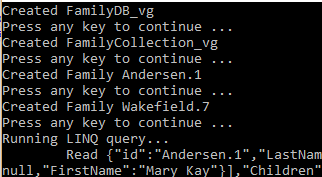

<properties
    pageTitle="Tutorial do NoSQL: DocumentDB .NET SDK | Microsoft Azure"
    description="Um tutorial NoSQL que cria um banco de dados online e o aplicativo de console c# usando o SDK do .NET DocumentDB. DocumentDB é um banco de dados NoSQL JSON."
    keywords="tutorial do NoSQL, banco de dados online, o aplicativo de console c#"
    services="documentdb"
    documentationCenter=".net"
    authors="AndrewHoh"
    manager="jhubbard"
    editor="monicar"/>

<tags
    ms.service="documentdb"
    ms.workload="data-services"
    ms.tgt_pltfrm="na"
    ms.devlang="dotnet"
    ms.topic="hero-article"
    ms.date="09/01/2016"
    ms.author="anhoh"/>

# NoSQL tutorial: criar um DocumentDB c# aplicativo de console

> [AZURE.SELECTOR]
- [.NET](documentdb-get-started.md)
- [Node](documentdb-nodejs-get-started.md)

Bem-vindo ao tutorial NoSQL para o SDK do .NET DocumentDB Azure! Após obter o projeto de início rápido ou Concluindo o tutorial, você terá um aplicativo de console que cria e consultas DocumentDB recursos.

- **[Início rápido](#quickstart)**: baixar o projeto de amostra, adicione suas informações de conexão e ter um aplicativo de DocumentDB executado em menos de 10 minutos.
- **[Tutorial](#tutorial)**: criar o aplicativo de início rápido do zero em 30 minutos.

## Pré-requisitos

- Uma conta do Azure active. Se você não tiver um, você pode inscrever para uma [conta gratuita](https://azure.microsoft.com/free/).
- [Visual Studio 2013 ou Visual Studio 2015](http://www.visualstudio.com/).
- .NET framework 4.6

## Início rápido

1. Baixar o projeto de amostra. zip do [GitHub](https://github.com/Azure-Samples/documentdb-dotnet-getting-started-quickstart/archive/master.zip) ou clonar o repo [documentdb-dotnet-obtendo-iniciado-início rápido](https://github.com/Azure-Samples/documentdb-dotnet-getting-started-quickstart) .
2. Use o portal do Azure para [criar uma conta de DocumentDB](documentdb-create-account.md).
3. No arquivo App, substitua os valores EndpointUri e PrimaryKey com os valores recuperados a partir do [portal do Azure](https://portal.azure.com/), navegando até blade **DocumentDB (NoSQL)** , e em seguida, clicando no **nome da conta**e clicando em **teclas** no menu de recursos.
    
4. Crie o projeto. A janela de console mostra os novos recursos sendo criados, consultados e, em seguida, eliminados.
    
    

## Tutorial

Este tutorial orienta a criação de um banco de dados de DocumentDB, um conjunto de DocumentDB e documentos JSON. Você vai coleção, de consulta e limpar e excluir o banco de dados. Este tutorial cria o mesmo projeto como o projeto de início rápido, mas você vai criar forma incremental e receberá explicação sobre o código que você está adicionando ao projeto.

## Etapa 1: Criar uma conta de DocumentDB

Vamos criar uma conta de DocumentDB. Se você já tiver uma conta que você deseja usar, você pode saltar para [configurar sua solução do Visual Studio](#SetupVS).

[AZURE.INCLUDE [documentdb-create-dbaccount](../../includes/documentdb-create-dbaccount.md)]

## Etapa 2: Configure sua solução do Visual Studio

1. Abra o **Visual Studio 2015** em seu computador.
2. No menu **arquivo** , selecione **novo**e, em seguida, escolha o **projeto**.
3. Na caixa de diálogo **Novo projeto** , selecione **modelos** / **Visual c#** / **Aplicativo de Console**, nomeie seu projeto e clique em **Okey**.

4. No **Solution Explorer**, clique com botão direito seu novo aplicativo de console, que está em sua solução do Visual Studio.
5. Sem sair do menu, clique no **Gerenciar pacotes de NuGet...** 
 
6. Na guia **Nuget** , clique em **Procurar**e digite **documentdb azure** na caixa de pesquisa.
7. Nos resultados, encontre **Microsoft.Azure.DocumentDB** e clique em **instalar**.
A ID de pacote para a biblioteca de cliente DocumentDB é [Microsoft.Azure.DocumentDB](https://www.nuget.org/packages/Microsoft.Azure.DocumentDB)

Legal! Agora que estamos terminar a configuração, vamos começar a escrever algum código. Você pode encontrar um projeto de código concluído deste tutorial em [GitHub](https://github.com/Azure-Samples/documentdb-dotnet-getting-started/blob/master/src/Program.cs).

## Etapa 3: Conectar a uma conta de DocumentDB

Primeiro, adicione essas referências para o início de seu aplicativo c#, no arquivo Program.cs:

    using System;
    using System.Linq;
    using System.Threading.Tasks;

    // ADD THIS PART TO YOUR CODE
    using System.Net;
    using Microsoft.Azure.Documents;
    using Microsoft.Azure.Documents.Client;
    using Newtonsoft.Json;

> [AZURE.IMPORTANT] Para concluir este tutorial NoSQL, verifique se que você adicionar as dependências acima.

Agora, adicione essas duas constantes e a variável de *cliente* sob sua classe pública *programa*.

    public class Program
    {
        // ADD THIS PART TO YOUR CODE
        private const string EndpointUri = "<your endpoint URI>";
        private const string PrimaryKey = "<your key>";
        private DocumentClient client;

Cabeça próxima, o [Portal do Azure](https://portal.azure.com) para recuperar o URI e a chave primária. A chave primária e DocumentDB URI são necessários para seu aplicativo para compreender onde conectar a e para DocumentDB confiar conexão do seu aplicativo.

No Portal do Azure, navegue até sua conta DocumentDB e, em seguida, clique **nas teclas**.

Copiar o URI do portal e colá-lo em `<your endpoint URI>` no arquivo program.cs. Em seguida, copie a chave primária no portal do e colá-lo em `<your key>`.

![Captura de tela do Portal do Azure usados pelo tutorial NoSQL para criar um aplicativo de console c#. Mostra uma conta de DocumentDB, com o hub ativo realçado, o botão de chaves realçado na lâmina DocumentDB conta e os valores URI, chave primária e chave SECUNDÁRIA realçados na lâmina teclas][keys]

Vamos começar o aplicativo iniciado obtendo criando uma nova instância da **DocumentClient**.

Abaixo do método **principal** , adicione esta nova tarefa assíncrona chamada **GetStartedDemo**, que criará uma instância nosso novo **DocumentClient**.

    static void Main(string[] args)
    {
    }

    // ADD THIS PART TO YOUR CODE
    private async Task GetStartedDemo()
    {
        this.client = new DocumentClient(new Uri(EndpointUri), PrimaryKey);
    }

Adicione o seguinte código para executar sua tarefa assíncrona do seu método de **principal** . O método **principal** será capturar exceções e escreva-los no console.

    static void Main(string[] args)
    {
            // ADD THIS PART TO YOUR CODE
            try
            {
                    Program p = new Program();
                    p.GetStartedDemo().Wait();
            }
            catch (DocumentClientException de)
            {
                    Exception baseException = de.GetBaseException();
                    Console.WriteLine("{0} error occurred: {1}, Message: {2}", de.StatusCode, de.Message, baseException.Message);
            }
            catch (Exception e)
            {
                    Exception baseException = e.GetBaseException();
                    Console.WriteLine("Error: {0}, Message: {1}", e.Message, baseException.Message);
            }
            finally
            {
                    Console.WriteLine("End of demo, press any key to exit.");
                    Console.ReadKey();
            }

Pressione **F5** para executar o aplicativo.

Parabéns! Você tiver conectado com êxito para uma conta de DocumentDB, vamos agora dar uma olhada trabalhando com recursos de DocumentDB.  

## Etapa 4: Criar um banco de dados
Antes de adicionar o código para criar um banco de dados, adicione um método auxiliar para gravar no console.

Copie e cole o método **WriteToConsoleAndPromptToContinue** sob o método **GetStartedDemo** .

    // ADD THIS PART TO YOUR CODE
    private void WriteToConsoleAndPromptToContinue(string format, params object[] args)
    {
            Console.WriteLine(format, args);
            Console.WriteLine("Press any key to continue ...");
            Console.ReadKey();
    }

Seu DocumentDB [banco de dados](documentdb-resources.md#databases) pode ser criados usando o método [CreateDatabaseAsync](https://msdn.microsoft.com/library/microsoft.azure.documents.client.documentclient.createdatabaseasync.aspx) da classe **DocumentClient** . Um banco de dados é o contêiner lógico de armazenamento de documento JSON particionado entre conjuntos.

Copie e cole o método **CreateDatabaseIfNotExists** sob o método **WriteToConsoleAndPromptToContinue** .

    // ADD THIS PART TO YOUR CODE
    private async Task CreateDatabaseIfNotExists(string databaseName)
    {
            // Check to verify a database with the id=FamilyDB does not exist
            try
            {
                    await this.client.ReadDatabaseAsync(UriFactory.CreateDatabaseUri(databaseName));
                    this.WriteToConsoleAndPromptToContinue("Found {0}", databaseName);
            }
            catch (DocumentClientException de)
            {
                    // If the database does not exist, create a new database
                    if (de.StatusCode == HttpStatusCode.NotFound)
                    {
                            await this.client.CreateDatabaseAsync(new Database { Id = databaseName });
                            this.WriteToConsoleAndPromptToContinue("Created {0}", databaseName);
                    }
                    else
                    {
                            throw;
                    }
            }
    }

Copie e cole o seguinte código ao seu método de **GetStartedDemo** sob a criação de cliente. Isso criará um banco de dados denominado *FamilyDB*.

    private async Task GetStartedDemo()
    {
        this.client = new DocumentClient(new Uri(EndpointUri), PrimaryKey);

        // ADD THIS PART TO YOUR CODE
        await this.CreateDatabaseIfNotExists("FamilyDB_va");

Pressione **F5** para executar o aplicativo.

Parabéns! Você criou com êxito um banco de dados de DocumentDB.  

## Etapa 5: Criar uma coleção  

> [AZURE.WARNING] **CreateDocumentCollectionAsync** irá criar um novo conjunto com produtividade reservada, o que tem implicações de preços. Para obter mais detalhes, visite nossa [página de preços](https://azure.microsoft.com/pricing/details/documentdb/).

Uma [coleção](documentdb-resources.md#collections) pode ser criados usando o método [CreateDocumentCollectionAsync](https://msdn.microsoft.com/library/microsoft.azure.documents.client.documentclient.createdocumentcollectionasync.aspx) da classe **DocumentClient** . Uma coleção é um contêiner de documentos JSON e lógica de aplicativo JavaScript associada.

Copie e cole o método **CreateDocumentCollectionIfNotExists** sob seu método de **CreateDatabaseIfNotExists** .

    // ADD THIS PART TO YOUR CODE
    private async Task CreateDocumentCollectionIfNotExists(string databaseName, string collectionName)
    {
        try
        {
            await this.client.ReadDocumentCollectionAsync(UriFactory.CreateDocumentCollectionUri(databaseName, collectionName));
            this.WriteToConsoleAndPromptToContinue("Found {0}", collectionName);
        }
        catch (DocumentClientException de)
        {
            // If the document collection does not exist, create a new collection
            if (de.StatusCode == HttpStatusCode.NotFound)
            {
                DocumentCollection collectionInfo = new DocumentCollection();
                collectionInfo.Id = collectionName;

                // Configure collections for maximum query flexibility including string range queries.
                collectionInfo.IndexingPolicy = new IndexingPolicy(new RangeIndex(DataType.String) { Precision = -1 });

                // Here we create a collection with 400 RU/s.
                await this.client.CreateDocumentCollectionAsync(
                    UriFactory.CreateDatabaseUri(databaseName),
                    collectionInfo,
                    new RequestOptions { OfferThroughput = 400 });

                this.WriteToConsoleAndPromptToContinue("Created {0}", collectionName);
            }
            else
            {
                throw;
            }
        }
    }

Copie e cole o seguinte código ao seu método de **GetStartedDemo** sob a criação de banco de dados. Isso criará um conjunto de documentos denominado *FamilyCollection_va*.

        this.client = new DocumentClient(new Uri(EndpointUri), PrimaryKey);

        await this.CreateDatabaseIfNotExists("FamilyDB_oa");

        // ADD THIS PART TO YOUR CODE
        await this.CreateDocumentCollectionIfNotExists("FamilyDB_va", "FamilyCollection_va");

Pressione **F5** para executar o aplicativo.

Parabéns! Você criou um conjunto de documentos DocumentDB com êxito.  

## Etapa 6: Criar documentos JSON
Um [documento](documentdb-resources.md#documents) pode ser criado usando o método [CreateDocumentAsync](https://msdn.microsoft.com/library/microsoft.azure.documents.client.documentclient.createdocumentasync.aspx) da classe **DocumentClient** . Os documentos são (aleatório) conteúdo JSON definidas pelo usuário. Agora, podemos pode inserir um ou mais documentos. Se você já tiver dados que você gostaria de armazenar no seu banco de dados, você pode usar da DocumentDB [ferramenta de migração de dados](documentdb-import-data.md).

Primeiro, precisamos criar uma classe de **família** que representará objetos armazenados no DocumentDB neste exemplo. Nós também criará **pai**, **filho**, **Pet**, subclasses de **endereço** que são usadas em **família**. Observe que os documentos tenham uma propriedade de **Id** serializada como **id** em JSON. Crie essas classes, adicionando as seguintes classes sub internas após o método **GetStartedDemo** .

Copie e cole na **família** **pai**, **filho**, **Pet**de classes de **endereços** sob o método **WriteToConsoleAndPromptToContinue** .

    private void WriteToConsoleAndPromptToContinue(string format, params object[] args)
    {
        Console.WriteLine(format, args);
        Console.WriteLine("Press any key to continue ...");
        Console.ReadKey();
    }

    // ADD THIS PART TO YOUR CODE
    public class Family
    {
        [JsonProperty(PropertyName = "id")]
        public string Id { get; set; }
        public string LastName { get; set; }
        public Parent[] Parents { get; set; }
        public Child[] Children { get; set; }
        public Address Address { get; set; }
        public bool IsRegistered { get; set; }
        public override string ToString()
        {
                return JsonConvert.SerializeObject(this);
        }
    }

    public class Parent
    {
        public string FamilyName { get; set; }
        public string FirstName { get; set; }
    }

    public class Child
    {
        public string FamilyName { get; set; }
        public string FirstName { get; set; }
        public string Gender { get; set; }
        public int Grade { get; set; }
        public Pet[] Pets { get; set; }
    }

    public class Pet
    {
        public string GivenName { get; set; }
    }

    public class Address
    {
        public string State { get; set; }
        public string County { get; set; }
        public string City { get; set; }
    }

Copie e cole o método **CreateFamilyDocumentIfNotExists** sob seu método de **CreateDocumentCollectionIfNotExists** .

    // ADD THIS PART TO YOUR CODE
    private async Task CreateFamilyDocumentIfNotExists(string databaseName, string collectionName, Family family)
    {
        try
        {
            await this.client.ReadDocumentAsync(UriFactory.CreateDocumentUri(databaseName, collectionName, family.Id));
            this.WriteToConsoleAndPromptToContinue("Found {0}", family.Id);
        }
        catch (DocumentClientException de)
        {
            if (de.StatusCode == HttpStatusCode.NotFound)
            {
                await this.client.CreateDocumentAsync(UriFactory.CreateDocumentCollectionUri(databaseName, collectionName), family);
                this.WriteToConsoleAndPromptToContinue("Created Family {0}", family.Id);
            }
            else
            {
                throw;
            }
        }
    }

E insira dois documentos, cada uma para a família Freitas e a família de Wakefield.

Copie e cole o seguinte código ao seu método de **GetStartedDemo** sob a criação de conjunto de documentos.

    await this.CreateDatabaseIfNotExists("FamilyDB_va");

    await this.CreateDocumentCollectionIfNotExists("FamilyDB_va", "FamilyCollection_va");

    // ADD THIS PART TO YOUR CODE
    Family andersenFamily = new Family
    {
            Id = "Andersen.1",
            LastName = "Andersen",
            Parents = new Parent[]
            {
                    new Parent { FirstName = "Thomas" },
                    new Parent { FirstName = "Mary Kay" }
            },
            Children = new Child[]
            {
                    new Child
                    {
                            FirstName = "Henriette Thaulow",
                            Gender = "female",
                            Grade = 5,
                            Pets = new Pet[]
                            {
                                    new Pet { GivenName = "Fluffy" }
                            }
                    }
            },
            Address = new Address { State = "WA", County = "King", City = "Seattle" },
            IsRegistered = true
    };

    await this.CreateFamilyDocumentIfNotExists("FamilyDB_va", "FamilyCollection_va", andersenFamily);

    Family wakefieldFamily = new Family
    {
            Id = "Wakefield.7",
            LastName = "Wakefield",
            Parents = new Parent[]
            {
                    new Parent { FamilyName = "Wakefield", FirstName = "Robin" },
                    new Parent { FamilyName = "Miller", FirstName = "Ben" }
            },
            Children = new Child[]
            {
                    new Child
                    {
                            FamilyName = "Merriam",
                            FirstName = "Jesse",
                            Gender = "female",
                            Grade = 8,
                            Pets = new Pet[]
                            {
                                    new Pet { GivenName = "Goofy" },
                                    new Pet { GivenName = "Shadow" }
                            }
                    },
                    new Child
                    {
                            FamilyName = "Miller",
                            FirstName = "Lisa",
                            Gender = "female",
                            Grade = 1
                    }
            },
            Address = new Address { State = "NY", County = "Manhattan", City = "NY" },
            IsRegistered = false
    };

    await this.CreateFamilyDocumentIfNotExists("FamilyDB_va", "FamilyCollection_va", wakefieldFamily);

Pressione **F5** para executar o aplicativo.

Parabéns! Dois documentos DocumentDB foi criado com êxito.  

##Etapa 7: Recursos de consulta DocumentDB

DocumentDB suporta rich [consultas](documentdb-sql-query.md) contra JSON documentos armazenados em cada conjunto.  O código de exemplo a seguir mostra várias consultas - usando as duas sintaxe SQL de DocumentDB, além de LINQ - que podemos executar nos documentos de nós inserido na etapa anterior.

Copie e cole o método **ExecuteSimpleQuery** sob seu método de **CreateFamilyDocumentIfNotExists** .

    // ADD THIS PART TO YOUR CODE
    private void ExecuteSimpleQuery(string databaseName, string collectionName)
    {
        // Set some common query options
        FeedOptions queryOptions = new FeedOptions { MaxItemCount = -1 };

            // Here we find the Andersen family via its LastName
            IQueryable<Family> familyQuery = this.client.CreateDocumentQuery<Family>(
                    UriFactory.CreateDocumentCollectionUri(databaseName, collectionName), queryOptions)
                    .Where(f => f.LastName == "Andersen");

            // The query is executed synchronously here, but can also be executed asynchronously via the IDocumentQuery<T> interface
            Console.WriteLine("Running LINQ query...");
            foreach (Family family in familyQuery)
            {
                    Console.WriteLine("\tRead {0}", family);
            }

            // Now execute the same query via direct SQL
            IQueryable<Family> familyQueryInSql = this.client.CreateDocumentQuery<Family>(
                    UriFactory.CreateDocumentCollectionUri(databaseName, collectionName),
                    "SELECT * FROM Family WHERE Family.LastName = 'Andersen'",
                    queryOptions);

            Console.WriteLine("Running direct SQL query...");
            foreach (Family family in familyQueryInSql)
            {
                    Console.WriteLine("\tRead {0}", family);
            }

            Console.WriteLine("Press any key to continue ...");
            Console.ReadKey();
    }

Copie e cole o seguinte código ao seu método de **GetStartedDemo** sob a segunda criação de documento.

    await this.CreateFamilyDocumentIfNotExists("FamilyDB_va", "FamilyCollection_va", wakefieldFamily);

    // ADD THIS PART TO YOUR CODE
    this.ExecuteSimpleQuery("FamilyDB_va", "FamilyCollection_va");

Pressione **F5** para executar o aplicativo.

Parabéns! Você tiver consultado com êxito em relação a um conjunto de DocumentDB.

O diagrama a seguir ilustra como o SQL DocumentDB sintaxe de consulta é chamado em relação à coleção que você criou e a mesma lógica se aplica à consulta LINQ também.

A palavra-chave [FROM](documentdb-sql-query.md#from-clause) é opcional na consulta, pois já têm como escopo DocumentDB consultas para um único conjunto. Portanto, "De famílias f" pode ser trocado por "De raiz r" ou qualquer outra variável nome que você escolher. DocumentDB irá inferir que famílias, raiz ou o nome da variável escolhido, referência à coleção atual por padrão.

##Etapa 8: Substitua documento JSON

DocumentDB oferece suporte a substituição JSON documentos.  

Copie e cole o método **ReplaceFamilyDocument** sob seu método de **ExecuteSimpleQuery** .

    // ADD THIS PART TO YOUR CODE
    private async Task ReplaceFamilyDocument(string databaseName, string collectionName, string familyName, Family updatedFamily)
    {
        try
        {
            await this.client.ReplaceDocumentAsync(UriFactory.CreateDocumentUri(databaseName, collectionName, familyName), updatedFamily);
            this.WriteToConsoleAndPromptToContinue("Replaced Family {0}", familyName);
        }
        catch (DocumentClientException de)
        {
            throw;
        }
    }

Copie e cole o seguinte código ao seu método de **GetStartedDemo** sob a execução da consulta. Após substituir o documento, isso executará a mesma consulta novamente para exibir o documento alterado.

    await this.CreateFamilyDocumentIfNotExists("FamilyDB_va", "FamilyCollection_va", wakefieldFamily);

    this.ExecuteSimpleQuery("FamilyDB_va", "FamilyCollection_va");

    // ADD THIS PART TO YOUR CODE
    // Update the Grade of the Andersen Family child
    andersenFamily.Children[0].Grade = 6;

    await this.ReplaceFamilyDocument("FamilyDB_va", "FamilyCollection_va", "Andersen.1", andersenFamily);

    this.ExecuteSimpleQuery("FamilyDB_va", "FamilyCollection_va");

Pressione **F5** para executar o aplicativo.

Parabéns! Você tiver substituído com êxito um documento DocumentDB.

##Etapa 9: Excluir documento JSON

DocumentDB suporta excluir documentos JSON.  

Copie e cole o método **DeleteFamilyDocument** sob seu método de **ReplaceFamilyDocument** .

    // ADD THIS PART TO YOUR CODE
    private async Task DeleteFamilyDocument(string databaseName, string collectionName, string documentName)
    {
        try
        {
            await this.client.DeleteDocumentAsync(UriFactory.CreateDocumentUri(databaseName, collectionName, documentName));
            Console.WriteLine("Deleted Family {0}", documentName);
        }
        catch (DocumentClientException de)
        {
            throw;
        }
    }

Copie e cole o seguinte código ao seu método de **GetStartedDemo** sob a segunda execução da consulta.

    await this.ReplaceFamilyDocument("FamilyDB_va", "FamilyCollection_va", "Andersen.1", andersenFamily);

    this.ExecuteSimpleQuery("FamilyDB_va", "FamilyCollection_va");

    // ADD THIS PART TO CODE
    await this.DeleteFamilyDocument("FamilyDB_va", "FamilyCollection_va", "Andersen.1");

Pressione **F5** para executar o aplicativo.

Parabéns! Você excluiu com êxito um documento DocumentDB.

##Etapa 10: Excluir o banco de dados

Excluir o banco de dados criado removerá o banco de dados e todos os recursos de filhos (coleções, documentos, etc.).

Copie e cole o seguinte código ao seu método de **GetStartedDemo** sob o documento excluir para excluir o banco de dados inteiro e todos os recursos de filhos.

    this.ExecuteSimpleQuery("FamilyDB_va", "FamilyCollection_va");

    await this.DeleteFamilyDocument("FamilyDB_va", "FamilyCollection_va", "Andersen.1");

    // ADD THIS PART TO CODE
    // Clean up/delete the database
    await this.client.DeleteDatabaseAsync(UriFactory.CreateDatabaseUri("FamilyDB_va"));

Pressione **F5** para executar o aplicativo.

Parabéns! Você excluiu com êxito um banco de dados de DocumentDB.

##Etapa 11: Executar seu console aplicativo c# todos junto!

Pressione F5 no Visual Studio para criar o aplicativo no modo de depuração.

Você deve ver a saída de seu aplicativo iniciado get. A saída mostrará os resultados das consultas adicionamos e devem coincidir o texto de exemplo abaixo.

    Created FamilyDB_va
    Press any key to continue ...
    Created FamilyCollection_va
    Press any key to continue ...
    Created Family Andersen.1
    Press any key to continue ...
    Created Family Wakefield.7
    Press any key to continue ...
    Running LINQ query...
        Read {"id":"Andersen.1","LastName":"Andersen","District":"WA5","Parents":[{"FamilyName":null,"FirstName":"Thomas"},{"FamilyName":null,"FirstName":"Mary Kay"}],"Children":[{"FamilyName":null,"FirstName":"Henriette Thaulow","Gender":"female","Grade":5,"Pets":[{"GivenName":"Fluffy"}]}],"Address":{"State":"WA","County":"King","City":"Seattle"},"IsRegistered":true}
    Running direct SQL query...
        Read {"id":"Andersen.1","LastName":"Andersen","District":"WA5","Parents":[{"FamilyName":null,"FirstName":"Thomas"},{"FamilyName":null,"FirstName":"Mary Kay"}],"Children":[{"FamilyName":null,"FirstName":"Henriette Thaulow","Gender":"female","Grade":5,"Pets":[{"GivenName":"Fluffy"}]}],"Address":{"State":"WA","County":"King","City":"Seattle"},"IsRegistered":true}
    Replaced Family Andersen.1
    Press any key to continue ...
    Running LINQ query...
        Read {"id":"Andersen.1","LastName":"Andersen","District":"WA5","Parents":[{"FamilyName":null,"FirstName":"Thomas"},{"FamilyName":null,"FirstName":"Mary Kay"}],"Children":[{"FamilyName":null,"FirstName":"Henriette Thaulow","Gender":"female","Grade":6,"Pets":[{"GivenName":"Fluffy"}]}],"Address":{"State":"WA","County":"King","City":"Seattle"},"IsRegistered":true}
    Running direct SQL query...
        Read {"id":"Andersen.1","LastName":"Andersen","District":"WA5","Parents":[{"FamilyName":null,"FirstName":"Thomas"},{"FamilyName":null,"FirstName":"Mary Kay"}],"Children":[{"FamilyName":null,"FirstName":"Henriette Thaulow","Gender":"female","Grade":6,"Pets":[{"GivenName":"Fluffy"}]}],"Address":{"State":"WA","County":"King","City":"Seattle"},"IsRegistered":true}
    Deleted Family Andersen.1
    End of demo, press any key to exit.

Parabéns! Você concluiu este tutorial NoSQL e tiver um aplicativo de console do trabalho c#!

## Próximas etapas

- Deseja um tutorial ASP.NET MVC NoSQL mais complexo? Consulte [criar um aplicativo web com o ASP.NET MVC usando DocumentDB](documentdb-dotnet-application.md).
- Deseja executar escala e testes de desempenho com DocumentDB? Consulte [desempenho e escala de teste com DocumentDB Azure](documentdb-performance-testing.md)
-   Saiba como [monitorar uma conta de DocumentDB](documentdb-monitor-accounts.md).
-   Execute consultas em nosso conjunto de dados de exemplo no [Espaço de consulta](https://www.documentdb.com/sql/demo).
-   Saiba mais sobre o modelo de programação na seção desenvolver da [página de documentação DocumentDB](https://azure.microsoft.com/documentation/services/documentdb/).

[documentdb-create-account]: documentdb-create-account.md
[documentdb-manage]: documentdb-manage.md
[keys]: media/documentdb-get-started-quickstart/nosql-tutorial-keys.png

