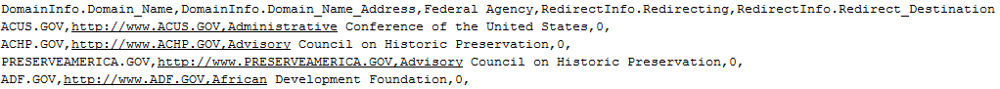
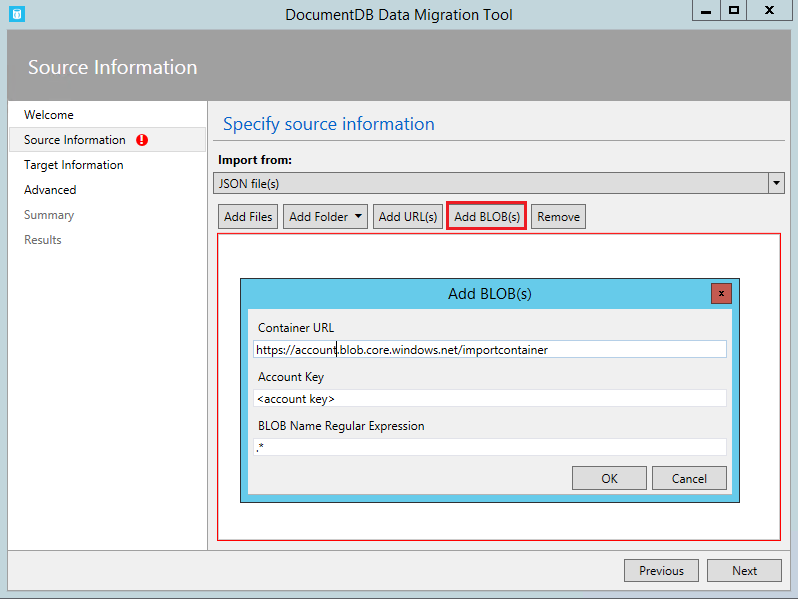
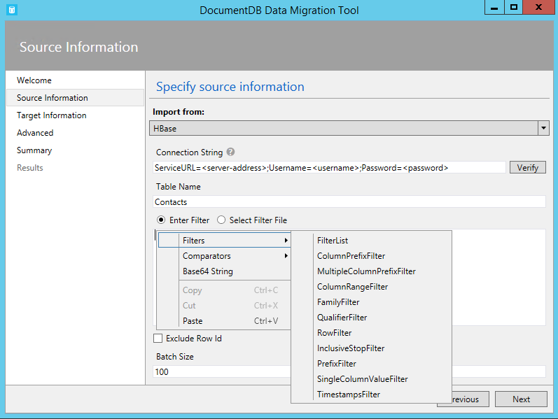
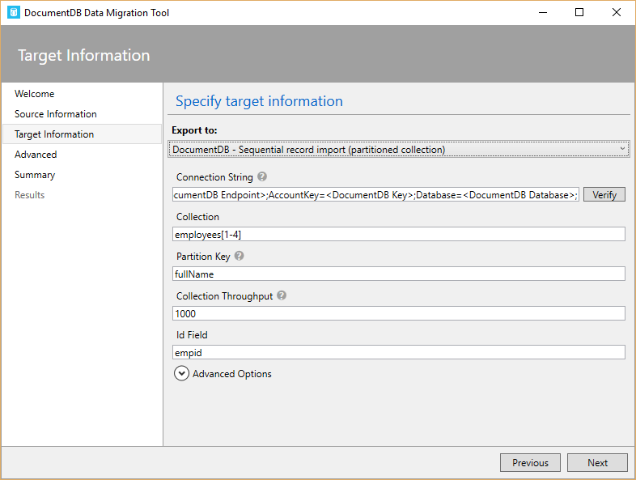
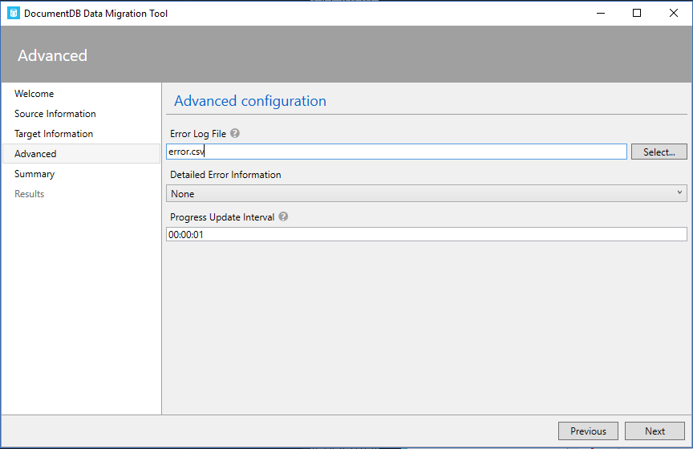

<properties
    pageTitle="Ferramenta de migração do banco de dados para DocumentDB | Microsoft Azure"
    description="Saiba como usar as ferramentas de migração de dados de DocumentDB Abrir origem para importar dados para DocumentDB de várias fontes, incluindo arquivos MongoDB, SQL Server, armazenamento tabela, Amazon DynamoDB, CSV e JSON. CSV para conversão de JSON."
    keywords="CSV para json, ferramentas de migração do banco de dados, converter csv para json"
    services="documentdb"
    authors="andrewhoh"
    manager="jhubbard"
    editor="monicar"
    documentationCenter=""/>

<tags
    ms.service="documentdb"
    ms.workload="data-services"
    ms.tgt_pltfrm="na"
    ms.devlang="na"
    ms.topic="article"
    ms.date="10/06/2016"
    ms.author="anhoh"/>

# Importar dados para DocumentDB com a ferramenta de migração do banco de dados

Este artigo mostra como usar a ferramenta de migração de dados de DocumentDB oficial Abrir origem para importar dados para o [Microsoft Azure DocumentDB](https://azure.microsoft.com/services/documentdb/) de várias fontes, incluindo arquivos JSON, arquivos CSV, SQL, MongoDB, armazenamento de tabela do Microsoft Azure, Amazon DynamoDB e conjuntos de DocumentDB.

Após ler este artigo, você poderá responder às seguintes perguntas:  

-   Como posso importar arquivo JSON, arquivo CSV, dados do SQL Server ou dados MongoDB para DocumentDB?
-   Como importar dados do armazenamento de tabela do Azure, Amazon DynamoDB e HBase para DocumentDB?
-   Como posso migrar dados entre conjuntos de DocumentDB?

##Pré-requisitos

Antes de seguir as instruções neste artigo, certifique-se de que você tem o seguinte instalado:

- [Microsoft .NET Framework 4.51](https://www.microsoft.com/download/developer-tools.aspx) ou superior.

##Visão geral da ferramenta de migração de dados de DocumentDB

A ferramenta de migração de dados de DocumentDB é uma solução de abrir origem que importa dados para DocumentDB de uma variedade de fontes, incluindo:

- Arquivos JSON
- MongoDB
- SQL Server
- Arquivos CSV
- Armazenamento de tabela do Azure
- Amazon DynamoDB
- HBase
- Conjuntos de DocumentDB

Enquanto a ferramenta de importação inclui uma interface de usuário gráfica (dtui.exe), ele também pode ser controlado na linha de comando (dt.exe). Na verdade, há uma opção para o comando associado de saída depois de configurar uma importação por meio da UI. Dados de origem tabular (por exemplo, arquivos do SQL Server ou CSV) podem ser transformados que relacionamentos hierárquicos (subdocumentos) podem ser criados durante a importação. Continue lendo para saber mais sobre as opções de fonte, linhas de comando para importar de cada fonte de destino e opções de importação de visualização resultados de exemplo.

##Instalar a ferramenta de migração de dados de DocumentDB

O código de origem de ferramenta de migração está disponível no GitHub [neste](https://github.com/azure/azure-documentdb-datamigrationtool) repositório e uma versão compilada estará disponível no [Centro de Download da Microsoft](http://www.microsoft.com/downloads/details.aspx?FamilyID=cda7703a-2774-4c07-adcc-ad02ddc1a44d). Você pode compilar a solução ou basta baixar e extrair a versão compilada em um diretório de sua escolha. Execute seja:

- **Dtui.exe**: versão de interface gráfica da ferramenta
- **DT.exe**: versão de linha de comando da ferramenta

##Importar arquivos JSON

A opção de Importador de origem do JSON arquivo permite importar um ou mais único documento JSON arquivos ou JSON cada uma com uma matriz de documentos JSON. Ao adicionar pastas que contêm arquivos JSON para importar, você tem a opção de repetidamente procurando arquivos em subpastas.

Aqui estão alguns exemplos de linha de comando para importar arquivos JSON:

    #Import a single JSON file
    dt.exe /s:JsonFile /s.Files:.\Sessions.json /t:DocumentDBBulk /t.ConnectionString:"AccountEndpoint=<DocumentDB Endpoint>;AccountKey=<DocumentDB Key>;Database=<DocumentDB Database>;" /t.Collection:Sessions /t.CollectionThroughput:2500

    #Import a directory of JSON files
    dt.exe /s:JsonFile /s.Files:C:\TESessions\*.json /t:DocumentDBBulk /t.ConnectionString:" AccountEndpoint=<DocumentDB Endpoint>;AccountKey=<DocumentDB Key>;Database=<DocumentDB Database>;" /t.Collection:Sessions /t.CollectionThroughput:2500

    #Import a directory (including sub-directories) of JSON files
    dt.exe /s:JsonFile /s.Files:C:\LastFMMusic\**\*.json /t:DocumentDBBulk /t.ConnectionString:" AccountEndpoint=<DocumentDB Endpoint>;AccountKey=<DocumentDB Key>;Database=<DocumentDB Database>;" /t.Collection:Music /t.CollectionThroughput:2500

    #Import a directory (single), directory (recursive), and individual JSON files
    dt.exe /s:JsonFile /s.Files:C:\Tweets\*.*;C:\LargeDocs\**\*.*;C:\TESessions\Session48172.json;C:\TESessions\Session48173.json;C:\TESessions\Session48174.json;C:\TESessions\Session48175.json;C:\TESessions\Session48177.json /t:DocumentDBBulk /t.ConnectionString:"AccountEndpoint=<DocumentDB Endpoint>;AccountKey=<DocumentDB Key>;Database=<DocumentDB Database>;" /t.Collection:subs /t.CollectionThroughput:2500

    #Import a single JSON file and partition the data across 4 collections
    dt.exe /s:JsonFile /s.Files:D:\\CompanyData\\Companies.json /t:DocumentDBBulk /t.ConnectionString:"AccountEndpoint=<DocumentDB Endpoint>;AccountKey=<DocumentDB Key>;Database=<DocumentDB Database>;" /t.Collection:comp[1-4] /t.PartitionKey:name /t.CollectionThroughput:2500

##Importar do MongoDB

A opção de Importador de fonte MongoDB permite importar de um conjunto de MongoDB individual e, opcionalmente, documentos usando uma consulta de filtro e/ou modificar a estrutura do documento usando uma projeção.  

A cadeia de conexão é no formato MongoDB padrão:

    mongodb://<dbuser>:<dbpassword>@<host>:<port>/<database>

> [AZURE.NOTE] Use o comando Verify para garantir que a instância de MongoDB especificada no campo de cadeia de conexão pode ser acessada.

Insira o nome da coleção do qual os dados serão importados. Opcionalmente, você pode especificar ou fornecer um arquivo para uma consulta (por exemplo, {pop: {$gt: 5000}}) e/ou projeção (por exemplo, {loc:0}) para filtrar e modelar os dados a serem importados.

Aqui estão alguns exemplos de linha de comando Importar do MongoDB:

    #Import all documents from a MongoDB collection
    dt.exe /s:MongoDB /s.ConnectionString:mongodb://<dbuser>:<dbpassword>@<host>:<port>/<database> /s.Collection:zips /t:DocumentDBBulk /t.ConnectionString:"AccountEndpoint=<DocumentDB Endpoint>;AccountKey=<DocumentDB Key>;Database=<DocumentDB Database>;" /t.Collection:BulkZips /t.IdField:_id /t.CollectionThroughput:2500

    #Import documents from a MongoDB collection which match the query and exclude the loc field
    dt.exe /s:MongoDB /s.ConnectionString:mongodb://<dbuser>:<dbpassword>@<host>:<port>/<database> /s.Collection:zips /s.Query:{pop:{$gt:50000}} /s.Projection:{loc:0} /t:DocumentDBBulk /t.ConnectionString:"AccountEndpoint=<DocumentDB Endpoint>;AccountKey=<DocumentDB Key>;Database=<DocumentDB Database>;" /t.Collection:BulkZipsTransform /t.IdField:_id/t.CollectionThroughput:2500

##Importar arquivos de exportação do MongoDB

A opção de Importador MongoDB exportação JSON arquivo fonte permite importar um ou mais arquivos JSON produzidos do utilitário mongoexport.  

Ao adicionar pastas que contêm MongoDB exportação JSON arquivos para importação, você tem a opção de repetidamente procurando arquivos em subpastas.

Aqui está um exemplo de linha de comando para importar de MongoDB exportação JSON arquivos:

    dt.exe /s:MongoDBExport /s.Files:D:\mongoemployees.json /t:DocumentDBBulk /t.ConnectionString:"AccountEndpoint=<DocumentDB Endpoint>;AccountKey=<DocumentDB Key>;Database=<DocumentDB Database>;" /t.Collection:employees /t.IdField:_id /t.Dates:Epoch /t.CollectionThroughput:2500

##Importar do SQL Server

A opção de Importador de origem do SQL permite importar de um banco de dados do SQL Server individual e, opcionalmente, filtrar os registros a serem importados usando uma consulta. Além disso, você pode modificar a estrutura do documento, especificando um separador de aninhamento (mais em breve).  

O formato da cadeia de caracteres de conexão é o formato padrão de cadeia de conexão SQL.

> [AZURE.NOTE] Use o comando Verify para garantir que a instância do SQL Server especificada no campo de cadeia de conexão pode ser acessada.

A propriedade separador aninhamento é usada para criar relacionamentos hierárquicos (documentos sub) durante a importação. Considere a seguinte consulta SQL:

*Selecione CAST (como BusinessEntityID varchar) como identificação, nome, AddressType como [Address.AddressType], AddressLine1 como [Address.AddressLine1], cidade como [Address.Location.City], Estadoprovíncianome como [Address.Location.StateProvinceName], CEP como [Address.PostalCode], CountryRegionName como [Address.CountryRegionName] de Sales.vStoreWithAddresses onde AddressType = 'Principal do Office'*

Que retorna os seguintes resultados (parciais):

Observe os aliases como Address.AddressType e Address.Location.StateProvinceName. Especificando um separador de aninhamento de '.', a ferramenta de importação cria subdocumentos endereço e Address.Location durante a importação. Aqui está um exemplo de um documento resultante no DocumentDB:

*{"id": "956", "nome": "Mais refinado de vendas e serviço", "Endereço": {"AddressType": "Principal do Office", "AddressLine1": "#500-75 O'Connor rua", "Local": {"Cidade": "Ottawa", "Estadoprovíncianome": "Ontário"}, "CEP": "K4B 1S2", "CountryRegionName": "Canadá"}}*

Aqui estão alguns exemplos de linha de comando para importar do SQL Server:

    #Import records from SQL which match a query
    dt.exe /s:SQL /s.ConnectionString:"Data Source=<server>;Initial Catalog=AdventureWorks;User Id=advworks;Password=<password>;" /s.Query:"select CAST(BusinessEntityID AS varchar) as Id, * from Sales.vStoreWithAddresses WHERE AddressType='Main Office'" /t:DocumentDBBulk /t.ConnectionString:" AccountEndpoint=<DocumentDB Endpoint>;AccountKey=<DocumentDB Key>;Database=<DocumentDB Database>;" /t.Collection:Stores /t.IdField:Id /t.CollectionThroughput:2500

    #Import records from sql which match a query and create hierarchical relationships
    dt.exe /s:SQL /s.ConnectionString:"Data Source=<server>;Initial Catalog=AdventureWorks;User Id=advworks;Password=<password>;" /s.Query:"select CAST(BusinessEntityID AS varchar) as Id, Name, AddressType as [Address.AddressType], AddressLine1 as [Address.AddressLine1], City as [Address.Location.City], StateProvinceName as [Address.Location.StateProvinceName], PostalCode as [Address.PostalCode], CountryRegionName as [Address.CountryRegionName] from Sales.vStoreWithAddresses WHERE AddressType='Main Office'" /s.NestingSeparator:. /t:DocumentDBBulk /t.ConnectionString:" AccountEndpoint=<DocumentDB Endpoint>;AccountKey=<DocumentDB Key>;Database=<DocumentDB Database>;" /t.Collection:StoresSub /t.IdField:Id /t.CollectionThroughput:2500

##Importar arquivos CSV - converter CSV para JSON

A opção de Importador de origem de arquivo CSV permite importar um ou mais arquivos CSV. Ao adicionar pastas que contêm arquivos CSV para importação, você tem a opção de repetidamente procurando arquivos em subpastas.

Semelhante à fonte de SQL, a propriedade separador aninhamento pode ser usada para criar relacionamentos hierárquicos (documentos sub) durante a importação. Considere o seguinte cabeçalho CSV linhas de linha e dados:

Observe os aliases como DomainInfo.Domain_Name e RedirectInfo.Redirecting. Especificando um separador de aninhamento de '.', a ferramenta de importação irá criar subdocumentos DomainInfo e RedirectInfo durante a importação. Aqui está um exemplo de um documento resultante no DocumentDB:

*{"DomainInfo": {"Nome_do_domínio": "ACUS.GOV", "Domain_Name_Address": "http://www.ACUS.GOV"}, "Órgão Federal": "administrativo conferência dos Estados Unidos", "RedirectInfo": {"Redirecionar": "0", "Redirect_Destination": ""}, "id": "9cc565c5-ebcd-1c03-ebd3-cc3e2ecd814d"}*

A ferramenta de importação tentará inferir informações de tipo para valores sem aspas em arquivos CSV (valores entre aspas sempre são tratados como cadeias de caracteres).  Tipos são identificados na seguinte ordem: número, datetime, booliano.  

Há duas outras coisas nota sobre a importação de CSV:

1.  Por padrão, valores sem aspas são sempre cortados para guias e espaços, enquanto valores entre aspas são preservadas como-é. Esse comportamento pode ser substituído com a caixa de seleção ARRUMAR valores entre aspas ou a opção de linha de comando /s.TrimQuoted.

2.  Por padrão, um null sem aspas será tratado como um valor nulo. Esse comportamento pode ser substituído (isto é, trate um null sem aspas como uma cadeia de caracteres "null") com a considerar sem aspas nulo como caixa de seleção de cadeia de caracteres ou a opção de linha de comando /s.NoUnquotedNulls.

Aqui está um exemplo de linha de comando para importação CSV:

    dt.exe /s:CsvFile /s.Files:.\Employees.csv /t:DocumentDBBulk /t.ConnectionString:"AccountEndpoint=<DocumentDB Endpoint>;AccountKey=<DocumentDB Key>;Database=<DocumentDB Database>;" /t.Collection:Employees /t.IdField:EntityID /t.CollectionThroughput:2500

##Importar do armazenamento de tabela do Azure

A opção de Importador de origem de armazenamento de tabela do Azure permite importar de uma tabela de armazenamento de tabela do Azure individual e, opcionalmente, filtrar as entidades da tabela a ser importado.  

O formato da cadeia de conexão do armazenamento de tabela do Azure é:

    DefaultEndpointsProtocol=<protocol>;AccountName=<Account Name>;AccountKey=<Account Key>;

> [AZURE.NOTE] Use o comando Verify para garantir que a instância de armazenamento de tabela do Azure especificada no campo de cadeia de conexão pode ser acessada.

Insira o nome da tabela Azure do qual os dados serão importados. Opcionalmente, você pode especificar um [filtro](https://msdn.microsoft.com/library/azure/ff683669.aspx).

A opção de Importador de origem de armazenamento de tabela do Azure tem as seguintes opções adicionais:

1. Incluir campos internos
    2. All - incluir todos os campos internos (PartitionKey, RowKey e carimbo de hora)
    3. Nenhum - excluir todos os campos internos
    4. RowKey - incluir apenas o campo RowKey
3. Selecionar colunas
    1. Filtros de armazenamento de tabela Azure não suportam projeções. Se você quiser importar somente propriedades específicas de entidade de tabela do Azure, adicioná-los à lista Selecionar colunas. Todas as outras propriedades de entidade serão ignoradas.

Aqui está um exemplo de linha de comando para importar de armazenamento de tabela do Azure:

    dt.exe /s:AzureTable /s.ConnectionString:"DefaultEndpointsProtocol=https;AccountName=<Account Name>;AccountKey=<Account Key>" /s.Table:metrics /s.InternalFields:All /s.Filter:"PartitionKey eq 'Partition1' and RowKey gt '00001'" /s.Projection:ObjectCount;ObjectSize  /t:DocumentDBBulk /t.ConnectionString:" AccountEndpoint=<DocumentDB Endpoint>;AccountKey=<DocumentDB Key>;Database=<DocumentDB Database>;" /t.Collection:metrics /t.CollectionThroughput:2500

##Importar do Amazon DynamoDB

A opção de Importador de origem do Amazon DynamoDB permite importar de uma tabela de Amazon DynamoDB individual e, opcionalmente, filtrar as entidades a serem importados. Vários modelos são fornecidos para que a configuração de uma importação é tão fácil quanto possível.

O formato da cadeia de caracteres de conexão Amazon DynamoDB é:

    ServiceURL=<Service Address>;AccessKey=<Access Key>;SecretKey=<Secret Key>;

> [AZURE.NOTE] Use o comando Verify para garantir que a instância de DynamoDB Amazon especificada no campo de cadeia de conexão pode ser acessada.

Aqui está um exemplo de linha de comando Importar do Amazon DynamoDB:

    dt.exe /s:DynamoDB /s.ConnectionString:ServiceURL=https://dynamodb.us-east-1.amazonaws.com;AccessKey=<accessKey>;SecretKey=<secretKey> /s.Request:"{   """TableName""": """ProductCatalog""" }" /t:DocumentDBBulk /t.ConnectionString:"AccountEndpoint=<DocumentDB Endpoint>;AccountKey=<DocumentDB Key>;Database=<DocumentDB Database>;" /t.Collection:catalogCollection /t.CollectionThroughput:2500

##Importar arquivos de armazenamento de Blob do Azure

O arquivo JSON, arquivo de exportação do MongoDB e opções de Importador de origem do arquivo CSV permitem que você importar um ou mais arquivos de armazenamento de Blob do Azure. Depois de especificar uma URL de contêiner de Blob e chave da conta, simplesmente fornecem uma expressão regular para selecionar os arquivos para importar.

Eis um exemplo de linha de comando para importar arquivos JSON do armazenamento de Blob do Azure:

    dt.exe /s:JsonFile /s.Files:"blobs://<account key>@account.blob.core.windows.net:443/importcontainer/.*" /t:DocumentDBBulk /t.ConnectionString:"AccountEndpoint=<DocumentDB Endpoint>;AccountKey=<DocumentDB Key>;Database=<DocumentDB Database>;" /t.Collection:doctest

##Importar do DocumentDB

A opção de Importador de origem de DocumentDB permite importar dados de um ou mais conjuntos de DocumentDB e, opcionalmente, filtrar documentos usando uma consulta.  

O formato da cadeia de caracteres de conexão DocumentDB é:

    AccountEndpoint=<DocumentDB Endpoint>;AccountKey=<DocumentDB Key>;Database=<DocumentDB Database>;

O DocumentDB cadeia de conexão da conta pode ser recuperada da lâmina teclas do portal do Azure, conforme descrito em [como gerenciar uma conta de DocumentDB](documentdb-manage-account.md), porém o nome do banco de dados precisa ser acrescentado à cadeia de conexão no seguinte formato:

    Database=<DocumentDB Database>;

> [AZURE.NOTE] Use o comando Verify para garantir que a instância de DocumentDB especificada no campo de cadeia de conexão pode ser acessada.

Para importar de um único conjunto de DocumentDB, insira o nome da coleção do qual os dados serão importados. Para importar de vários conjuntos de DocumentDB, forneça uma expressão regular para corresponder um ou mais nomes de coleção (por exemplo, collection01 | collection02 | collection03). Opcionalmente, você pode especificar ou fornecer um arquivo para uma consulta para filtrar e forma os dados a serem importados.

> [AZURE.NOTE] Desde que o campo conjunto aceita expressões regulares, se você estiver importando de um único conjunto cujo nome contém caracteres de expressões regulares, em seguida, esses caracteres devem haver escape adequadamente.

A opção de Importador de origem DocumentDB tem as seguintes opções avançadas:

1. Incluir campos internos: Especifica se deseja ou não incluir DocumentDB propriedades do sistema de documento na exportação (por exemplo, _rid, _ts).
2. Número de tentativas em caso de falha: Especifica o número de tentativas a conexão para DocumentDB no caso de falhas temporárias (por exemplo, interrupção de conectividade de rede).
3. Intervalo de repetição: Especifica por quanto tempo de espera entre repetindo a conexão para DocumentDB no caso de falhas temporárias (por exemplo, interrupção de conectividade de rede).
4. Modo de Conexão: Especifica o modo de conexão para usar com o DocumentDB. As opções disponíveis são DirectTcp, DirectHttps e Gateway. Os modos de conexão direta são mais rápidos, enquanto o modo de gateway é mais firewall amigável como ele usa somente a porta 443.

> [AZURE.TIP] A ferramenta de importação padrão para o modo de conexão DirectTcp. Se você tiver problemas de firewall, alterne para modo de conexão Gateway, pois ela requer somente a porta 443.

Aqui estão alguns exemplos de linha de comando para importar de DocumentDB:

    #Migrate data from one DocumentDB collection to another DocumentDB collections
    dt.exe /s:DocumentDB /s.ConnectionString:"AccountEndpoint=<DocumentDB Endpoint>;AccountKey=<DocumentDB Key>;Database=<DocumentDB Database>;" /s.Collection:TEColl /t:DocumentDBBulk /t.ConnectionString:" AccountEndpoint=<DocumentDB Endpoint>;AccountKey=<DocumentDB Key>;Database=<DocumentDB Database>;" /t.Collection:TESessions /t.CollectionThroughput:2500

    #Migrate data from multiple DocumentDB collections to a single DocumentDB collection
    dt.exe /s:DocumentDB /s.ConnectionString:"AccountEndpoint=<DocumentDB Endpoint>;AccountKey=<DocumentDB Key>;Database=<DocumentDB Database>;" /s.Collection:comp1|comp2|comp3|comp4 /t:DocumentDBBulk /t.ConnectionString:"AccountEndpoint=<DocumentDB Endpoint>;AccountKey=<DocumentDB Key>;Database=<DocumentDB Database>;" /t.Collection:singleCollection /t.CollectionThroughput:2500

    #Export a DocumentDB collection to a JSON file
    dt.exe /s:DocumentDB /s.ConnectionString:"AccountEndpoint=<DocumentDB Endpoint>;AccountKey=<DocumentDB Key>;Database=<DocumentDB Database>;" /s.Collection:StoresSub /t:JsonFile /t.File:StoresExport.json /t.Overwrite /t.CollectionThroughput:2500

##Importar do HBase

A opção de Importador de origem HBase permite importar dados de uma tabela de HBase e, opcionalmente, filtrar os dados. Vários modelos são fornecidos para que a configuração de uma importação é tão fácil quanto possível.

O formato da cadeia de caracteres de conexão HBase Stargate é:

    ServiceURL=<server-address>;Username=<username>;Password=<password>

> [AZURE.NOTE] Use o comando Verify para garantir que a instância de HBase especificada no campo de cadeia de conexão pode ser acessada.

Aqui está um exemplo de linha de comando para importar de HBase:

    dt.exe /s:HBase /s.ConnectionString:ServiceURL=<server-address>;Username=<username>;Password=<password> /s.Table:Contacts /t:DocumentDBBulk /t.ConnectionString:"AccountEndpoint=<DocumentDB Endpoint>;AccountKey=<DocumentDB Key>;Database=<DocumentDB Database>;" /t.Collection:hbaseimport

##Importar para DocumentDB (importação em massa)

O importador DocumentDB massa permite importar de qualquer uma das opções disponíveis de origem, usando um procedimento armazenado de DocumentDB para eficiência. A ferramenta suporta a importação para um conjunto de DocumentDB particionada única, bem como importar sharded por meio da qual os dados são particionados em vários conjuntos de DocumentDB particionada único. Para obter mais informações sobre a partição de dados, consulte [Partitioning e a escala do Azure DocumentDB](documentdb-partition-data.md). A ferramenta irá criar, executar e, em seguida, excluir o procedimento armazenado de conjuntos de que o destino.  

O formato da cadeia de caracteres de conexão DocumentDB é:

    AccountEndpoint=<DocumentDB Endpoint>;AccountKey=<DocumentDB Key>;Database=<DocumentDB Database>;

O DocumentDB cadeia de conexão da conta pode ser recuperada da lâmina teclas do portal do Azure, conforme descrito em [como gerenciar uma conta de DocumentDB](documentdb-manage-account.md), porém o nome do banco de dados precisa ser acrescentado à cadeia de conexão no seguinte formato:

    Database=<DocumentDB Database>;

> [AZURE.NOTE] Use o comando Verify para garantir que a instância de DocumentDB especificada no campo de cadeia de conexão pode ser acessada.

Para importar para uma única coleção, insira o nome da coleção à qual os dados serão importados e clique no botão Adicionar. Para importar para vários conjuntos, insira o nome de cada coleção individualmente ou use a seguinte sintaxe para especificar vários conjuntos: *collection_prefix*[índice de início - índice final]. Ao especificar várias coleções via sintaxe mencionado anteriormente, tenha o seguinte em mente:

1. Somente inteiro intervalo padrões de nome são suportados. Por exemplo, especificar conjunto [0-3] produzirão coleções a seguir: collection0, collection1, collection2, collection3.
2. Você pode usar uma sintaxe abreviada: conjunto [3] serão emitir o mesmo conjunto de coleções mencionada na etapa 1.
3. Substituição de mais de uma pode ser fornecida. Por exemplo, o conjunto [0-1] [0-9] irá gerar 20 nomes de coleção com zeros (collection01,... 02,... 03).

Após os nomes de coleção tiverem sido especificados, escolha o rendimento desejado dos conjuntos de que (400 RUs para 10.000 RUs). Para obter melhor desempenho de importação, escolha uma taxa de transferência maior. Para obter mais informações sobre níveis de desempenho, consulte [níveis de desempenho em DocumentDB](documentdb-performance-levels.md).

> [AZURE.NOTE] A configuração de produtividade de desempenho se aplica somente a criação do conjunto. Se o conjunto especificado já existir, sua produtividade não será modificada.

Ao importar para vários conjuntos, o hash de suportes de ferramenta de importação com base fragmentação. Neste cenário, especifique a propriedade de documento que você deseja usar como a chave da partição (se a chave de partição estiver em branco, documentos serão sharded aleatoriamente entre os conjuntos de destino).

Opcionalmente, você pode especificar qual campo na fonte de importação deve ser usado como a propriedade de id do documento DocumentDB durante a importação (Observe que se documentos não contêm essa propriedade, em seguida, a ferramenta de importação irá gerar um GUID como o valor da propriedade id).

Há várias opções avançadas disponíveis durante a importação. Em primeiro lugar, enquanto a ferramenta inclui uma massa padrão importar procedimento armazenado (BulkInsert.js), você pode optar por especificar seu próprio procedimento armazenado de importação:

 

Além disso, ao importar tipos de data (por exemplo, do SQL Server ou MongoDB), você pode escolher entre três opções de importação:

 

-   Cadeia de caracteres: Persistir como um valor de cadeia de caracteres
-   Época: Se mantiver como um valor de número de época
-   Ambos: Persistir cadeia de caracteres e valores numéricos época. Esta opção criará um subdocumento, por exemplo: "date_joined": {"Valor": "2013-10-21T21:17:25.2410000Z", "época": 1382390245}

O importador de massa DocumentDB tem as seguintes adicionais opções avançadas:

1. Tamanho do lote: Os padrões de ferramenta para um tamanho de lote de 50.  Se os documentos a serem importados forem grandes, considere a possibilidade de reduzir o tamanho do lote. Por outro lado, se os documentos a serem importados são pequenos, considere a possibilidade de aumentar o tamanho do lote.
2. Tamanho máximo de Script (bytes): A ferramenta padrões para um tamanho máximo de script de 512KB
3. Desativar a geração automática do Id: Se cada documento a ser importado contiver um campo de identificação, selecionando essa opção pode aumentar o desempenho. Documentos faltando um campo de identificação exclusiva não serão importados.
4. Documentos de existente de atualização: A ferramenta padrão não substituindo documentos existentes com conflitos de id. Esta opção permitirá a substituir os documentos existentes com ids de correspondência. Esse recurso é útil para migrações de dados agendada que atualizar os documentos existentes.
5. Número de tentativas em caso de falha: Especifica o número de tentativas a conexão para DocumentDB no caso de falhas temporárias (por exemplo, interrupção de conectividade de rede).
6. Intervalo de repetição: Especifica por quanto tempo de espera entre repetindo a conexão para DocumentDB no caso de falhas temporárias (por exemplo, interrupção de conectividade de rede).
7. Modo de Conexão: Especifica o modo de conexão para usar com o DocumentDB. As opções disponíveis são DirectTcp, DirectHttps e Gateway. Os modos de conexão direta são mais rápidos, enquanto o modo de gateway é mais firewall amigável como ele usa somente a porta 443.

> [AZURE.TIP] A ferramenta de importação padrão para o modo de conexão DirectTcp. Se você tiver problemas de firewall, alterne para modo de conexão Gateway, pois ela requer somente a porta 443.

##Importar para DocumentDB (registro sequenciais importar)

O importador de registro sequencial DocumentDB permite importar de qualquer uma das opções de origem disponíveis em cada registro por registro. Você pode escolher essa opção se você estiver importando para um conjunto existente que atingiu sua cota de procedimentos armazenados. A ferramenta suporta importação para um único (partição única e partição múltipla) DocumentDB conjunto, bem como sharded importar por meio da qual dados são particionados em vários conjuntos de DocumentDB de partição única e/ou partição múltipla. Para obter mais informações sobre a partição de dados, consulte [Partitioning e a escala do Azure DocumentDB](documentdb-partition-data.md).

O formato da cadeia de caracteres de conexão DocumentDB é:

    AccountEndpoint=<DocumentDB Endpoint>;AccountKey=<DocumentDB Key>;Database=<DocumentDB Database>;

O DocumentDB cadeia de conexão da conta pode ser recuperada da lâmina teclas do portal do Azure, conforme descrito em [como gerenciar uma conta de DocumentDB](documentdb-manage-account.md), porém o nome do banco de dados precisa ser acrescentado à cadeia de conexão no seguinte formato:

    Database=<DocumentDB Database>;

> [AZURE.NOTE] Use o comando Verify para garantir que a instância de DocumentDB especificada no campo de cadeia de conexão pode ser acessada.

Para importar para uma única coleção, insira o nome da coleção à qual os dados serão importados e clique no botão Adicionar. Para importar para vários conjuntos, insira o nome de cada coleção individualmente ou use a seguinte sintaxe para especificar vários conjuntos: *collection_prefix*[índice de início - índice final]. Ao especificar várias coleções via sintaxe mencionado anteriormente, tenha o seguinte em mente:

1. Somente inteiro intervalo padrões de nome são suportados. Por exemplo, especificar conjunto [0-3] produzirão coleções a seguir: collection0, collection1, collection2, collection3.
2. Você pode usar uma sintaxe abreviada: conjunto [3] serão emitir o mesmo conjunto de coleções mencionada na etapa 1.
3. Substituição de mais de uma pode ser fornecida. Por exemplo, o conjunto [0-1] [0-9] irá gerar 20 nomes de coleção com zeros (collection01,... 02,... 03).

Após os nomes de coleção tiverem sido especificados, escolha o rendimento desejado dos conjuntos de que (400 RUs para 250.000 RUs). Para obter melhor desempenho de importação, escolha uma taxa de transferência maior. Para obter mais informações sobre níveis de desempenho, consulte [níveis de desempenho em DocumentDB](documentdb-performance-levels.md). Qualquer importar para coleções com produtividade > 10.000 RUs exigirá uma chave de partição. Se você optar por ter mais de 250.000 RUs, consulte [Solicitar aumentado DocumentDB limites de conta](documentdb-increase-limits.md).

> [AZURE.NOTE] A configuração de produtividade se aplica somente a criação do conjunto. Se o conjunto especificado já existir, sua produtividade não será modificada.

Ao importar para vários conjuntos, o hash de suportes de ferramenta de importação com base fragmentação. Neste cenário, especifique a propriedade de documento que você deseja usar como a chave da partição (se a chave de partição estiver em branco, documentos serão sharded aleatoriamente entre os conjuntos de destino).

Opcionalmente, você pode especificar qual campo na fonte de importação deve ser usado como a propriedade de id do documento DocumentDB durante a importação (Observe que se documentos não contêm essa propriedade, em seguida, a ferramenta de importação irá gerar um GUID como o valor da propriedade id).

Há várias opções avançadas disponíveis durante a importação. Primeiro, ao importar tipos de data (por exemplo, do SQL Server ou MongoDB), você pode escolher entre três opções de importação:

 

-   Cadeia de caracteres: Persistir como um valor de cadeia de caracteres
-   Época: Se mantiver como um valor de número de época
-   Ambos: Persistir cadeia de caracteres e valores numéricos época. Esta opção criará um subdocumento, por exemplo: "date_joined": {"Valor": "2013-10-21T21:17:25.2410000Z", "época": 1382390245}

O DocumentDB - importador de registro sequencial tem as seguintes opções avançadas adicionais:

1. Número de solicitações paralelas: A ferramenta padrão é 2 solicitações paralelas. Se os documentos a serem importados são pequenos, considere aumentando o número de solicitações paralelas. Observe que se esse número é gerado muito, a importação pode notar a otimização.
2. Desativar a geração automática do Id: Se cada documento a ser importado contiver um campo de identificação, selecionando essa opção pode aumentar o desempenho. Documentos faltando um campo de identificação exclusiva não serão importados.
3. Documentos de existente de atualização: A ferramenta padrão não substituindo os documentos existentes com conflitos de id. Selecionar essa opção permite substituir os documentos existentes com ids de correspondência. Esse recurso é útil para migrações de dados agendada que atualizar os documentos existentes.
4. Número de tentativas em caso de falha: Especifica o número de tentativas a conexão para DocumentDB no caso de falhas temporárias (por exemplo, interrupção de conectividade de rede).
5. Intervalo de repetição: Especifica por quanto tempo de espera entre repetindo a conexão para DocumentDB no caso de falhas temporárias (por exemplo, interrupção de conectividade de rede).
6. Modo de Conexão: Especifica o modo de conexão para usar com o DocumentDB. As opções disponíveis são DirectTcp, DirectHttps e Gateway. Os modos de conexão direta são mais rápidos, enquanto o modo de gateway é mais firewall amigável como ele usa somente a porta 443.

> [AZURE.TIP] A ferramenta de importação padrão para o modo de conexão DirectTcp. Se você tiver problemas de firewall, alterne para modo de conexão Gateway, pois ela requer somente a porta 443.

##Especificar uma política de indexação ao criar conjuntos de DocumentDB

Quando você permite que a ferramenta de migração para criar conjuntos durante a importação, você pode especificar a política de indexação das coleções. Nas opções avançadas seção da DocumentDB em massa importar e opções de registro de DocumentDB sequencial, navegue até a seção de política de indexação.

Usando a política de indexação opção avançada, você pode selecionar um arquivo de política de indexação, manualmente insira uma política de indexação ou selecione um conjunto de modelos padrão (clicando para a direita na caixa de texto indexação política).

Os modelos de política que a ferramenta fornece são:

- Padrão. Essa política é melhor quando você estiver executando consultas de igualdade em cadeias de caracteres e usando ORDER BY, intervalo e consultas de igualdade para números. Esta política possui uma sobrecarga de armazenamento de índice menor que intervalo.
- Intervalo. Essa política é melhor que você estiver usando consultas ORDER BY, intervalo e igualdade em números e cadeias de caracteres. Esta política possui uma sobrecarga de armazenamento do índice maior que o padrão ou Hash.

> [AZURE.NOTE] Se você não especificar uma política de indexação, a política padrão será aplicada. Para obter mais informações sobre políticas de indexação, consulte [DocumentDB políticas de indexação](documentdb-indexing-policies.md).

## Exportar para arquivo JSON

O exportador DocumentDB JSON permite exportar qualquer uma das opções de origem disponíveis para um arquivo JSON que contém uma matriz de documentos JSON. A ferramenta irá lidar com a exportação para você, ou você pode optar por exibir o comando resultante de migração e execute o comando por conta própria. O arquivo JSON resultante pode estar armazenado localmente ou no armazenamento de Blob do Azure.

Opcionalmente, você pode optar por prettify o JSON resultante, que aumentará o tamanho do documento resultante, tornando o conteúdo mais legível.

    Standard JSON export
    [{"id":"Sample","Title":"About Paris","Language":{"Name":"English"},"Author":{"Name":"Don","Location":{"City":"Paris","Country":"France"}},"Content":"Don's document in DocumentDB is a valid JSON document as defined by the JSON spec.","PageViews":10000,"Topics":[{"Title":"History of Paris"},{"Title":"Places to see in Paris"}]}]

    Prettified JSON export
    [
    {
    "id": "Sample",
    "Title": "About Paris",
    "Language": {
      "Name": "English"
    },
    "Author": {
      "Name": "Don",
      "Location": {
        "City": "Paris",
        "Country": "France"
      }
    },
    "Content": "Don's document in DocumentDB is a valid JSON document as defined by the JSON spec.",
    "PageViews": 10000,
    "Topics": [
      {
        "Title": "History of Paris"
      },
      {
        "Title": "Places to see in Paris"
      }
    ]
    }]

## Configuração avançada

Na tela de configuração avançada, especifique o local do arquivo de log para o qual você gostaria de quaisquer erros gravados. As regras a seguir se aplicam a esta página:

1.  Se não for fornecido um nome de arquivo, em seguida, todos os erros serão retornados na página de resultados.
2.  Se um nome de arquivo é fornecido sem um diretório, em seguida, o arquivo será criado (ou substituído) na pasta atual do ambiente.
3.  Se você selecionar uma existente arquivo e, em seguida, o arquivo será substituído, há nenhuma opção de acréscimo.

Em seguida, escolha se deseja registrar todas, críticas, ou sem mensagens de erro. Por fim, decida frequência a mensagem de transferência na tela será atualizada com seu andamento.

    

## Confirmar configurações de importação e linha de comando do modo de exibição

1. Depois de especificar as informações da fonte, informações de destino e configuração avançada, examine a migração de resumo e, opcionalmente, o comando de migração resultante de exibir/cópia (copiar o comando é útil para automatizar operações de importação):

    

    

2. Quando estiver satisfeito com as opções de origem e de destino, clique em **Importar**. O tempo decorrido, contagem transferida e informações de falha (se você não fornecer um nome de arquivo na configuração avançada) atualizará conforme a importação está em processo. Após a conclusão, você pode exportar os resultados (por exemplo, para lidar com quaisquer falhas de importação).

    

3. Você também pode iniciar uma nova importação, ao manter as configurações existentes (por exemplo, escolha de informações, origem e destino de cadeia de conexão, etc.) ou redefinir todos os valores.

    

## Próximas etapas

- Para saber mais sobre DocumentDB, consulte o [Caminho de aprendizagem](https://azure.microsoft.com/documentation/learning-paths/documentdb/).
