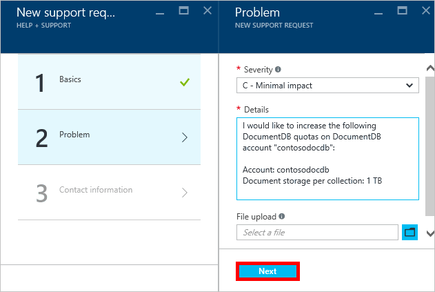

<properties
    pageTitle="Solicitação de aumento cotas de conta DocumentDB | Microsoft Azure"
    description="Saiba como solicitar um ajuste cotas de banco de dados de DocumentDB como armazenamento de documentos e produtividade por conjunto."
    services="documentdb"
    authors="AndrewHoh"
    manager="jhubbard"
    editor="monicar"
    documentationCenter=""/>

<tags
    ms.service="documentdb"
    ms.workload="data-services"
    ms.tgt_pltfrm="na"
    ms.devlang="na"
    ms.topic="article"
    ms.date="08/25/2016"
    ms.author="anhoh"/>

# Solicitação de aumento DocumentDB limites de conta

[Microsoft Azure DocumentDB](https://azure.microsoft.com/services/documentdb/) tem um conjunto de cotas padrão que podem ser ajustadas contatando o suporte Azure.  Este artigo mostra como solicitar um aumento de cota.

Após ler este artigo, você poderá responder às seguintes perguntas:  

-   Quais cotas de banco de dados de DocumentDB podem ser ajustadas contatando o suporte Azure?
-   Como posso solicitar um ajuste de cota de conta DocumentDB?

##Cotas de conta DocumentDB

A tabela a seguir descreve as cotas de DocumentDB. As cotas que tenham um asterisco (*) podem ser ajustadas contatando o suporte Azure:

[AZURE.INCLUDE [azure-documentdb-limits](../../includes/azure-documentdb-limits.md)]

##Solicitar um ajuste de cota
As etapas a seguir mostram como solicitar um ajuste de cota.

1. No [portal do Azure](https://portal.azure.com), clique em **Mais serviços**e, em seguida, clique em **Ajuda + suporte**.

    

2. Na lâmina **Ajuda + suporte** , clique em **nova solicitação de suporte**.

    

3. Na lâmina **nova solicitação de suporte** , clique em **Noções básicas**. Próximo, defina o **tipo de problema** para **cota**, **assinatura** à sua assinatura que hospeda seu DocumentDB conta, **tipo de cota** para **DocumentDB**e **plano de suporte** para **O suporte de cota - incluído**. Em seguida, clique em **Avançar**.

    

4. Na lâmina **problema** , escolha uma gravidade e incluem informações sobre o aumento de cota em **detalhes**. Clique em **Avançar**.

    

5. Finalmente, preencha suas informações de contato na lâmina **informações de contato** e clique em **criar**.

Depois que o tíquete tiver sido criado, você deve receber o número de solicitação de suporte via email.  Você também pode exibir a solicitação de suporte clicando em **solicitações de suporte de gerenciar** na lâmina **Ajuda + suporte** .

##Próximas etapas
- Para saber mais sobre DocumentDB, clique [aqui](http://azure.com/docdb).
